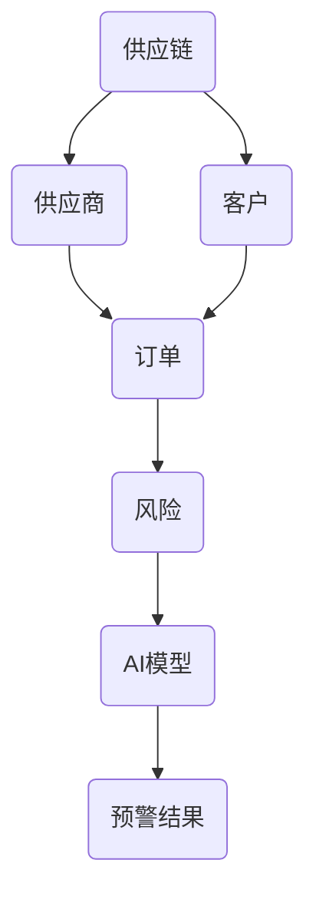
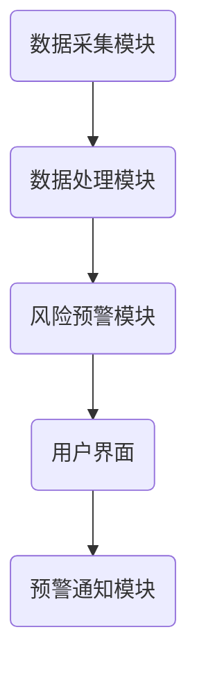

                 


# 《AI在供应链金融风险预警中的深度应用》

---

## 关键词：
供应链金融、人工智能、风险预警、机器学习、深度学习、金融风险管理

---

## 摘要：
本文深入探讨了人工智能在供应链金融风险预警中的应用，结合实际案例和理论分析，详细阐述了AI技术如何通过数据分析、模型构建和实时监控等手段，帮助企业和金融机构识别、预测和应对供应链金融中的潜在风险。文章从供应链金融的基本概念出发，逐步分析了AI在风险预警中的核心作用，包括算法原理、系统架构设计和项目实战等，为读者提供了从理论到实践的全面指导。

---

## 第1章: 供应链金融概述

### 1.1 供应链金融的基本概念

#### 1.1.1 供应链金融的定义
供应链金融是指通过整合供应链上的资金流、信息流和物流，为供应链上的企业提供融资服务的一种金融模式。其核心在于通过控制物流和信息流，降低企业的融资成本，优化资金配置。

#### 1.1.2 供应链金融的核心要素
- **供应链参与方**：包括供应商、制造商、分销商和终端客户。
- **资金流**：包括应收账款、预付款和库存融资。
- **信息流**：包括订单、物流和财务数据。
- **物流**：包括原材料采购、生产加工和产品配送。

#### 1.1.3 供应链金融的业务流程
1. **需求分析**：企业根据生产和销售需求确定融资需求。
2. **融资申请**：企业向金融机构提出融资申请。
3. **审核与授信**：金融机构审核企业的信用状况，确定授信额度。
4. **融资执行**：金融机构为企业提供融资支持，企业获得资金用于供应链运作。
5. **监控与管理**：金融机构实时监控企业的资金使用情况和供应链运作，确保资金安全。

---

### 1.2 供应链金融的风险管理

#### 1.2.1 供应链金融中的主要风险
- **信用风险**：供应链上的企业可能因经营不善或恶意违约导致资金损失。
- **操作风险**：供应链运作中的物流、信息流和资金流可能出现延迟或错误。
- **市场风险**：市场波动可能导致供应链上的企业无法按时履行合同，影响资金流动。

#### 1.2.2 风险管理的传统方法
- **信用评估**：通过企业财务报表和信用评级确定授信额度。
- **质押融资**：要求企业提供质押物（如存货）作为融资担保。
- **定期审查**：金融机构定期审查企业的财务状况和供应链运作情况。

#### 1.2.3 AI在风险管理中的潜力
- **数据驱动的信用评估**：通过分析企业的历史交易数据和市场数据，提高信用评估的准确性。
- **实时监控**：通过AI技术实时监控供应链中的异常情况，及时发现潜在风险。
- **预测与预警**：利用机器学习模型预测供应链中的潜在风险，并提前发出预警。

---

### 1.3 AI技术在供应链金融中的应用背景

#### 1.3.1 AI技术的发展与应用趋势
- AI技术的快速发展为供应链金融的风险管理提供了新的工具和方法。
- 大数据技术的进步使得海量数据的处理和分析成为可能，为AI在供应链金融中的应用奠定了基础。

#### 1.3.2 AI在供应链金融中的应用场景
- **信用评估**：通过AI技术分析企业的历史交易数据和市场数据，评估企业的信用风险。
- **风险预警**：通过机器学习模型预测供应链中的潜在风险，并提前发出预警。
- **实时监控**：通过AI技术实时监控供应链中的物流、信息流和资金流，及时发现异常情况。

#### 1.3.3 供应链金融与AI结合的必要性
- **提高风险管理效率**：通过AI技术实现自动化、智能化的风险管理，降低人工操作的成本和风险。
- **优化资源配置**：通过AI技术优化供应链中的资金分配，提高资金使用效率。
- **提升客户体验**：通过AI技术实现个性化的融资服务，提升客户的满意度和忠诚度。

---

### 1.4 本章小结
本章从供应链金融的基本概念出发，详细介绍了供应链金融的核心要素和业务流程，并分析了供应链金融中的主要风险和传统风险管理方法。最后，结合AI技术的发展趋势和应用场景，探讨了AI技术在供应链金融风险管理中的潜力和必要性。

---

## 第2章: 供应链金融风险预警的核心概念

### 2.1 供应链金融风险预警的定义与特点

#### 2.1.1 风险预警的定义
风险预警是指通过分析潜在的风险因素，提前预测和通知可能发生的负面事件，从而采取相应的措施降低风险的影响。

#### 2.1.2 供应链金融风险预警的特点
- **实时性**：通过实时监控供应链中的物流、信息流和资金流，及时发现潜在风险。
- **数据驱动**：基于海量数据的分析和处理，提供精准的风险预警。
- **智能化**：通过AI技术实现自动化的风险识别和预警。

---

### 2.2 AI在供应链金融风险预警中的作用

#### 2.2.1 数据分析与模式识别
- **数据分析**：通过AI技术分析供应链中的历史数据和实时数据，识别潜在的风险因素。
- **模式识别**：通过机器学习算法识别供应链中的异常模式，提前预测潜在风险。

#### 2.2.2 预测与决策支持
- **预测模型**：通过机器学习模型预测供应链中的潜在风险，提供决策支持。
- **决策优化**：通过AI技术优化供应链中的资金分配和资源调度，降低风险影响。

#### 2.2.3 实时监控与异常检测
- **实时监控**：通过AI技术实时监控供应链中的物流、信息流和资金流，及时发现异常情况。
- **异常检测**：通过异常检测算法识别供应链中的异常行为，提前发出预警。

---

### 2.3 核心概念的ER实体关系图



---

### 2.4 本章小结
本章详细介绍了供应链金融风险预警的定义和特点，并分析了AI技术在供应链金融风险预警中的作用。通过ER实体关系图展示了供应链金融风险预警的核心概念及其相互关系。

---

## 第3章: 供应链金融风险预警的算法原理

### 3.1 供应链金融风险预警的算法原理

#### 3.1.1 机器学习算法在供应链金融中的应用
- **逻辑回归**：用于分类问题，预测企业是否违约。
- **随机森林**：用于分类和回归问题，预测企业的信用评分。
- **支持向量机（SVM）**：用于分类问题，预测企业的信用风险等级。

#### 3.1.2 深度学习算法在供应链金融中的应用
- **神经网络**：用于复杂的数据模式识别，预测供应链中的潜在风险。
- **卷积神经网络（CNN）**：用于图像识别和序列数据分析，预测供应链中的异常情况。
- **长短期记忆网络（LSTM）**：用于时间序列数据分析，预测供应链中的未来风险。

---

### 3.2 供应链金融风险预警的算法流程

#### 3.2.1 数据预处理
- **数据清洗**：去除重复数据和缺失数据，确保数据的完整性和准确性。
- **特征提取**：从供应链中的历史数据和实时数据中提取关键特征，用于模型训练。

#### 3.2.2 模型训练
- **训练数据集**：将预处理后的数据分为训练集和测试集，用于模型的训练和验证。
- **模型训练**：通过机器学习或深度学习算法训练模型，优化模型参数，提高预测准确率。

#### 3.2.3 模型评估
- **评估指标**：通过准确率、召回率、F1分数等指标评估模型的性能。
- **模型优化**：根据评估结果优化模型参数，提高模型的预测能力。

---

### 3.3 供应链金融风险预警的算法实现

#### 3.3.1 逻辑回归模型的实现
```python
from sklearn.linear_model import LogisticRegression
from sklearn.model_selection import train_test_split
from sklearn.metrics import accuracy_score

# 数据预处理
X = df.drop('target', axis=1)
y = df['target']

# 数据分割
X_train, X_test, y_train, y_test = train_test_split(X, y, test_size=0.2, random_state=42)

# 模型训练
model = LogisticRegression()
model.fit(X_train, y_train)

# 模型评估
y_pred = model.predict(X_test)
print("准确率：", accuracy_score(y_test, y_pred))
```

#### 3.3.2 随机森林模型的实现
```python
from sklearn.ensemble import RandomForestClassifier
from sklearn.metrics import confusion_matrix, classification_report

# 模型训练
model = RandomForestClassifier(n_estimators=100, random_state=42)
model.fit(X_train, y_train)

# 模型评估
y_pred = model.predict(X_test)
print("混淆矩阵：")
print(confusion_matrix(y_test, y_pred))
print("\n分类报告：")
print(classification_report(y_test, y_pred))
```

---

### 3.4 本章小结
本章详细介绍了供应链金融风险预警的算法原理，包括机器学习和深度学习算法在供应链金融中的应用，以及算法的实现流程。通过具体的代码示例，展示了如何利用机器学习模型进行风险预警。

---

## 第4章: 供应链金融风险预警的系统架构设计

### 4.1 供应链金融风险预警系统的功能设计

#### 4.1.1 数据采集模块
- **数据源**：包括企业的财务数据、供应链上的交易数据和市场数据。
- **数据采集**：通过API接口实时采集供应链中的物流、信息流和资金流数据。

#### 4.1.2 数据处理模块
- **数据清洗**：去除重复数据和缺失数据，确保数据的完整性和准确性。
- **特征提取**：从原始数据中提取关键特征，用于模型训练。

#### 4.1.3 风险预警模块
- **模型训练**：利用机器学习模型训练风险预警模型。
- **实时监控**：通过实时数据流持续监控供应链中的风险因素。
- **预警触发**：当检测到潜在风险时，触发预警机制，通知相关人员采取措施。

---

### 4.2 供应链金融风险预警系统的架构设计

#### 4.2.1 系统架构图


#### 4.2.2 接口设计
- **数据接口**：通过RESTful API接口实现数据的采集和传输。
- **预警接口**：通过API接口实现预警信息的推送和通知。

---

### 4.3 本章小结
本章详细介绍了供应链金融风险预警系统的功能设计和架构设计，展示了如何通过系统化的架构设计实现AI技术在供应链金融风险预警中的深度应用。

---

## 第5章: 供应链金融风险预警的项目实战

### 5.1 项目背景与目标
- **项目背景**：某制造企业希望通过AI技术实现供应链金融风险预警，降低企业的融资成本和风险。
- **项目目标**：通过AI技术构建风险预警模型，实现供应链金融风险的实时监控和预警。

---

### 5.2 项目实施步骤

#### 5.2.1 环境安装
```bash
pip install numpy pandas scikit-learn matplotlib
```

#### 5.2.2 数据采集
```python
import requests
import pandas as pd

url = "https://api.example.com/financial_data"
response = requests.get(url)
data = response.json()
df = pd.DataFrame(data)
```

#### 5.2.3 数据预处理
```python
# 删除缺失值
df.dropna(inplace=True)

# 标准化处理
from sklearn.preprocessing import StandardScaler
scaler = StandardScaler()
df_scaled = scaler.fit_transform(df)
```

#### 5.2.4 模型训练
```python
from sklearn.model_selection import train_test_split
from sklearn.linear_model import LogisticRegression
from sklearn.metrics import accuracy_score

X = df_scaled.drop('target', axis=1)
y = df_scaled['target']

X_train, X_test, y_train, y_test = train_test_split(X, y, test_size=0.2, random_state=42)

model = LogisticRegression()
model.fit(X_train, y_train)

y_pred = model.predict(X_test)
print("准确率：", accuracy_score(y_test, y_pred))
```

#### 5.2.5 模型部署
```python
from flask import Flask, request, jsonify

app = Flask(__name__)

@app.route('/predict', methods=['POST'])
def predict():
    data = request.json
    # 数据处理
    # 模型预测
    prediction = model.predict(data)
    return jsonify({'prediction': prediction.tolist()})

if __name__ == '__main__':
    app.run(debug=True)
```

---

### 5.3 项目分析与总结
- **项目分析**：通过AI技术构建的风险预警模型能够有效识别供应链中的潜在风险，降低企业的融资成本和风险。
- **项目总结**：本项目展示了AI技术在供应链金融风险预警中的实际应用，为企业的风险管理提供了新的思路和方法。

---

## 第6章: 总结与展望

### 6.1 本章总结
本文深入探讨了人工智能在供应链金融风险预警中的应用，从供应链金融的基本概念出发，详细介绍了AI技术在供应链金融风险预警中的作用和算法原理，最后通过实际案例展示了AI技术在供应链金融风险预警中的系统设计和项目实战。

---

### 6.2 未来展望
随着AI技术的不断发展，供应链金融风险预警的应用将更加广泛和深入。未来的研究方向包括：
- **多模态数据融合**：通过结合文本、图像和语音等多种数据源，提高风险预警的准确性。
- **强化学习应用**：通过强化学习算法优化供应链中的决策过程，降低风险影响。
- **区块链技术结合**：通过区块链技术实现供应链中的数据共享和信任机制，提高风险预警的可信度。

---

## 作者：AI天才研究院/AI Genius Institute & 禅与计算机程序设计艺术 /Zen And The Art of Computer Programming

---

以上是《AI在供应链金融风险预警中的深度应用》的技术博客文章大纲，涵盖了从基础概念到实际应用的各个方面，结合理论分析和项目实战，为读者提供了全面的指导。

