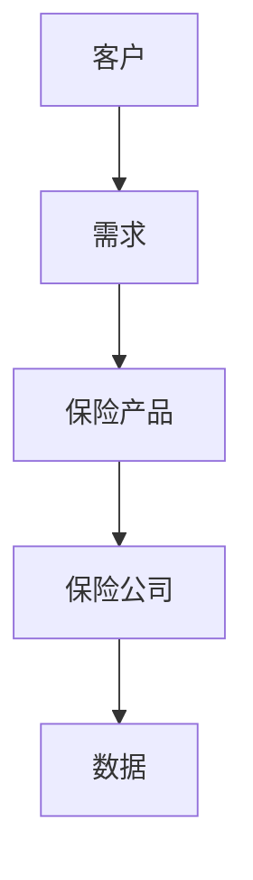
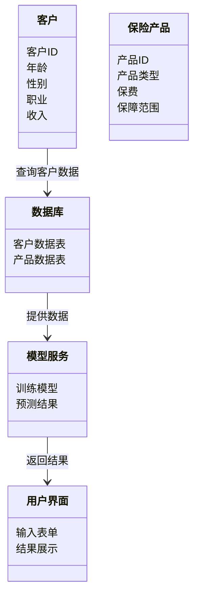
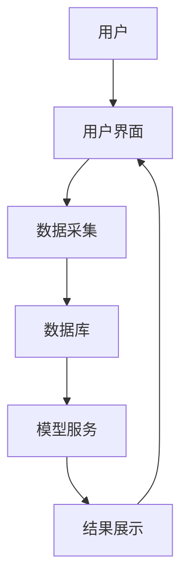
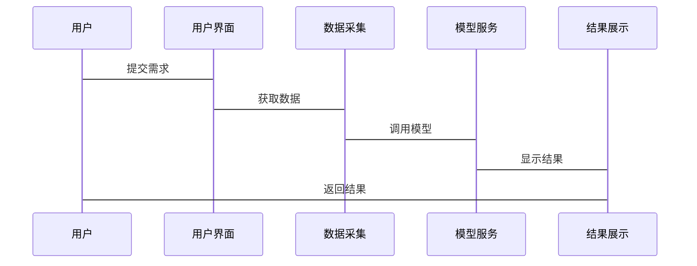

                 


# 《AI在保险产品个性化定制中的深度应用》

---

**关键词：** 人工智能、机器学习、深度学习、保险产品、个性化定制、自然语言处理、系统架构

---

**摘要：**  
随着人工智能技术的飞速发展，保险行业正经历着从传统模式向智能化转型的深刻变革。个性化保险产品的定制化需求日益增长，而AI技术为这一需求提供了强大的技术支持。本文将深入探讨AI在保险产品个性化定制中的应用场景、技术原理、系统架构及实际案例，全面解析如何通过AI技术实现保险产品的精准匹配与优化设计。通过结合机器学习、深度学习、自然语言处理等技术，本文将揭示保险产品个性化定制的未来发展方向，并为从业者提供实践指导。

---

## 正文

### 第一部分：AI与保险产品个性化定制的背景与基础

#### 第1章：AI与保险行业的概述

##### 1.1 保险行业的数字化转型

###### 1.1.1 保险行业的现状与痛点  
保险行业作为传统金融行业的重要组成部分，长期以来依赖人工服务和经验判断。然而，随着市场竞争的加剧和客户需求的多样化，传统保险产品难以满足客户的个性化需求。同时，保险公司面临着运营成本高、效率低、客户体验差等痛点。

###### 1.1.2 保险产品设计的传统模式  
传统的保险产品设计基于固定的产品组合和标准化条款，难以灵活适应不同客户群体的需求。这种模式不仅限制了产品的创新性，还可能导致客户体验不佳，进而影响客户忠诚度。

###### 1.1.3 数字化转型对保险行业的影响  
数字化转型为保险行业带来了新的机遇。通过大数据、云计算和AI技术，保险公司可以实现客户行为的精准分析、产品设计的智能化以及服务流程的自动化。这种转变不仅提升了效率，还为客户提供了更优质的服务体验。

##### 1.2 AI技术在保险行业的应用现状

###### 1.2.1 AI技术的基本概念  
人工智能（AI）是指计算机系统模拟人类智能的能力，包括学习、推理、自我改进等。在保险行业中，AI技术被广泛应用于风险评估、保费定价、客户服务等领域。

###### 1.2.2 AI在保险行业的典型应用  
1. **风险评估与预测：** 利用机器学习算法分析历史数据，预测客户可能面临的各类风险。  
2. **保费定价：** 基于客户特征和市场数据，AI技术可以实现精准的保费定价。  
3. **客户服务：** 通过自然语言处理（NLP）技术，AI可以实现智能客服，为客户提供实时咨询和问题解答。

###### 1.2.3 AI在保险产品定制中的潜力  
AI技术可以通过分析客户的个性化需求，设计出符合其风险偏好和保障需求的保险产品。这种定制化的产品不仅能够提升客户满意度，还能帮助保险公司提高市场竞争力。

##### 1.3 个性化定制保险产品的概念与价值

###### 1.3.1 个性化保险产品的定义  
个性化保险产品是指根据客户的具体需求和特征，量身定制的保险产品。这类产品能够满足客户的多样化需求，提供更精准的风险保障。

###### 1.3.2 个性化定制的必要性与优势  
1. **必要性：** 传统保险产品的标准化设计难以满足客户的个性化需求，而个性化定制能够更好地解决这一问题。  
2. **优势：** 个性化定制可以提升客户满意度、增强客户忠诚度，并帮助保险公司提高市场竞争力。

###### 1.3.3 个性化定制与客户体验的关系  
个性化定制通过满足客户的特定需求，能够显著提升客户体验。客户感受到的产品的针对性和专属感，会增强其对保险公司的信任和忠诚度。

#### 第1章小结  
本章介绍了保险行业的数字化转型趋势，分析了AI技术在保险行业的应用现状，并重点探讨了个性化定制保险产品的概念与价值。通过AI技术，保险公司可以实现产品设计的智能化和个性化，从而更好地满足客户的需求。

---

#### 第2章：AI技术在保险产品定制中的核心问题

##### 2.1 保险产品定制的核心挑战

###### 2.1.1 客户需求的多样性  
客户的需求千差万别，不同客户的风险承受能力、保障需求和保费预算都有所不同。如何满足这种多样性是保险产品定制的核心挑战之一。

###### 2.1.2 产品设计的复杂性  
保险产品的设计涉及多个因素，包括风险评估、保费计算、条款设计等。这些因素的复杂性使得产品设计难以快速响应客户需求。

###### 2.1.3 数据驱动的精准匹配  
保险产品的定制需要依赖大量的数据，包括客户的个人信息、健康状况、财务状况等。如何高效地处理和分析这些数据，实现精准匹配，是另一个重要挑战。

##### 2.2 AI技术如何解决这些问题

###### 2.2.1 机器学习在需求分析中的应用  
通过机器学习算法，AI可以分析客户的海量数据，识别其潜在需求，并生成个性化的保险方案。

###### 2.2.2 深度学习在产品设计中的作用  
深度学习技术可以通过训练大量数据，帮助保险公司优化产品设计，使其更符合客户需求。

###### 2.2.3 自然语言处理在客户交互中的优化  
通过NLP技术，AI可以实现智能客服，快速理解客户需求，并提供个性化的服务建议。

##### 2.3 保险产品个性化定制的边界与外延

###### 2.3.1 定制的范围与限度  
个性化定制需要在一定范围内进行，既要满足客户的需求，又要符合监管要求。因此，定制的范围和限度需要在实践中不断探索和调整。

###### 2.3.2 个性化与标准化的平衡  
个性化定制并不意味着完全摒弃标准化产品。保险公司需要在个性化与标准化之间找到平衡点，以实现成本效益的最大化。

###### 2.3.3 产品的可扩展性与可持续性  
个性化定制的产品需要具备良好的可扩展性和可持续性，以适应市场需求的变化和客户群体的扩展。

#### 第2章小结  
本章分析了保险产品定制的核心挑战，并探讨了AI技术如何解决这些问题。个性化定制的边界与外延也需要在实践中不断探索，以确保产品的可行性和可持续性。

---

#### 第3章：AI在保险产品个性化定制中的核心概念与联系

##### 3.1 核心概念原理

###### 3.1.1 机器学习在需求预测中的应用  
机器学习可以通过分析客户的过往行为数据，预测其未来的保险需求，从而为个性化定制提供数据支持。

###### 3.1.2 深度学习在产品设计中的创新  
深度学习技术可以用于训练复杂的模型，帮助保险公司优化产品设计，使其更符合客户需求。

###### 3.1.3 自然语言处理在客户交互中的优化  
通过NLP技术，AI可以实现智能客服，快速理解客户需求，并提供个性化的服务建议。

##### 3.2 核心概念属性对比表

| 概念       | 特征                   | 优缺点分析                             |
|------------|------------------------|-----------------------------------------|
| 机器学习   | 数据驱动、模型可解释性  | 适合中小规模数据，模型解释性强           |
| 深度学习   | 高维度特征提取、非线性关系| 适合大规模数据，模型解释性较弱           |
| NLP        | 文本理解和生成         | 适合处理非结构化数据，但需要大量计算资源 |

##### 3.3 实体关系图（ER图）



##### 3.4 本章小结  
本章详细介绍了AI技术在保险产品个性化定制中的核心概念，包括机器学习、深度学习和自然语言处理的基本原理和应用。通过对比分析和实体关系图，帮助读者更好地理解这些技术在保险产品定制中的作用。

---

### 第二部分：AI在保险产品个性化定制中的算法原理

#### 第4章：机器学习在保险产品定制中的应用

##### 4.1 机器学习的基本原理

###### 4.1.1 机器学习的定义  
机器学习是一种通过数据训练模型，使其能够从经验中学习并做出预测的技术。

###### 4.1.2 机器学习的分类  
1. **监督学习：** 基于标记数据进行训练，适用于分类和回归任务。  
2. **无监督学习：** 基于未标记数据进行训练，适用于聚类任务。  
3. **强化学习：** 通过与环境交互，学习最优策略。

##### 4.2 随机森林在保险产品推荐中的应用

###### 4.2.1 随机森林的定义  
随机森林是一种基于决策树的集成学习算法，通过构建多棵决策树并取其平均，提高模型的准确性和鲁棒性。

###### 4.2.2 随机森林的数学公式  
随机森林的预测结果是基于各个决策树的投票结果得出的，公式如下：  
$$ y = \text{sign}(\sum_{i=1}^{n} y_i) $$  
其中，$y_i$是第$i$棵决策树的预测结果，$n$是决策树的数量。

###### 4.2.3 应用场景  
随机森林可以用于保险产品的推荐，通过分析客户的特征数据，预测其可能感兴趣的保险产品类型。

##### 4.3 实际案例：保险产品推荐系统

###### 4.3.1 数据预处理  
1. **数据清洗：** 去除缺失值和异常值。  
2. **特征提取：** 从客户数据中提取关键特征，如年龄、职业、收入等。

###### 4.3.2 模型实现  
使用Python代码实现随机森林模型：

```python
from sklearn.ensemble import RandomForestClassifier
import pandas as pd

# 数据加载与预处理
data = pd.read_csv('insurance.csv')
X = data.drop('product_type', axis=1)
y = data['product_type']

# 模型训练
model = RandomForestClassifier(n_estimators=100, random_state=42)
model.fit(X, y)

# 模型预测
new_customer = [[30, '工程师', 5000]]
print(model.predict(new_customer))
```

##### 4.4 本章小结  
本章通过随机森林算法，详细讲解了机器学习在保险产品推荐中的应用。通过实际案例，展示了如何利用机器学习技术实现个性化定制。

---

#### 第5章：深度学习在保险产品定制中的应用

##### 5.1 深度学习的基本原理

###### 5.1.1 深度学习的定义  
深度学习是一种基于人工神经网络的机器学习技术，通过多层非线性变换，实现对数据的高层次抽象。

##### 5.2 神经网络在保险产品设计中的应用

###### 5.2.1 神经网络的结构  
神经网络由输入层、隐藏层和输出层组成，通过训练数据调整权重，实现对输入数据的分类或回归。

###### 5.2.2 神经网络的训练过程  
神经网络的训练过程包括前向传播和反向传播两个阶段。前向传播计算预测值，反向传播调整权重以最小化预测误差。

##### 5.3 实际案例：保险产品定价系统

###### 5.3.1 数据预处理  
1. **数据清洗：** 去除缺失值和异常值。  
2. **特征提取：** 从客户数据中提取关键特征，如年龄、职业、收入等。

###### 5.3.2 模型实现  
使用Python代码实现神经网络模型：

```python
import tensorflow as tf
from tensorflow.keras import layers

# 数据加载与预处理
data = pd.read_csv('insurance.csv')
X = data.drop('premium', axis=1)
y = data['premium']

# 模型构建
model = tf.keras.Sequential([
    layers.Dense(64, activation='relu', input_shape=(X.shape[1],)),
    layers.Dense(1, activation='linear')
])

# 模型训练
model.compile(optimizer='adam', loss='mse')
model.fit(X, y, epochs=100, batch_size=32)

# 模型预测
new_customer = [[30, '工程师', 5000]]
print(model.predict(new_customer))
```

##### 5.4 本章小结  
本章通过神经网络算法，详细讲解了深度学习在保险产品定价中的应用。通过实际案例，展示了如何利用深度学习技术实现个性化定制。

---

### 第三部分：AI在保险产品个性化定制中的系统分析与架构设计

#### 第6章：系统分析与架构设计方案

##### 6.1 问题场景介绍

###### 6.1.1 客户需求  
客户希望通过个性化定制，获得符合其特定需求的保险产品。

###### 6.1.2 业务需求  
保险公司希望通过AI技术，实现保险产品的智能化设计和个性化推荐。

##### 6.2 项目介绍

###### 6.2.1 项目目标  
通过AI技术实现保险产品的个性化定制，提升客户满意度和市场竞争力。

###### 6.2.2 项目范围  
涵盖客户数据采集、产品设计、模型训练、结果展示等多个环节。

##### 6.3 系统功能设计

###### 6.3.1 领域模型（Mermaid类图）



###### 6.3.2 系统架构设计（Mermaid架构图）



##### 6.4 系统接口设计

###### 6.4.1 API接口  
1. **数据采集接口：** 提供客户数据的采集功能。  
2. **模型服务接口：** 提供保险产品的预测和推荐功能。  
3. **结果展示接口：** 提供预测结果的展示功能。

##### 6.5 系统交互（Mermaid序列图）



##### 6.6 本章小结  
本章通过系统分析与架构设计，详细介绍了保险产品个性化定制的实现方案。通过Mermaid图展示了系统的功能模块和交互流程，为后续的项目实施提供了理论基础。

---

### 第四部分：AI在保险产品个性化定制中的项目实战

#### 第7章：项目实战：保险产品推荐系统

##### 7.1 环境安装

###### 7.1.1 安装Python  
安装Python 3.8及以上版本。

###### 7.1.2 安装依赖库  
安装以下依赖库：

```bash
pip install pandas scikit-learn tensorflow keras matplotlib
```

##### 7.2 系统核心实现

###### 7.2.1 数据预处理  
1. **数据清洗：** 去除缺失值和异常值。  
2. **特征提取：** 从客户数据中提取关键特征，如年龄、职业、收入等。

###### 7.2.2 模型实现  
使用随机森林算法实现保险产品推荐系统：

```python
from sklearn.ensemble import RandomForestClassifier
import pandas as pd

# 数据加载与预处理
data = pd.read_csv('insurance.csv')
X = data.drop('product_type', axis=1)
y = data['product_type']

# 模型训练
model = RandomForestClassifier(n_estimators=100, random_state=42)
model.fit(X, y)

# 模型预测
new_customer = [[30, '工程师', 5000]]
print(model.predict(new_customer))
```

##### 7.3 代码应用解读与分析

###### 7.3.1 数据加载与预处理  
1. **数据加载：** 使用`pd.read_csv`加载数据。  
2. **特征提取：** 通过`drop`方法去除目标变量，提取特征。

###### 7.3.2 模型训练  
使用随机森林模型进行训练，`n_estimators`参数表示决策树的数量，`random_state`用于随机种子的设置。

###### 7.3.3 模型预测  
通过模型预测新客户的保险产品类型，输出结果。

##### 7.4 实际案例分析

###### 7.4.1 案例背景  
某保险公司希望通过个性化定制，为客户提供更精准的保险产品推荐。

###### 7.4.2 数据分析  
通过分析客户数据，发现不同职业和收入水平的客户对保险产品的需求差异显著。

###### 7.4.3 模型优化  
通过调整随机森林的参数，优化模型的准确性和鲁棒性。

##### 7.5 项目小结  
本章通过实际案例，详细讲解了保险产品推荐系统的实现过程。从数据预处理到模型训练，再到结果展示，全面展示了如何利用AI技术实现个性化定制。

---

### 第五部分：总结与展望

#### 第8章：总结与展望

##### 8.1 总结  
本文深入探讨了AI技术在保险产品个性化定制中的应用场景、技术原理和系统架构。通过结合机器学习、深度学习和自然语言处理等技术，展示了如何实现保险产品的精准匹配与优化设计。

##### 8.2 未来展望  
随着AI技术的不断发展，保险产品个性化定制将更加智能化和个性化。未来的研究方向包括：  
1. **更复杂的模型：** 如图神经网络和强化学习。  
2. **多模态数据处理：** 结合文本、图像等多种数据源。  
3. **实时定制：** 实现动态调整和实时推荐。

##### 8.3 最佳实践 tips  
1. **数据质量：** 数据的质量直接影响模型的性能，需要重视数据的清洗和特征提取。  
2. **模型选择：** 根据具体需求选择合适的算法，避免盲目追求复杂模型。  
3. **系统架构：** 设计合理的系统架构，确保系统的可扩展性和可维护性。  

##### 8.4 本章小结  
本章总结了全文的主要内容，展望了未来的发展方向，并给出了实践中的注意事项和建议。

---

**作者：AI天才研究院/AI Genius Institute & 禅与计算机程序设计艺术 /Zen And The Art of Computer Programming**

