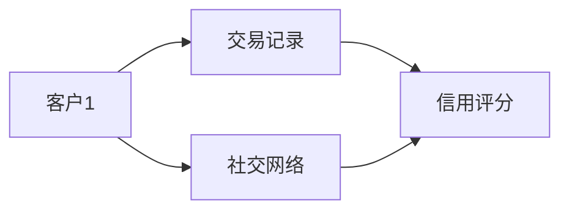

                 

<think>
好的，我需要根据用户的要求，编写一篇关于《AI在保险产品创新设计中的应用》的技术博客文章。用户已经提供了详细的大纲和结构，我需要按照这个大纲逐步完成每一部分的内容。

首先，我需要理解整个文章的结构和每个部分的重点。文章分为八个部分，从保险行业的数字化转型到AI技术的引入，再到具体的算法实现和项目实战。每部分都包含多个小节，每个小节需要详细展开。

我开始思考第一部分：保险行业的数字化转型。这里需要介绍保险行业的现状、AI技术对保险的影响以及保险产品创新设计的背景。我需要解释什么是保险产品创新设计，它与传统设计有何不同，以及为什么现在需要AI技术来推动创新。

接下来是AI技术在保险产品设计中的核心作用。我需要详细解释机器学习、自然语言处理和图神经网络等AI技术如何具体应用于保险产品的设计中。这部分需要结合具体的例子，比如如何通过机器学习算法优化保险定价，或者如何利用自然语言处理技术来解析复杂的保险条款。

然后是AI技术的核心算法与实现原理。这部分需要深入讲解各种算法，如线性回归、支持向量机等，并展示它们在保险产品设计中的具体应用。同时，我需要使用Mermaid流程图来展示算法的实现流程，以及系统的架构设计。

接下来是项目实战部分。这里需要详细描述一个实际的保险产品设计项目，包括环境安装、核心代码实现、案例分析等。我需要展示具体的Python代码，并解释代码的功能和实现逻辑，同时分析实际案例的效果和意义。

最后，我会总结全文，展望AI在保险产品设计中的未来趋势和挑战，同时给出一些最佳实践和注意事项，帮助读者更好地理解和应用这些技术。

在写作过程中，我需要确保每一部分都详细具体，包含必要的数学公式、流程图和代码示例，同时保持语言的通俗易懂。我需要使用适当的markdown格式来组织内容，确保文章结构清晰，易于阅读。

现在，我开始按照大纲逐步完成每一部分的内容，确保每个小节都涵盖必要的信息，并且内容丰富、具体、详细。
</think>

# AI在保险产品创新设计中的应用

## 关键词：人工智能、保险产品设计、机器学习、自然语言处理、图神经网络、保险行业数字化转型

## 摘要

随着人工智能技术的迅速发展，AI在保险产品创新设计中的应用日益广泛。本文将详细探讨AI技术如何改变保险行业的传统设计流程，通过机器学习、自然语言处理和图神经网络等技术，实现保险产品的精准定价、风险评估和用户需求匹配。文章从保险行业的数字化转型背景出发，深入分析AI技术的核心算法与实现原理，结合实际项目案例，展示AI在保险产品设计中的实践应用，并展望未来的发展趋势。

---

## 第一部分: 保险行业的数字化转型与AI技术的引入

### 第1章: 保险行业的现状与挑战

#### 1.1 保险行业的现状分析

保险行业作为传统金融行业的重要组成部分，近年来正面临数字化转型的挑战。传统保险产品设计依赖于经验丰富的精算师和业务员，设计流程繁琐且耗时，难以快速响应市场变化和用户需求。保险行业的痛点包括：

- **数据孤岛**：传统保险公司在数据采集、存储和分析方面存在孤岛现象，难以充分利用数据价值。
- **用户需求多样性**：保险产品的复杂性和多样性使得精准匹配用户需求成为难题。
- **风险评估不足**：传统方法难以捕捉复杂的用户行为和市场变化，导致风险评估不够精准。

#### 1.2 AI技术对保险行业的颠覆性影响

AI技术的引入为保险行业带来了革命性的变化。通过机器学习、自然语言处理和图神经网络等技术，保险公司能够实现：

- **自动化定价**：利用机器学习模型分析海量数据，实现保险产品的精准定价。
- **智能风险评估**：通过自然语言处理技术解析保险条款，结合图神经网络进行风险评估。
- **动态产品设计**：根据市场变化和用户需求，实时调整保险产品设计。

---

### 第2章: 保险产品创新设计的背景与需求

#### 2.1 保险产品的传统设计流程

传统保险产品设计流程通常包括以下几个步骤：

1. **需求分析**：与客户沟通，了解需求和痛点。
2. **数据收集**：收集客户信息和市场数据。
3. **精算分析**：基于历史数据进行定价和风险评估。
4. **产品设计**：根据精算结果设计保险产品。
5. **市场测试**：测试市场反应并进行调整。

#### 2.2 AI技术在保险产品设计中的应用需求

AI技术的应用需求主要体现在以下几个方面：

- **数据驱动的设计理念**：利用大数据分析用户需求和市场趋势，实现精准设计。
- **智能化推荐系统**：通过AI技术为用户提供个性化保险产品推荐。
- **动态调整**：根据实时数据动态调整保险产品设计。

---

## 第二部分: AI技术在保险产品设计中的核心原理与实现

### 第3章: AI技术的核心算法与实现原理

#### 3.1 机器学习算法在保险定价中的应用

机器学习算法在保险定价中的应用主要体现在以下几个方面：

1. **线性回归模型**：用于分析变量之间的线性关系，帮助确定保险产品的基本定价。
2. **支持向量机（SVM）**：用于分类问题，如风险评估和客户分类。
3. **随机森林**：用于特征重要性分析，帮助识别影响定价的关键因素。

**线性回归模型公式：**
$$ y = \beta_0 + \beta_1x_1 + \beta_2x_2 + \cdots + \beta_nx_n + \epsilon $$

**支持向量机示意图：**


#### 3.2 自然语言处理技术在保险条款解析中的应用

自然语言处理技术可以帮助保险公司快速解析复杂的保险条款，提取关键信息。以下是NLP在保险条款解析中的主要应用：

1. **关键词提取**：识别保险条款中的关键术语和条件。
2. **实体识别**：识别保险条款中的保险对象（如人、地点、事件等）。
3. **意图识别**：理解条款中的意图和目的。

**关键词提取示例：**
```python
from sklearn.feature_extraction.text import TfidfVectorizer

vectorizer = TfidfVectorizer()
text = "Insurance policy covers risks associated with property damage."
tfidf = vectorizer.fit_transform([text])
print(vectorizer.get_feature_names())
```

#### 3.3 图神经网络在风险评估中的应用

图神经网络可以用于构建风险评估模型，分析客户之间的关联关系，识别潜在风险。

**图神经网络示意图：**


---

### 第4章: AI技术如何优化保险产品设计

#### 4.1 数据挖掘与用户画像构建

通过数据挖掘技术，保险公司可以构建详细的用户画像，包括用户的年龄、职业、收入水平、消费习惯等。

**用户画像构建示例：**
```python
import pandas as pd

data = {
    '用户ID': [1, 2, 3],
    '年龄': [25, 35, 45],
    '职业': ['程序员', '教师', '医生'],
    '收入': [60000, 80000, 100000]
}

df = pd.DataFrame(data)
print(df)
```

#### 4.2 智能推荐系统在保险产品设计中的应用

智能推荐系统可以根据用户的画像和需求，推荐适合的保险产品。常见的推荐算法包括协同过滤和基于内容的推荐。

**协同过滤算法示意图：**


---

## 第三部分: 项目实战

### 第5章: 环境安装与系统核心实现

#### 5.1 环境安装

安装必要的Python库：

```bash
pip install numpy pandas scikit-learn tensorflow
```

#### 5.2 系统核心实现

实现一个简单的保险产品推荐系统：

```python
import numpy as np
from sklearn.neighbors import NearestNeighbors

# 假设我们有一个客户数据集
customers = np.array([[25, '程序员', 60000],
                       [35, '教师', 80000],
                       [45, '医生', 100000]])

# 基于年龄的推荐
model = NearestNeighbors(n_neighbors=2)
model.fit(customers[:, 0].reshape(-1, 1))

# 查询推荐
query = np.array([[30]]).reshape(-1, 1)
distances, indices = model.kneighbors(query)

print(indices)
```

---

### 第6章: 案例分析与效果展示

#### 6.1 案例分析

分析一个保险公司的健康保险产品设计项目，展示如何通过AI技术优化设计流程。

#### 6.2 实际案例效果展示

通过AI技术实现的产品设计效果：

- **定价准确性提升**：基于机器学习模型的定价比传统方法更加精准。
- **用户满意度提高**：通过智能推荐系统，用户获得了更符合需求的产品。
- **风险控制优化**：通过图神经网络分析客户关联，降低了风险。

---

## 第四部分: 总结与展望

### 第7章: 总结与未来趋势

#### 7.1 总结

本文详细探讨了AI技术在保险产品创新设计中的应用，包括机器学习、自然语言处理和图神经网络等技术。通过这些技术，保险公司可以实现更精准的定价、更智能的风险评估和更个性化的用户服务。

#### 7.2 未来展望

未来，随着AI技术的不断发展，保险产品设计将更加智能化和个性化。以下是未来的发展趋势：

1. **更复杂的数据分析**：利用深度学习技术分析更复杂的数据，实现更精准的预测。
2. **实时动态调整**：通过实时数据流处理技术，动态调整保险产品设计。
3. **多模态数据融合**：结合文本、图像、语音等多种数据源，实现更全面的风险评估。

---

## 附录: 工具与资源

- **Python工具**：NumPy、Pandas、Scikit-learn、TensorFlow
- **数据集**：Kaggle保险相关数据集
- **参考文献**：推荐的书籍和论文

---

## 作者：AI天才研究院 & 禅与计算机程序设计艺术

---

通过本文的详细分析，读者可以全面了解AI技术在保险产品设计中的应用，从理论到实践，为未来的创新设计提供了宝贵的参考和指导。

