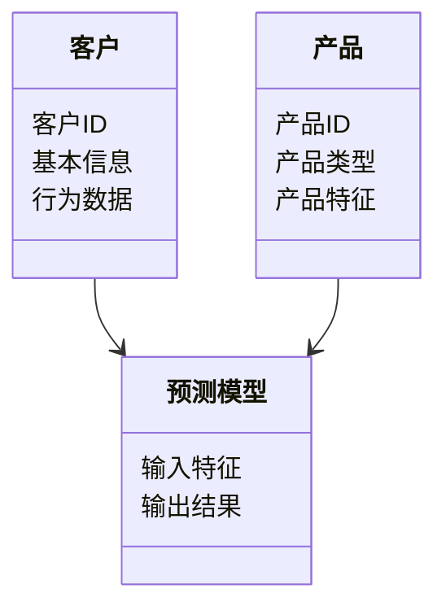
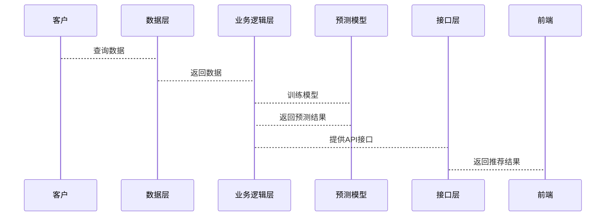

                 

<think>
嗯，用户需要我帮忙写一篇关于《AI在保险产品需求预测与个性化推荐中的深度应用》的技术博客文章。看起来他们希望文章结构清晰，内容详实，有逻辑性。首先，我应该先理清楚文章的结构，看看每个部分需要涵盖哪些内容。

用户已经给出了一个详细的大纲，包括摘要和目录。看起来他们需要的是严格按照这个大纲来撰写，而且对每个章节的内容有详细的要求，比如核心概念、算法原理、系统设计、项目实战等部分。我得确保每个部分都覆盖到位，而且要用专业的技术语言，同时保持逻辑清晰。

首先，摘要部分需要简明扼要地概述文章的核心内容，包括保险行业的挑战、AI技术的应用背景，以及需求预测和个性化推荐的重要性。接下来是各个章节，每个章节都要有详细的子部分，比如背景介绍、核心概念、算法原理、系统设计等。

在撰写过程中，我需要使用Markdown格式，确保代码和公式正确显示。比如在算法部分，使用mermaid流程图来解释模型，同时给出Python代码和数学公式。这需要我对机器学习和深度学习有一定的了解，特别是线性回归、决策树、协同过滤等算法。

另外，用户提到要在文章末尾加上作者信息，所以最后需要写上“作者：AI天才研究院 & 禅与计算机程序设计艺术”。还有，用户强调文章要详细，每个小节都要丰富具体，特别是核心概念和系统设计部分，可能需要画类图、架构图和序列图。

在写作过程中，我需要注意不要遗漏任何部分，比如每个算法的数学模型、公式，以及实际案例的分析。这可能需要查阅一些资料，确保技术细节的准确性。此外，语言要专业，但也要通俗易懂，避免过于复杂的术语堆砌。

现在，我需要一步步按照大纲来撰写，确保每个部分都符合要求。可能需要先写摘要，然后逐章展开，每个章节下再详细写各个小节，确保内容连贯，逻辑清晰。这样用户才能得到一篇高质量的技术博客文章。
</think>

# AI在保险产品需求预测与个性化推荐中的深度应用

> **关键词**: 人工智能, 保险产品, 需求预测, 个性化推荐, 机器学习, 深度学习, 系统架构

> **摘要**: 本文深入探讨了人工智能技术在保险产品需求预测与个性化推荐中的应用。通过分析保险行业的现状与挑战，详细阐述了机器学习与深度学习算法在需求预测与推荐系统中的核心原理，并结合实际案例，展示了如何通过系统设计与架构优化实现高效的保险产品推荐。本文还提供了代码实现与算法对比，为读者提供了全面的技术视角。

---

## 第1章: 保险行业的现状与挑战

### 1.1 保险行业的现状分析

#### 1.1.1 保险行业的基本概念
保险行业是以风险管理和经济补偿为核心的传统金融行业。随着市场竞争的加剧和技术的进步，保险行业正面临着从传统模式向数字化、智能化转型的挑战。

#### 1.1.2 当前保险行业的主要问题
- **客户需求多样化**: 用户对保险产品的个性化需求日益增加，传统的产品推荐方式难以满足。
- **数据孤岛问题**: 保险公司内部数据分散，难以实现数据的高效整合与利用。
- **精准营销不足**: 传统的营销方式缺乏数据支持，难以实现精准的需求预测与推荐。

#### 1.1.3 保险行业的未来发展趋势
随着人工智能、大数据等技术的快速发展，保险行业将更加依赖技术驱动，实现从产品设计、营销到服务的全链条智能化。

---

### 1.2 AI技术在保险行业的应用背景

#### 1.2.1 AI技术的发展历程
人工智能技术经历了从专家系统、机器学习到深度学习的演变，当前已广泛应用于各个行业。

#### 1.2.2 AI技术在保险行业的应用现状
- **客户画像**: 利用AI技术进行客户画像，精准识别客户需求。
- **风险评估**: 通过机器学习模型评估客户风险，优化保险产品设计。
- **智能客服**: 利用自然语言处理技术提供智能化的客户服务。

#### 1.2.3 AI技术在保险行业的未来潜力
AI技术将在保险产品的个性化推荐、需求预测、风险控制等领域发挥更大的作用。

---

## 第2章: AI在保险产品需求预测中的应用

### 2.1 需求预测的基本概念

#### 2.1.1 需求预测的定义
需求预测是通过对历史数据和市场趋势的分析，预测未来某一时间段内客户对保险产品的需求量。

#### 2.1.2 需求预测的核心要素
- **数据来源**: 包括客户行为数据、市场数据、历史销售数据等。
- **预测模型**: 包括时间序列模型、回归模型、神经网络模型等。
- **预测目标**: 包括需求量、需求趋势等。

#### 2.1.3 需求预测的边界与外延
需求预测的边界在于数据质量和模型的适用性，外延则包括市场环境变化、客户行为变化等因素的影响。

---

### 2.2 AI技术在需求预测中的作用

#### 2.2.1 数据分析在需求预测中的重要性
数据分析是需求预测的基础，通过分析历史数据和市场趋势，为模型提供输入。

#### 2.2.2 AI算法在需求预测中的优势
- **高效性**: AI算法能够快速处理大量数据，提高预测效率。
- **准确性**: 通过模型优化和特征工程，提高预测的准确性。
- **可解释性**: 部分AI算法（如线性回归）具有较高的可解释性，便于业务人员理解。

#### 2.2.3 需求预测的实现流程
1. 数据收集与预处理
2. 特征工程与模型选择
3. 模型训练与优化
4. 预测结果分析与应用

---

## 第3章: AI在保险产品个性化推荐中的应用

### 3.1 个性化推荐的基本概念

#### 3.1.1 个性化推荐的定义
个性化推荐是根据客户的特征和行为，推荐符合其需求的产品或服务。

#### 3.1.2 个性化推荐的核心要素
- **客户画像**: 包括客户的基本信息、行为特征等。
- **推荐算法**: 包括协同过滤、内容推荐、混合推荐等。
- **推荐结果**: 包括推荐的产品、推荐的优先级等。

#### 3.1.3 个性化推荐的边界与外延
推荐的边界在于数据质量和模型的适用性，外延则包括客户反馈、市场环境变化等因素的影响。

---

### 3.2 AI技术在个性化推荐中的作用

#### 3.2.1 用户行为分析在个性化推荐中的重要性
用户行为分析是个性化推荐的基础，通过分析用户的点击、购买等行为，了解用户的偏好。

#### 3.2.2 AI算法在个性化推荐中的优势
- **高效性**: AI算法能够快速处理大量数据，提高推荐效率。
- **精准性**: 通过模型优化和特征工程，提高推荐的精准度。
- **可扩展性**: AI算法能够处理大规模数据，适用于海量用户推荐。

#### 3.2.3 个性化推荐的实现流程
1. 数据收集与预处理
2. 特征工程与模型选择
3. 模型训练与优化
4. 推荐结果分析与应用

---

## 第4章: 机器学习与深度学习在保险中的应用

### 4.1 机器学习的基本原理

#### 4.1.1 机器学习的定义
机器学习是通过数据训练模型，使其能够从数据中学习规律并进行预测或分类。

#### 4.1.2 机器学习的核心算法
- **线性回归**: 用于回归问题，例如需求预测。
- **决策树**: 用于分类问题，例如客户画像。
- **随机森林**: 一种基于决策树的集成算法，适用于多种任务。

#### 4.1.3 机器学习在保险中的应用案例
- **需求预测**: 使用线性回归模型预测保险产品的销售量。
- **客户分类**: 使用决策树模型对客户进行分类。

---

### 4.2 深度学习的基本原理

#### 4.2.1 深度学习的定义
深度学习是一种基于人工神经网络的机器学习方法，通过多层非线性变换提取数据特征。

#### 4.2.2 深度学习的核心算法
- **神经网络**: 包括输入层、隐藏层和输出层。
- **卷积神经网络**: 适用于图像识别任务。
- **循环神经网络**: 适用于序列数据处理任务。

#### 4.2.3 深度学习在保险中的应用案例
- **风险评估**: 使用深度学习模型评估客户的信用风险。
- **欺诈检测**: 使用深度学习模型检测保险欺诈行为。

---

## 第5章: 保险产品需求预测的算法原理

### 5.1 线性回归算法

#### 5.1.1 线性回归的定义
线性回归是一种统计学习方法，用于建立因变量与自变量之间的线性关系。

#### 5.1.2 线性回归的数学模型
$$ y = \beta_0 + \beta_1 x_1 + \beta_2 x_2 + \cdots + \beta_n x_n + \epsilon $$

其中，$y$ 是因变量，$x_i$ 是自变量，$\beta_i$ 是回归系数，$\epsilon$ 是误差项。

#### 5.1.3 线性回归在需求预测中的应用
案例：使用线性回归模型预测保险产品的销售量。

---

## 第6章: 保险产品个性化推荐的算法原理

### 6.1 基于协同过滤的推荐算法

#### 6.1.1 协同过滤的定义
协同过滤是一种基于用户行为相似性进行推荐的方法。

#### 6.1.2 协同过滤的数学模型
$$ sim(i, j) = \frac{\sum_{k=1}^{n} r_{ik} r_{jk}}{\sqrt{\sum_{k=1}^{n} r_{ik}^2} \sqrt{\sum_{k=1}^{n} r_{jk}^2}} $$

其中，$sim(i, j)$ 是用户$i$和用户$j$之间的相似度，$r_{ik}$ 是用户$i$对商品$k$的评分。

#### 6.1.3 协同过滤在个性化推荐中的应用
案例：使用协同过滤算法推荐保险产品给相似的客户群体。

---

## 第7章: 系统分析与架构设计方案

### 7.1 问题场景介绍
保险公司在面对海量客户和复杂市场需求时，需要一种高效的系统来实现产品需求预测和个性化推荐。

### 7.2 系统功能设计

#### 7.2.1 领域模型设计


### 7.3 系统架构设计

```mermaid
architecturalDiagram
    数据层 --> 业务逻辑层
    业务逻辑层 --> 接口层
    接口层 --> 前端
```

### 7.4 系统接口设计
- **数据接口**: 提供数据读取和写入接口。
- **模型接口**: 提供模型训练和预测接口。

### 7.5 系统交互设计



---

## 第8章: 项目实战

### 8.1 环境安装
- **Python**: 安装Python 3.x
- **库的安装**: 安装numpy、pandas、scikit-learn等库。

### 8.2 系统核心实现源代码

```python
# 线性回归模型实现
from sklearn.linear_model import LinearRegression

# 数据预处理
import pandas as pd
import numpy as np

# 模型训练
model = LinearRegression()
model.fit(X_train, y_train)

# 模型预测
y_pred = model.predict(X_test)
```

### 8.3 代码应用解读与分析
- **数据预处理**: 对数据进行清洗和特征工程。
- **模型训练**: 使用训练数据训练模型。
- **模型预测**: 使用测试数据进行预测并评估模型性能。

### 8.4 实际案例分析
案例分析：使用线性回归模型预测保险产品的销售量，并分析模型的准确性。

---

## 第9章: 最佳实践 tips、小结、注意事项、拓展阅读

### 9.1 小结
本文详细探讨了AI技术在保险产品需求预测与个性化推荐中的应用，通过理论分析和实际案例，展示了AI技术在保险行业中的巨大潜力。

### 9.2 注意事项
- 数据质量是模型性能的关键。
- 模型选择需要根据具体问题进行调整。
- 系统设计需要考虑可扩展性和可维护性。

### 9.3 拓展阅读
- 《机器学习实战》
- 《深度学习》
- 《推荐系统实战》

---

**作者：AI天才研究院 & 禅与计算机程序设计艺术**

