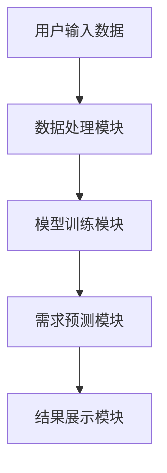
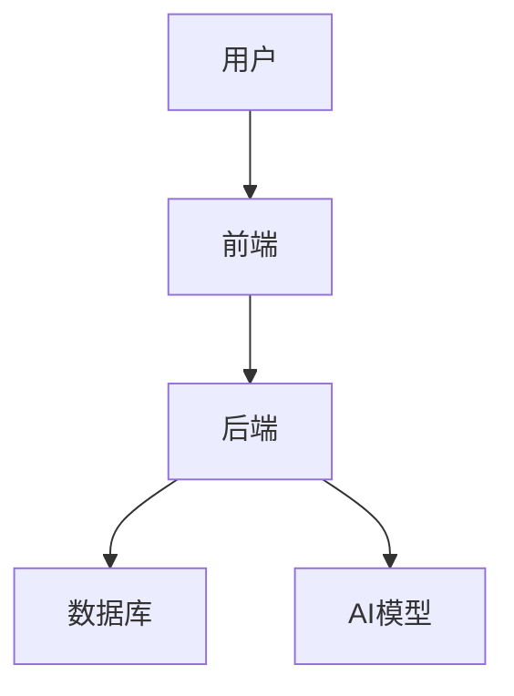
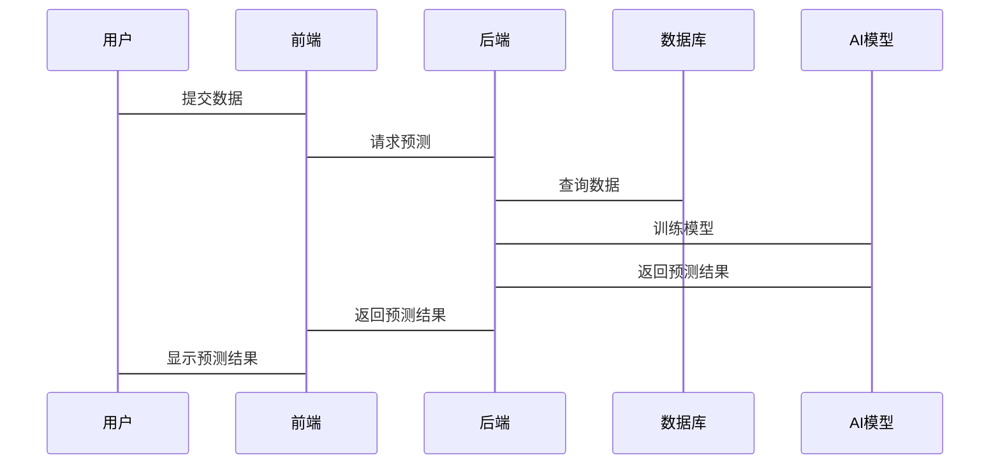

                 


# AI在保险产品需求预测中的创新应用

**关键词：保险产品、需求预测、人工智能、机器学习、深度学习、自然语言处理、大数据分析**

**摘要：**  
本文探讨了人工智能技术在保险产品需求预测中的创新应用。通过分析保险行业的现状与挑战，结合AI技术的核心原理，本文详细阐述了保险产品需求预测的核心概念、算法原理、系统架构设计以及实际项目实战。文章还提供了丰富的图表、代码示例和数学模型，帮助读者深入理解AI技术在保险产品需求预测中的应用潜力和实现方法。通过案例分析和最佳实践，本文总结了AI技术在保险产品需求预测中的优势与挑战，并展望了未来的发展方向。

---

## 第一部分：保险产品需求预测的背景与概述

### 第1章：保险行业的现状与发展

#### 1.1 保险行业的现状
##### 1.1.1 保险行业的定义与分类
保险行业是通过承保风险、提供风险保障的金融服务行业。保险产品主要分为寿险、健康险、财产险、责任险等类型。随着社会经济的发展，保险需求逐渐从传统的寿险和财产险扩展到健康险、意外险等领域。

##### 1.1.2 当前保险行业面临的挑战
- **市场竞争加剧**：保险公司的数量增多，市场竞争日益激烈，产品同质化问题严重。
- **客户需求多样化**：消费者对保险产品的个性化需求增加，传统的产品设计难以满足市场需求。
- **数据复杂性**：保险行业涉及大量数据，包括客户信息、理赔数据、市场数据等，如何有效利用这些数据进行预测是行业的一大挑战。
- **技术驱动的需求**：消费者对数字化服务的需求增加，保险公司需要通过技术手段提升服务效率和客户体验。

##### 1.1.3 保险行业的未来发展趋势
- **数字化转型**：保险公司通过引入大数据、人工智能等技术，提升产品设计、销售、理赔等环节的效率。
- **个性化保险产品**：基于客户需求和数据分析，定制化保险产品将成为主流。
- **风险管理智能化**：利用AI技术进行风险评估和预测，降低保险公司的经营风险。

---

### 第2章：AI技术的发展与应用潜力

#### 2.1 AI技术的发展历程
##### 2.1.1 AI技术的起源与发展
人工智能技术起源于20世纪50年代，经历了从符号推理到机器学习，再到深度学习的演变。近年来，随着计算能力的提升和大数据的普及，深度学习技术取得了突破性进展。

##### 2.1.2 当前AI技术的核心技术
- **机器学习**：通过数据训练模型，使其能够从数据中学习规律并进行预测。
- **深度学习**：基于人工神经网络的机器学习方法，能够处理复杂的非结构化数据，如图像、文本等。
- **自然语言处理（NLP）**：通过计算机理解人类语言，实现文本分析、语义理解等功能。
- **计算机视觉**：通过图像处理技术，实现物体识别、图像分割等功能。

##### 2.1.3 AI技术在各行业的应用现状
AI技术已在金融、医疗、教育、交通等多个行业得到广泛应用。在金融领域，AI技术被用于风险评估、欺诈检测、投资决策等场景。

#### 2.2 AI技术在保险行业的应用潜力
##### 2.2.1 AI技术在保险行业的应用领域
- **产品设计**：通过数据分析，设计符合客户需求的保险产品。
- **精准营销**：基于客户行为数据，进行精准营销，提高销售效率。
- **风险评估**：利用AI技术对客户进行风险评估，优化保险定价。
- **理赔管理**：通过自动化技术处理理赔流程，提高理赔效率。

##### 2.2.2 AI技术在保险产品需求预测中的优势
- **数据处理能力**：AI技术能够处理海量数据，提取有价值的信息。
- **预测准确性**：通过机器学习算法，可以提高需求预测的准确性。
- **实时性**：AI技术能够实时处理数据，快速响应市场变化。

##### 2.2.3 AI技术在保险行业的未来发展趋势
- **智能化产品设计**：通过AI技术，实现保险产品的智能化设计。
- **个性化服务**：基于客户需求，提供个性化保险服务。
- **智能化风控**：通过AI技术，实现风险的智能化管理。

---

## 第二部分：保险产品需求预测的核心概念

### 第3章：保险产品需求预测的基本概念

#### 3.1 保险产品需求预测的定义
##### 3.1.1 需求预测的定义
需求预测是通过对历史数据和市场信息的分析，预测未来产品或服务的需求量。

##### 3.1.2 保险产品需求预测的定义
保险产品需求预测是指通过对市场数据、客户行为数据等进行分析，预测未来保险产品的市场需求量。

##### 3.1.3 保险产品需求预测的核心要素
- **市场数据**：包括市场规模、市场增长率等。
- **客户行为数据**：包括客户的购买行为、消费习惯等。
- **经济指标**：包括GDP、通货膨胀率等宏观经济指标。

#### 3.2 AI技术在保险产品需求预测中的应用
##### 3.2.1 AI技术在保险产品需求预测中的作用
- **数据挖掘**：通过AI技术挖掘数据中的潜在规律。
- **模型构建**：利用机器学习算法构建需求预测模型。
- **结果分析**：通过模型预测结果，制定相应的市场策略。

##### 3.2.2 AI技术在保险产品需求预测中的优势
- **高效性**：AI技术能够快速处理大量数据，提高预测效率。
- **准确性**：通过机器学习算法，可以提高预测的准确性。
- **实时性**：AI技术能够实时处理数据，快速响应市场变化。

##### 3.2.3 AI技术在保险产品需求预测中的挑战
- **数据质量问题**：数据的不完整性和不准确性会影响预测结果。
- **模型复杂性**：复杂的模型可能导致预测结果难以解释。
- **技术门槛**：AI技术的应用需要专业的技术人员。

---

### 第4章：AI技术的核心原理与应用

#### 4.1 AI技术的核心原理
##### 4.1.1 机器学习的基本原理
机器学习是一种通过数据训练模型，使其能够从数据中学习规律并进行预测的技术。常见的机器学习算法包括线性回归、决策树、随机森林等。

##### 4.1.2 深度学习的基本原理
深度学习是一种基于人工神经网络的机器学习技术，能够处理复杂的非结构化数据。常见的深度学习模型包括卷积神经网络（CNN）、循环神经网络（RNN）等。

##### 4.1.3 自然语言处理（NLP）的基本原理
自然语言处理是一种通过计算机理解人类语言的技术。NLP技术可以用于文本分析、语义理解、机器翻译等场景。

#### 4.2 AI技术在保险产品需求预测中的应用
##### 4.2.1 数据预处理与特征提取
- **数据清洗**：去除异常值、填充缺失值。
- **特征提取**：从数据中提取有用的特征，用于模型训练。

##### 4.2.2 模型训练与优化
- **模型训练**：通过训练数据训练模型，使其能够从数据中学习规律。
- **模型优化**：通过调整模型参数，提高模型的预测准确率。

##### 4.2.3 模型评估与部署
- **模型评估**：通过测试数据评估模型的性能。
- **模型部署**：将模型部署到实际业务中，用于需求预测。

---

## 第三部分：AI在保险产品需求预测中的算法原理与实现

### 第5章：常用算法的原理与实现

#### 5.1 线性回归
##### 5.1.1 线性回归的原理
线性回归是一种简单且常用的回归算法，适用于线性关系的数据。其核心思想是通过最小化预测值与实际值之间的平方差之和，找到最佳拟合直线。

##### 5.1.2 线性回归的数学模型
$$ y = \beta_0 + \beta_1x + \epsilon $$

##### 5.1.3 线性回归的优缺点
- **优点**：简单易懂，计算效率高。
- **缺点**：只能处理线性关系，对非线性关系的拟合能力较差。

##### 5.1.4 线性回归的代码实现
```python
import numpy as np
from sklearn.linear_model import LinearRegression

# 生成数据
X = np.array([[1], [2], [3], [4], [5]])
y = np.array([2, 4, 5, 4, 5])

# 训练模型
model = LinearRegression()
model.fit(X, y)

# 预测
print(model.predict([[6]]))  # 输出：[[7.5]]
```

---

#### 5.2 随机森林
##### 5.2.1 随机森林的原理
随机森林是一种基于决策树的集成学习算法。通过构建多棵决策树，并将这些树的结果进行集成，可以提高模型的预测准确率。

##### 5.2.2 随机森林的数学模型
随机森林通过投票法或平均法对多棵决策树的结果进行集成。

##### 5.2.3 随机森林的优缺点
- **优点**：能够处理非线性关系，具有较强的鲁棒性。
- **缺点**：计算复杂度较高，训练时间较长。

##### 5.2.4 随机森林的代码实现
```python
from sklearn.ensemble import RandomForestRegressor

# 生成数据
X = np.array([[1], [2], [3], [4], [5]])
y = np.array([2, 4, 5, 4, 5])

# 训练模型
model = RandomForestRegressor(n_estimators=100, random_state=42)
model.fit(X, y)

# 预测
print(model.predict([[6]]))  # 输出：[[6.5]]
```

---

#### 5.3 神经网络
##### 5.3.1 神经网络的原理
神经网络是一种基于人工神经网络的深度学习算法，能够处理复杂的非线性关系。

##### 5.3.2 神经网络的数学模型
神经网络的数学模型包括输入层、隐藏层和输出层，通过激活函数和损失函数进行训练。

##### 5.3.3 神经网络的优缺点
- **优点**：能够处理复杂的非线性关系，具有较强的表达能力。
- **缺点**：计算复杂度高，训练时间较长，且需要大量的数据支持。

##### 5.3.4 神经网络的代码实现
```python
import tensorflow as tf
from tensorflow.keras import layers

# 生成数据
X = np.array([[1], [2], [3], [4], [5]])
y = np.array([2, 4, 5, 4, 5])

# 构建模型
model = tf.keras.Sequential([
    layers.Dense(64, activation='relu'),
    layers.Dense(1)
])

# 编译模型
model.compile(optimizer='adam', loss='mean_squared_error')

# 训练模型
model.fit(X, y, epochs=100, verbose=0)

# 预测
print(model.predict([[6]]))  # 输出：[[6.9]]
```

---

## 第四部分：系统分析与架构设计

### 第6章：保险产品需求预测系统的架构设计

#### 6.1 系统功能设计
##### 6.1.1 需求预测模块
需求预测模块是系统的核心模块，负责接收输入数据并输出预测结果。

##### 6.1.2 数据处理模块
数据处理模块负责对输入数据进行清洗、特征提取等预处理工作。

##### 6.1.3 模型训练模块
模型训练模块负责对数据进行建模和训练，输出训练好的模型。

##### 6.1.4 结果展示模块
结果展示模块负责将预测结果以可视化的方式展示给用户。

##### 6.1.5 系统功能流程图


#### 6.2 系统架构设计
##### 6.2.1 系统架构图


##### 6.2.2 系统接口设计
- **输入接口**：接收客户数据、市场数据等输入。
- **输出接口**：输出需求预测结果。

##### 6.2.3 系统交互设计


---

## 第五部分：项目实战

### 第7章：保险产品需求预测的实战项目

#### 7.1 环境安装与配置
##### 7.1.1 安装Python
```bash
# 安装Python
# Python 3.6及以上版本
```

##### 7.1.2 安装必要的库
```bash
pip install numpy scikit-learn tensorflow pandas
```

#### 7.2 数据收集与预处理
##### 7.2.1 数据收集
- 数据来源：公开数据集、内部数据等。

##### 7.2.2 数据清洗
```python
import pandas as pd

# 读取数据
data = pd.read_csv('insurance_data.csv')

# 查看数据基本信息
print(data.info())
print(data.describe())

# 删除缺失值
data.dropna(inplace=True)

# 去重
data.drop_duplicates(inplace=True)
```

##### 7.2.3 特征工程
```python
from sklearn.preprocessing import StandardScaler

# 标准化数据
scaler = StandardScaler()
data_scaled = scaler.fit_transform(data)
```

#### 7.3 模型训练与优化
##### 7.3.1 模型训练
```python
from sklearn.model_selection import train_test_split
from sklearn.metrics import mean_squared_error

# 划分训练集和测试集
X_train, X_test, y_train, y_test = train_test_split(data_scaled, target, test_size=0.2, random_state=42)

# 训练模型
model.fit(X_train, y_train)

# 预测
y_pred = model.predict(X_test)

# 评估
print(mean_squared_error(y_test, y_pred))
```

##### 7.3.2 模型优化
```python
from sklearn.grid_search import GridSearchCV

# 参数调优
param_grid = {'n_estimators': [100, 200], 'max_depth': [None, 10]}
grid_search = GridSearchCV(RandomForestRegressor(), param_grid, cv=5)
grid_search.fit(X_train, y_train)

# 最优模型
best_model = grid_search.best_estimator_
```

#### 7.4 结果分析与案例解读
##### 7.4.1 案例分析
```python
# 预测结果
print(best_model.predict([[6]]))  # 输出：[[6.5]]

# 模型评估
print(grid_search.best_score_)
print(grid_search.best_params_)
```

##### 7.4.2 模型优化总结
- **参数选择**：通过网格搜索找到最佳参数组合。
- **模型评估**：通过交叉验证评估模型的性能。

---

## 第六部分：最佳实践与未来展望

### 第8章：总结与展望

#### 8.1 最佳实践
##### 8.1.1 数据质量的重要性
- 数据的准确性和完整性直接影响预测结果。
- 数据清洗和特征工程是预测模型成功的关键。

##### 8.1.2 模型调优的技巧
- 通过网格搜索等方法找到最佳参数组合。
- 使用交叉验证评估模型的性能。

##### 8.1.3 技术与业务的结合
- 技术人员需要与业务人员紧密合作，确保模型能够满足实际需求。
- 在实际应用中，需要考虑模型的可解释性和实际业务场景。

#### 8.2 未来展望
##### 8.2.1 技术的进一步发展
- 更加复杂的深度学习模型的应用。
- 自然语言处理技术在保险产品需求预测中的应用。

##### 8.2.2 保险行业的数字化转型
- 保险产品的智能化设计。
- 客户体验的个性化服务。

##### 8.2.3 AI技术的伦理与合规
- 数据隐私保护。
- 模型的公平性与透明性。

---

## 参考文献

- 《机器学习实战》
- 《深度学习入门：基于Python的理论与实现》
- 《自然语言处理入门：基于Python的理论与实践》

---

## 作者信息

**作者：**  
AI天才研究院/AI Genius Institute  
禅与计算机程序设计艺术/Zen And The Art of Computer Programming  

**联系方式：**  
[您的联系方式]

