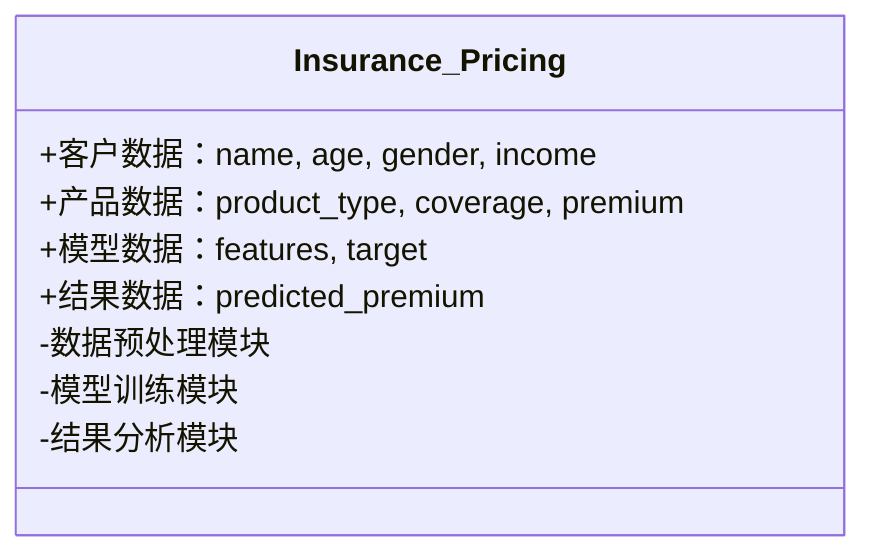

                 


# AI在保险定价个性化中的创新应用

> 关键词：人工智能，保险定价，个性化定价，机器学习，深度学习，数据驱动

> 摘要：本文探讨了人工智能在保险定价中的创新应用，特别是个性化定价方面。通过分析数据特征、模型选择和算法实现，结合系统架构设计和实际案例，展示了AI如何提升保险定价的精准性和客户体验。文章还讨论了AI技术带来的挑战和未来发展趋势。

---

## 第一部分: AI在保险定价个性化中的背景与概述

### 第1章: 保险定价的基本概念与挑战

#### 1.1 保险定价的基本概念

- **保险定价的定义与作用**  
保险定价是根据风险评估、历史数据和市场因素，确定保险产品的价格。其作用在于平衡保险公司收入与客户支付成本，确保可持续性。

- **保险定价的核心要素**  
  - 风险评估：分析客户的风险状况，如健康状况、驾驶记录等。  
  - 市场需求：考虑客户对价格的敏感度和竞争对手的定价策略。  
  - 成本控制：确保保费足以覆盖赔付和运营成本。

- **传统保险定价的局限性**  
  - 数据依赖性：传统定价主要依赖历史数据，难以捕捉新兴风险。  
  - 个性化不足：传统方法难以满足不同客户群体的多样化需求。  
  - 计算复杂性：处理大量数据和变量需要复杂的计算，传统方法效率低下。

#### 1.2 AI技术的基本概念

- **人工智能的定义与分类**  
人工智能（AI）是模拟人类智能的技术，包括学习、推理和自我改进。分为弱AI（特定任务）和强AI（通用任务）。

- **机器学习的基本原理**  
机器学习是AI的分支，通过数据训练模型，使其能够做出预测或决策。常见算法包括线性回归、随机森林、神经网络等。

- **深度学习的核心思想**  
深度学习是机器学习的子集，使用多层神经网络处理复杂数据，如图像和文本。

#### 1.3 保险定价个性化的需求与趋势

- **个性化定价的定义**  
根据客户的具体情况定制保费，提高客户满意度和市场竞争力。

- **个性化定价的市场需求**  
客户期望更低的价格和更精准的服务，保险公司需要通过个性化定价提高客户忠诚度。

- **个性化定价的技术趋势**  
AI和大数据技术的进步使个性化定价成为可能，推动保险行业向数据驱动转型。

---

### 第2章: AI在保险定价中的创新应用

#### 2.1 AI在保险定价中的核心价值

- **提高定价准确性**  
AI通过分析大量数据，发现传统方法难以察觉的规律，提高预测精度。

- **降低定价成本**  
自动化数据处理和模型训练减少人工干预，降低运营成本。

- **提升客户体验**  
个性化定价使客户感受到公平和定制化服务，增强客户满意度。

#### 2.2 个性化定价的实现路径

- **数据驱动的定价模型**  
利用客户数据构建模型，预测风险并定价。

- **AI算法在定价中的应用**  
使用机器学习模型分析数据，优化定价策略。

- **个性化定价的实施步骤**  
数据收集、模型训练、定价策略制定和实施。

#### 2.3 保险定价中的AI技术挑战

- **数据质量问题**  
数据不完整或不准确会影响模型性能。

- **模型解释性问题**  
复杂的AI模型难以解释定价决策，影响监管合规性。

- **风险控制问题**  
AI模型可能放大某些风险，如逆向选择和道德风险。

---

## 第二部分: AI在保险定价个性化中的核心概念与技术

### 第3章: 数据特征与模型选择

#### 3.1 数据特征的提取与分析

- **数据特征的分类**  
  - 数值型：如年龄、收入。  
  - 类别型：如性别、职业。  
  - 时间型：如投保历史。

- **数据特征的重要性评估**  
使用特征重要性评分，识别对定价影响最大的特征。

- **数据特征的预处理方法**  
  - 数据清洗：处理缺失值和异常值。  
  - 标准化：统一特征尺度。  
  - 编码：将类别特征转换为数值。

#### 3.2 模型选择与优化

- **常见机器学习模型概述**  
  - 线性回归：适合线性关系。  
  - 支持向量机：适合高维数据分类。  
  - 随机森林：适合特征重要性分析。

- **线性回归模型的适用场景**  
当数据呈现线性关系时，线性回归是简单有效的选择。

- **模型评估与优化**  
  - 交叉验证：评估模型泛化能力。  
  - 超参数优化：通过网格搜索或随机搜索选择最佳参数。

#### 3.3 模型评估与优化

- **模型评估指标**  
  - 均方误差（MSE）：衡量预测值与真实值的差异。  
  - R平方值（R²）：衡量模型解释力。  
  - 准确率：分类模型的正确预测比例。

- **模型调优方法**  
  - 增加数据：解决过拟合问题。  
  - 调整参数：优化模型性能。  
  - 简化模型：减少复杂度。

- **模型部署与监控**  
将模型集成到生产环境中，实时监控性能，及时调整。

### 第4章: AI算法在保险定价中的应用

#### 4.1 线性回归模型的应用

- **线性回归模型的数学公式**  
  $$ y = \beta_0 + \beta_1x_1 + \beta_2x_2 + ... + \beta_nx_n + \epsilon $$  
其中，$\beta_0$是截距，$\beta_i$是回归系数，$x_i$是自变量，$\epsilon$是误差项。

- **线性回归模型的实现步骤**  
  1. 数据收集与预处理。  
  2. 训练模型，计算回归系数。  
  3. 预测新数据，评估模型性能。

- **线性回归模型的优缺点**  
优点：简单易懂，计算速度快。缺点：只能处理线性关系，忽略复杂交互作用。

#### 4.2 集成学习模型的应用

- **集成学习的基本原理**  
通过组合多个弱模型，提高整体性能，如随机森林和梯度提升。

- **随机森林模型的应用**  
  - 随机森林是多个决策树的集成，适合特征重要性分析。  
  - 使用Python实现随机森林模型：

```python
from sklearn.ensemble import RandomForestRegressor
model = RandomForestRegressor(n_estimators=100, random_state=42)
model.fit(X_train, y_train)
```

- **梯度提升树模型的应用**  
  - 常见算法包括XGBoost和LightGBM，适合处理复杂数据。  
  - 使用XGBoost实现：

```python
import xgboost as xgb
dtrain = xgb.DMatrix(X_train, label=y_train)
model = xgb.XGBRegressor(n_estimators=100, learning_rate=0.1, max_depth=3)
model.fit(X_train, y_train)
```

#### 4.3 神经网络模型的应用

- **神经网络的基本原理**  
通过多层神经网络模拟人类大脑，处理复杂数据。

- **深度学习在保险定价中的应用**  
  - 使用卷积神经网络（CNN）处理图像数据。  
  - 使用循环神经网络（RNN）处理时间序列数据。

- **神经网络模型的实现**  
使用Keras框架实现简单的神经网络：

```python
from tensorflow.keras import layers
model = layers.Dense(64, activation='relu')(input_tensor)
model = layers.Dense(1, activation='linear')(model)
model = Model(inputs=input_tensor, outputs=model)
model.compile(optimizer='adam', loss='mean_squared_error')
model.fit(X_train, y_train, epochs=10, batch_size=32)
```

---

## 第三部分: 系统架构与实现

### 第5章: 系统架构设计

#### 5.1 问题场景介绍

- **保险定价系统的目标**  
构建一个基于AI的个性化定价系统，提高定价准确性和客户满意度。

- **系统功能需求**  
  - 数据预处理：清洗和转换数据。  
  - 模型训练：训练定价模型。  
  - 结果分析：评估模型性能并优化。

#### 5.2 系统功能设计

- **领域模型设计**  
使用Mermaid类图展示系统模块：



- **系统架构设计**  
使用Mermaid架构图展示系统架构：


- **系统接口设计**  
  - API接口：供前端调用，返回预测结果。  
  - 数据接口：与数据库交互，获取和存储数据。

- **系统交互设计**  
使用Mermaid序列图展示交互流程：

```mermaid
sequenceDiagram
    客户发送请求 -> API服务
    API服务 -> 数据库：查询客户数据
    数据库 -> API服务：返回数据
    API服务 -> AI模型：调用预测函数
    AI模型 -> API服务：返回预测结果
    API服务 -> 客户：返回最终结果
```

---

## 第四部分: 项目实战与案例分析

### 第6章: 项目实战

#### 6.1 项目环境与工具安装

- **环境要求**  
Python 3.8及以上，安装必要的库：scikit-learn、xgboost、tensorflow。

#### 6.2 系统核心实现

- **数据预处理**  
  ```python
  import pandas as pd
  data = pd.read_csv('insurance.csv')
  data = data.dropna()
  ```

- **模型训练与预测**  
  ```python
  from sklearn.model_selection import train_test_split
  X_train, X_test, y_train, y_test = train_test_split(X, y, test_size=0.2)
  model.fit(X_train, y_train)
  y_pred = model.predict(X_test)
  ```

- **结果分析**  
  ```python
  from sklearn.metrics import mean_squared_error
  mse = mean_squared_error(y_test, y_pred)
  print(f'Mean Squared Error: {mse}')
  ```

#### 6.3 案例分析

- **案例背景**  
某保险公司希望通过AI技术优化车险定价。

- **数据准备**  
收集客户驾驶记录、事故历史、车辆信息等数据。

- **模型选择**  
选择随机森林模型进行训练，预测保费。

- **结果解读**  
通过模型预测，发现驾驶记录对保费影响最大，优化定价策略。

#### 6.4 项目小结

- **项目成果**  
提高了定价准确性，降低赔付风险。  
- **经验总结**  
数据质量和特征选择对模型性能影响重大，需谨慎处理。

---

## 第五部分: 结束语

### 7.1 展望与挑战

- **技术展望**  
AI和大数据将继续推动保险行业的创新，个性化定价将成为主流。  
- **技术挑战**  
模型解释性、数据隐私和计算成本是未来需要解决的问题。

### 7.2 实践建议

- **数据驱动**  
重视数据质量和特征工程，确保模型准确。  
- **模型解释**  
选择可解释的模型，确保定价透明。  
- **合规性**  
遵守相关法规，确保定价公平合理。

---

## 作者：AI天才研究院 & 禅与计算机程序设计艺术

本文作者是AI天才研究院，致力于探索人工智能技术的创新应用。禅与计算机程序设计艺术团队专注于技术与艺术的结合，提供深入的技术分析和优雅的解决方案。

---

通过以上步骤，文章逐步展开每个部分的内容，确保逻辑清晰、技术详实、案例具体。

