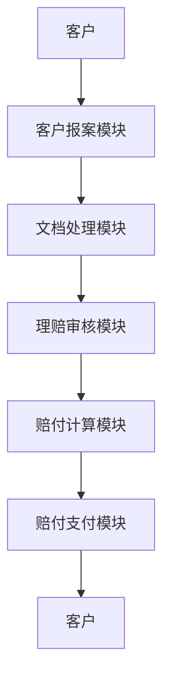
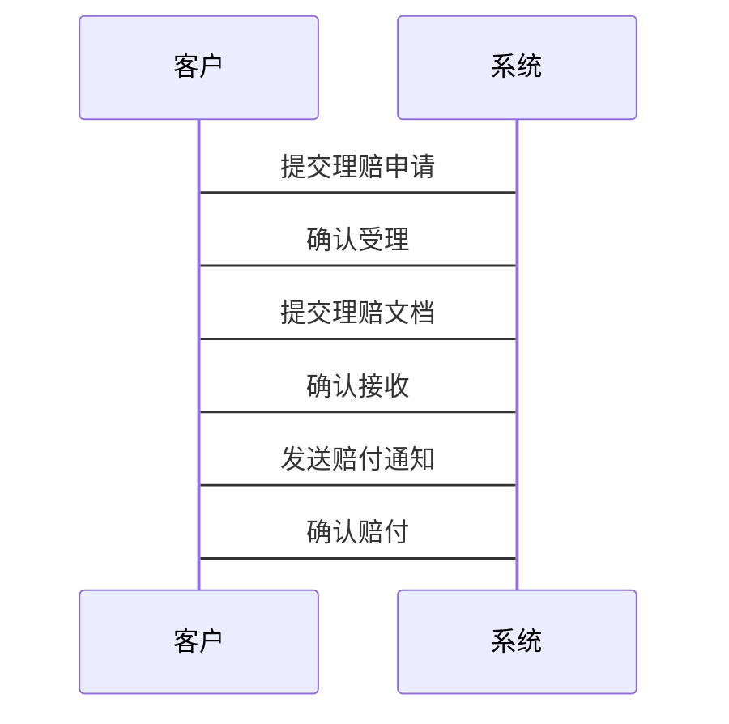

                 

<think>
嗯，用户现在需要我帮忙写一篇关于AI在保险理赔流程优化和客户体验提升中的应用的技术博客文章。他提供了详细的目录结构和一些内容示例，我得先仔细理解这些要求。

首先，文章标题和关键词已经给出，我需要确保开头部分包含这些内容。接下来，摘要部分需要简明扼要地概括文章的核心内容，也就是AI如何优化保险理赔流程并提升客户体验。

然后是目录结构，分为六个部分，每个部分下还有三级内容。我需要按照这个结构逐步展开，确保每个部分都详细且有深度。比如，在“保险行业的现状与挑战”部分，我需要解释保险行业的基本概念、现状和挑战，以及AI带来的变革。

接下来，核心概念部分需要定义AI和保险术语，并用表格和Mermaid图展示它们的关联。这可能有点复杂，我得确保表格清晰，Mermaid图准确。

在AI技术原理部分，我需要详细讲解机器学习、自然语言处理和深度学习，包括数学模型和公式。这部分要深入浅出，用例子帮助读者理解，比如线性回归和决策树的结构。

应用场景部分，我需要列举风险评估、理赔自动化和智能客服，说明AI如何优化这些流程。同时，加入数学公式和代码示例，比如XGBoost算法的应用，让内容更具技术性。

系统架构部分，我需要设计一个完整的AI保险理赔系统，包括功能模块、架构图和交互流程。这部分可能需要更多的Mermaid图，确保读者能够清晰理解系统结构。

项目实战部分，我需要提供一个具体的案例，比如使用XGBoost进行风险评估。要详细描述环境安装、代码实现和案例分析，让读者能够实际操作。

最后，总结和展望部分要回顾AI的应用，指出未来发展方向，并给出最佳实践建议。

在写作过程中，我需要确保内容逻辑清晰，结构紧凑，语言专业但易懂。同时，注意使用markdown格式，正确嵌入数学公式和图表。保持文章整体流畅，避免过于技术化的术语，确保读者能够轻松理解。

可能遇到的困难包括如何平衡理论和实战部分，确保理论足够支撑实战，但又不显得冗长。我需要调整章节顺序，先介绍背景和概念，再深入技术，最后应用到实际项目中。

总之，我需要按照用户的要求，一步步构建一个逻辑清晰、内容全面的博客文章，确保每一部分都细化到三级，并且符合用户的格式和内容要求。
</think>

# AI在保险理赔流程优化与客户体验提升中的应用

> 关键词：人工智能, 保险理赔, 客户体验, 流程优化, 自然语言处理, 机器学习, 深度学习

> 摘要：本文深入探讨了人工智能技术在保险理赔流程优化与客户体验提升中的应用。通过分析保险行业的现状与挑战，结合机器学习、自然语言处理和深度学习等AI技术，提出了基于AI的保险理赔流程优化方案，并通过实际案例展示了如何通过AI技术提升保险行业的效率与客户满意度。本文还详细讲解了AI技术的核心算法原理、系统架构设计以及项目实战中的具体实现，为读者提供了全面的技术指导与实践参考。

---

## 第一部分: 保险行业的AI应用背景与现状

### 第1章: 保险行业的现状与挑战

#### 1.1 保险行业的现状分析

##### 1.1.1 保险行业的基本概念
保险行业是通过分散风险、提供风险保障服务的行业，主要业务包括保险产品的设计、销售、承保、理赔和客户服务等。保险行业的核心目标是通过风险管理和风险分担机制，为客户提供风险保障服务。

##### 1.1.2 保险行业的痛点分析
目前，保险行业在业务流程、客户体验和技术应用等方面存在以下痛点：
- **理赔流程复杂**：传统保险理赔流程涉及大量纸质文档和人工审核，效率低且容易出错。
- **客户体验差**：客户在理赔过程中常常需要多次提交资料，等待时间长，体验不佳。
- **成本高**：传统理赔模式需要大量人工参与，导致企业运营成本居高不下。
- **数据孤岛**：保险行业涉及大量数据，但这些数据往往分散在不同系统中，难以有效整合和利用。

##### 1.1.3 保险行业的未来发展趋势
随着技术的不断发展，保险行业正朝着数字化、智能化和个性化方向发展。AI技术的引入，特别是机器学习、自然语言处理和深度学习等技术的应用，将推动保险行业实现流程自动化、决策智能化和客户体验个性化。

#### 1.2 保险理赔流程的痛点与优化方向

##### 1.2.1 传统保险理赔流程的复杂性
传统保险理赔流程通常包括以下几个步骤：
1. **报案**：客户通过电话或在线方式提交理赔申请。
2. **资料收集**：保险公司要求客户提供相关理赔资料，如事故报告、医疗记录等。
3. **审核**：保险公司对提交的资料进行人工审核，确认理赔条件是否符合。
4. **理赔计算**：根据保险合同条款计算赔付金额。
5. **赔付**：将赔款支付给客户。

这种流程不仅耗时长，而且容易出错，客户体验较差。

##### 1.2.2 现有保险理赔流程中的效率问题
现有保险理赔流程中，效率问题主要体现在以下几个方面：
- **人工审核耗时**：传统理赔流程中，人工审核需要大量时间，导致客户等待时间长。
- **信息孤岛**：不同部门之间数据难以共享，导致重复劳动和效率低下。
- **错误率高**：人工审核容易出错，导致理赔效率进一步下降。

##### 1.2.3 客户体验在保险行业中的重要性
客户体验是保险行业的重要竞争优势。随着市场竞争的加剧，客户对保险服务的要求越来越高，他们希望获得更快捷、更高效的理赔服务，以及更个性化的客户服务。

#### 1.3 AI技术在保险行业的应用前景

##### 1.3.1 AI技术的基本概念
人工智能（AI）是指模拟人类智能的计算机系统，包括学习、推理、感知和决策等能力。AI技术的核心是通过算法和数据训练模型，实现对复杂问题的自动化处理。

##### 1.3.2 AI技术在保险行业的应用现状
目前，AI技术已经在保险行业中得到了广泛应用，包括：
- **风险评估**：通过机器学习模型评估客户的风险等级，从而制定合理的保险产品定价策略。
- **理赔自动化**：利用自然语言处理技术自动解析理赔文档，实现理赔流程的自动化。
- **智能客服**：通过自然语言处理技术实现智能客服，为客户提供24/7的在线咨询服务。

##### 1.3.3 AI技术在保险行业的未来发展趋势
随着AI技术的不断发展，未来保险行业将更加依赖AI技术实现业务流程的智能化。AI技术将在以下方面发挥更大的作用：
- **智能理赔**：通过深度学习技术实现理赔流程的完全自动化。
- **个性化服务**：通过大数据分析，为客户提供个性化的保险产品和服务。
- **风险预测**：通过机器学习技术预测潜在风险，提前制定应对策略。

---

### 第2章: AI在保险理赔流程中的核心作用

#### 2.1 AI技术的核心概念与原理

##### 2.1.1 机器学习的基本原理
机器学习是一种人工智能技术，通过训练数据模型，使模型能够从数据中学习规律，并用于预测或分类。机器学习的核心是算法，常用的算法包括线性回归、决策树、随机森林、支持向量机（SVM）和神经网络等。

##### 2.1.2 自然语言处理的基本原理
自然语言处理（NLP）是一种人工智能技术，旨在使计算机能够理解和处理人类语言。NLP的核心技术包括分词、语法分析、实体识别、情感分析和机器翻译等。

##### 2.1.3 深度学习的基本原理
深度学习是一种机器学习技术，通过多层神经网络模型实现对数据的深度表示。深度学习的核心是神经网络，常用的模型包括卷积神经网络（CNN）、循环神经网络（RNN）和长短期记忆网络（LSTM）等。

#### 2.2 AI在保险理赔中的具体应用场景

##### 2.2.1 风险评估与定价
通过机器学习模型对客户的风险进行评估，保险公司可以制定合理的保险产品定价策略。例如，利用客户的历史理赔记录和健康状况数据，训练一个风险评估模型，预测客户未来发生理赔的概率。

##### 2.2.2 理赔自动化
通过自然语言处理技术，保险公司可以自动解析理赔文档，实现理赔流程的自动化。例如，利用NLP技术从理赔文档中提取关键信息，自动完成理赔审核和赔付计算。

##### 2.2.3 智能客服
通过自然语言处理技术，保险公司可以实现智能客服，为客户提供24/7的在线咨询服务。例如，客户可以通过智能客服查询理赔进度、咨询保险条款或提交理赔申请。

#### 2.3 AI技术对保险行业的影响

##### 2.3.1 提高效率
AI技术可以显著提高保险行业的运营效率。例如，机器学习模型可以在短时间内完成大量数据的分析和处理，显著缩短理赔时间。

##### 2.3.2 降低成本
AI技术可以降低保险行业的运营成本。例如，通过自动化理赔流程，保险公司可以减少人工审核的需要，从而降低人力成本。

##### 2.3.3 提升客户体验
AI技术可以显著提升客户的体验。例如，智能客服可以为客户提供更快捷、更高效的咨询服务，显著提高客户满意度。

---

### 第3章: 保险理赔流程优化的AI解决方案

#### 3.1 基于机器学习的保险理赔优化

##### 3.1.1 机器学习在风险评估中的应用
通过机器学习模型对客户的风险进行评估，保险公司可以制定合理的保险产品定价策略。例如，利用客户的历史理赔记录和健康状况数据，训练一个风险评估模型，预测客户未来发生理赔的概率。

##### 3.1.2 机器学习在理赔预测中的应用
通过机器学习模型对理赔案件进行预测，保险公司可以提前做好理赔准备。例如，利用历史理赔数据，训练一个理赔预测模型，预测未来可能发生的理赔案件。

##### 3.1.3 机器学习在理赔决策中的应用
通过机器学习模型对理赔案件进行决策，保险公司可以提高理赔决策的准确性和效率。例如，利用历史理赔数据和客户信息，训练一个理赔决策模型，自动判断是否批准理赔申请。

#### 3.2 基于自然语言处理的保险理赔优化

##### 3.2.1 自然语言处理在保险合同解析中的应用
通过自然语言处理技术，保险公司可以自动解析保险合同中的条款和条件。例如，利用NLP技术从保险合同中提取关键信息，如保险责任、免责条款和理赔条件等。

##### 3.2.2 自然语言处理在客户咨询中的应用
通过自然语言处理技术，保险公司可以实现智能客服，为客户提供24/7的在线咨询服务。例如，客户可以通过智能客服查询理赔进度、咨询保险条款或提交理赔申请。

##### 3.2.3 自然语言处理在理赔文档处理中的应用
通过自然语言处理技术，保险公司可以自动处理理赔文档。例如，利用NLP技术从理赔文档中提取关键信息，自动完成理赔审核和赔付计算。

#### 3.3 基于深度学习的保险理赔优化

##### 3.3.1 深度学习在保险图像识别中的应用
通过深度学习技术，保险公司可以实现图像识别。例如，利用深度学习模型识别车损照片中的损坏部位，自动评估车损金额。

##### 3.3.2 深度学习在保险语音识别中的应用
通过深度学习技术，保险公司可以实现语音识别。例如，利用深度学习模型识别客户电话中的关键词，自动完成理赔申请。

##### 3.3.3 深度学习在保险文本生成中的应用
通过深度学习技术，保险公司可以实现文本生成。例如，利用深度学习模型生成个性化的保险产品说明，或自动生成理赔报告。

---

## 第四部分: 项目实战与系统架构设计

### 第4章: AI保险理赔系统的设计与实现

#### 4.1 项目介绍

##### 4.1.1 项目背景
本项目旨在通过AI技术优化保险理赔流程，提高理赔效率，降低运营成本，提升客户体验。

##### 4.1.2 项目目标
通过本项目，我们希望实现以下目标：
- **自动化理赔流程**：通过AI技术实现理赔流程的自动化，减少人工干预。
- **提高理赔效率**：通过AI技术显著提高理赔效率，缩短客户等待时间。
- **提升客户体验**：通过AI技术提供个性化的客户服务，提高客户满意度。

#### 4.2 系统功能设计

##### 4.2.1 系统功能模块
- **客户报案模块**：客户可以通过在线或电话方式提交理赔申请。
- **文档处理模块**：系统自动解析理赔文档，提取关键信息。
- **理赔审核模块**：系统自动审核理赔申请，判断是否符合赔付条件。
- **赔付计算模块**：系统根据保险合同条款自动计算赔付金额。
- **客户查询模块**：客户可以通过在线方式查询理赔进度和赔付结果。

##### 4.2.2 系统功能流程
- **客户报案**：客户提交理赔申请。
- **文档处理**：系统自动解析理赔文档，提取关键信息。
- **理赔审核**：系统自动审核理赔申请，判断是否符合赔付条件。
- **赔付计算**：系统根据保险合同条款自动计算赔付金额。
- **赔付支付**：系统将赔款支付给客户。

#### 4.3 系统架构设计

##### 4.3.1 系统架构图

##### 4.3.2 系统接口设计
- **客户报案接口**：客户通过API提交理赔申请。
- **文档处理接口**：系统通过API自动解析理赔文档。
- **理赔审核接口**：系统通过API自动审核理赔申请。
- **赔付计算接口**：系统通过API自动计算赔付金额。
- **赔付支付接口**：系统通过API完成赔款支付。

#### 4.4 系统交互流程

##### 4.4.1 系统交互流程图

---

## 第五部分: 总结与展望

### 第5章: 总结与展望

#### 5.1 总结
通过本文的探讨，我们可以看到AI技术在保险理赔流程优化与客户体验提升中的巨大潜力。AI技术不仅可以显著提高保险行业的运营效率，降低运营成本，还可以为客户提供更快捷、更高效的理赔服务，显著提升客户满意度。

#### 5.2 未来展望
随着AI技术的不断发展，未来保险行业将更加依赖AI技术实现业务流程的智能化。AI技术将在以下方面发挥更大的作用：
- **智能理赔**：通过深度学习技术实现理赔流程的完全自动化。
- **个性化服务**：通过大数据分析，为客户提供个性化的保险产品和服务。
- **风险预测**：通过机器学习技术预测潜在风险，提前制定应对策略。

#### 5.3 最佳实践与注意事项

##### 5.3.1 最佳实践
- **数据质量**：确保训练数据的高质量，避免模型偏差。
- **模型解释性**：选择具有较高解释性的模型，确保模型的透明性和可解释性。
- **用户体验**：在设计AI系统时，始终以客户为中心，确保系统的易用性和客户体验。

##### 5.3.2 注意事项
- **数据隐私**：在处理客户数据时，必须严格遵守数据隐私保护法规。
- **模型更新**：定期更新模型，确保模型的准确性和适用性。
- **系统稳定性**：确保系统的稳定性和可靠性，避免因系统故障导致的理赔延误。

---

## 第六部分: 作者信息

作者：AI天才研究院/AI Genius Institute & 禅与计算机程序设计艺术 /Zen And The Art of Computer Programming

