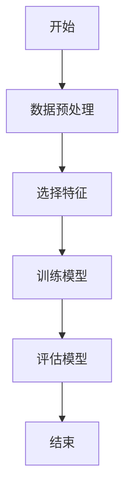
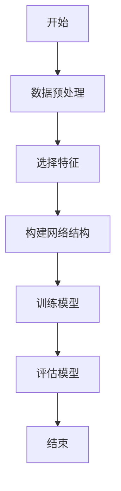

                 


# AI在保险理赔预测中的创新应用

> 关键词：保险理赔预测，人工智能，机器学习，深度学习，风险管理

> 摘要：本文探讨了人工智能技术在保险理赔预测中的创新应用，分析了传统保险行业的痛点，介绍了AI技术的核心优势，详细讲解了机器学习和深度学习在保险理赔预测中的应用原理，通过具体案例展示了AI技术在保险行业中的实际应用效果，总结了AI技术在保险行业中的未来发展方向。

---

## 第一部分: 保险行业的现状与AI技术的引入

### 第1章: 保险行业的现状与挑战

#### 1.1 保险行业的现状
保险行业作为金融体系的重要组成部分，长期以来依赖传统的业务流程和人工操作。随着信息技术的飞速发展，保险行业正逐步向数字化和智能化方向转型。

#### 1.1.1 传统保险业务流程
传统的保险业务流程包括投保、核保、理赔和续保等环节。在理赔环节，保险公司通常需要手动审核大量的理赔申请，依赖人工经验判断理赔结果。这种模式效率低下，容易出错，且成本较高。

#### 1.1.2 保险理赔中的痛点
保险理赔是保险业务中的核心环节，但也存在诸多痛点：
1. **理赔效率低**：传统理赔流程繁琐，人工审核耗时长，客户等待时间长。
2. **欺诈风险高**：保险欺诈行为屡见不鲜，增加了保险公司的赔付成本。
3. **数据孤岛**：不同部门和系统之间的数据难以共享，影响了理赔决策的准确性。
4. **人工成本高**：大量的人工审核工作增加了企业的运营成本。

#### 1.1.3 保险行业的数字化转型
随着大数据、人工智能等技术的快速发展，保险行业正在加速数字化转型。数字化转型不仅提高了业务效率，还为保险公司带来了新的业务模式和竞争优势。

#### 1.2 AI技术在保险行业的应用前景
人工智能技术的应用为保险行业带来了革命性的变化。通过AI技术，保险公司可以更高效地处理理赔、降低欺诈风险、优化客户服务体验。

#### 1.2.1 AI技术的核心优势
1. **高效性**：AI技术可以快速处理大量数据，提高理赔效率。
2. **准确性**：通过机器学习算法，AI可以提高理赔判断的准确性。
3. **预测性**：AI可以通过数据分析预测潜在风险，提前采取措施。

#### 1.2.2 AI在保险理赔中的潜在应用
1. **欺诈检测**：通过分析历史数据，识别潜在的欺诈行为。
2. **风险评估**：基于客户数据，评估客户的风险等级。
3. **理赔预测**：通过机器学习模型预测理赔的可能性和金额。

#### 1.2.3 保险行业对AI技术的需求
随着保险行业的数字化转型，保险公司对AI技术的需求日益增长。AI技术可以帮助保险公司提高效率、降低成本、提升客户满意度。

#### 1.3 本章小结
本章介绍了保险行业的现状和挑战，分析了传统保险业务流程的痛点，并探讨了AI技术在保险行业的应用前景。通过数字化转型，AI技术正在改变保险行业的传统模式，为保险公司带来新的机遇和挑战。

---

## 第二部分: AI在保险理赔预测中的核心概念与联系

### 第2章: 核心概念与原理

#### 2.1 机器学习与深度学习在保险中的应用
机器学习和深度学习是AI技术的核心组成部分，广泛应用于保险行业的多个领域。

#### 2.1.1 机器学习的基本原理
机器学习是一种通过数据训练模型的技术。模型通过学习数据的特征，能够对新的数据进行预测或分类。

#### 2.1.2 深度学习的基本原理
深度学习是一种基于人工神经网络的机器学习技术。与传统机器学习不同，深度学习可以通过多层网络结构自动提取数据的特征。

#### 2.1.3 机器学习与深度学习的对比
| 特性                | 机器学习                | 深度学习                |
|---------------------|-------------------------|-------------------------|
| 数据需求            | 数据量较小              | 数据量较大              |
| 特征工程            | 需要手动特征提取        | 可以自动提取特征        |
| 模型复杂度          | 模型相对简单            | 模型复杂度较高          |
| 应用场景            | 适合中小规模数据        | 适合大规模数据          |

#### 2.2 AI在保险理赔预测中的关键算法
在保险理赔预测中，常用的算法包括逻辑回归、决策树、随机森林和神经网络等。

#### 2.2.1 逻辑回归
逻辑回归是一种用于分类的机器学习算法。它通过构建一个线性回归模型，将输入特征映射到0和1之间的概率值。

#### 2.2.2 支持向量机
支持向量机（SVM）是一种用于分类和回归的机器学习算法。它通过找到一个超平面，将数据分为两类。

#### 2.2.3 随机森林
随机森林是一种基于决策树的集成学习算法。它通过随机选择特征和样本，构建多个决策树，并通过投票或平均的方式进行预测。

#### 2.2.4 神经网络
神经网络是一种模拟人脑神经网络的深度学习算法。它通过多层网络结构，自动提取数据的特征。

#### 2.3 算法原理与流程图
以下是逻辑回归和神经网络的算法流程图：

#### 2.3.1 逻辑回归算法流程图


#### 2.3.2 神经网络算法流程图


#### 2.4 核心概念对比表
以下是几种常用算法的对比表：

| 算法名称 | 优点                          | 缺点                          |
|----------|-------------------------------|-------------------------------|
| 逻辑回归 | 实现简单，计算速度快           | 对非线性关系的处理能力较弱    |
| 决策树   | 易于解释，适合中小规模数据     | � prone to overfitting         |
| 随机森林 | 鲁棒性高，适合高维数据         | 计算复杂度较高                |
| 神经网络 | 能够处理复杂非线性关系         | 需要大量数据，计算资源消耗大  |

#### 2.5 本章小结
本章介绍了机器学习和深度学习的基本原理，分析了AI在保险理赔预测中的关键算法，并通过流程图和对比表展示了不同算法的特点和应用场景。

---

## 第三部分: 算法原理与数学模型

### 第3章: 保险理赔预测的数学模型

#### 3.1 逻辑回归模型
逻辑回归是一种常用的二分类算法，广泛应用于保险理赔预测。

#### 3.1.1 模型公式
逻辑回归的模型公式为：
$$ P(y=1|x) = \frac{1}{1 + e^{-\beta x}} $$
其中，$\beta$ 是模型的系数，$x$ 是输入特征。

#### 3.1.2 模型推导
逻辑回归的损失函数为对数损失函数：
$$ L = -\sum_{i=1}^{n} y_i \ln(p_i) + (1 - y_i) \ln(1 - p_i) $$
其中，$y_i$ 是标签，$p_i$ 是预测概率。

#### 3.1.3 示例说明
假设我们有一个客户的数据，包括年龄、性别和保费等特征。我们可以通过逻辑回归模型预测该客户发生理赔的概率。

#### 3.2 神经网络模型
神经网络是一种复杂的深度学习模型，可以处理复杂的非线性关系。

#### 3.2.1 网络结构
神经网络通常包括输入层、隐藏层和输出层。每一层的节点通过激活函数进行非线性变换。

#### 3.2.2 激活函数
常用的激活函数包括sigmoid、ReLU和tanh等。

#### 3.2.3 损失函数
神经网络常用的损失函数是交叉熵损失函数：
$$ L = -\sum_{i=1}^{n} y_i \ln(a_i) + (1 - y_i) \ln(1 - a_i) $$
其中，$a_i$ 是输出层的激活值。

#### 3.3 XGBoost算法
XGBoost是一种基于树的集成学习算法，广泛应用于保险理赔预测。

#### 3.3.1 树模型原理
XGBoost通过构建多个决策树，并通过投票的方式进行预测。

#### 3.3.2 正则化方法
XGBoost引入了L1和L2正则化，以防止模型过拟合。

#### 3.3.3 示例分析
通过XGBoost模型，我们可以对客户的数据进行分类，预测其理赔概率。

#### 3.4 模型对比与优化
通过对比不同算法的性能，我们可以选择最适合当前任务的模型。

#### 3.5 本章小结
本章详细讲解了逻辑回归、神经网络和XGBoost算法的数学模型和实现原理，为后续的项目实战奠定了理论基础。

---

## 第四部分: 系统分析与架构设计

### 第4章: 保险理赔预测系统架构

#### 4.1 系统功能设计
保险理赔预测系统需要实现数据采集、数据处理、模型训练和结果输出等功能。

#### 4.1.1 数据采集模块
数据采集模块负责从各个数据源获取客户数据，包括投保信息、历史理赔记录等。

#### 4.1.2 数据处理模块
数据处理模块对采集到的数据进行清洗、特征提取和数据标准化。

#### 4.1.3 模型训练模块
模型训练模块使用训练数据对机器学习模型进行训练，生成可用于预测的模型。

#### 4.1.4 结果输出模块
结果输出模块将模型预测的结果输出，包括理赔概率和建议的理赔金额。

#### 4.2 系统架构设计
保险理赔预测系统的架构设计需要考虑系统的可扩展性和可维护性。

#### 4.2.1 分层架构
分层架构将系统划分为数据层、业务逻辑层和用户界面层，每一层都有明确的功能定义。

#### 4.2.2 微服务架构
微服务架构将系统分解为多个独立的服务，每个服务负责特定的功能模块。

#### 4.3 系统接口设计
系统接口设计需要考虑不同模块之间的交互和数据传递。

#### 4.3.1 数据接口
数据接口负责与数据源的交互，包括数据的读取和写入。

#### 4.3.2 模型接口
模型接口负责与机器学习模型的交互，包括模型的训练和预测。

#### 4.3.3 用户接口
用户接口负责与用户的交互，包括用户输入和结果展示。

#### 4.4 系统交互流程
系统交互流程包括数据采集、数据处理、模型训练和结果输出四个主要步骤。

#### 4.4.1 数据采集流程
1. 从数据源获取客户数据。
2. 对数据进行清洗和预处理。
3. 将数据存储到数据库中。

#### 4.4.2 模型训练流程
1. 从数据库中读取训练数据。
2. 使用机器学习算法训练模型。
3. 将训练好的模型保存到模型库中。

#### 4.4.3 结果输出流程
1. 接收用户的理赔请求。
2. 使用训练好的模型进行预测。
3. 将预测结果返回给用户。

#### 4.5 本章小结
本章详细描述了保险理赔预测系统的功能设计、架构设计和交互流程，为后续的项目实战提供了系统设计的依据。

---

## 第五部分: 项目实战与案例分析

### 第5章: 项目实战

#### 5.1 项目介绍
本项目旨在利用AI技术构建一个保险理赔预测系统，帮助保险公司提高理赔效率和准确性。

#### 5.2 环境安装
需要安装Python、Scikit-learn、XGBoost和TensorFlow等机器学习库。

#### 5.3 核心代码实现
以下是项目的部分核心代码：

#### 5.3.1 数据预处理代码
```python
import pandas as pd
from sklearn.preprocessing import StandardScaler

# 读取数据
data = pd.read_csv('insurance.csv')

# 数据清洗
data = data.dropna()

# 特征提取
X = data[['age', 'sex', 'bmi', 'children', 'smoker', 'region']]
y = data['charges']

# 标准化处理
scaler = StandardScaler()
X_scaled = scaler.fit_transform(X)
```

#### 5.3.2 模型训练代码
```python
from sklearn.ensemble import RandomForestClassifier
from sklearn.model_selection import train_test_split
from sklearn.metrics import accuracy_score

# 数据分割
X_train, X_test, y_train, y_test = train_test_split(X_scaled, y, test_size=0.2, random_state=42)

# 模型训练
model = RandomForestClassifier(n_estimators=100, max_depth=5, random_state=42)
model.fit(X_train, y_train)

# 模型预测
y_pred = model.predict(X_test)

# 模型评估
print("准确率:", accuracy_score(y_test, y_pred))
```

#### 5.3.3 案例分析
通过上述代码，我们可以训练一个随机森林模型，并对测试数据进行预测。模型的准确率可以用来衡量其预测能力。

#### 5.4 本章小结
本章通过具体的项目实战，展示了如何利用AI技术构建保险理赔预测系统。通过代码实现和案例分析，读者可以更好地理解AI技术在保险行业的实际应用。

---

## 第六部分: 总结与展望

### 第6章: 总结与展望

#### 6.1 本章总结
本文详细探讨了AI技术在保险理赔预测中的创新应用，分析了传统保险行业的痛点，介绍了AI技术的核心优势，详细讲解了机器学习和深度学习在保险理赔预测中的应用原理，并通过具体案例展示了AI技术在保险行业中的实际应用效果。

#### 6.2 未来发展方向
随着AI技术的不断发展，未来保险行业将更加智能化和数字化。以下是未来的发展方向：
1. **自动化理赔**：通过AI技术实现理赔的全自动处理。
2. **个性化保险产品**：基于客户数据，设计个性化保险产品。
3. **实时风险评估**：通过实时数据监测，实时评估客户的风险等级。

#### 6.3 最佳实践 tips
1. 在使用AI技术时，要注意数据隐私和安全问题。
2. 要选择适合具体业务场景的算法和模型。
3. 要持续优化模型，提高预测准确率。

#### 6.4 本章小结
本章总结了本文的核心内容，并展望了AI技术在保险行业的未来发展方向。通过本文的分析，读者可以更好地理解AI技术在保险行业的创新应用，并为未来的研究和实践提供参考。

---

## 作者：AI天才研究院/AI Genius Institute & 禅与计算机程序设计艺术 /Zen And The Art of Computer Programming

