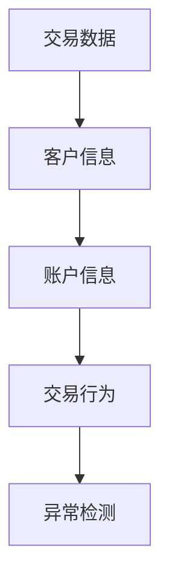
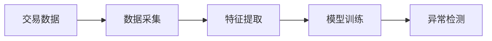
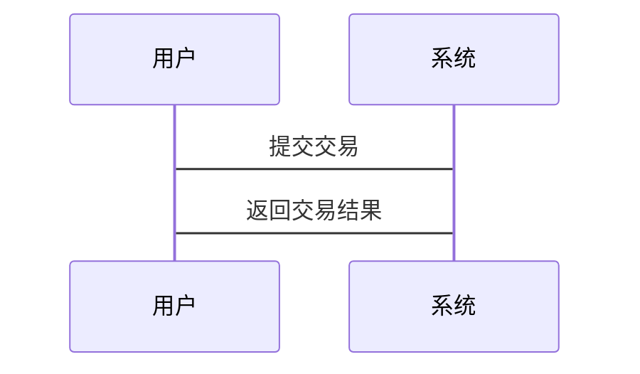

                 


# AI在反洗钱模式识别中的创新应用

> 关键词：反洗钱，人工智能，模式识别，机器学习，金融安全

> 摘要：本文探讨了AI技术在反洗钱模式识别中的创新应用，结合理论与实践，详细分析了AI如何通过模式识别技术提升反洗钱的效率与准确性。文章从反洗钱的基本概念出发，深入探讨了AI模式识别的核心原理，结合具体案例分析了常见算法的应用，并通过系统架构设计展示了AI在反洗钱中的实际应用价值。最后，本文总结了AI在反洗钱模式识别中的创新意义，并展望了未来的发展方向。

---

## 第一章：反洗钱与模式识别概述

### 1.1 反洗钱的基本概念与挑战

反洗钱（Anti-Money Laundering, AML）是指识别和防止非法资金通过金融系统流动的活动。洗钱的目的是将非法所得合法化，通常涉及掩盖资金来源、转移资金和隐藏交易痕迹。

反洗钱的核心挑战包括：
1. **交易数据的复杂性**：金融交易涉及大量的数据，包括交易金额、时间、地点等，这些数据可能来自多个渠道。
2. **洗钱手段的多样化**：洗钱者会不断变换策略，如利用多个账户分散资金、通过跨国交易掩盖来源等。
3. **传统方法的局限性**：传统基于规则的反洗钱系统依赖于预定义的规则，难以应对复杂的新型洗钱手法。

### 1.2 AI技术在反洗钱中的应用背景

随着AI技术的快速发展，其在金融领域的应用越来越广泛。AI能够处理海量数据，并通过学习发现隐藏的模式，这为反洗钱提供了新的工具。

AI在反洗钱中的优势：
1. **高效性**：AI能够快速处理大量数据，发现潜在的异常交易。
2. **自适应性**：AI模型能够根据新的数据不断优化，适应洗钱手段的变化。
3. **准确性**：AI通过学习海量数据，能够发现传统方法难以识别的模式。

### 1.3 AI模式识别在反洗钱中的创新应用

模式识别是AI的核心技术之一，其在反洗钱中的应用主要体现在：
1. **交易行为分析**：通过分析客户的交易行为，识别异常模式。
2. **客户画像构建**：利用客户数据构建画像，识别高风险客户。
3. **实时监控**：通过实时数据分析，快速识别可疑交易。

---

## 第二章：AI模式识别的核心概念与原理

### 2.1 反洗钱模式识别的核心概念

#### 数据特征提取
数据特征是模式识别的基础，主要包括：
- **交易特征**：如交易金额、频率、时间等。
- **账户特征**：如账户类型、开户时间、关联账户等。
- **行为特征**：如登录时间、操作频率、交易地点等。

#### 模型训练与优化
AI模式识别依赖于模型的训练，常用算法包括聚类、分类、回归等。模型训练的关键在于特征工程和算法选择。

#### 结果解释与反馈
AI模型需要能够解释结果，并提供反馈机制，以便不断优化模型。

### 2.2 AI模式识别的核心原理

#### 数据预处理与特征工程
数据预处理是模式识别的第一步，包括数据清洗、标准化、特征提取等。特征工程的目标是将原始数据转换为模型可以处理的特征。

#### 算法选择与模型训练
选择合适的算法是关键。聚类算法适用于发现异常交易，分类算法适用于预测交易是否异常。

#### 模型评估与优化
模型的评估指标包括准确率、召回率、F1值等。通过交叉验证和网格搜索优化模型参数。

### 2.3 核心概念的属性特征对比

| 概念          | 属性特征                  |
|---------------|---------------------------|
| 数据特征      | 交易金额、频率、时间      |
| 模型训练      | 算法选择、特征工程        |
| 结果解释      | 解释性、反馈机制          |

### 2.4 ER实体关系图架构



---

## 第三章：AI模式识别的算法原理与实现

### 3.1 算法原理

#### 聚类算法
聚类算法（如K-means）用于发现交易中的异常群体。例如，通过聚类发现某些客户的交易模式异常集中。

#### 分类算法
分类算法（如随机森林）用于预测交易是否为异常。例如，根据客户的交易特征预测其是否为高风险客户。

#### 回归算法
回归算法用于分析交易金额与时间的关系，识别异常的交易金额波动。

#### 异常检测
异常检测算法（如Isolation Forest）用于实时监控交易，识别突发的异常行为。

### 3.2 算法实现

#### 聚类算法实现

```python
from sklearn.cluster import KMeans
import numpy as np

# 示例数据
X = np.random.rand(100, 2)

# 聚类模型
model = KMeans(n_clusters=2)
model.fit(X)

# 预测结果
labels = model.predict(X)
```

#### 分类算法实现

```python
from sklearn.ensemble import RandomForestClassifier
from sklearn.model_selection import train_test_split

# 示例数据
X = np.random.rand(100, 2)
y = np.random.randint(0, 2, 100)

# 数据划分
X_train, X_test, y_train, y_test = train_test_split(X, y, test_size=0.2)

# 分类模型
model = RandomForestClassifier()
model.fit(X_train, y_train)

# 预测结果
y_pred = model.predict(X_test)
```

### 3.3 数学模型

#### 聚类算法公式
$$ \text{目标函数} = \sum_{i=1}^{n} \sum_{j=1}^{k} \min(d(x_i, c_j), d(x_i, c_{j'})) $$

#### 分类算法公式
$$ P(y|x) = \prod_{i=1}^{n} P(x_i|y) \cdot P(y) $$

---

## 第四章：系统分析与架构设计

### 4.1 系统功能设计

- **数据采集**：从数据库中获取交易数据。
- **特征提取**：对交易数据进行特征提取。
- **模型训练**：训练AI模型。
- **异常检测**：实时监控交易，识别异常。

### 4.2 系统架构设计



### 4.3 系统接口设计

- **输入接口**：接收交易数据。
- **输出接口**：输出异常交易报告。

### 4.4 系统交互流程



---

## 第五章：项目实战

### 5.1 环境搭建

- **Python**：安装Python 3.x。
- **库依赖**：安装scikit-learn、pandas、numpy。

### 5.2 核心实现

```python
import pandas as pd
from sklearn.ensemble import RandomForestClassifier

# 数据加载
data = pd.read_csv('transactions.csv')

# 特征提取
features = data[['amount', 'time']]
labels = data['is_fraud']

# 数据划分
from sklearn.model_selection import train_test_split
X_train, X_test, y_train, y_test = train_test_split(features, labels, test_size=0.2)

# 模型训练
model = RandomForestClassifier()
model.fit(X_train, y_train)

# 预测结果
y_pred = model.predict(X_test)
print('准确率:', model.score(X_test, y_test))
```

### 5.3 案例分析

- **案例描述**：某客户短时间内多次大额交易，系统识别为异常。
- **分析结果**：模型预测该交易为异常，系统发出预警。

---

## 第六章：总结与展望

### 6.1 总结

AI技术通过模式识别显著提升了反洗钱的效率和准确性，特别是在实时监控和异常检测方面。

### 6.2 未来展望

未来，AI在反洗钱中的应用将更加智能化和自动化，结合区块链和大数据技术，构建更高效的反洗钱系统。

### 6.3 最佳实践

- **数据质量**：确保数据的完整性和准确性。
- **模型优化**：定期更新模型，适应新的洗钱手段。
- **合规性**：确保AI应用符合相关法律法规。

---

## 作者：AI天才研究院 & 禅与计算机程序设计艺术

---

这篇文章详细探讨了AI在反洗钱模式识别中的创新应用，结合理论与实践，为读者提供了全面的视角。希望对您有所帮助！

