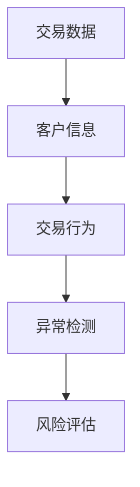
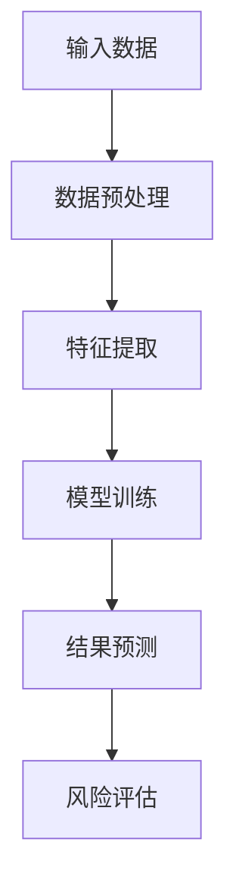
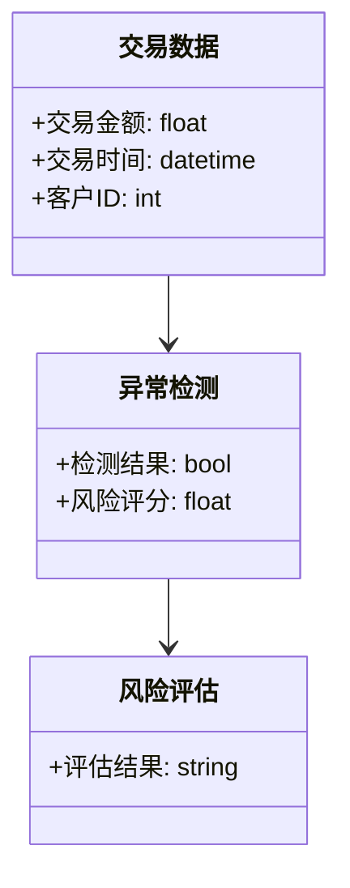

                 


# AI在反洗钱模式进化检测中的深度应用研究

## 关键词
AI, 反洗钱, 模式检测, 深度学习, LSTM, 洗钱手段

## 摘要
本文深入探讨了人工智能技术在反洗钱模式进化检测中的应用。首先，我们从反洗钱的基本概念和挑战入手，分析了传统反洗钱模式的局限性以及洗钱手段的多样性和复杂性。接着，我们介绍了人工智能技术的基本原理和优势，特别是深度学习在模式识别中的应用潜力。随后，我们详细阐述了反洗钱模式检测的核心概念，包括数据特征提取、模型特征选择和检测机制设计，并通过对比分析和实体关系图展示了模式进化检测的关键特征。在算法原理部分，我们重点介绍了基于LSTM的序列模型和基于CNN的图像识别模型，通过流程图和代码示例详细讲解了这些算法在反洗钱中的具体实现。最后，我们通过一个完整的项目实战，展示了如何利用这些算法进行反洗钱模式进化检测，并总结了最佳实践和注意事项。

---

## 正文

### 第1章: 反洗钱的基本概念与挑战

#### 1.1 反洗钱的基本概念

反洗钱是指通过各种手段将非法获得的资金合法化的过程，其核心目的是追踪和阻止非法资金的流动。洗钱通常包括三个阶段：放置、层化和融合，每个阶段都需要复杂的金融操作和掩盖。反洗钱的核心任务是识别这些非法行为，并采取相应的措施。

#### 1.2 反洗钱模式检测的挑战

传统的反洗钱模式检测主要依赖于规则-based系统和人工分析，这种方法存在以下问题：
- **规则的局限性**：传统的规则-based系统难以应对洗钱手段的多样化和复杂化。
- **数据量与数据质量的双刃剑**：虽然现代金融机构积累了大量的交易数据，但数据的质量和相关性对模型的效果有直接影响。
- **模式进化**：洗钱者不断进化其手段，传统的静态规则难以适应动态变化的模式。

---

### 第2章: AI在反洗钱中的应用背景

#### 2.1 AI技术的基本原理与优势

人工智能（AI）和深度学习（DL）技术在反洗钱中的应用越来越广泛。深度学习通过多层神经网络结构，能够自动提取数据中的特征，特别适用于非结构化数据（如文本和图像）的分析。

#### 2.2 反洗钱模式进化检测的必要性

洗钱者不断进化其手段以规避传统的反洗钱措施，这要求我们采用更加灵活和动态的检测方法。模式进化检测的核心在于识别异常交易模式的变化趋势，并及时调整检测策略。

---

### 第3章: 反洗钱模式进化检测的核心概念与联系

#### 3.1 反洗钱模式检测的基本原理

模式检测的核心是通过数据分析识别异常行为。数据特征提取是关键步骤，包括交易金额、频率、时间等。模型特征选择则依赖于深度学习算法，能够自动提取更复杂的特征。

#### 3.2 反洗钱模式进化检测的特征对比

通过对比分析，我们可以发现模式进化检测的关键特征，例如交易行为的变化趋势和异常模式的动态变化。

#### 3.3 反洗钱模式进化检测的ER实体关系图



---

### 第4章: 基于深度学习的反洗钱模式检测算法

#### 4.1 基于LSTM的反洗钱模式检测算法

LSTM（长短期记忆网络）是一种特殊的循环神经网络，能够有效捕捉时间序列数据中的长依赖关系。

##### 4.1.1 LSTM的基本结构
LSTM由记忆单元、输入门和遗忘门组成，能够有效解决传统RNN的梯度消失问题。

##### 4.1.2 LSTM在反洗钱中的具体实现

以下是一个基于LSTM的反洗钱模型的代码示例：

```python
import numpy as np
from tensorflow.keras.models import Sequential
from tensorflow.keras.layers import LSTM, Dense, Dropout

# 定义模型
model = Sequential()
model.add(LSTM(64, input_shape=(timesteps, features)))
model.add(Dropout(0.5))
model.add(Dense(1, activation='sigmoid'))

# 编译模型
model.compile(loss='binary_crossentropy', optimizer='adam', metrics=['accuracy'])

# 训练模型
model.fit(X_train, y_train, epochs=10, batch_size=32, validation_data=(X_test, y_test))
```

##### 4.1.3 LSTM的数学模型

LSTM的核心公式如下：
$$
f_t = \sigma(W_f \cdot [h_{t-1}, x_t] + b_f)
$$
$$
i_t = \sigma(W_i \cdot [h_{t-1}, x_t] + b_i)
$$
$$
o_t = \sigma(W_o \cdot [h_{t-1}, x_t] + b_o)
$$
$$
h_t = f_t \cdot c_{t-1} + i_t \cdot x_t
$$

---

### 4.2 基于CNN的图像识别模型

#### 4.2.1 CNN的基本原理

CNN通过卷积层、池化层和全连接层提取图像特征。以下是一个简单的CNN模型：

```python
import tensorflow as tf
from tensorflow.keras.models import Sequential
from tensorflow.keras.layers import Conv2D, MaxPooling2D, Flatten, Dense

model = Sequential()
model.add(Conv2D(32, (3,3), activation='relu', input_shape=(64, 64, 3)))
model.add(MaxPooling2D((2,2)))
model.add(Flatten())
model.add(Dense(128, activation='relu'))
model.add(Dense(1, activation='sigmoid'))
```

#### 4.2.2 图像特征提取在反洗钱中的应用

交易数据可以通过可视化生成图像，例如热图和时间序列图，从而利用CNN进行异常检测。

---

### 4.3 算法流程图



---

### 第5章: 系统分析与架构设计方案

#### 5.1 问题场景介绍

反洗钱系统需要实时处理大量的交易数据，并快速识别异常行为。

#### 5.2 系统功能设计

以下是系统的功能模块：



---

### 第6章: 项目实战

#### 6.1 环境安装

需要安装以下库：
- TensorFlow
- Keras
- Scikit-learn
- Pandas
- Numpy

#### 6.2 核心实现代码

以下是反洗钱模式检测的代码示例：

```python
import numpy as np
import pandas as pd
from sklearn.model_selection import train_test_split
from tensorflow.keras.models import Sequential
from tensorflow.keras.layers import LSTM, Dense, Dropout

# 数据预处理
data = pd.read_csv('transactions.csv')
X = data[['amount', 'time', 'customer_id']]
y = data['is_fraud']

X_train, X_test, y_train, y_test = train_test_split(X, y, test_size=0.2)

# 模型训练
model = Sequential()
model.add(LSTM(64, input_shape=(X_train.shape[1], 1)))
model.add(Dropout(0.5))
model.add(Dense(1, activation='sigmoid'))

model.compile(loss='binary_crossentropy', optimizer='adam', metrics=['accuracy'])
model.fit(X_train, y_train, epochs=10, batch_size=32, validation_data=(X_test, y_test))
```

#### 6.3 案例分析

假设我们有以下交易数据：
| 交易金额 | 交易时间 | 客户ID | 是否洗钱 |
|----------|----------|--------|----------|
| 1000     | 2023-01-01 | 1 | 0 |
| 2000     | 2023-01-02 | 1 | 1 |
| 1500     | 2023-01-03 | 1 | 0 |

通过模型检测，我们可以识别异常交易。

---

## 第7章: 最佳实践与小结

#### 7.1 小结

本文详细介绍了AI在反洗钱模式进化检测中的深度应用，重点讲解了基于LSTM和CNN的算法原理和实现。

#### 7.2 注意事项

- 数据隐私保护
- 模型的可解释性
- 模型的实时性

#### 7.3 拓展阅读

- 《深度学习实战》
- 《反洗钱的法律与技术》

---

## 作者

作者：AI天才研究院 & 禅与计算机程序设计艺术

