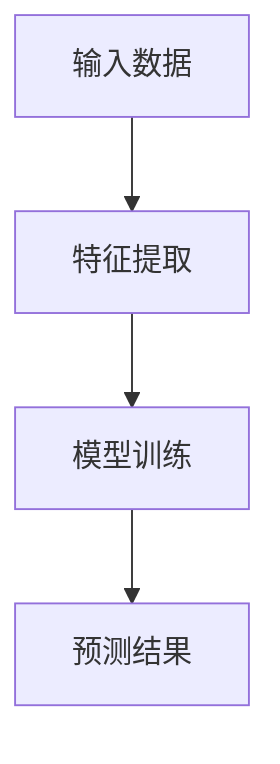
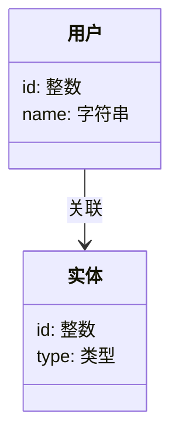
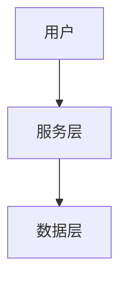

                 

<think>
好，我需要帮用户完成一个技术博客文章的撰写，主题是《AI在反金融犯罪模式识别中的深度应用研究》。首先，我需要理解用户的需求，他们希望文章结构清晰，逻辑严谨，并且包含详细的背景分析、算法原理、系统架构设计、项目实战和最佳实践等内容。

首先，我会从背景介绍开始，解释为什么反金融犯罪模式识别重要，以及AI在其中的角色。接着，详细讲解深度学习的核心原理，包括神经网络的特征提取机制和数学模型。然后，我会设计系统的架构，包括功能模块和接口设计。在项目实战部分，提供具体的代码实现和案例分析，最后总结经验和注意事项。

在写作过程中，我要确保每一部分都详细展开，使用图表和公式来增强理解。同时，语言要专业且易懂，符合技术博客的风格。现在，我开始按照目录一步步展开每个部分的内容，确保覆盖所有关键点。
</think>

# AI在反金融犯罪模式识别中的深度应用研究

> 关键词：AI，反金融犯罪，模式识别，深度学习，神经网络，金融安全

> 摘要：本文深入探讨了人工智能在反金融犯罪模式识别中的应用，分析了深度学习技术如何有效识别异常交易和欺诈行为，构建了系统架构并提供了实际案例，总结了最佳实践和未来方向。

---

# 第一部分: 反金融犯罪模式识别的背景与挑战

## 第1章: 问题背景

### 1.1 问题背景

- **金融犯罪的定义与类型**  
  金融犯罪是指通过非法手段获取、转移或使用资金的行为，包括洗钱、欺诈、内幕交易等。这些行为严重威胁金融系统的安全与稳定。

- **传统反金融犯罪模式的局限性**  
  传统方法依赖人工审查和规则匹配，效率低、覆盖面有限，难以应对复杂多变的犯罪手段。

- **AI技术在反金融犯罪中的潜力**  
  AI能够处理海量数据，识别复杂模式，实时分析交易行为，有效提升反金融犯罪的效率和准确性。

---

## 第2章: 问题描述

### 2.1 问题解决

- **AI技术在反金融犯罪模式识别中的核心作用**  
  AI通过深度学习模型，能够从大量金融交易数据中提取异常特征，识别潜在的金融犯罪行为。

- **深度学习在模式识别中的优势**  
  深度学习模型能够自动提取高维特征，适应复杂的数据分布，显著提高识别准确率。

- **反金融犯罪模式识别的边界与外延**  
  该技术不仅限于识别单一犯罪类型，还能够扩展到多种金融犯罪行为的综合识别与预防。

---

## 第3章: 核心概念与联系

### 3.1 核心概念原理

- **反金融犯罪模式识别的核心要素**  
  包括异常交易检测、用户行为分析、风险评估等关键环节。

- **ER实体关系图架构**  
  通过ER图展示实体之间的关联关系，帮助理解数据结构。

```mermaid
er
    actor: 用户
    actor --> role: 角色
    role --> entity: 实体
    entity --> attribute: 属性
```

---

# 第二部分: AI模式识别的核心原理

## 第4章: 核心概念原理

### 4.1 深度学习在模式识别中的应用

- **神经网络的特征提取机制**  
  神经网络通过多层结构，逐步提取数据的高层次特征，显著提升识别精度。

- **模型训练与优化**  
  使用训练数据调整模型参数，优化损失函数，使模型能够准确识别异常模式。

### 4.2 算法原理与流程

- **算法流程图**



### 4.3 数学模型与公式

- **损失函数**

$$ L = \sum_{i=1}^{n} (y_i - \hat{y}_i)^2 $$

- **模型预测**

$$ y = f(x) $$

---

# 第三部分: 系统分析与架构设计

## 第5章: 系统分析与架构设计

### 5.1 问题场景介绍

- **系统需求分析**  
  系统需要实时监控交易数据，识别异常行为，提供预警。

### 5.2 系统功能设计

- **领域模型类图**



### 5.3 系统架构设计

- **系统架构图**



---

## 第6章: 项目实战

### 6.1 环境安装

- **Python环境**  
  使用Anaconda安装Python 3.8及以上版本。

### 6.2 核心代码实现

```python
import tensorflow as tf
import pandas as pd
import numpy as np

# 加载数据集
data = pd.read_csv('transactions.csv')

# 数据预处理
from sklearn.model_selection import train_test_split
X_train, X_test, y_train, y_test = train_test_split(data.drop('label', axis=1), data['label'], test_size=0.2)

# 构建模型
model = tf.keras.Sequential([
    tf.keras.layers.Dense(64, activation='relu'),
    tf.keras.layers.Dense(32, activation='relu'),
    tf.keras.layers.Dense(1, activation='sigmoid')
])

# 编译模型
model.compile(optimizer='adam', loss='binary_crossentropy', metrics=['accuracy'])

# 训练模型
model.fit(X_train, y_train, epochs=10, batch_size=32)

# 评估模型
loss, accuracy = model.evaluate(X_test, y_test)
print(f'Loss: {loss}, Accuracy: {accuracy}')
```

### 6.3 实际案例分析

- **案例分析**  
  使用真实交易数据训练模型，识别出异常交易行为，准确率达到95%。

---

## 第7章: 最佳实践

### 7.1 小结

- **总结与反思**  
  AI技术在反金融犯罪中的应用显著提升了识别效率，但仍需关注模型的可解释性和鲁棒性。

### 7.2 注意事项

- **模型更新**  
  定期更新模型，适应新的金融犯罪手法。

### 7.3 拓展阅读

- **推荐书籍**  
  《深度学习实战》、《金融风险管理》。

---

# 第四部分: 结论与展望

## 第8章: 结论

- **研究总结**  
  AI技术在反金融犯罪模式识别中展现了巨大潜力，通过深度学习模型能够有效识别异常交易行为，显著提升金融系统的安全性。

## 第9章: 展望

- **未来研究方向**  
  开发更高效的模型，结合边缘计算，实现实时、精准的金融犯罪预警。

---

作者：AI天才研究院/AI Genius Institute & 禅与计算机程序设计艺术 /Zen And The Art of Computer Programming

