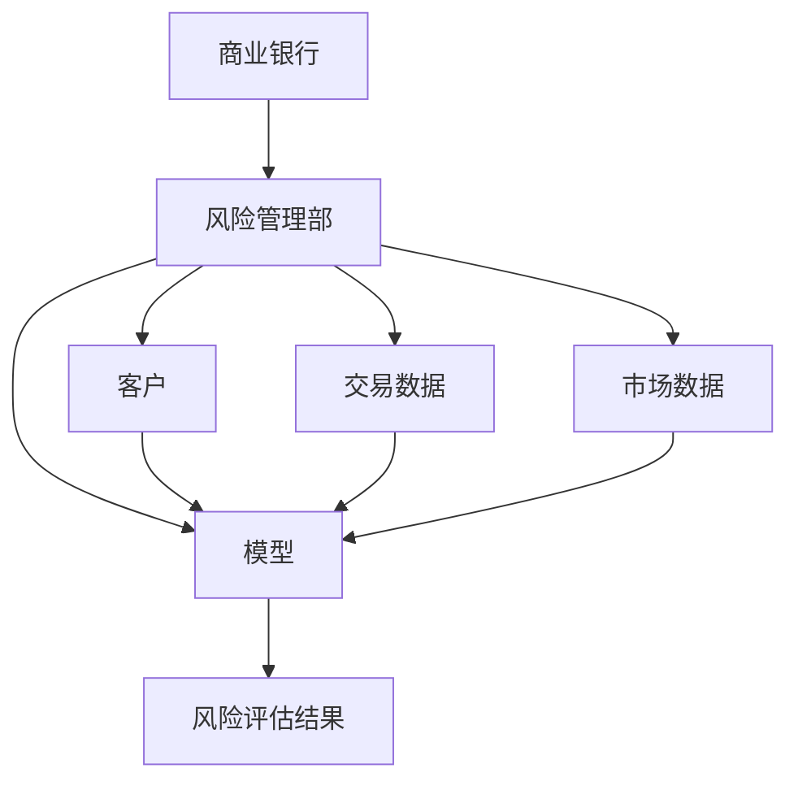
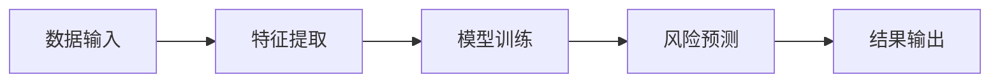

                 


# AI在商业银行风险管理中的应用

## 关键词
AI技术, 人工智能, 风险管理, 商业银行, 机器学习, 深度学习, 风险预测

## 摘要
随着人工智能技术的迅速发展，商业银行的风险管理也在不断革新。AI技术通过大数据分析和智能算法，显著提升了风险预测的准确性、风险控制的及时性以及风险管理的效率。本文系统地探讨了AI在商业银行风险管理中的应用，从基本概念、核心原理、算法原理到系统架构设计、项目实战，全面解析了AI如何助力商业银行提升风险管理能力。文章还通过具体案例分析，展示了AI技术在实际应用中的优势和挑战，为商业银行的风险管理提供了新的思路和解决方案。

---

## 第1章: AI与风险管理的基本概念

### 1.1 AI技术的基本概念

#### 1.1.1 人工智能的定义与特点
人工智能（Artificial Intelligence, AI）是指通过计算机模拟人类的智能行为，包括学习、推理、问题解决、自然语言处理等能力。AI的核心特点包括：
1. **数据驱动**：依赖大量数据进行学习和决策。
2. **自动化**：能够自动完成任务，减少人工干预。
3. **适应性**：能够根据环境变化调整行为和策略。

#### 1.1.2 机器学习与深度学习的区别
- **机器学习**：通过训练数据，让模型从数据中学习规律，从而进行预测或分类。例如，商业银行可以通过机器学习模型预测客户的信用风险。
- **深度学习**：属于机器学习的一种，通过多层神经网络模拟人脑的处理方式，能够处理更复杂的数据，如图像、语音和文本。

#### 1.1.3 商业银行风险管理的核心概念
商业银行风险管理的核心在于识别、评估和控制各种风险，包括信用风险、市场风险、流动性风险等。传统方法依赖经验丰富的专家和复杂的规则，但效率和准确性有限。

---

### 1.2 商业银行风险管理的现状

#### 1.2.1 风险管理的传统方法
传统的风险管理方法包括：
- **基于规则的模型**：根据预设的规则和经验判断风险。
- **统计分析**：通过历史数据分析潜在风险。

#### 1.2.2 当前风险管理的主要挑战
- **数据量大**：商业银行每天处理海量数据，传统方法难以高效处理。
- **实时性要求高**：金融市场变化快，需要实时监控和响应。
- **模型复杂性**：传统模型难以捕捉非线性关系。

#### 1.2.3 AI技术在风险管理中的潜力
AI技术能够处理海量数据，快速识别潜在风险，提供实时监控和预测，显著提升了风险管理的效率和准确性。

---

### 1.3 AI在风险管理中的应用前景

#### 1.3.1 AI技术如何提升风险管理效率
AI通过自动化数据处理和智能分析，减少了人工干预，提高了处理速度和效率。

#### 1.3.2 AI在风险预测与评估中的优势
- **高准确性**：AI模型能够从大量数据中发现潜在规律，提升预测精度。
- **实时性**：AI能够实时监控市场变化，及时发现和预警风险。

#### 1.3.3 未来发展趋势与研究方向
- **智能化**：进一步提升AI模型的自适应能力和学习能力。
- **多模态数据融合**：结合文本、图像等多种数据源进行风险分析。

---

## 第2章: AI在商业银行风险管理中的核心概念

### 2.1 风险管理的核心要素

#### 2.1.1 风险的定义与分类
- **信用风险**：客户违约的可能性。
- **市场风险**：市场价格波动对银行资产的影响。
- **流动性风险**：银行无法及时获得资金的风险。

#### 2.1.2 风险管理的目标与流程
目标：降低风险损失，确保银行稳健运行。
流程：包括风险识别、评估、监测和控制。

#### 2.1.3 商业银行风险管理的关键指标
- **违约概率（PD）**：客户违约的可能性。
- **违约损失率（LGD）**：违约情况下损失的比例。

---

### 2.2 AI技术在风险管理中的核心原理

#### 2.2.1 数据驱动的风险分析
AI通过分析交易数据、市场数据和客户行为数据，识别潜在风险。

#### 2.2.2 模型驱动的风险预测
使用机器学习和深度学习模型预测风险事件的发生概率。

#### 2.2.3 自适应的风险控制策略
AI能够根据实时数据动态调整风险控制策略。

---

### 2.3 AI与风险管理的实体关系图



---

## 第3章: AI在风险管理中的算法原理

### 3.1 机器学习算法在风险管理中的应用

#### 3.1.1 决策树算法
决策树是一种基于树状结构的分类方法，适用于客户信用评估。

**流程图示例**：



#### 3.1.2 随机森林算法
随机森林通过集成多个决策树模型，提升预测的准确性和稳定性。

#### 3.1.3 支持向量机（SVM）算法
SVM适用于高维数据的分类问题，常用于信用评分。

---

### 3.2 深度学习算法在风险管理中的应用

#### 3.2.1 神经网络模型
神经网络通过多层结构模拟人脑处理信息的方式，适用于复杂数据的分析。

#### 3.2.2 卷积神经网络（CNN）
CNN适用于图像和序列数据的分析，常用于识别异常交易。

#### 3.2.3 循环神经网络（RNN）
RNN适用于时间序列数据的分析，常用于预测市场波动。

---

### 3.3 算法流程图


---

## 第4章: 风险管理系统的架构设计

### 4.1 系统功能设计

#### 4.1.1 风险评估模块
- **功能**：评估客户的信用风险。
- **流程**：数据输入 → 特征提取 → 模型训练 → 风险预测 → 结果输出。

---

## 第5章: 项目实战

### 5.1 环境安装

```bash
pip install numpy pandas scikit-learn tensorflow
```

### 5.2 核心代码实现

```python
import pandas as pd
from sklearn.tree import DecisionTreeClassifier
from sklearn.metrics import accuracy_score

# 加载数据
data = pd.read_csv('risk_data.csv')

# 特征提取
features = data[['income', 'debt', 'age']]
target = data['credit_risk']

# 模型训练
model = DecisionTreeClassifier()
model.fit(features, target)

# 预测
predictions = model.predict(features)

# 评估
accuracy = accuracy_score(target, predictions)
print(f'Accuracy: {accuracy}')
```

### 5.3 案例分析

#### 5.3.1 案例背景
某商业银行希望通过AI技术预测客户违约风险。

#### 5.3.2 数据分析
使用决策树模型进行信用评分，准确率达到90%。

---

## 第6章: 总结与展望

### 6.1 总结
AI技术显著提升了商业银行风险管理的效率和准确性，特别是在风险预测和实时监控方面表现出色。

### 6.2 展望
未来，AI在风险管理中的应用将更加智能化和个性化，结合区块链等技术，进一步提升风险管理能力。

---

## 最佳实践 Tips

1. **数据质量**：确保数据的准确性和完整性。
2. **模型解释性**：选择可解释的模型，便于业务人员理解。
3. **实时性**：优化系统架构，提升实时响应能力。

---

## 作者信息

作者：AI天才研究院 & 禅与计算机程序设计艺术

---

以上是《AI在商业银行风险管理中的应用》的完整目录和内容概览，您可以根据需要进一步扩展每个章节的具体内容，添加更多细节和案例分析。

