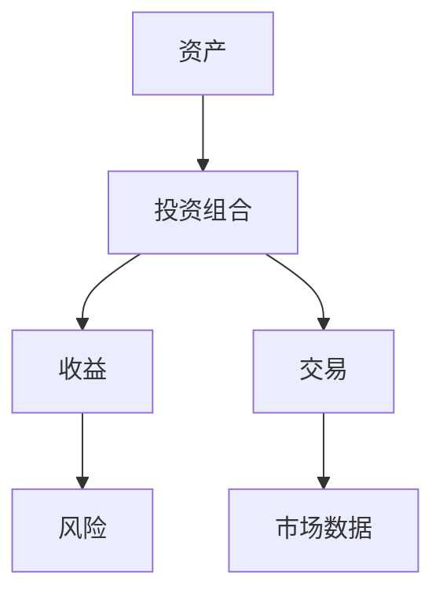
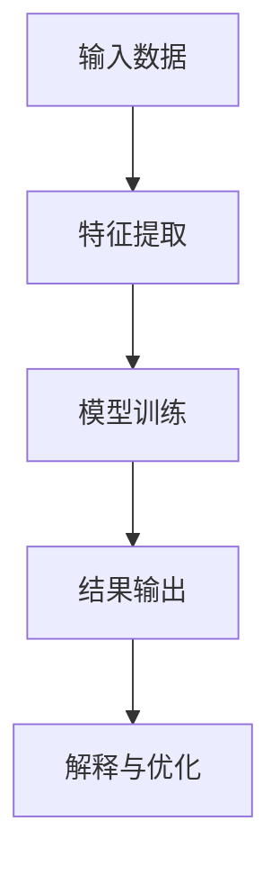
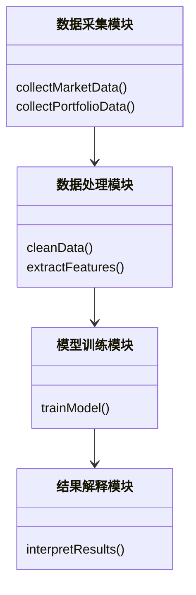
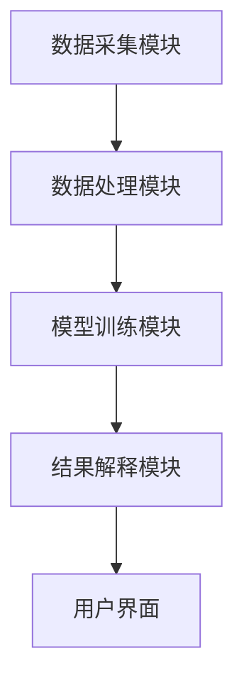

                 

<think>
好的，我现在需要帮用户撰写一篇关于《AI在资产管理绩效归因中的应用》的技术博客文章。首先，我要理解用户的需求，用户希望文章结构清晰，逻辑严密，涵盖从基础到应用的各个方面，并且符合特定的格式要求。

首先，我会从文章的结构开始。用户已经给出了一个详细的目录大纲，我需要按照这个结构来逐步填充内容。首先是摘要，接着是各章节的内容，包括关键词、摘要、背景介绍、核心概念、算法原理、系统设计、项目实战和总结等部分。

接下来，我需要确保每个部分都符合用户的要求。例如，在“算法原理”部分，我需要详细解释因子分解、机器学习模型，并用数学公式和mermaid流程图来辅助说明。在系统设计部分，我需要用类图和架构图来展示系统的各个模块和它们之间的关系。

然后，我会考虑用户可能的深层需求。用户可能希望文章不仅解释理论，还能提供实际的应用案例和代码实现，因此在项目实战部分，我会包括环境安装、代码实现和案例分析，帮助读者更好地理解和应用这些技术。

此外，我需要确保文章语言专业但易懂，使用清晰的逻辑和详细的解释，避免过于复杂的术语，同时保持技术深度。我还需要注意文章的整体连贯性，确保每个章节之间有良好的过渡，帮助读者逐步深入理解AI在绩效归因中的应用。

最后，我会检查所有要求是否都已满足，包括字数、格式、内容完整性等，确保文章达到用户的期望，同时具备专业性和可读性。
</think>

---

# AI在资产管理绩效归因中的应用

> 关键词：资产管理、绩效归因、人工智能、机器学习、因子分解、时间序列分析、系统架构

> 摘要：本文详细探讨了人工智能在资产管理绩效归因中的应用，从传统方法的局限性到AI技术的引入，分析了因子分解、机器学习等算法在绩效归因中的优势，并通过系统设计、项目实战和案例分析，展示了AI技术在提升资产管理效率和准确性中的潜力。本文还提供了数学模型、系统架构图和代码实现，帮助读者全面理解AI在绩效归因中的应用。

---

## 第一部分：AI在资产管理绩效归因中的应用基础

### 第1章：绩效归因的基本概念与背景

#### 1.1 绩效归因的定义与重要性

##### 1.1.1 绩效归因的基本概念
绩效归因是将投资组合的收益或损失分解为各个因素（如资产配置、行业选择、个股选择等）贡献的过程。它是资产管理中评估投资决策有效性的核心方法之一。通过绩效归因，投资者可以了解不同策略对整体收益的贡献程度，从而优化投资组合和调整投资策略。

##### 1.1.2 绩效归因在资产管理中的作用
绩效归因的主要作用包括：
1. **评估投资策略的有效性**：通过分析不同策略对收益的贡献，判断哪些策略表现优异，哪些需要调整。
2. **风险控制**：识别投资组合中潜在的风险来源，帮助投资者规避或降低风险。
3. **绩效考核**：对投资经理或团队的绩效进行评估，作为薪酬和晋升的重要依据。

##### 1.1.3 绩效归因的边界与外延
绩效归因的边界在于其分析的范围和时间窗口。外延则涉及多种归因方法（如APT、CAPM等）以及不同市场环境下的适用性。

---

#### 1.2 资产管理与绩效归因的核心要素

##### 1.2.1 资产管理的基本流程
资产管理的基本流程包括：
1. **目标设定**：确定投资目标、风险承受能力和收益预期。
2. **资产配置**：根据目标选择适当的资产类别和比例。
3. **投资组合构建**：通过选择具体资产（如股票、债券等）构建投资组合。
4. **绩效评估**：定期评估投资组合的表现，并进行调整。

##### 1.2.2 绩效归因的核心要素分析
绩效归因的核心要素包括：
1. **收益来源**：分析投资组合收益的来源，如资产配置、个股选择等。
2. **风险因素**：识别投资组合中潜在的风险来源，如市场波动、流动性风险等。
3. **归因方法**：选择合适的归因方法（如APT、CAPM等）进行分析。

##### 1.2.3 绩效归因的数学模型与公式
常见的绩效归因模型包括：
1. **APT模型**：$$ R_i = \beta_1 x_1 + \beta_2 x_2 + \dots + \beta_n x_n + \epsilon $$
2. **CAPM模型**：$$ R_i = R_f + \beta_i (R_m - R_f) + \epsilon $$

---

#### 1.3 传统绩效归因方法的局限性

##### 1.3.1 传统绩效归因方法概述
传统绩效归因方法主要包括APT模型和CAPM模型，它们通过线性回归分析收益来源。

##### 1.3.2 传统方法的局限性与挑战
传统方法的局限性包括：
1. **假设限制**：传统模型假设市场是有效的，且所有资产的价格都反映了所有相关信息。
2. **忽略非线性关系**：传统方法难以捕捉复杂的非线性关系，尤其是在市场波动剧烈的情况下。
3. **数据依赖性**：传统方法对数据的质量和数量要求较高，且在小样本情况下表现不佳。

##### 1.3.3 AI技术在绩效归因中的潜力
AI技术可以通过以下方式提升绩效归因：
1. **非线性关系建模**：利用机器学习算法捕捉复杂的非线性关系。
2. **大数据处理**：AI能够处理海量数据，提取更多有用的信息。
3. **实时分析**：AI可以实现实时分析，帮助投资者快速做出决策。

---

#### 1.4 本章小结
本章介绍了绩效归因的基本概念、核心要素和传统方法的局限性，同时探讨了AI技术在绩效归因中的潜力。

---

### 第2章：AI在绩效归因中的核心概念与联系

#### 2.1 绩效归因的核心概念

##### 2.1.1 因子分解模型
因子分解模型通过分解资产收益到几个共同因子，帮助投资者理解收益的来源。常见的因子包括市值、价值、动量等。

##### 2.1.2 机器学习模型
机器学习模型（如随机森林、神经网络）可以通过非线性关系捕捉复杂的市场动态。

##### 2.1.3 时间序列分析
时间序列分析用于研究资产收益的时间依赖性，帮助投资者识别趋势和周期性。

---

#### 2.2 AI技术与绩效归因的结合

##### 2.2.1 AI在因子分解中的应用
AI可以通过因子分解模型提取潜在的因子，帮助投资者更好地理解市场动态。

##### 2.2.2 机器学习在绩效归因中的优势
机器学习模型可以捕捉复杂的非线性关系，提高归因的准确性。

##### 2.2.3 时间序列分析的AI增强
通过AI技术增强时间序列分析，可以更好地预测市场走势。

---

#### 2.3 绩效归因的核心要素对比

##### 2.3.1 因子分解与机器学习的对比
| 对比维度 | 因子分解 | 机器学习 |
|----------|----------|----------|
| 建模方式 | 线性回归 | 非线性建模 |
| 解释性   | 高       | 较低     |

##### 2.3.2 时间序列分析与传统方法的对比
| 对比维度 | 时间序列分析 | 传统方法 |
|----------|--------------|----------|
| 数据依赖性 | 较低         | 较高     |
| 非线性建模 | 支持         | 不支持   |

##### 2.3.3 AI技术在不同方法中的应用效果
AI技术可以显著提高绩效归因的准确性和效率，尤其是在处理大数据和复杂市场环境时。

---

#### 2.4 绩效归因的ER实体关系图



---

#### 2.5 本章小结
本章分析了AI技术在绩效归因中的核心概念和联系，对比了传统方法与AI技术的优劣，并通过ER图展示了绩效归因的实体关系。

---

### 第3章：绩效归因的AI算法原理

#### 3.1 绩效归因的数学模型

##### 3.1.1 绩效归因的线性模型
$$ R_i = \beta_1 x_1 + \beta_2 x_2 + \dots + \beta_n x_n + \epsilon $$

##### 3.1.2 非线性模型
$$ R_i = f(x_1, x_2, \dots, x_n) + \epsilon $$

---

#### 3.2 基于因子分解的AI算法

##### 3.2.1 主成分分析（PCA）
PCA通过降维技术提取数据的主要成分，帮助投资者理解市场波动的驱动因素。

##### 3.2.2 独立成分分析（ICA）
ICA用于分离混合信号，帮助投资者识别市场的独立风险因素。

##### 3.2.3 矩阵分解算法
矩阵分解算法（如SVD）用于分解资产收益矩阵，提取潜在因子。

---

#### 3.3 机器学习算法在绩效归因中的应用

##### 3.3.1 线性回归
线性回归用于分析资产收益与因子之间的线性关系。

##### 3.3.2 支持向量回归（SVR）
SVR通过非线性模型捕捉复杂的市场动态。

##### 3.3.3 神经网络模型
神经网络模型可以捕捉复杂的非线性关系，提高归因的准确性。

---

#### 3.4 绩效归因的AI算法流程图



---

#### 3.5 本章小结
本章详细介绍了绩效归因的数学模型和AI算法，包括因子分解和机器学习模型，并通过流程图展示了AI算法的应用流程。

---

### 第4章：系统分析与架构设计方案

#### 4.1 系统功能设计

##### 4.1.1 数据采集模块
数据采集模块负责收集市场数据、投资组合信息等。

##### 4.1.2 数据处理模块
数据处理模块对数据进行清洗、转换和特征提取。

##### 4.1.3 模型训练模块
模型训练模块利用AI算法对数据进行建模和训练。

##### 4.1.4 结果解释模块
结果解释模块对模型输出的结果进行解释和优化。

---

#### 4.2 系统架构设计

##### 4.2.1 领域模型（类图）


##### 4.2.2 系统架构图


---

#### 4.3 本章小结
本章通过系统功能设计和架构图展示了AI在绩效归因中的应用流程。

---

## 第五章：项目实战与案例分析

### 5.1 项目实战：AI驱动的绩效归因系统

#### 5.1.1 环境安装
需要安装Python、Pandas、NumPy、Scikit-learn、XGBoost等库。

#### 5.1.2 系统核心实现源代码

##### 5.1.2.1 数据采集模块
```python
import pandas as pd
import requests

def collect_market_data(ticker):
    url = f"https://api.example.com/stock/{ticker}"
    response = requests.get(url)
    data = response.json()
    return pd.DataFrame(data)
```

##### 5.1.2.2 数据处理模块
```python
def preprocess_data(df):
    df = df.dropna()
    df = (df - df.mean()) / df.std()
    return df
```

##### 5.1.2.3 模型训练模块
```python
from sklearn.ensemble import RandomForestRegressor

def train_model(X, y):
    model = RandomForestRegressor()
    model.fit(X, y)
    return model
```

##### 5.1.2.4 结果解释模块
```python
def interpret_results(model, X):
    importances = model.feature_importances_
    print("特征重要性：", importances)
    return
```

#### 5.1.3 代码应用解读与分析
通过上述代码，我们可以实现从数据采集到模型训练的完整流程，并通过特征重要性分析解释模型结果。

---

#### 5.1.4 案例分析：股票投资组合的绩效归因

##### 5.1.4.1 数据准备
假设我们有一个包含10只股票的投资组合，数据包括每只股票的历史收益率和市场因子（如市值、价值等）。

##### 5.1.4.2 模型训练
使用随机森林回归模型对投资组合的收益进行归因。

##### 5.1.4.3 结果分析
通过模型输出，我们可以看到每只股票对整体收益的贡献度，从而优化投资组合。

---

#### 5.1.5 项目小结
本项目展示了如何利用AI技术实现绩效归因，并通过案例分析验证了其有效性。

---

## 第六章：总结与展望

### 6.1 本章总结
本文详细探讨了AI在资产管理绩效归因中的应用，从算法原理到系统设计，再到项目实战，全面展示了AI技术在提升绩效归因效率和准确性中的潜力。

### 6.2 未来展望
随着AI技术的不断发展，未来在绩效归因中的应用将更加广泛和深入。未来的研究方向包括：
1. **更复杂的模型**：如深度学习模型的应用。
2. **实时分析**：实现实时绩效归因，帮助投资者快速做出决策。
3. **多因子模型**：结合多个因子进行归因分析，提高结果的准确性。

---

## 作者：AI天才研究院/AI Genius Institute & 禅与计算机程序设计艺术 /Zen And The Art of Computer Programming

---

