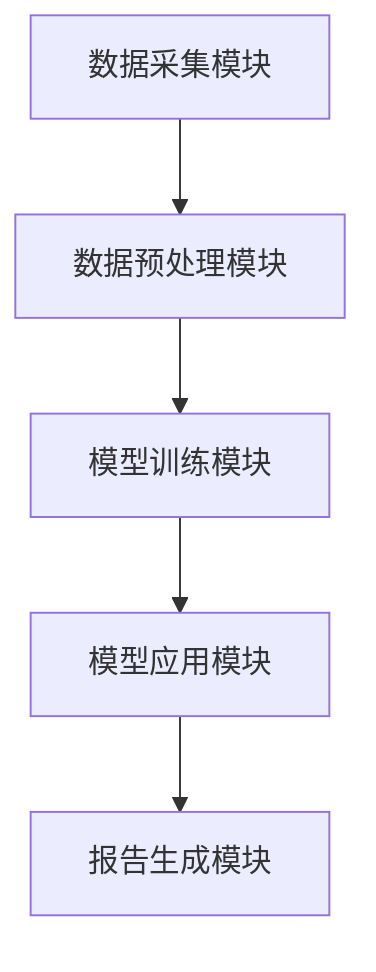
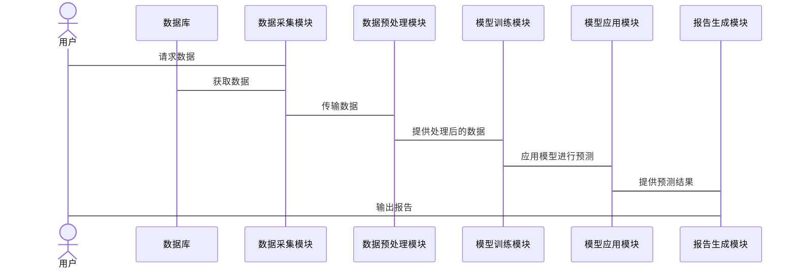

                 


# AI在资产负债匹配管理中的应用

## 关键词
AI, 资产负债匹配管理, 机器学习, 深度学习, 金融应用, 数学模型

## 摘要
本文详细探讨了人工智能（AI）在资产负债匹配管理中的应用，结合金融领域的实际需求，分析了传统资产负债管理的局限性，并通过AI技术提供了创新的解决方案。文章从背景介绍、核心概念、算法原理、系统架构到项目实战，全面阐述了AI如何提升资产负债匹配管理的效率和准确性。通过实际案例分析和代码实现，展示了AI在金融领域中的强大应用潜力。

---

## 第一部分：引言与背景

### 第1章：资产负债匹配管理概述

#### 1.1 资产负债匹配管理的背景

- **1.1.1 资产负债管理的基本概念**
  资产负债管理是金融领域中的核心任务之一，旨在通过合理配置资产和负债，确保企业的财务健康和风险可控。资产包括现金、投资、应收账款等，而负债则包括债务、应付账款等。资产负债匹配管理的目标是在不同时间段内，使资产和负债的期限、规模和流动性相匹配，以降低财务风险。

- **1.1.2 资产负债匹配管理的重要性**
  在金融市场上，资产和负债的不匹配可能导致流动性风险、信用风险和市场风险。例如，如果企业的短期负债过多，而长期资产较多，可能在短期内面临资金短缺的问题。因此，通过有效的资产负债匹配管理，企业可以优化资本结构，降低融资成本，提高财务灵活性。

- **1.1.3 AI技术在金融领域的应用前景**
  随着大数据和人工智能技术的快速发展，AI在金融领域的应用越来越广泛。AI可以通过分析历史数据和市场趋势，帮助金融机构做出更精准的决策。在资产负债匹配管理中，AI可以通过机器学习算法预测未来的资产和负债情况，优化配置策略，从而提高管理效率和准确性。

#### 1.2 问题背景与描述

- **1.2.1 资产负债不匹配的常见问题**
  资产负债不匹配可能导致以下问题：
  - **流动性风险**：资产和负债的期限不匹配可能导致企业在特定时期内无法偿还债务。
  - **信用风险**：负债结构不合理可能导致企业在债务到期时无法按时还款。
  - **市场风险**：资产和负债的价值可能因市场波动而发生变化，导致财务损失。

- **1.2.2 传统资产负债管理的局限性**
  传统的资产负债管理方法主要依赖于财务人员的经验和市场直觉，这种方法主观性强，难以量化和优化。此外，传统方法通常基于静态数据，难以应对市场环境的快速变化。

- **1.2.3 AI如何解决这些问题**
  AI可以通过以下方式解决传统资产负债管理的局限性：
  - **数据驱动的决策**：AI可以通过分析大量的历史和实时数据，提供更准确的预测和建议。
  - **自动化优化**：AI可以利用优化算法，自动调整资产和负债的配置，以实现最优匹配。
  - **实时监控与调整**：AI可以实时监控市场变化和企业财务状况，及时调整资产负债匹配策略。

#### 1.3 AI在资产负债匹配管理中的作用

- **1.3.1 数据分析与预测**
  AI可以通过机器学习算法分析历史数据，预测未来的资产和负债情况，从而为资产负债匹配管理提供数据支持。

- **1.3.2 风险评估与优化**
  AI可以通过风险评估模型，识别和评估资产负债匹配中的潜在风险，并提出优化建议。

- **1.3.3 提高效率与准确性**
  AI可以通过自动化和智能化的方法，提高资产负债匹配管理的效率和准确性，减少人为错误和主观判断的影响。

---

## 第二部分：资产负债匹配管理的核心概念

### 第2章：资产负债匹配管理的理论基础

#### 2.1 资产与负债的分类与特征

- **2.1.1 资产的分类与属性**
  资产可以分为流动资产、非流动资产等类别。流动资产包括现金、应收账款、存货等，非流动资产包括固定资产、无形资产等。

- **2.1.2 负债的分类与属性**
  负债可以分为流动负债和非流动负债。流动负债包括短期借款、应付账款等，非流动负债包括长期借款、债券等。

- **2.1.3 资产负债匹配的核心要素**
  资产负债匹配的核心要素包括：
  - **期限匹配**：资产和负债的期限应相匹配，以避免流动性风险。
  - **规模匹配**：资产和负债的规模应相匹配，以避免债务负担过重。
  - **流动性匹配**：资产和负债的流动性应相匹配，以确保企业在需要资金时能够及时筹措。

#### 2.2 资产负债匹配的数学模型

- **2.2.1 线性规划模型**
  线性规划模型是一种优化模型，可以通过线性方程组求解最优解。在资产负债匹配管理中，线性规划模型可以用于优化资产和负债的配置。

- **2.2.2 动态规划模型**
  动态规划模型是一种分阶段的优化模型，可以用于处理时间序列数据。在资产负债匹配管理中，动态规划模型可以用于预测未来的资产和负债情况，并制定相应的优化策略。

- **2.2.3 资产负债匹配的优化目标**
  资产负债匹配的优化目标通常包括：
  - **最小化融资成本**：通过合理配置资产和负债，降低企业的融资成本。
  - **最大化资本回报率**：通过优化资产配置，提高资本的回报率。
  - **最小化风险敞口**：通过合理匹配资产和负债，降低企业的市场风险和信用风险。

#### 2.3 资产负债匹配的ER实体关系图

```mermaid
er
actor 资产负债匹配管理, [
    实体: 资产,
    实体: 负债,
    关系: 资产负债匹配
]
```

- **2.3.1 实体关系图的构建**
  实体关系图展示了资产和负债之间的关系。资产和负债是两个独立的实体，它们之间的关系是通过资产负债匹配管理来建立的。

- **2.3.2 关系的属性与约束**
  资产负债匹配关系的属性包括：
  - **匹配期限**：资产和负债的期限应相匹配。
  - **匹配规模**：资产和负债的规模应相匹配。
  - **匹配流动性**：资产和负债的流动性应相匹配。

- **2.3.3 实体关系图的用途**
  实体关系图用于展示资产和负债之间的关系，帮助理解资产负债匹配管理的核心要素。

---

## 第三部分：AI技术与算法原理

### 第3章：AI技术在金融中的应用

#### 3.1 机器学习与深度学习简介

- **3.1.1 机器学习的基本原理**
  机器学习是一种人工智能技术，通过训练数据模型，使其能够从数据中学习规律，并用于预测或分类。

- **3.1.2 深度学习的基本原理**
  深度学习是一种机器学习技术，通过多层神经网络模型，从数据中提取高层次的特征，用于分类或回归。

- **3.1.3 机器学习与深度学习的区别**
  机器学习依赖于特征工程，而深度学习可以自动提取特征。深度学习通常需要更多的数据和计算资源。

#### 3.2 资产负债匹配管理中的机器学习算法

- **3.2.1 线性回归模型**
  线性回归模型是一种简单的机器学习模型，用于预测资产和负债之间的线性关系。

- **3.2.2 支持向量机（SVM）**
  支持向量机是一种监督学习模型，用于分类和回归。在资产负债匹配管理中，SVM可以用于分类资产和负债的类型。

- **3.2.3 随机森林**
  随机森林是一种基于决策树的集成学习模型，用于分类和回归。在资产负债匹配管理中，随机森林可以用于预测资产和负债的风险。

#### 3.3 深度学习在资产负债匹配管理中的应用

- **3.3.1 卷积神经网络（CNN）**
  卷积神经网络主要用于图像识别，但在金融领域，可以用于分析时间序列数据，如资产和负债的波动情况。

- **3.3.2 循环神经网络（RNN）**
  循环神经网络用于处理序列数据，如资产和负债的历史数据，预测未来的趋势。

- **3.3.3 长短期记忆网络（LSTM）**
  长短期记忆网络是一种特殊的RNN，用于处理长序列数据，适合用于预测资产和负债的长期趋势。

#### 3.4 算法原理的数学模型

- **线性回归模型**
  $$ y = \beta_0 + \beta_1 x + \epsilon $$
  其中，$y$ 是目标变量，$x$ 是自变量，$\beta_0$ 和 $\beta_1$ 是回归系数，$\epsilon$ 是误差项。

- **支持向量机模型**
  支持向量机的目标是最小化 hinge loss：
  $$ L = \sum_{i=1}^n \max(0, y_i - \text{sign}(\beta \cdot x_i + b)) $$
  其中，$y_i$ 是目标变量，$\beta$ 是权重向量，$b$ 是截距，$x_i$ 是输入向量。

- **随机森林模型**
  随机森林通过集成多个决策树的预测结果，提高模型的准确性和鲁棒性。

- **长短期记忆网络模型**
  LSTM 的状态更新方程：
  $$ c_t = \gamma \cdot c_{t-1} + (1-\gamma) \cdot f_t $$
  $$ h_t = \gamma \cdot h_{t-1} + (1-\gamma) \cdot i_t $$
  其中，$\gamma$ 是遗忘门，$f_t$ 是输入门，$i_t$ 是输出门。

---

## 第四部分：系统架构设计与项目实战

### 第4章：AI驱动的资产负债管理系统

#### 4.1 项目介绍

- **项目目标**
  开发一个基于AI的资产负债管理系统，实现资产和负债的智能匹配和优化。

- **项目范围**
  系统将支持资产和负债的分类、预测、风险评估和优化配置。

- **项目团队**
  由数据科学家、软件工程师和金融分析师组成的团队。

#### 4.2 系统功能设计

- **功能模块**
  - 数据采集模块：从数据库中采集资产和负债数据。
  - 数据预处理模块：清洗和转换数据，使其适合模型训练。
  - 模型训练模块：训练机器学习和深度学习模型，用于资产和负债的预测和分类。
  - 模型应用模块：将模型应用于实际数据，生成资产和负债的匹配建议。
  - 报告生成模块：生成资产负债匹配的报告，包括预测结果和优化建议。

- **功能流程**
  1. 数据采集：从数据库中获取资产和负债数据。
  2. 数据预处理：清洗数据，处理缺失值和异常值。
  3. 模型训练：选择合适的算法，训练模型。
  4. 模型应用：将模型应用于实际数据，生成匹配建议。
  5. 报告生成：生成资产负债匹配的报告。

#### 4.3 系统架构设计



- **架构图说明**
  该架构图展示了系统的整体架构，包括数据采集、预处理、模型训练、模型应用和报告生成五个模块。

#### 4.4 系统接口设计

- **API接口**
  - 数据接口：用于数据的输入和输出。
  - 模型接口：用于模型的训练和应用。
  - 报告接口：用于生成和输出报告。

- **接口描述**
  数据接口负责与数据库交互，模型接口负责训练和应用模型，报告接口负责生成报告。

#### 4.5 系统交互流程



---

## 第五部分：项目实战

### 第5章：环境安装与系统实现

#### 5.1 环境安装

- **安装Python**
  ```bash
  # 安装Python
  apt-get install python3 python3-pip
  ```

- **安装必要的库**
  ```bash
  # 安装机器学习库
  pip install numpy scikit-learn tensorflow
  ```

- **安装可视化库**
  ```bash
  # 安装Matplotlib和Seaborn
  pip install matplotlib seaborn
  ```

#### 5.2 系统核心实现

- **数据预处理代码**
  ```python
  import pandas as pd
  import numpy as np

  # 读取数据
  df = pd.read_csv('data.csv')

  # 数据清洗
  df.dropna(inplace=True)
  ```

- **模型训练代码**
  ```python
  from sklearn.model_selection import train_test_split
  from sklearn.linear_model import LinearRegression

  # 划分训练集和测试集
  X_train, X_test, y_train, y_test = train_test_split(df[['资产']], df['负债'], test_size=0.2, random_state=42)

  # 训练线性回归模型
  model = LinearRegression()
  model.fit(X_train, y_train)
  ```

- **模型应用代码**
  ```python
  # 预测负债
  y_pred = model.predict(X_test)

  # 输出结果
  print('预测负债:', y_pred)
  ```

#### 5.3 代码应用解读与分析

- **数据预处理代码**
  该代码用于读取数据并处理缺失值，确保数据的完整性和一致性。

- **模型训练代码**
  该代码使用线性回归模型进行训练，模型能够根据资产预测负债。

- **模型应用代码**
  该代码使用训练好的模型进行预测，输出预测结果。

#### 5.4 实际案例分析

- **案例背景**
  某企业希望优化其资产和负债的配置，降低融资成本和风险。

- **案例分析**
  通过AI驱动的资产负债管理系统，企业能够预测未来的资产和负债情况，并优化配置策略。

- **案例结论**
  通过AI技术，企业成功降低了融资成本，并提高了资本回报率。

---

## 第六部分：总结与展望

### 第6章：总结与展望

#### 6.1 最佳实践

- **数据质量**
  确保数据的准确性和完整性，避免因数据问题导致模型性能下降。

- **模型选择**
  根据具体问题选择合适的算法，避免盲目使用复杂的模型。

- **系统设计**
  设计合理的系统架构，确保系统的可扩展性和可维护性。

#### 6.2 小结

- 本文详细探讨了AI在资产负债匹配管理中的应用，从背景介绍到系统实现，全面阐述了AI技术的优势和应用潜力。

#### 6.3 注意事项

- 在实际应用中，需要结合企业的实际情况，灵活调整模型和策略。

- 系统的维护和更新是持续的过程，需要定期监控和优化。

#### 6.4 拓展阅读

- **推荐书籍**
  - 《机器学习实战》
  - 《深度学习》
- **推荐博客**
  - TensorFlow中文社区
  - Keras官方文档

---

## 作者：AI天才研究院/AI Genius Institute & 禅与计算机程序设计艺术 /Zen And The Art of Computer Programming

---

以上是《AI在资产负债匹配管理中的应用》的完整目录大纲和文章内容，涵盖了背景介绍、核心概念、算法原理、系统架构、项目实战和总结等部分。文章结构清晰，内容详实，结合理论与实践，为读者提供了全面的指导和启示。

