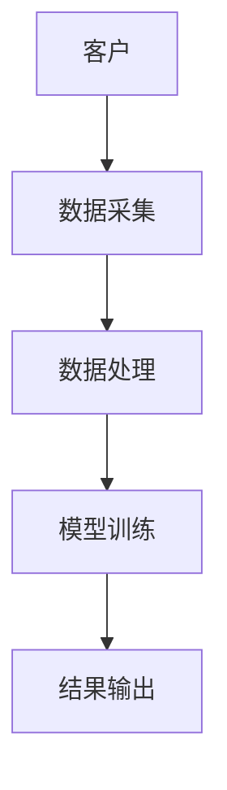
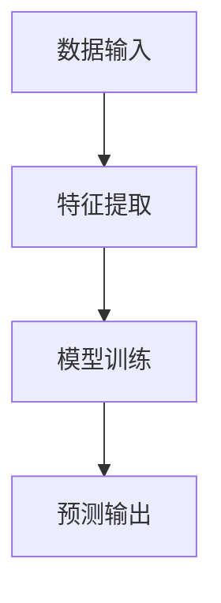
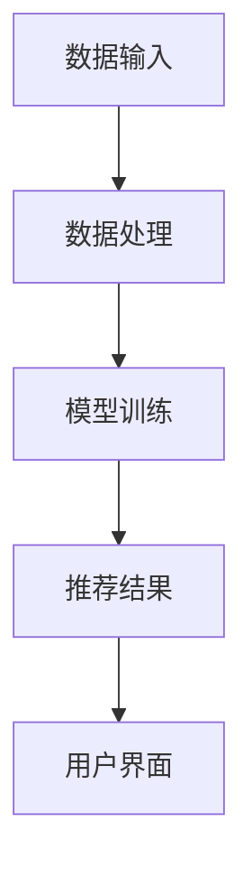
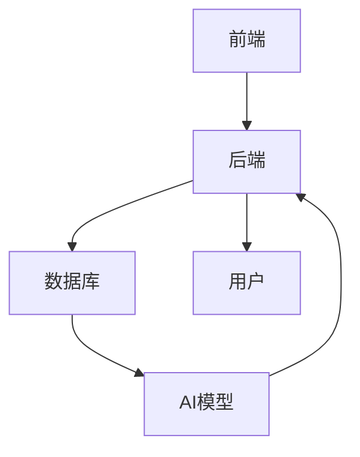
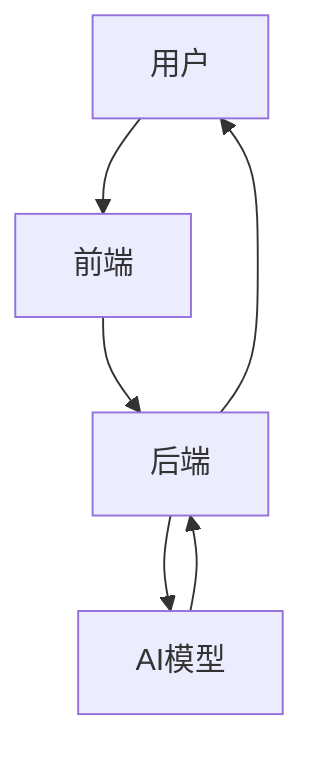

                 

<think>
好的，我现在需要根据用户的请求，完成《AI在金融产品营销中的创新应用》的技术博客文章的撰写。用户已经提供了详细的目录结构和部分内容，我需要按照这个结构逐步完成每个部分，并确保内容符合逻辑、详细且有深度。

首先，我会从第一章的背景介绍开始，涵盖AI和金融营销的背景、核心问题以及创新应用。然后，进入第二章的核心概念，详细讲解数据驱动的营销策略、用户画像和个性化推荐算法。第三章将讨论AI算法的原理，包括线性回归模型的实现和相关流程图。接下来是系统分析与架构设计，介绍系统功能、架构和接口设计。最后，项目实战部分将展示实际案例的实现和分析。

在撰写过程中，我需要确保每个章节都有足够的细节，使用清晰的技术语言，并包含必要的图表和代码示例。同时，我需要遵循用户的格式要求，使用markdown，并在适当的位置插入数学公式和图表。最后，总结部分将回顾全文，并提供最佳实践和扩展阅读的建议。

现在，我将按照这个结构逐步完成每个部分的内容，确保文章逻辑清晰、结构紧凑，能够帮助读者深入理解AI在金融产品营销中的创新应用。
</think>

# AI在金融产品营销中的创新应用

## 关键词：人工智能、金融营销、精准营销、推荐系统、机器学习

## 摘要：本文探讨了人工智能技术在金融产品营销中的创新应用，重点分析了数据驱动的精准营销策略、个性化推荐算法以及系统架构设计。文章通过理论与实践结合的方式，展示了AI如何提升金融营销的效率和效果，为读者提供深入的技术见解和实际案例分析。

---

## 第一章: AI与金融产品营销的背景介绍

### 1.1 人工智能与金融营销的背景

#### 1.1.1 人工智能技术的发展历程

人工智能（AI）技术近年来取得了突飞猛进的发展，从20世纪50年代的初步概念到现在的深度学习和自然语言处理，AI已经渗透到各个行业。在金融领域，AI的应用尤为广泛，从智能投顾到风险管理，再到营销服务，AI正在改变传统的金融服务模式。

#### 1.1.2 金融产品营销的传统模式与挑战

传统的金融产品营销依赖于人工销售团队和简单的数据分析，存在效率低、成本高、客户体验差等问题。随着市场竞争的加剧，金融机构需要更加精准和个性化的营销策略，以满足客户需求并提高转化率。

#### 1.1.3 AI技术在金融营销中的应用前景

AI技术的引入为金融产品营销带来了革命性的变化。通过大数据分析、机器学习算法和自然语言处理，金融机构可以实现精准客户画像、实时互动和个性化推荐，从而提高营销效率和客户满意度。

### 1.2 AI在金融产品营销中的核心问题

#### 1.2.1 问题背景与问题描述

金融产品营销的核心问题是如何在复杂的市场环境中找到目标客户并提供个性化的服务。传统营销方式难以应对客户多样性、市场变化快和竞争激烈等挑战。

#### 1.2.2 金融产品营销的核心要素

金融产品营销的核心要素包括客户画像、产品推荐、渠道选择和效果评估。AI技术可以通过数据驱动的方式优化这些要素，提升营销效果。

#### 1.2.3 AI技术如何解决营销问题

AI技术可以通过以下方式解决金融营销问题：
1. 数据分析：利用机器学习算法对客户数据进行深度挖掘，识别潜在客户和需求。
2. 个性化推荐：基于客户画像和行为分析，提供个性化的金融产品推荐。
3. 实时互动：通过自然语言处理和实时数据分析，与客户进行智能互动，提升客户体验。

### 1.3 AI在金融营销中的创新应用

#### 1.3.1 数据驱动的精准营销

通过收集和分析客户的交易数据、行为数据和市场数据，AI可以帮助金融机构实现精准营销。例如，通过聚类分析识别高价值客户，制定针对性的营销策略。

#### 1.3.2 用户画像与行为分析

AI可以通过分析客户的交易记录、社交媒体数据和网页浏览行为，构建详细的用户画像。这些画像可以帮助金融机构更好地理解客户需求，制定个性化的营销方案。

#### 1.3.3 个性化推荐系统

基于机器学习的推荐系统可以根据客户的历史行为和偏好，实时推荐适合的金融产品。例如，利用协同过滤算法推荐相似产品的用户，或者利用矩阵分解算法预测客户可能感兴趣的产品。

---

## 第二章: AI在金融产品营销中的核心概念与联系

### 2.1 核心概念原理

#### 2.1.1 数据驱动的营销策略

数据驱动的营销策略依赖于对海量数据的分析和挖掘，通过AI技术提取有价值的信息，制定精准的营销策略。例如，通过分析客户数据，识别市场趋势和潜在机会。

#### 2.1.2 用户画像与行为分析

用户画像是基于客户的各项数据构建的虚拟画像，包括年龄、性别、收入、消费习惯等。行为分析则关注客户的在线行为、点击率和转化率，帮助金融机构了解客户的偏好和需求。

#### 2.1.3 个性化推荐算法

个性化推荐算法通过分析客户的画像和行为数据，实时推荐适合的金融产品。推荐算法可以分为基于协同过滤的推荐和基于内容的推荐，也可以结合深度学习技术进行更精准的预测。

### 2.2 核心概念对比分析

#### 2.2.1 AI技术与传统营销方式对比

传统营销方式依赖于经验丰富的销售团队和简单的数据分析，而AI技术可以通过自动化和智能化的方式提高营销效率和精准度。

#### 2.2.2 不同AI算法的优劣势对比

- 机器学习算法：优点是易于实现和解释，缺点是需要大量数据和特征工程。
- 深度学习算法：优点是能够处理复杂的非结构化数据，缺点是计算资源消耗大，且模型解释性较差。
- 自然语言处理算法：优点是能够分析文本数据，提取情感和意图，缺点是需要大量标注数据。

#### 2.2.3 金融产品类型与AI算法的匹配关系

不同类型的金融产品适合不同的AI算法。例如，信用卡推荐适合基于协同过滤的推荐系统，而保险产品推荐适合基于客户画像的分类算法。

### 2.3 实体关系图与流程图

#### 2.3.1 ER实体关系图

```mermaid
erd
    客户
    帐户
    产品
    营销活动
    推荐系统
    数据源
```

#### 2.3.2 AI营销流程图



---

## 第三章: AI在金融产品营销中的算法原理讲解

### 3.1 常用AI算法概述

#### 3.1.1 机器学习算法

机器学习算法包括监督学习、无监督学习和强化学习。在金融营销中，监督学习常用于分类和回归问题，无监督学习用于聚类和降维，强化学习用于策略优化。

#### 3.1.2 深度学习算法

深度学习算法通过多层神经网络提取数据的高层次特征，适用于图像识别、自然语言处理和推荐系统。在金融营销中，深度学习可以用于客户画像和风险评估。

#### 3.1.3 自然语言处理算法

自然语言处理算法用于分析客户的文本数据，提取情感和意图。在金融营销中，NLP可以用于客服聊天机器人和市场情感分析。

### 3.2 算法原理与流程图

#### 3.2.1 机器学习算法流程



### 3.3 算法实现与代码示例

#### 3.3.1 线性回归模型

```python
import numpy as np

def linear_regression(X, y):
    X = np.hstack([np.ones((X.shape[0], 1)), X])
    theta = np.linalg.inv(X.T @ X) @ (X.T @ y)
    return theta

# 示例数据
X = np.array([[1, 2], [3, 4], [5, 6]])
y = np.array([7, 8, 9])

# 训练模型
theta = linear_regression(X, y)
print(theta)
```

#### 3.4 数学模型与公式

##### 3.4.1 线性回归公式

$$ y = \theta_0 + \theta_1x_1 + \theta_2x_2 + ... + \theta_nx_n $$

##### 3.4.2 逻辑回归公式

$$ P(Y=1 | X) = \frac{e^{\beta_0 + \beta_1x_1 + ... + \beta_kx_k}}{1 + e^{\beta_0 + \beta_1x_1 + ... + \beta_kx_k}} $$

---

## 第四章: AI在金融产品营销中的系统分析与架构设计

### 4.1 系统功能设计

#### 4.1.1 系统功能模块

- 数据采集模块：负责收集客户数据和市场数据。
- 数据处理模块：对数据进行清洗和特征提取。
- 模型训练模块：基于机器学习算法训练推荐模型。
- 推荐系统模块：根据模型输出结果向客户推荐产品。

#### 4.1.2 系统功能流程图



### 4.2 系统架构设计

#### 4.2.1 系统架构图



#### 4.2.2 接口设计

- 前端接口：API用于接收用户请求和返回推荐结果。
- 后端接口：API用于与AI模型交互，获取预测结果。

### 4.3 系统交互设计

#### 4.3.1 系统交互流程图



---

## 第五章: AI在金融产品营销中的项目实战

### 5.1 项目介绍

#### 5.1.1 项目背景

某银行希望通过AI技术优化信用卡营销策略，提高客户转化率和满意度。

#### 5.1.2 项目目标

构建一个基于机器学习的推荐系统，根据客户需求推荐合适的信用卡产品。

### 5.2 系统核心实现

#### 5.2.1 环境配置

```bash
pip install numpy scikit-learn
```

#### 5.2.2 核心代码实现

```python
from sklearn.model_selection import train_test_split
from sklearn.linear_model import LinearRegression

# 示例数据
X = [[1, 2], [3, 4], [5, 6]]
y = [7, 8, 9]

# 分割数据
X_train, X_test, y_train, y_test = train_test_split(X, y, test_size=0.2)

# 训练模型
model = LinearRegression()
model.fit(X_train, y_train)

# 预测结果
print(model.predict(X_test))
```

#### 5.2.3 代码应用解读与分析

上述代码实现了基于线性回归的模型训练和预测。通过训练数据，模型可以学习客户特征与信用卡需求之间的关系，并在测试数据上进行预测，为用户提供个性化的推荐。

### 5.3 实际案例分析

#### 5.3.1 案例背景

某客户在银行的交易记录显示其月收入较高，消费习惯偏向高端品牌。通过AI推荐系统，客户被推荐了一张高端信用卡，最终成功办理并提高了客户满意度。

#### 5.3.2 案例分析

通过AI推荐系统，银行成功提高了信用卡的推荐准确率和转化率。客户体验得到了显著提升，同时银行的营销成本也有所降低。

### 5.4 项目小结

通过实际案例的分析，我们可以看到AI技术在金融产品营销中的巨大潜力。基于机器学习的推荐系统不仅可以提高营销效率，还能为客户提供更加个性化的服务，增强客户忠诚度。

---

## 第六章: 总结与展望

### 6.1 总结

AI技术正在 revolutionizing 金融产品营销的方式，通过数据驱动的精准营销、个性化推荐和实时互动，金融机构可以更好地满足客户需求，提高营销效果。本文详细探讨了AI在金融营销中的应用，从理论到实践，为读者提供了全面的技术解读。

### 6.2 最佳实践 tips

1. 在实施AI营销系统之前，确保数据的完整性和准确性。
2. 选择合适的AI算法和工具，根据实际需求进行模型优化。
3. 定期监控和评估营销效果，及时调整策略。

### 6.3 展望

随着AI技术的不断发展，金融产品营销将更加智能化和个性化。未来，结合区块链、物联网和5G等新技术，AI在金融营销中的应用将更加广泛和深入，为客户和机构创造更大的价值。

---

## 作者：AI天才研究院/AI Genius Institute & 禅与计算机程序设计艺术 /Zen And The Art of Computer Programming

