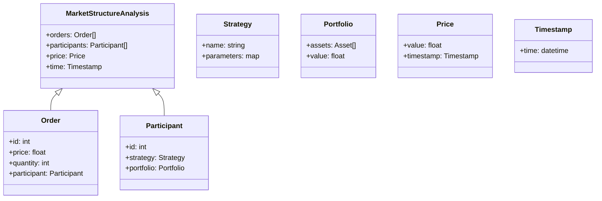
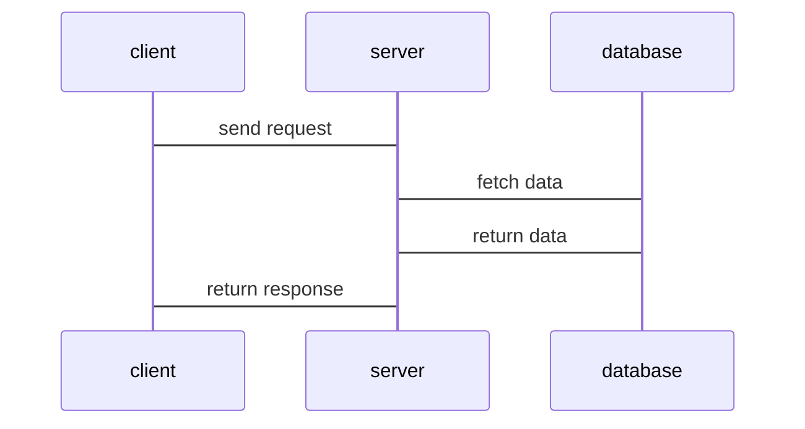

                 


# AI在金融市场微观结构分析中的创新应用

## 关键词：AI，金融市场，微观结构分析，机器学习，深度学习，金融数据

## 摘要：  
本文将深入探讨人工智能（AI）技术在金融市场微观结构分析中的创新应用。通过结合金融市场的核心概念、AI技术的最新进展，以及实际应用场景，本文将系统地分析AI如何帮助我们更好地理解市场微观结构，优化投资策略，提升交易效率。从基础的金融数据处理到复杂的深度学习模型，再到实际的系统架构设计，本文将为读者提供一个全面的技术指南。

---

# 第1章: AI与金融市场微观结构分析概述

## 1.1 人工智能与金融市场的结合

### 1.1.1 人工智能的基本概念  
人工智能（AI）是指通过模拟人类智能的计算机系统，实现自动化决策、模式识别和问题解决。AI的核心技术包括机器学习、深度学习、自然语言处理和计算机视觉等。

### 1.1.2 金融市场的基本概念  
金融市场是一个买卖金融资产（如股票、债券、期货等）的市场，其微观结构涉及市场参与者、订单簿、交易行为和价格形成机制等。

### 1.1.3 AI在金融领域的应用现状  
AI已在金融领域广泛应用，包括股票价格预测、风险评估、交易策略优化和市场情绪分析等。AI技术的引入显著提升了金融市场的分析效率和准确性。

## 1.2 金融市场微观结构分析的核心概念

### 1.2.1 金融市场的微观结构定义  
金融市场微观结构是指市场中的参与者、订单簿、交易规则和价格形成机制等构成要素的动态关系。

### 1.2.2 微观结构分析的关键要素  
- **订单簿分析**：研究订单的生成、撤销和成交规律。  
- **交易行为分析**：分析市场参与者的交易策略和行为模式。  
- **价格形成机制**：研究价格波动的内在逻辑和驱动因素。  

### 1.2.3 AI在微观结构分析中的创新点  
AI通过深度学习和自然语言处理等技术，能够从海量金融数据中提取非线性关系，发现传统方法难以捕捉的市场规律。

## 1.3 本章小结  
本章介绍了AI在金融市场中的应用现状，重点阐述了金融市场微观结构的核心概念和AI技术的创新点。通过这些分析，我们为后续章节的深入探讨奠定了基础。

---

# 第2章: 金融数据的处理与分析

## 2.1 金融数据的分类与特点

### 2.1.1 常见金融数据类型  
- **时间序列数据**：如股票价格、指数等。  
- **结构化数据**：如订单簿数据、交易记录等。  
- **非结构化数据**：如新闻、社交媒体信息等。  

### 2.1.2 数据的时间序列特性  
金融数据通常具有很强的时间依赖性，价格波动往往表现出趋势性和周期性特征。

### 2.1.3 数据的波动性和相关性  
金融市场的高度波动性和相关性使得数据分析具有挑战性，但也为AI技术的应用提供了丰富的场景。

## 2.2 数据清洗与预处理

### 2.2.1 数据缺失值处理  
- 使用均值、中位数或插值方法填补缺失值。  
- 使用模型预测缺失值（如ARIMA模型）。  

### 2.2.2 异常值检测与处理  
- 基于统计方法（如Z-score）或深度学习模型（如Isolation Forest）检测异常值。  
- 对异常值进行剔除或调整。  

### 2.2.3 数据标准化与归一化  
- 标准化：将数据转换为均值为0、标准差为1的分布。  
- 归一化：将数据缩放到0-1范围，适用于神经网络训练。  

## 2.3 数据可视化与初步分析

### 2.3.1 时间序列数据的可视化  
- 使用折线图、柱状图和K线图展示价格走势。  
- 使用箱线图和散点图分析数据分布。  

### 2.3.2 数据分布与相关性分析  
- 使用直方图和QQ图分析数据分布。  
- 使用相关系数矩阵和热力图分析变量间的相关性。  

### 2.3.3 数据可视化工具与方法  
- 常用工具：Matplotlib、Seaborn、Plotly等。  
- 可视化方法：动态可视化、交互式可视化等。  

## 2.4 本章小结  
本章介绍了金融数据的分类与特点，并详细讲解了数据清洗、预处理和可视化的方法。这些技术为后续的AI模型训练奠定了基础。

---

# 第3章: 常见AI模型与算法在金融中的应用

## 3.1 机器学习基础

### 3.1.1 监督学习与无监督学习  
- **监督学习**：基于标签数据的训练，如股票价格预测。  
- **无监督学习**：基于无标签数据的训练，如聚类分析市场参与者行为。  

### 3.1.2 常见机器学习算法介绍  
- **线性回归**：用于价格趋势预测。  
- **支持向量机（SVM）**：用于分类问题，如市场情绪分类。  
- **随机森林**：用于特征重要性分析和数据降维。  

### 3.1.3 算法选择与优化  
- 基于模型性能指标（如准确率、F1分数）选择最优算法。  
- 使用交叉验证和网格搜索优化模型参数。  

## 3.2 深度学习在金融中的应用

### 3.2.1 RNN与LSTM在时间序列分析中的应用  
- **RNN**：用于序列数据的预测。  
- **LSTM**：用于捕捉长期依赖关系，如股票价格预测。  

### 3.2.2 CNN在金融数据特征提取中的应用  
- **CNN**：用于图像化金融数据（如K线图）的特征提取。  

### 3.2.3 GAN在金融数据生成中的应用  
- **GAN**：用于生成合成金融数据，用于模型训练和测试。  

## 3.3 其他AI技术与工具

### 3.3.1 自然语言处理在金融新闻分析中的应用  
- **NLP**：用于分析新闻标题和内容，预测市场情绪。  

### 3.3.2 图神经网络在金融网络分析中的应用  
- **图神经网络**：用于分析金融市场中的网络结构，如机构间交易关系。  

### 3.3.3 开源工具与框架介绍  
- **TensorFlow**：用于深度学习模型的构建与训练。  
- **PyTorch**：用于动态计算图的构建与训练。  
- **Scikit-learn**：用于机器学习算法的实现与优化。  

## 3.4 本章小结  
本章介绍了机器学习和深度学习的核心算法及其在金融中的应用，重点讲解了时间序列分析、图像化数据处理和自然语言处理等技术。

---

# 第4章: AI在金融市场微观结构分析中的具体应用

## 4.1 市场微观结构分析的核心问题

### 4.1.1 市场微观结构的定义与构成  
- **订单簿**：记录当前市场上的所有待成交订单。  
- **交易行为**：市场参与者的交易策略和行为模式。  
- **价格形成机制**：价格的生成、波动和变化规律。  

### 4.1.2 AI在订单簿分析中的应用  
- **订单预测**：基于历史订单数据，预测未来的订单生成和撤销。  
- **订单模式识别**：识别市场参与者的交易行为模式，如高频交易、套利行为等。  

### 4.1.3 基于AI的交易行为建模  
- 使用深度学习模型分析交易行为，预测市场参与者的下一步动作。  
- 使用强化学习模拟交易决策过程。  

## 4.2 市场参与者行为分析

### 4.2.1 基于AI的交易行为建模  
- **监督学习**：用于分类交易行为类型（如机构交易、散户交易）。  
- **无监督学习**：用于聚类市场参与者的交易行为模式。  

### 4.2.2 市场情绪分析与预测  
- 使用NLP技术分析新闻、社交媒体等文本数据，预测市场情绪。  
- 使用时间序列模型（如LSTM）预测情绪变化对价格的影响。  

### 4.2.3 AI在价格形成机制中的应用  
- 分析价格波动的内在逻辑，如市场供需关系、信息传播等。  
- 使用复杂网络分析价格波动的传播路径。  

## 4.3 本章小结  
本章详细探讨了AI在金融市场微观结构分析中的具体应用，包括订单簿分析、交易行为建模和市场情绪分析等方面。

---

# 第5章: 金融市场微观结构分析的系统架构设计

## 5.1 问题场景介绍  
金融市场微观结构分析是一个复杂的系统工程，需要整合多种数据源和分析方法，构建高效的分析系统。

## 5.2 系统功能设计

### 5.2.1 领域模型（Mermaid类图）  


### 5.2.2 系统架构设计（Mermaid架构图）  


### 5.2.3 系统接口设计  
- **API接口**：提供RESTful API，供客户端调用。  
- **数据接口**：与数据源（如交易所API）对接，获取实时数据。  

### 5.2.4 系统交互设计（Mermaid序列图）  


## 5.3 本章小结  
本章通过系统架构设计，展示了如何将AI技术应用于金融市场微观结构分析的系统中，包括功能设计、架构设计和接口设计等内容。

---

# 第6章: 项目实战——基于AI的金融市场微观结构分析系统

## 6.1 项目介绍  
本项目旨在构建一个基于AI的金融市场微观结构分析系统，整合订单簿数据、交易行为数据和市场情绪数据，实现市场微观结构的实时分析。

## 6.2 环境安装与配置

### 6.2.1 安装Python环境  
- 使用Anaconda安装Python 3.8及以上版本。  

### 6.2.2 安装依赖库  
- `pip install numpy pandas matplotlib scikit-learn tensorflow keras pytorch`  

## 6.3 核心实现

### 6.3.1 数据获取与预处理  
- 使用Yahoo Finance API获取股票数据。  
- 对数据进行清洗和标准化处理。  

### 6.3.2 模型训练与优化  
- 使用LSTM模型进行股票价格预测。  
- 通过网格搜索优化模型参数。  

### 6.3.3 系统实现（代码示例）  

#### 数据获取与预处理  
```python
import pandas as pd
import numpy as np

# 获取股票数据
data = pd.read_csv('stock_data.csv')

# 数据清洗
data = data.dropna()
data = data.astype(float)

# 标准化处理
from sklearn.preprocessing import StandardScaler
scaler = StandardScaler()
data_scaled = scaler.fit_transform(data)
```

#### 模型训练与优化  
```python
from tensorflow.keras.models import Sequential
from tensorflow.keras.layers import LSTM, Dense

# 构建LSTM模型
model = Sequential()
model.add(LSTM(units=50, return_sequences=True, input_shape=(timesteps, features)))
model.add(Dense(1))
model.compile(optimizer='adam', loss='mean_squared_error')

# 训练模型
model.fit(X_train, y_train, epochs=100, batch_size=32, validation_split=0.2)
```

## 6.4 项目小结  
本章通过一个实际项目，展示了如何将AI技术应用于金融市场微观结构分析的系统中，从数据获取到模型训练，再到系统实现，为读者提供了完整的实战经验。

---

# 第7章: 总结与展望

## 7.1 本章总结  
本文系统地探讨了AI在金融市场微观结构分析中的创新应用，从基础的金融数据处理到复杂的深度学习模型，再到实际的系统架构设计，为读者提供了全面的技术指南。

## 7.2 未来展望  
随着AI技术的不断发展，金融市场微观结构分析将更加智能化和自动化。未来的研究方向包括：  
- 更加高效的算法优化。  
- 更加复杂的时间序列模型（如Transformer）。  
- 更多的跨学科应用（如量子计算与AI的结合）。  

## 7.3 最佳实践 Tips  
- 在实际应用中，建议结合多种AI技术（如机器学习和深度学习）进行综合分析。  
- 数据预处理是模型训练的关键步骤，需仔细处理缺失值和异常值。  
- 在系统设计中，建议采用模块化设计，便于功能扩展和维护。  

## 7.4 小结  
AI技术为金融市场微观结构分析带来了全新的思路和方法，未来将有更多创新应用出现。

---

# 作者：AI天才研究院/AI Genius Institute & 禅与计算机程序设计艺术 /Zen And The Art of Computer Programming

