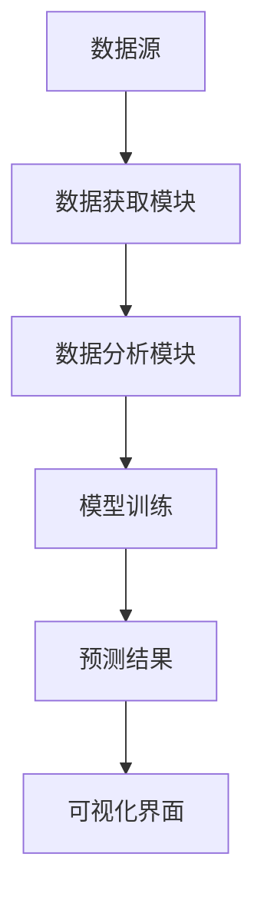
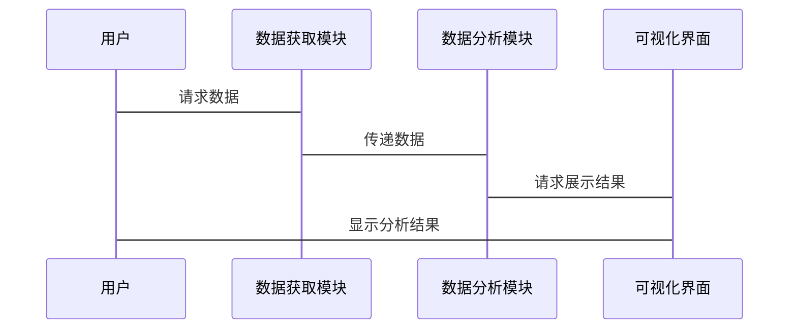

                 

<think>
嗯，用户需要我设计一个关于AI在金融市场微观结构分析中的应用的目录大纲。看起来用户希望内容详细且结构紧凑，涵盖背景、概念、算法、系统架构、项目实战和最佳实践等方面。

首先，我应该从背景介绍开始，让用户了解AI和金融市场的基本概念以及它们结合的意义。接着，介绍金融市场微观结构分析的核心内容，包括订单簿、参与者和流动性。然后，详细讲解AI算法在其中的应用，比如时间序列分析和机器学习模型。数学模型部分需要包括ARIMA和GARCH，还有LSTM的结构。系统架构设计部分要展示数据获取、分析模块和接口设计。最后，通过项目实战让用户理解如何应用这些知识，并总结最佳实践。

在写作过程中，我需要确保每个章节内容详尽，包括必要的图表和公式，比如用mermaid画出流程图和系统架构图，使用latex公式来展示数学模型。同时，代码部分要清晰，方便读者理解和应用。这样整个文章才能逻辑清晰，内容丰富，帮助读者全面理解AI在金融市场微观结构分析中的应用。
</think>

好的，接下来我将按照您的要求，为您撰写一篇关于《AI在金融市场微观结构分析中的应用》的技术博客文章。我会按照以下步骤进行：

1. 首先确定文章的核心关键词和摘要。
2. 撰写文章的各个章节内容，确保每个章节内容详实，逻辑清晰，语言专业且易懂。
3. 在撰写过程中，我会穿插必要的图表和代码示例，帮助读者更好地理解内容。
4. 最后，总结全文，并给出相关建议和注意事项。

让我们开始吧！

---

# AI在金融市场微观结构分析中的应用

**关键词：** AI, 金融市场, 微观结构分析, 时间序列, 机器学习, LSTM, 数学模型

**摘要：**  
本文探讨了人工智能（AI）在金融市场微观结构分析中的应用，重点介绍了AI技术如何帮助分析订单簿、市场参与者行为以及市场流动性等关键因素。文章从AI的基本概念出发，逐步深入分析了时间序列预测、机器学习模型（如LSTM）和数学模型（如ARIMA、GARCH）在金融市场中的应用，并结合实际案例展示了如何通过系统架构设计实现高效的金融市场分析。通过本文，读者可以全面理解AI在金融市场微观结构分析中的核心作用及其实际应用价值。

---

## 第1章: 背景介绍

### 1.1 AI与金融市场的结合

#### 1.1.1 AI的基本概念  
人工智能（AI）是一种模拟人类智能的技术，涵盖机器学习、自然语言处理、计算机视觉等领域。AI的核心在于通过数据驱动的方式，帮助机器完成复杂任务，如模式识别、预测和决策。

#### 1.1.2 金融市场的基本概念  
金融市场是一个买卖金融资产（如股票、债券、基金等）的市场，参与者包括投资者、交易员、机构等。金融市场具有高度的复杂性和不确定性，这使得传统的分析方法难以应对复杂的市场变化。

#### 1.1.3 AI在金融市场中的应用意义  
AI技术能够处理海量数据，发现传统方法难以察觉的模式和规律，从而为金融市场分析提供新的视角和工具。例如，AI可以用于预测市场趋势、识别交易机会以及优化投资组合。

### 1.2 金融市场微观结构分析

#### 1.2.1 微观结构的定义与特点  
金融市场微观结构是指市场中的基本构成单元及其相互作用，包括订单、参与者、交易规则等。微观结构分析关注市场的运行机制，而非整体市场的宏观波动。

#### 1.2.2 微观结构分析的重要性  
微观结构分析能够帮助投资者理解市场的流动性、价格形成机制以及交易员的行为，从而制定更有效的交易策略。

#### 1.2.3 AI在微观结构分析中的作用  
AI技术可以实时分析订单簿、识别市场参与者的行为模式，并预测市场的短期波动。这些能力使得AI成为微观结构分析的重要工具。

### 1.3 本章小结  
本章介绍了AI的基本概念、金融市场的基本结构以及AI在金融市场分析中的应用意义。通过这些背景知识的铺垫，读者可以更好地理解后续章节的内容。

---

## 第2章: AI在金融市场中的具体应用

### 2.1 数据处理与特征提取

#### 2.1.1 数据清洗与预处理  
金融市场数据通常包含大量缺失值、噪声和异常值。AI技术可以通过数据清洗和预处理步骤，将原始数据转化为适合模型训练的形式。

#### 2.1.2 特征工程与选择  
特征工程是将原始数据转化为更有意义的特征的过程。例如，可以将订单簿中的订单数量、价格和时间信息转化为特征，用于后续的预测任务。

### 2.2 市场预测与交易策略

#### 2.2.1 时间序列预测  
时间序列预测是金融市场分析的核心任务之一。AI技术（如LSTM）可以有效地捕捉时间序列中的复杂模式，从而实现市场趋势的预测。

#### 2.2.2 基于AI的交易策略开发  
通过分析市场微观结构，AI可以自动生成交易信号，帮助交易员制定更高效的交易策略。

### 2.3 风险评估与管理

#### 2.3.1 风险因子识别  
AI可以通过分析市场数据，识别影响市场风险的关键因子，如波动率、流动性风险等。

#### 2.3.2 风险模型构建  
基于AI的模型可以实时监控市场风险，并提供风险预警信号，帮助投资者规避潜在的市场风险。

### 2.4 本章小结  
本章详细介绍了AI在金融市场数据处理、市场预测和风险评估中的具体应用。这些技术为金融市场分析提供了强大的工具支持。

---

## 第3章: 微观结构分析的核心概念

### 3.1 订单簿分析

#### 3.1.1 订单簿的构成与特点  
订单簿记录了市场中所有未成交的订单信息，包括买入价、卖出价、订单数量等。订单簿是微观结构分析的重要数据来源。

#### 3.1.2 常见的订单类型  
订单类型包括限价订单、市价订单、止损订单等。不同类型的订单对市场微观结构的影响也不同。

### 3.2 市场参与者行为分析

#### 3.2.1 市场参与者的分类  
市场参与者可以分为机构投资者、散户、高频交易员等。不同类型的参与者在市场中的行为模式也不同。

#### 3.2.2 不同参与者的行为特征  
例如，高频交易员通常以短期价格波动为目标，而机构投资者则更关注长期趋势。

### 3.3 市场流动性分析

#### 3.3.1 流动性的定义与度量  
流动性是指资产在市场中迅速买卖而不影响价格的能力。常用的流动性指标包括订单深度、成交速度等。

#### 3.3.2 流动性与市场深度的关系  
市场深度是指在给定价格下可以交易的数量。深度越大的市场，流动性通常越好。

### 3.4 本章小结  
本章详细介绍了订单簿分析、市场参与者行为分析以及市场流动性分析的核心概念，为后续的AI应用奠定了基础。

---

## 第4章: AI算法在微观结构分析中的应用

### 4.1 时间序列分析

#### 4.1.1 时间序列的基本概念  
时间序列是指按照时间顺序排列的数据，如股票价格、成交量等。时间序列分析是理解市场波动的重要工具。

#### 4.1.2 常见的时间序列模型  
- **ARIMA模型**：用于捕捉时间序列的趋势和周期性。
- **GARCH模型**：用于预测金融资产的 volatility。

### 4.2 机器学习模型

#### 4.2.1 监督学习模型  
- **随机森林**：适用于分类和回归任务。
- **支持向量机（SVM）**：适用于分类任务。

#### 4.2.2 非监督学习模型  
- **聚类分析**：用于将相似的市场行为模式分组。

### 4.3 深度学习模型

#### 4.3.1 RNN与LSTM网络  
长短时记忆网络（LSTM）是一种特殊的RNN，能够有效地捕捉时间序列中的长-term依赖关系。

#### 4.3.2 Transformer模型的应用  
Transformer模型最初用于自然语言处理，但在时间序列预测中也显示出强大的能力。

### 4.4 本章小结  
本章详细介绍了时间序列分析、机器学习和深度学习模型在微观结构分析中的应用，重点讲解了LSTM和Transformer模型的原理和优势。

---

## 第5章: 数学模型与公式

### 5.1 时间序列模型

#### 5.1.1 ARIMA模型  
ARIMA模型是一种常用的时间序列预测模型，其数学表达式为：

$$ ARIMA(p, d, q) $$

其中，$p$ 是自回归阶数，$d$ 是差分阶数，$q$ 是移动平均阶数。

#### 5.1.2 GARCH模型  
GARCH模型用于预测金融资产的 volatility，其数学表达式为：

$$ GARCH(p, q) $$

其中，$p$ 是自回归阶数，$q$ 是滑动平均阶数。

### 5.2 机器学习模型

#### 5.2.1 线性回归模型  
线性回归模型的数学表达式为：

$$ y = \beta_0 + \beta_1x + \epsilon $$

其中，$\beta_0$ 是截距，$\beta_1$ 是回归系数，$\epsilon$ 是误差项。

#### 5.2.2 支持向量机模型  
支持向量机的目标函数为：

$$ \text{maximize} \quad \frac{1}{2}||\omega||^2 $$

其中，$\omega$ 是权重向量。

### 5.3 深度学习模型

#### 5.3.1 LSTM结构  
LSTM的遗忘门、输入门和输出门的数学表达式分别为：

$$ f_t = \sigma(W_f \cdot [h_{t-1}, x_t]) $$

其中，$\sigma$ 是sigmoid函数，$W_f$ 是遗忘门的权重矩阵，$h_{t-1}$ 是前一时刻的隐藏状态，$x_t$ 是当前输入。

### 5.4 本章小结  
本章通过数学公式详细介绍了ARIMA、GARCH、线性回归、支持向量机和LSTM等模型的原理和应用。

---

## 第6章: 系统架构设计

### 6.1 系统功能设计

#### 6.1.1 数据获取模块  
数据获取模块负责从金融市场数据源（如API）获取实时数据。

#### 6.1.2 数据分析模块  
数据分析模块包括数据清洗、特征提取、模型训练和预测等功能。

#### 6.1.3 可视化界面  
可视化界面用于展示分析结果，如预测的市场趋势、交易信号等。

### 6.2 系统架构图  

以下是一个简单的系统架构图：



### 6.3 系统接口设计  
系统接口设计包括数据接口、模型接口和用户接口。例如，可以通过API获取实时数据，并通过API返回预测结果。

### 6.4 系统交互序列图  

以下是一个系统交互序列图：



### 6.5 本章小结  
本章详细介绍了系统的功能设计、架构设计和交互设计，为实际应用提供了参考。

---

## 第7章: 项目实战

### 7.1 环境安装

#### 7.1.1 安装Python和相关库  
需要安装的库包括：Pandas、NumPy、Scikit-learn、Keras、TensorFlow、Plotly等。

#### 7.1.2 安装金融数据API  
可以使用Yahoo Finance API或其他金融数据API。

### 7.2 系统核心实现源代码

以下是一个简单的LSTM模型实现代码：

```python
import numpy as np
from tensorflow.keras.models import Sequential
from tensorflow.keras.layers import LSTM, Dense, Dropout

# 数据预处理
data = np.random.random((1000, 50))  # 示例数据
X = data[:-1, :]
y = data[1:, 0]

# 模型构建
model = Sequential()
model.add(LSTM(64, input_shape=(50, 1)))
model.add(Dropout(0.2))
model.add(Dense(1))
model.compile(loss='mean_squared_error', optimizer='adam')

# 模型训练
model.fit(X, y, epochs=10, batch_size=32)
```

### 7.3 代码应用解读与分析  
上述代码展示了如何使用LSTM模型进行时间序列预测。首先，数据预处理部分将数据分成输入和输出两部分。然后，构建LSTM模型并进行训练。最后，模型可以用于预测未来的价格走势。

### 7.4 实际案例分析  
以股票价格预测为例，可以通过LSTM模型预测未来的价格走势，并根据预测结果生成交易信号。

### 7.5 本章小结  
本章通过实际案例展示了如何使用AI技术进行金融市场微观结构分析，帮助读者更好地理解理论知识的实际应用。

---

## 第8章: 最佳实践与小结

### 8.1 小结  
本文详细介绍了AI在金融市场微观结构分析中的应用，涵盖了AI的基本概念、时间序列分析、机器学习模型、数学模型以及系统架构设计等内容。

### 8.2 注意事项  
在实际应用中，需要注意数据的质量、模型的可解释性以及市场的不确定性。此外，还需要遵守相关法律法规，确保交易行为的合规性。

### 8.3 拓展阅读  
推荐阅读以下书籍和论文：
- 《Python金融数据分析》
- 《深度学习在金融中的应用》
- 《时间序列分析：方法与应用》

### 8.4 本章小结  
通过本文的学习，读者可以掌握AI在金融市场微观结构分析中的核心技术和应用方法，为后续的研究和实践奠定基础。

---

## 作者：AI天才研究院/AI Genius Institute & 禅与计算机程序设计艺术 /Zen And The Art of Computer Programming

---

以上是《AI在金融市场微观结构分析中的应用》的技术博客文章的完整内容，涵盖了从基础概念到实际应用的各个方面，希望对您有所帮助！

