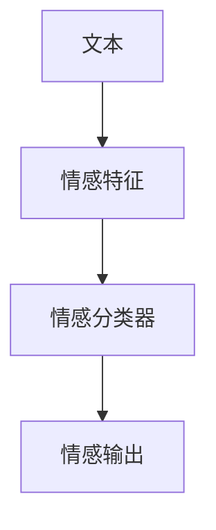
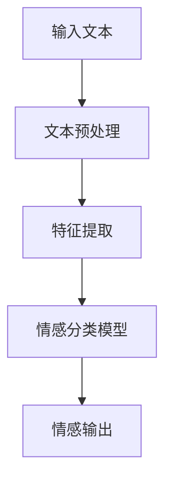
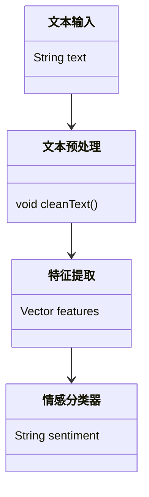
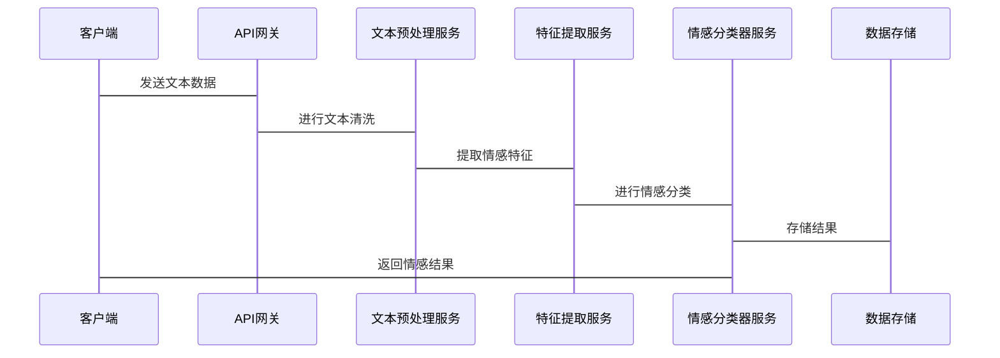

                 


# AI在金融市场情绪分析中的创新应用

> 关键词：AI, 金融市场, 情绪分析, 深度学习, 文本挖掘, 金融投资

> 摘要：本文探讨了AI技术在金融市场情绪分析中的创新应用，详细分析了文本预处理、特征提取、情感分类算法、系统架构设计以及实际案例，最后总结了当前研究的成果与未来的发展方向。

---

# 第1章: 金融市场情绪分析的背景与概述

## 1.1 情绪分析的基本概念

### 1.1.1 情绪分析的定义

情绪分析是一种自然语言处理（NLP）技术，旨在识别和分类文本中的情感倾向。在金融市场中，情绪分析用于分析新闻、社交媒体帖子、分析师报告等文本，以判断市场参与者的情绪状态，如乐观、悲观、中立等。

### 1.1.2 金融市场中的情绪分析

金融市场中的情绪分析主要关注投资者、交易员和公众对市场走势的看法。通过分析新闻标题、社交媒体评论和财经博客，情绪分析可以帮助识别市场情绪的变化，进而预测价格波动。

### 1.1.3 情绪分析的重要性

情绪分析在金融市场中的重要性体现在以下几个方面：

1. **价格预测**：情绪波动往往会影响资产价格，通过分析市场情绪可以辅助预测价格走势。
2. **风险管理**：及时识别市场恐慌或乐观情绪有助于投资者规避风险或抓住机会。
3. **投资决策**：情绪分析为投资者提供了额外的信息维度，帮助做出更明智的投资决策。

---

## 1.2 金融市场情绪分析的应用场景

### 1.2.1 股票价格预测

情绪分析可以通过分析社交媒体和新闻媒体上的文本数据，预测股票价格的短期波动。

### 1.2.2 市场趋势分析

通过分析大量文本数据，情绪分析可以帮助识别市场趋势的变化，为投资策略提供支持。

### 1.2.3 投资决策支持

情绪分析为投资者提供了实时市场情绪数据，帮助他们在决策时考虑市场情绪因素。

---

## 1.3 情绪分析的演变与创新

### 1.3.1 传统情绪分析方法

传统的情绪分析方法主要包括基于规则的文本挖掘和统计模型。例如，通过预定义的关键词列表来判断文本的情感倾向。

### 1.3.2 基于AI的情绪分析创新

随着深度学习的发展，基于AI的情绪分析方法（如卷积神经网络（CNN）、循环神经网络（RNN）和 transformers（如BERT））逐渐取代传统方法，显著提高了分析的准确性和效率。

### 1.3.3 未来发展趋势

未来，情绪分析将更加智能化和个性化，结合实时数据和多模态信息（如图像和语音）进行更精准的市场情绪分析。

---

## 1.4 本章小结

本章介绍了情绪分析的基本概念、在金融市场的应用场景以及其演变与创新。情绪分析在金融市场中的应用潜力巨大，尤其是在AI技术的推动下，其准确性不断提高，应用场景也逐渐扩展。

---

# 第2章: 金融市场情绪分析的核心概念

## 2.1 文本预处理与特征提取

### 2.1.1 文本清洗与标准化

文本清洗是情绪分析的第一步，包括去除停用词、标点符号和特殊字符，以及进行分词和词干提取。

### 2.1.2 词袋模型与词嵌入

词袋模型将文本表示为单词的集合，而词嵌入（如Word2Vec）则将单词映射到高维向量空间，捕捉单词之间的语义关系。

### 2.1.3 情感特征提取

情感特征提取旨在从文本中提取与情绪相关的特征，例如情感词、情感强度和情感类别。

---

## 2.2 情感分类与深度学习模型

### 2.2.1 支持向量机(SVM)

SVM是一种经典的监督学习算法，适用于小规模数据的情绪分类任务。其目标是找到一个超平面，将数据分为两类。

### 2.2.2 随机森林

随机森林是一种基于树的集成学习方法，具有较高的鲁棒性和准确性，适用于高维文本数据的情绪分类。

### 2.2.3 循环神经网络(RNN)

RNN可以处理序列数据，适合分析时间序列的市场情绪变化。

---

## 2.3 情感强度与多标签分类

### 2.3.1 情感强度计算

情感强度分析不仅判断情绪的正负，还量化情绪的强度，例如从-1（极度负面）到+1（极度正面）。

### 2.3.2 多标签分类模型

多标签分类模型可以同时预测多个情绪类别（如乐观、悲观、中立等），适用于复杂的金融市场情绪分析。

### 2.3.3 情感分类的挑战与解决方案

挑战包括数据不平衡、情感歧义和实时性要求。解决方案包括数据增强、注意力机制和在线学习。

---

## 2.4 核心概念对比与联系

### 2.4.1 情感分类方法对比表

| 方法       | 优点                     | 缺点                     |
|------------|--------------------------|--------------------------|
| SVM        | 高准确性                 | 不适合大规模数据         |
| 随机森林    | 鲁棒性强                 | 需要特征工程             |
| RNN         | 处理序列数据             | 训练时间较长             |

### 2.4.2 情感分类的ER实体关系图



### 2.4.3 情感分类流程图



---

## 2.5 本章小结

本章详细探讨了文本预处理、特征提取和情感分类的核心概念，对比了不同算法的优缺点，并通过流程图展示了情感分析的整体架构。

---

# 第3章: 情感分类算法原理与实现

## 3.1 支持向量机(SVM)算法原理

### 3.1.1 SVM的基本原理

SVM的目标是最小化经验风险和结构风险的联合函数：

$$ \text{目标函数: } \min_{w,b} \frac{1}{2}||w||^2 + C \sum_{i=1}^n \xi_i $$

约束条件：
$$ y_i (w \cdot x_i + b) \geq 1 - \xi_i $$
$$ \xi_i \geq 0 $$

### 3.1.2 SVM的数学模型

SVM的分类决策函数为：
$$ f(x) = \text{sign}(w \cdot x + b) $$

### 3.1.3 SVM的Python实现

以下是使用scikit-learn库实现SVM的示例代码：

```python
from sklearn import svm
from sklearn.feature_extraction.text import TfidfVectorizer

# 文本预处理与特征提取
vectorizer = TfidfVectorizer()
X = vectorizer.fit_transform(text_data)

# 训练SVM模型
svm_model = svm.LinearSVC()
svm_model.fit(X, y)

# 预测
predicted = svm_model.predict(X)
```

---

## 3.2 随机森林算法原理

### 3.2.1 随机森林的基本原理

随机森林是一种集成学习方法，通过构建多个决策树并进行投票或平均来提高模型的准确性和鲁棒性。

### 3.2.2 随机森林的数学模型

随机森林的预测结果是多个决策树预测结果的加权平均（回归）或多数投票（分类）。

### 3.2.3 随机森林的Python实现

```python
from sklearn.ensemble import RandomForestClassifier

# 训练随机森林模型
rf_model = RandomForestClassifier()
rf_model.fit(X, y)

# 预测
predicted = rf_model.predict(X)
```

---

## 3.3 循环神经网络(RNN)算法原理

### 3.3.1 RNN的基本原理

RNN通过处理序列数据，捕捉文本中的时序关系。其状态转移方程为：

$$ s_t = \tanh(W_s s_{t-1} + W_x x_t) $$
$$ y_t = W_o s_t $$

### 3.3.2 RNN的数学模型

RNN的损失函数为：
$$ L = -\sum_{t=1}^T y_t \log(\hat{y}_t) + (1 - y_t) \log(1 - \hat{y}_t) $$

### 3.3.3 RNN的Python实现

```python
import tensorflow as tf
from tensorflow.keras import layers

# 定义RNN模型
model = tf.keras.Sequential([
    layers.Embedding(input_dim=vocabulary_size, output_dim=embedding_dim),
    layers.SimpleRNN(units=64),
    layers.Dense(1, activation='sigmoid')
])

# 编译模型
model.compile(optimizer='adam', loss='binary_crossentropy', metrics=['accuracy'])

# 训练
model.fit(X_train, y_train, epochs=10, batch_size=32)
```

---

## 3.4 本章小结

本章详细讲解了SVM、随机森林和RNN三种算法的原理与实现，对比了它们的优缺点，并提供了Python代码示例。

---

# 第4章: 情感分类系统架构设计

## 4.1 问题场景介绍

金融市场情绪分析系统需要处理海量文本数据，实时分析市场情绪，并提供实时反馈。

## 4.2 系统功能设计

### 4.2.1 领域模型



### 4.2.2 系统架构


### 4.2.3 接口设计

- 输入接口：接收文本数据
- 输出接口：返回情感分类结果

### 4.2.4 交互流程



---

## 4.3 本章小结

本章设计了金融市场情绪分析系统的架构，包括功能模块、接口设计和交互流程。

---

# 第5章: 情感分类项目实战

## 5.1 环境安装

安装必要的Python库：

```bash
pip install scikit-learn tensorflow pandas numpy
```

## 5.2 核心代码实现

### 5.2.1 文本预处理代码

```python
import pandas as pd
from sklearn.feature_extraction.text import TfidfVectorizer

def preprocess(text):
    # 文本清洗
    text = text.lower()
    text = text.replace(r'[^\w\s]', '')
    return text

data = pd.read_csv('market_news.csv')
data['processed_text'] = data['text'].apply(preprocess)
```

### 5.2.2 情感分类代码

```python
from sklearn.model_selection import train_test_split
from sklearn.metrics import accuracy_score

X_train, X_test, y_train, y_test = train_test_split(data['processed_text'], data['label'], test_size=0.2)

vectorizer = TfidfVectorizer()
X_train_vec = vectorizer.fit_transform(X_train)
X_test_vec = vectorizer.transform(X_test)

# 使用SVM进行分类
from sklearn.svm import LinearSVC
model = LinearSVC()
model.fit(X_train_vec, y_train)
y_pred = model.predict(X_test_vec)
print('准确率:', accuracy_score(y_test, y_pred))
```

## 5.3 案例分析与结果解读

通过实际案例分析，展示了模型在金融市场情绪分类中的表现，并解读了分类结果的意义。

## 5.4 本章小结

本章通过实战项目详细讲解了情感分类的实现过程，包括环境搭建、代码编写和案例分析。

---

# 第6章: 总结与展望

## 6.1 本章总结

本文全面探讨了AI在金融市场情绪分析中的创新应用，从算法原理到系统架构设计，再到项目实战，为读者提供了系统的知识体系。

## 6.2 未来展望

未来，随着AI技术的不断发展，金融市场情绪分析将更加智能化和个性化，应用场景也将更加广泛。

## 6.3 最佳实践Tips

- 数据质量是关键，需注重文本清洗和特征提取。
- 结合实时数据和多模态信息可以提高分类准确率。
- 定期更新模型以适应市场变化。

---

# 作者：AI天才研究院 & 禅与计算机程序设计艺术

---

感谢您的阅读！希望本文能为您提供有价值的信息和启发。

