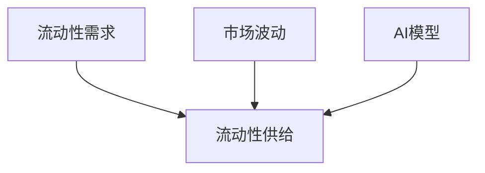
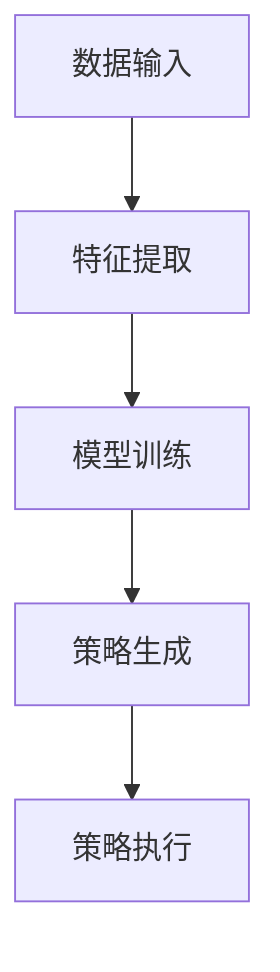
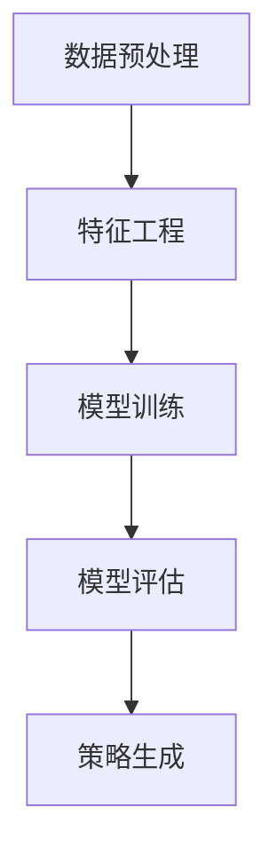
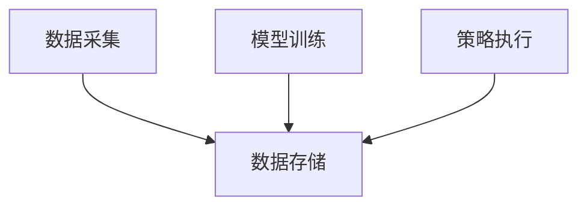
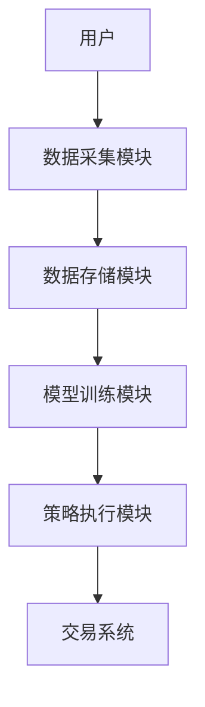

                 


```markdown
# AI在金融市场流动性提供策略优化中的创新应用

> 关键词：AI技术、金融市场流动性、策略优化、机器学习、深度学习、强化学习

> 摘要：本文深入探讨了人工智能技术在金融市场流动性提供策略优化中的创新应用。通过分析流动性管理的核心问题，结合AI技术的核心原理，提出了基于机器学习、深度学习和强化学习的流动性优化算法。本文详细介绍了算法实现的数学模型、系统架构设计方案，通过项目实战展示了AI技术在流动性管理中的具体应用，并提出了最佳实践和未来研究方向。

---

# 第一部分: 金融市场流动性提供策略优化的背景与挑战

# 第1章: 金融市场流动性概述

## 1.1 金融市场的基本概念
### 1.1.1 金融市场的定义与分类
- 金融市场的定义：金融市场是资金供需双方通过金融工具进行交易的场所，包括股票市场、债券市场、外汇市场等。
- 金融市场的分类：一级市场和二级市场；货币市场和资本市场；场内市场和场外市场。

### 1.1.2 流动性的定义与重要性
- 流动性的定义：资产在不损失价值的情况下迅速转化为现金的能力。
- 流动性的的重要性：确保市场平稳运行，降低交易成本，提高市场效率。

### 1.1.3 流动性提供者的角色与功能
- 流动性提供者的角色：做市商、交易商、券商等。
- 流动性提供者的功能：提供即时报价、吸收订单、维护市场深度。

## 1.2 传统流动性提供策略的局限性
### 1.2.1 市场波动对流动性的影响
- 市场波动导致的流动性危机：如2008年金融危机中的流动性枯竭。
- 市场波动对做市商的影响：市场波动加剧时，做市商可能面临更大的风险和成本。

### 1.2.2 传统策略的效率瓶颈
- 传统策略的低效性：基于固定规则的策略在复杂市场中表现不佳。
- 传统策略的反应速度慢：无法及时捕捉市场变化，导致交易成本增加。

### 1.2.3 技术进步对流动性管理的推动
- 技术进步带来的机会：大数据、AI技术的发展为流动性管理提供了新的工具和方法。
- 技术进步带来的挑战：如何有效利用新技术提高流动性管理效率。

## 1.3 AI技术在金融领域的应用前景
### 1.3.1 AI技术的基本概念
- AI技术的定义：人工智能是模拟人类智能的计算机系统，包括学习、推理、自我改进等能力。
- AI技术的核心技术：机器学习、深度学习、自然语言处理等。

### 1.3.2 AI在金融领域的典型应用
- AI在金融领域的应用：股票交易、风险管理、信用评估、客户画像等。
- AI在流动性管理中的潜力：利用AI技术优化流动性策略，提高市场预测精度。

## 1.4 本章小结
- 本章介绍了金融市场的基本概念，分析了传统流动性提供策略的局限性，并探讨了AI技术在金融领域的应用前景。

---

# 第二部分: AI在流动性策略优化中的技术基础

# 第2章: AI与流动性优化的核心概念

## 2.1 AI技术的核心原理
### 2.1.1 机器学习的基本概念
- 机器学习的定义：通过数据训练模型，使其能够进行预测或分类。
- 机器学习的分类：监督学习、无监督学习、半监督学习、强化学习。

### 2.1.2 深度学习的基本概念
- 深度学习的定义：通过多层神经网络模拟人类大脑的处理方式。
- 深度学习的典型模型：卷积神经网络（CNN）、循环神经网络（RNN）、生成对抗网络（GAN）。

### 2.1.3 强化学习的基本概念
- 强化学习的定义：通过智能体与环境交互，学习最优策略。
- 强化学习的典型算法：Q-learning、Deep Q-Networks（DQN）。

## 2.2 流动性优化的数学模型
### 2.2.1 流动性需求的数学表达
- 流动性需求的预测模型：基于时间序列的ARIMA模型，如$$ARIMA(p, d, q)$$。
- 流动性需求的影响因素：市场波动、交易量、宏观经济指标等。

### 2.2.2 流动性供给的数学表达
- 流动性供给的优化模型：基于优化理论的线性规划模型，如$$\min c^T x$$。
- 流动性供给的约束条件：资本充足率、风险承受能力等。

### 2.2.3 流动性风险的数学模型
- 流动性风险的定义：无法以合理成本快速变现资产的风险。
- 流动性风险的度量：流动性缺口模型、VaR（Value at Risk）模型。

## 2.3 AI与流动性优化的结合点
### 2.3.1 数据驱动的流动性预测
- 数据驱动的流动性预测方法：基于机器学习的预测模型，如随机森林、梯度提升树。
- 数据驱动的预测优势：能够捕捉非线性关系，提高预测精度。

### 2.3.2 模型驱动的策略优化
- 模型驱动的策略优化方法：基于强化学习的策略优化，如DQN算法。
- 模型驱动的优化优势：能够适应复杂动态环境，实现自主决策。

### 2.3.3 实时决策的AI支持
- 实时决策的支持方式：基于实时数据的快速预测和调整。
- 实时决策的应用场景：高频交易、算法交易等。

## 2.4 核心概念与联系
### 2.4.1 实体关系图（ER图）

### 2.4.2 算法流程图


## 2.5 本章小结
- 本章介绍了AI技术的核心原理，分析了流动性优化的数学模型，并探讨了AI与流动性优化的结合点。

---

# 第三部分: 系统架构与项目实战

# 第3章: AI优化流动性策略的算法原理

## 3.1 常见的流动性优化算法
### 3.1.1 基于机器学习的预测算法
- 基于机器学习的预测算法：线性回归、支持向量机（SVM）、随机森林等。
- 预测算法的应用：预测市场波动、预测流动性需求。

### 3.1.2 基于强化学习的决策算法
- 基于强化学习的决策算法：DQN、Actor-Critic等。
- 决策算法的应用：动态调整报价、优化订单簿管理。

### 3.1.3 基于深度学习的模型算法
- 基于深度学习的模型算法：LSTM网络、Transformer模型等。
- 深度学习的应用：捕捉市场中的复杂模式，提高预测精度。

## 3.2 算法实现的数学模型
### 3.2.1 线性回归模型
$$y = \beta_0 + \beta_1x + \epsilon$$
- 线性回归模型的应用：简单预测，如预测股票价格的变化趋势。

### 3.2.2 神经网络模型
$$y = \sigma(w \cdot x + b)$$
- 神经网络模型的应用：复杂模式识别，如识别市场情绪变化。

### 3.2.3 强化学习模型
$$Q(s,a) = r + \gamma \max Q(s',a')$$
- 强化学习模型的应用：动态策略优化，如实时调整交易策略。

## 3.3 算法实现的流程图


## 3.4 本章小结
- 本章介绍了常见的流动性优化算法，详细讲解了算法实现的数学模型，并通过流程图展示了算法实现的步骤。

---

# 第4章: 系统架构设计方案

## 4.1 问题场景介绍
### 4.1.1 流动性需求预测
- 问题描述：如何准确预测市场的流动性需求，以优化报价策略。
- 边界与外延：预测的时间窗口、数据来源、预测精度等。

### 4.1.2 流动性供给优化
- 问题描述：如何在市场波动中动态调整报价，以维持市场深度。
- 边界与外延：报价策略的调整频率、风险承受能力等。

### 4.1.3 实时决策支持
- 问题描述：如何在实时交易中快速决策，以应对市场变化。
- 边界与外延：决策的时间延迟、决策的准确性等。

## 4.2 系统功能设计
### 4.2.1 数据采集模块
- 数据采集的功能：从多个数据源获取实时市场数据。
- 数据采集的实现：API接口、数据订阅、数据存储。

### 4.2.2 模型训练模块
- 模型训练的功能：基于历史数据训练AI模型，生成预测模型。
- 模型训练的实现：选择算法、调整超参数、评估模型性能。

### 4.2.3 策略执行模块
- 策略执行的功能：根据模型预测结果，生成交易指令。
- 策略执行的实现：订单簿管理、交易执行、风险控制。

## 4.3 系统架构设计
### 4.3.1 系统架构图

### 4.3.2 系统交互图


## 4.4 本章小结
- 本章介绍了系统架构设计方案，包括数据采集、模型训练和策略执行模块的实现。

---

# 第5章: 项目实战与案例分析

## 5.1 项目背景介绍
- 项目目标：优化流动性提供策略，提高市场竞争力。
- 项目范围：某股票市场流动性管理系统的优化。

## 5.2 项目核心实现
### 5.2.1 环境安装
- 安装Python环境：Anaconda。
- 安装依赖库：TensorFlow、Keras、Pandas、NumPy等。

### 5.2.2 核心代码实现
```python
import numpy as np
import pandas as pd
from tensorflow.keras import models, layers

# 定义模型
model = models.Sequential()
model.add(layers.Dense(64, activation='relu', input_dim=10))
model.add(layers.Dense(1, activation='linear'))

# 编译模型
model.compile(optimizer='adam', loss='mean_squared_error')

# 训练模型
model.fit(X_train, y_train, epochs=100, batch_size=32)
```

### 5.2.3 代码解读与分析
- 数据预处理：特征工程，如标准化、归一化。
- 模型训练：选择合适的算法，调整超参数。
- 策略执行：根据模型预测结果，生成交易指令。

## 5.3 案例分析
- 案例背景：某股票市场流动性管理系统的优化。
- 案例分析：通过AI优化后的流动性策略，提高了市场深度，降低了交易成本。

## 5.4 本章小结
- 本章通过项目实战展示了AI技术在流动性管理中的应用，详细讲解了系统的实现过程。

---

# 第6章: 最佳实践与总结

## 6.1 最佳实践
### 6.1.1 数据质量管理
- 数据质量的重要性：高质量数据是模型准确性的基础。
- 数据质量管理的方法：数据清洗、数据增强、数据标注。

### 6.1.2 模型风险管理
- 模型风险管理的重要性：确保模型在实际应用中的稳定性和可靠性。
- 模型风险管理的方法：模型监控、模型再训练、模型调优。

## 6.2 项目总结
- 项目成果：通过AI优化流动性策略，提高了市场竞争力。
- 项目经验：AI技术的应用需要结合具体业务场景，注重数据质量和模型风险管理。

## 6.3 未来研究方向
- 研究方向：多目标优化、实时决策优化、模型可解释性等。
- 研究意义：进一步提升AI技术在金融领域的应用效果，推动金融创新。

## 6.4 本章小结
- 本章总结了项目的最佳实践，提出了未来的研究方向。

---

# 作者：AI天才研究院/AI Genius Institute & 禅与计算机程序设计艺术 /Zen And The Art of Computer Programming

---

# END
```

