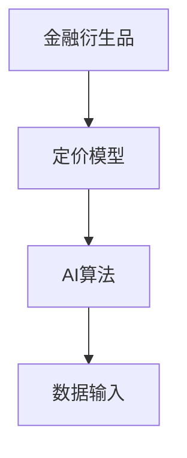
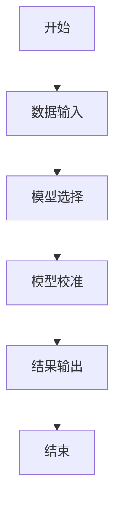
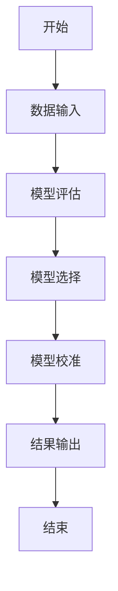
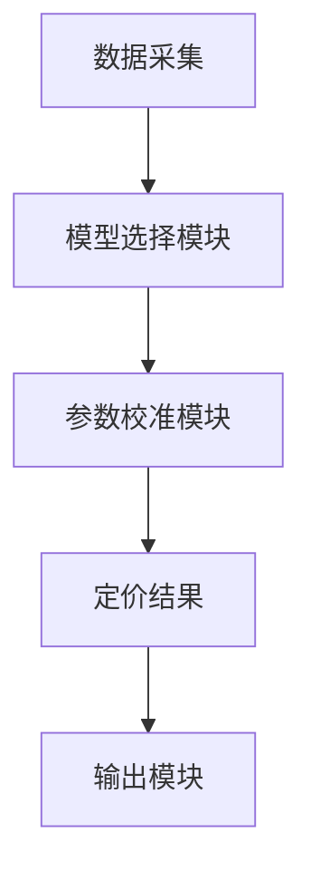

                 


# AI在金融衍生品定价模型动态选择与校准中的创新应用

## 关键词：人工智能，金融衍生品，定价模型，动态选择，模型校准

## 摘要：  
本文探讨了人工智能技术在金融衍生品定价模型中的创新应用，重点分析了动态选择与模型校准的关键技术。通过结合AI算法与金融定价理论，提出了一种高效的解决方案，详细阐述了算法原理、系统架构设计及实际案例分析，展示了AI在金融衍生品定价领域的巨大潜力。

---

# 第一部分: AI在金融衍生品定价模型中的背景与核心概念

## 第1章: 金融衍生品定价模型的背景与问题

### 1.1 金融衍生品定价的背景

#### 1.1.1 金融衍生品的基本概念  
金融衍生品是一种以基础资产（如股票、债券、商品等）为标的，通过合约形式约定在未来某一时间点以特定价格买卖标的资产的金融工具。常见的衍生品包括期货、期权、互换和远期合约等。  

#### 1.1.2 传统定价模型的局限性  
传统的金融衍生品定价模型（如Black-Scholes模型）虽然在理论上较为完善，但在实际应用中面临以下挑战：  
1. 市场波动性难以预测。  
2. 模型假设与实际市场存在偏差（如无摩擦市场假设）。  
3. 需要频繁调整模型参数以适应市场变化。  

#### 1.1.3 AI技术在金融领域的潜力  
人工智能技术在金融领域的应用日益广泛，尤其是在高频交易、风险评估和衍生品定价方面。AI可以通过海量数据处理和深度学习，捕捉复杂市场中的隐含规律，为衍生品定价提供更精准的解决方案。

### 1.2 AI在金融衍生品定价中的问题描述

#### 1.2.1 动态选择定价模型的挑战  
在金融市场上，不同衍生品的价格受多种因素影响，单一模型往往难以满足所有场景的需求。动态选择定价模型的核心在于根据市场环境的变化，实时调整使用的模型类型和参数。  

#### 1.2.2 模型校准的复杂性  
模型校准是指通过历史数据调整模型参数，使其更好地反映市场价格。传统方法依赖于人工经验，而AI可以通过优化算法自动完成校准过程，提高效率和准确性。

#### 1.2.3 传统方法的不足与AI的优势  
传统定价模型通常假设市场符合特定条件（如正态分布、无套利机会等），而实际市场中存在多种不确定性因素。AI技术可以通过非线性回归、强化学习等方法，更好地适应复杂市场环境。

### 1.3 AI驱动的创新解决方案

#### 1.3.1 动态选择定价模型的核心思想  
动态选择定价模型是一种基于AI的自适应方法，通过实时分析市场数据，动态调整使用的定价模型。这种方法能够根据市场环境的变化，选择最合适的模型进行定价。

#### 1.3.2 自动校准的技术路径  
AI驱动的自动校准技术通过优化算法（如梯度下降、遗传算法等）调整模型参数，使其更好地拟合市场价格。这种方法不仅提高了校准效率，还能发现传统方法难以察觉的模式。

#### 1.3.3 问题的边界与外延  
动态选择定价模型的应用范围主要集中在金融衍生品领域，但也需要考虑模型选择的边界条件（如数据质量、市场深度等）。未来，AI技术还可以扩展到更广泛的金融领域，如风险管理、投资组合优化等。

### 1.4 核心概念与要素组成

#### 1.4.1 AI算法的核心要素  
AI算法在定价模型中的应用涉及以下几个核心要素：  
1. 数据来源：包括历史价格、市场波动率、交易量等。  
2. 模型选择：通过机器学习算法（如随机森林、神经网络）选择最合适的定价模型。  
3. 参数优化：通过优化算法调整模型参数，使其更好地适应市场变化。

#### 1.4.2 金融衍生品定价的关键参数  
定价模型中的关键参数包括：  
1. 标的资产价格。  
2. 行权价格。  
3. 到期时间。  
4. 市场波动率。  

#### 1.4.3 动态选择与校准的系统架构  
动态选择与校准的系统架构包括以下几个部分：  
1. 数据采集模块：实时采集市场数据。  
2. 模型选择模块：根据市场环境选择最合适的定价模型。  
3. 参数校准模块：通过优化算法调整模型参数。  
4. 输出模块：生成定价结果并输出。

---

# 第二部分: AI驱动的金融衍生品定价模型动态选择与校准原理

## 第2章: AI在金融衍生品定价中的核心概念与联系

### 2.1 AI大模型在定价中的应用原理

#### 2.1.1 大模型的基本原理  
AI大模型（如神经网络模型）通过大量数据训练，能够捕捉市场中的复杂规律。在定价模型中，大模型可以用于预测标的资产价格、估计波动率等关键参数。

#### 2.1.2 动态选择模型的机制  
动态选择模型的机制包括以下几个步骤：  
1. 数据采集：实时采集市场数据。  
2. 模型评估：通过性能指标（如均方误差、准确率）评估候选模型的性能。  
3. 模型选择：根据评估结果选择最合适的模型。  
4. 模型更新：根据市场变化动态调整模型选择。

#### 2.1.3 模型校准的AI方法  
AI驱动的模型校准方法包括：  
1. 基于梯度下降的参数优化。  
2. 基于遗传算法的全局优化。  
3. 基于蒙特卡洛模拟的校准方法。

### 2.2 核心概念的属性对比

#### 2.2.1 模型选择与校准的对比分析  
| **对比维度** | **模型选择** | **模型校准** |
|--------------|---------------|--------------|
| **目标**     | 选择最优模型 | 调整模型参数 |
| **输入**     | 多个候选模型 | 历史数据和目标函数 |
| **输出**     | 最优模型     | 优化后的模型参数 |

#### 2.2.2 AI驱动与传统方法的对比  
| **对比维度** | **传统方法** | **AI驱动方法** |
|--------------|---------------|----------------|
| **效率**     | 较低          | 较高            |
| **精度**     | 有限          | 更高            |
| **适应性**   | 较差          | 更强            |

#### 2.2.3 动态选择与静态选择的对比  
动态选择方法能够根据市场环境的变化，实时调整定价模型，而静态选择方法则固定使用某一种模型。动态选择方法在市场环境变化较大的情况下更具优势。

### 2.3 实体关系图与流程图

#### 2.3.1 实体关系图（ER图）


#### 2.3.2 动态选择与校准流程图


---

## 第3章: 算法原理与数学模型

### 3.1 算法原理

#### 3.1.1 基于AI的动态选择算法


#### 3.1.2 算法的数学模型  
假设我们有 $n$ 个候选模型，每个模型的预测结果为 $y_i$，真实价格为 $y$。我们可以通过均方误差（MSE）来评估模型的性能：

$$ MSE = \frac{1}{n} \sum_{i=1}^{n} (y_i - y)^2 $$

动态选择算法的目标是选择使 $MSE$ 最小的模型。

---

### 3.2 系统分析与架构设计

#### 3.2.1 系统架构图


---

### 3.3 项目实战

#### 3.3.1 环境安装  
需要安装以下环境：  
1. Python 3.8+  
2. TensorFlow或PyTorch  
3. Pandas和NumPy

#### 3.3.2 核心代码实现  
以下是基于神经网络的动态选择算法的Python代码示例：

```python
import numpy as np
import tensorflow as tf

# 数据准备
X_train = ...  # 输入特征
y_train = ...  # 真实价格

# 定义神经网络模型
model = tf.keras.Sequential([
    tf.keras.layers.Dense(64, activation='relu'),
    tf.keras.layers.Dense(1, activation='linear')
])

# 编译模型
model.compile(optimizer='adam', loss='mean_squared_error')

# 训练模型
model.fit(X_train, y_train, epochs=100, batch_size=32)

# 模型预测
y_pred = model.predict(X_test)
```

---

### 3.4 最佳实践

#### 3.4.1 小结  
通过本文的分析，我们了解到AI技术在金融衍生品定价模型动态选择与校准中的巨大潜力。AI算法能够显著提高模型选择和校准的效率与精度，为金融衍生品定价提供了更优的解决方案。

#### 3.4.2 注意事项  
在实际应用中，需要注意以下几点：  
1. 数据质量对模型性能影响较大，需确保数据来源可靠。  
2. 模型选择和校准需要根据具体场景进行调整。  
3. 需要定期更新模型以适应市场变化。  

#### 3.4.3 拓展阅读  
1. 《Deep Learning for Financial Markets》  
2. 《Reinforcement Learning for Algorithmic Trading》  
3. 《Machine Learning in Quantitative Investment》  

---

# 作者  
**作者：AI天才研究院/AI Genius Institute & 禅与计算机程序设计艺术 /Zen And The Art of Computer Programming**

---

# 结语  
人工智能技术正在深刻改变金融衍生品定价的模式。通过动态选择与校准技术，AI能够帮助投资者更好地应对复杂市场环境，实现更精准的定价和风险管理。未来，随着AI技术的不断发展，金融衍生品定价模型将更加智能化、个性化和动态化。

