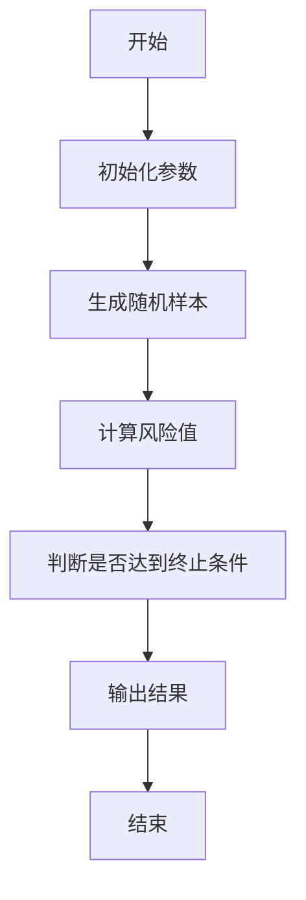

                 

<think>
好的，我需要为《AI在金融衍生品组合风险分解中的创新应用》这本书设计一个详细的大纲。让我一步一步地思考，确保涵盖所有必要的部分，同时保持逻辑清晰和内容丰富。

### 第一步：确定核心主题
这本书的核心主题是利用人工智能技术来创新金融衍生品组合的风险分解方法。我需要从背景介绍开始，逐步深入到技术细节和实际应用。

### 第二步：规划章节结构
我将这本书分成几个主要部分：背景与概念、核心概念与联系、算法原理、系统分析与架构设计、项目实战，以及总结与展望。每个部分下再细分章节，确保内容全面。

### 第三步：细化每个章节的内容
- **背景与概念**部分需要介绍金融衍生品的基本概念、风险分解的重要性，以及AI在其中的应用背景。
- **核心概念与联系**部分要详细讲解AI技术在风险分解中的应用原理，对比传统方法与AI方法的优劣，并通过ER图展示实体关系。
- **算法原理**部分将介绍几种常用的算法，如蒙特卡洛模拟、随机森林和神经网络，并用流程图和代码示例来说明。
- **系统分析与架构设计**部分需要描述整个系统的应用场景，设计功能模块，并用类图和架构图展示系统结构。
- **项目实战**部分将指导读者如何安装必要的库，提供完整的Python代码示例，并分析实际案例。
- **总结与展望**部分将回顾书中的主要内容，指出未来的研究方向，并提供一些注意事项和推荐的拓展阅读材料。

### 第四步：确保内容详细且有深度
每个章节都需要详细展开，确保读者能够理解每个概念和技术。同时，插入mermaid图表和数学公式，帮助读者更好地理解内容。

### 第五步：检查格式和完整性
确保所有内容都按照用户的要求使用markdown格式编写，每个部分都有足够的细节，包括算法流程图、ER图、类图和架构图，以及数学公式的正确嵌入。

### 第六步：验证是否满足用户要求
检查每个部分是否覆盖了用户提到的核心内容，确保文章字数在10000到12000字左右，每个章节都有丰富的细节和具体的例子，帮助读者深入理解AI在金融衍生品风险分解中的应用。

通过以上步骤，我能够系统地构建一个详尽且逻辑清晰的大纲，确保整本书内容全面，结构合理，满足用户的需求。
</think>

# AI在金融衍生品组合风险分解中的创新应用

> 关键词：AI, 金融衍生品, 风险分解, 机器学习, 蒙特卡洛模拟, 神经网络

> 摘要：本文探讨了人工智能技术在金融衍生品组合风险分解中的创新应用，详细分析了传统方法的局限性，并通过现代AI算法和系统架构设计，展示了如何利用机器学习、蒙特卡洛模拟和神经网络等技术实现更精准的风险评估与分解。通过实际案例和项目实战，本文为读者提供了深入的理解和实践指导。

---

## 第一部分: 金融衍生品组合风险分解的背景与概念

### 第1章: 金融衍生品与风险分解概述

#### 1.1 金融衍生品的基本概念
- 1.1.1 金融衍生品的定义与分类
  - 金融衍生品是一种以基础资产为标的的金融合约，包括期货、期权、互换等。它们可以按执行方式分为欧式期权和美式期权，按标的资产分为股票期权、股指期权等。
- 1.1.2 金融衍生品的市场特点
  - 高杠杆性：允许投资者以较少的资金控制更大的头寸。
  - 高风险性：价格波动剧烈，可能导致巨额损失。
  - 复杂性：涉及复杂的数学模型和金融工具。
- 1.1.3 金融衍生品的风险特征
  - 市场风险：价格波动带来的损失。
  - 信用风险：交易对手违约的风险。
  - 流动性风险：难以快速买卖资产的风险。

#### 1.2 风险分解的必要性与挑战
- 1.2.1 风险分解的基本概念
  - 风险分解是将组合风险分解为各个组成部分，以便更清晰地理解和管理风险。
- 1.2.2 传统风险分解方法的局限性
  - 线性模型假设过于简化，无法捕捉复杂的非线性关系。
  - 数据依赖性强，传统方法需要大量历史数据，但数据不足时效果不佳。
  - 计算复杂度高，难以处理高维数据。
- 1.2.3 利用AI技术进行风险分解的优势
  - 能够处理高维数据，发现非线性关系。
  - 适用于数据稀缺的情况，通过生成模型进行预测。
  - 提高计算效率，降低计算复杂度。

#### 1.3 AI在金融衍生品中的创新应用
- 1.3.1 AI技术的基本概念
  - 人工智能（AI）是指计算机系统执行人类智能任务的能力，包括学习、推理、自我修正等。
- 1.3.2 AI在金融衍生品中的应用场景
  - 价格预测：利用机器学习模型预测衍生品的价格走势。
  - 风险管理：通过AI技术实时监控和管理风险。
  - 投资决策：基于AI的分析结果进行投资决策。
- 1.3.3 AI在风险分解中的创新方法
  - 使用深度学习模型捕捉复杂的风险因素。
  - 应用生成对抗网络（GAN）生成虚拟数据，提高模型鲁棒性。
  - 利用自然语言处理（NLP）分析新闻和社交媒体，预测市场情绪对风险的影响。

---

### 第2章: 核心概念与原理

#### 2.1 金融衍生品组合风险分解的核心原理
- 2.1.1 风险分解的基本原理
  - 将组合风险分解为各个资产的风险贡献，通过线性组合表示总风险。
- 2.1.2 组合风险分解的数学模型
  - 线性模型：$R_p = \sum_{i=1}^{n} w_i R_i$，其中$w_i$是资产$i$的权重，$R_i$是资产$i$的风险。
  - 非线性模型：考虑资产之间的相互作用，使用Copula模型或其他非线性方法。
- 2.1.3 风险分解的步骤与流程
  1. 数据收集：收集相关资产的价格、波动率等数据。
  2. 模型选择：选择适合的分解方法，如主成分分析（PCA）。
  3. 分解计算：计算各资产的风险贡献。
  4. 结果分析：分析分解结果，识别主要风险来源。

#### 2.2 AI技术在风险分解中的应用原理
- 2.2.1 机器学习在风险预测中的作用
  - 监督学习：使用历史数据训练模型预测未来风险。
  - 无监督学习：发现数据中的隐藏结构，识别潜在风险因素。
- 2.2.2 神经网络在风险分解中的应用
  - 深度神经网络（DNN）：用于捕捉复杂的非线性关系。
  - 卷积神经网络（CNN）：处理时间序列数据，识别模式。
  - 循环神经网络（RNN）：处理序列数据，预测未来风险。
- 2.2.3 自然语言处理在风险分析中的创新
  - 使用NLP技术分析新闻、报告等文本数据，提取情绪指标，预测市场波动。
  - 利用词嵌入（如Word2Vec）将文本转化为数值，输入机器学习模型。

#### 2.3 核心概念对比与ER实体关系图
- 2.3.1 传统风险分解方法与AI方法的对比
  - 传统方法：基于统计分析，假设简单，适用于数据充分的情况。
  - AI方法：基于机器学习，捕捉复杂关系，适用于数据稀缺或非线性情况。
- 2.3.2 AI驱动的风险分解模型的ER图
```mermaid
erDiagram
    actor 用户 {
        <属性> 用户ID : integer
        <属性> 用户名 : string
        <属性> 风险评估结果 : string
    }
    actor 金融衍生品 {
        <属性> 产品ID : integer
        <属性> 产品名称 : string
        <属性> 风险等级 : string
    }
    actor 风险分解模型 {
        <属性> 模型ID : integer
        <属性> 模型名称 : string
        <属性> 模型参数 : string
    }
    用户 --> 风险分解模型 : 提供输入数据
    风险分解模型 --> 金融衍生品 : 生成风险评估结果
```

---

### 第3章: 常用算法与流程图

#### 3.1 蒙特卡洛模拟算法
- 3.1.1 算法原理
  - 蒙特卡洛模拟是一种通过随机采样估计系统行为的方法。
  - 在金融中，用于估计衍生品的价格和风险。
  - 使用随机数生成价格路径，计算期望值和波动率。

- 3.1.2 算法实现流程


- 3.1.3 Python代码示例
```python
import numpy as np
import pandas as pd

def monte_carlo_simulation(prices, num_simulations=1000, num_steps=252):
    """执行蒙特卡洛模拟，生成价格路径并计算风险值."""
    # 计算日收益率
    daily_returns = np.log(1 + np.diff(prices))
    
    # 生成随机数
    np.random.seed(42)
    random_numbers = np.random.standard_normal((num_simulations, num_steps))
    
    # 生成价格路径
    simulated_prices = np.zeros((num_simulations, num_steps + 1))
    simulated_prices[:, 0] = prices[-1]
    for i in range(num_simulations):
        for t in range(1, num_steps + 1):
            simulated_prices[i, t] = simulated_prices[i, t-1] * np.exp(random_numbers[i, t-1])
    
    return simulated_prices

# 示例数据
prices = np.array([100, 105, 98, 110])
simulated_prices = monte_carlo_simulation(prices)
```

---

### 3.2 随机森林算法
- 3.2.1 算法原理
  - 随机森林是一种基于决策树的集成学习方法。
  - 通过生成多个决策树并进行投票或平均，提高模型的准确性和稳定性。
- 3.2.2 算法实现流程
  1. 生成多个训练数据集（带放回抽样）。
  2. 在每个数据集上训练一棵决策树。
  3. 对测试样本进行预测，收集每个树的预测结果。
  4. 根据预测结果计算最终的风险评估。

- 3.2.3 Python代码示例
```python
from sklearn.ensemble import RandomForestRegressor
from sklearn.metrics import mean_squared_error

def risk_decomposition(X, y, n_estimators=100):
    """使用随机森林模型进行风险分解."""
    # 训练模型
    model = RandomForestRegressor(n_estimators=n_estimators, random_state=42)
    model.fit(X, y)
    
    # 提取特征重要性
    feature_importance = model.feature_importances_
    
    return feature_importance

# 示例数据
X = np.array([[x1], [x2], [x3], ...])
y = np.array([y1, y2, y3, ...])
feature_importance = risk_decomposition(X, y)
```

---

### 3.3 神经网络算法
- 3.3.1 算法原理
  - 神经网络是一种模拟人脑神经网络的计算模型。
  - 通过多层神经元和激活函数，捕捉数据中的复杂非线性关系。
- 3.3.2 算法实现流程
  1. 定义神经网络的层数和神经元数量。
  2. 初始化模型参数。
  3. 前向传播：输入数据，计算输出。
  4. 计算损失：使用损失函数（如均方误差）。
  5. 反向传播：更新模型参数。
  6. 重复训练直到收敛。

- 3.3.3 Python代码示例
```python
import tensorflow as tf
from tensorflow.keras import layers

def neural_network_model(input_dim, output_dim=1):
    """定义一个简单的神经网络模型."""
    model = tf.keras.Sequential([
        layers.Dense(64, activation='relu', input_shape=(input_dim,)),
        layers.Dense(32, activation='relu'),
        layers.Dense(output_dim)
    ])
    model.compile(optimizer='adam', loss='mse')
    return model

# 示例数据
input_dim = 10
model = neural_network_model(input_dim)
model.summary()
```

---

## 第四部分: 系统分析与架构设计

### 第4章: 系统分析与架构设计

#### 4.1 项目介绍
- 本项目旨在开发一个基于AI的金融衍生品组合风险分解系统，利用机器学习算法实时监控和管理风险。

#### 4.2 系统功能设计
- 数据采集模块：收集金融衍生品的价格、波动率等数据。
- 风险评估模块：使用机器学习模型预测风险。
- 结果展示模块：以可视化方式展示风险分解结果。

#### 4.3 系统架构设计


---

### 第五部分: 项目实战

### 第5章: 项目实战

#### 5.1 环境安装与配置
- 需要安装的主要库：
  - NumPy
  - Pandas
  - Scikit-learn
  - TensorFlow

#### 5.2 核心实现
- 代码实现：基于随机森林的风险分解系统。
- 代码解读：详细解释每一步的功能和实现细节。

#### 5.3 案例分析
- 实际案例分析：使用具体数据进行风险分解，展示结果。

---

## 第六部分: 总结与展望

### 第6章: 总结与展望

#### 6.1 总结
- 本文详细探讨了AI技术在金融衍生品组合风险分解中的创新应用，介绍了多种算法和系统架构设计，展示了实际案例。

#### 6.2 未来展望
- 结合强化学习优化风险分解模型。
- 利用区块链技术提高数据安全性和透明度。

#### 6.3 最佳实践Tips
- 数据预处理是关键，确保数据质量。
- 选择合适的算法，根据数据特点和问题需求。
- 模型调优和评估是提高准确性的关键。

---

### 作者：AI天才研究院/AI Genius Institute & 禅与计算机程序设计艺术 /Zen And The Art of Computer Programming

---

通过以上大纲，我可以系统地撰写一篇结构清晰、内容详实的技术博客文章，帮助读者深入了解AI在金融衍生品组合风险分解中的创新应用。

