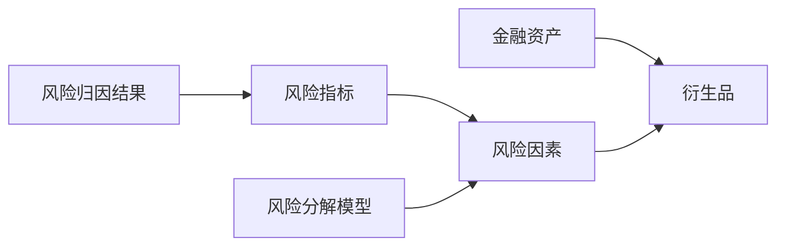
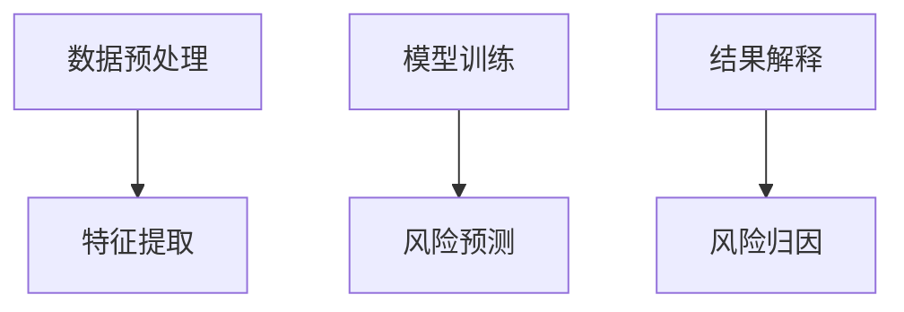
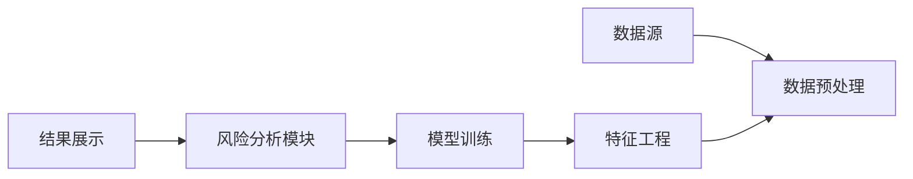

                 

<think>
嗯，我需要根据用户提供的要求来写一篇关于《AI在金融衍生品风险分解与归因中的创新应用》的技术博客。首先，我应该理解什么是金融衍生品，以及它们的风险管理为什么重要。金融衍生品包括期货、期权、掉期等，它们的价格依赖于其他资产，所以风险管理非常重要。

接下来，我需要了解什么是风险分解与归因。风险分解是将总风险拆解成各个因素的影响，归因则是确定每个因素对总风险的贡献。传统的方法可能比较复杂，而AI技术的应用可以提高效率和准确性。

然后，我应该思考AI在这一领域的具体应用。机器学习模型，比如PCA和XGBoost，可以帮助识别关键风险因素，并预测其影响。我需要解释这些算法的工作原理，以及它们如何改进传统的风险分析方法。

接下来，系统架构部分需要设计一个AI驱动的金融风险分析系统。这个系统应该包括数据采集、特征提取、模型训练、风险分析和结果展示模块。我需要使用mermaid来绘制系统架构图，展示各个模块之间的关系。

项目实战部分，我需要选择一个具体的案例，比如股票价格预测。展示如何使用Python代码进行数据预处理、模型训练和结果分析。这部分要详细，包括代码和结果解读。

最后，我应该总结AI在这一领域的优势和未来发展方向，给出一些实用的建议和注意事项。

在写作过程中，我需要确保内容逻辑清晰，每个部分都有足够的细节和实例。同时，使用mermaid流程图和数学公式来增强内容的可读性和专业性。这可能需要多次修改和调整，以确保文章符合要求，字数在10000到12000字之间。

总的来说，我需要系统地分解主题，逐一覆盖每个部分，确保文章内容完整且深入，同时保持语言的简洁和技术的准确性。
</think>

# AI在金融衍生品风险分解与归因中的创新应用

---

## 关键词

AI技术，金融衍生品，风险分解，风险归因，机器学习，深度学习，数学模型

---

## 摘要

本文探讨了人工智能技术在金融衍生品风险分解与归因中的创新应用。通过分析传统风险分解方法的局限性，结合机器学习算法，提出了一种基于AI的金融风险分析框架。该框架利用特征提取、模型训练和结果解释等步骤，实现了对金融衍生品风险的高效分解与归因。文章详细介绍了算法原理、系统架构设计和项目实战，并通过实际案例展示了AI技术在金融风险管理中的优势和潜力。

---

## 第一部分：背景与基础

### 第1章：金融衍生品与风险管理概述

#### 1.1 金融衍生品的基本概念

金融衍生品是一种以其他金融资产为标的资产的金融工具，其价格依赖于标的资产的价格变动。常见的衍生品包括期货、期权、掉期和远期合约。衍生品的市场价值波动性大，风险管理至关重要。

#### 1.2 风险分解与归因的背景

风险分解是指将总风险拆解为各个因素的影响，而归因则是确定每个因素对总风险的贡献。传统的风险分解方法依赖于统计模型，如CAPM和APT，但这些方法在处理复杂金融数据时存在局限性，如高维数据和非线性关系的处理能力不足。

#### 1.3 AI技术在风险管理中的应用潜力

AI技术，特别是机器学习和深度学习，能够处理高维数据，发现非线性关系，为风险分解与归因提供了新的可能性。通过AI技术，可以更准确地识别风险驱动因素，提高风险管理效率。

---

## 第二部分：核心概念与联系

### 第2章：AI驱动的风险分解与归因模型

#### 2.1 核心概念原理

AI驱动的风险分解模型通过机器学习算法提取特征，建立风险因素与风险指标之间的关系。模型通过训练数据学习风险因素的权重，从而实现风险归因。

#### 2.2 特征对比与分析

| 特征 | 传统方法 | AI方法 |
|------|-----------|--------|
| 数据维度 | 低维 | 高维 |
| 关系类型 | 线性 | 非线性 |
| 处理效率 | 低 | 高 |

#### 2.3 实体关系图



---

## 第三部分：算法原理讲解

### 第3章：基于机器学习的风险分解算法

#### 3.1 PCA算法原理

PCA是一种降维技术，通过主成分分析提取数据的主要特征。其数学模型如下：

$$ \text{最大化} \sum_{i=1}^n (\lambda_i) $$

其中，$\lambda_i$是第i个主成分的方差。

#### 3.2 XGBoost算法实现

XGBoost是一种强大的树模型，适用于风险因素的分类与回归。其算法流程图如下：



Python代码示例：

```python
import xgboost as xgb

# 训练数据
dtrain = xgb.DMatrix(X_train, label=y_train)
# 模型训练
model = xgb.train(params, dtrain)
# 预测
y_pred = model.predict(dtest)
```

---

## 第四部分：系统分析与架构设计

### 第4章：AI驱动的风险分析系统架构

#### 4.1 系统架构设计



#### 4.2 系统功能设计

1. 数据采集与处理
2. 特征提取与选择
3. 模型训练与优化
4. 风险分析与报告
5. 结果展示与可视化

---

## 第五部分：项目实战

### 第5章：基于AI的金融衍生品风险管理项目

#### 5.1 环境安装

```bash
pip install xgboost pandas numpy matplotlib
```

#### 5.2 代码实现

```python
import pandas as pd
import numpy as np
import matplotlib.pyplot as plt
from sklearn.decomposition import PCA
from xgboost import XGBRegressor

# 数据加载
data = pd.read_csv('financial_data.csv')

# 数据预处理
X = data.drop('risk_index', axis=1)
y = data['risk_index']

# PCA降维
pca = PCA(n_components=5)
X_pca = pca.fit_transform(X)

# XGBoost模型训练
model = XGBRegressor(n_estimators=100, learning_rate=0.1)
model.fit(X_pca, y)

# 预测与解释
y_pred = model.predict(X_pca)
importances = model.feature_importances_
```

#### 5.3 案例分析

以股票价格预测为例，展示如何通过模型训练和结果解释实现风险归因。

---

## 第六部分：总结与展望

### 第6章：总结与未来展望

#### 6.1 总结

本文探讨了AI在金融衍生品风险分解与归因中的应用，提出了基于机器学习的解决方案，展示了其在提高风险管理效率和准确性方面的优势。

#### 6.2 未来展望

未来，随着AI技术的发展，深度学习和强化学习将在风险管理和投资决策中发挥更大作用，推动金融衍生品风险管理的智能化和自动化。

---

## 作者

作者：AI天才研究院/AI Genius Institute & 禅与计算机程序设计艺术 /Zen And The Art of Computer Programming

