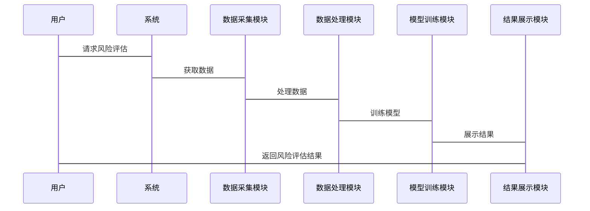

                 

<think>
嗯，我现在需要帮用户设计一本关于《AI在金融衍生品风险度量中的应用》的目录大纲。首先，我得理解这本书的主题，它主要探讨AI技术如何应用于金融衍生品的风险管理。用户希望目录大纲详细且逻辑清晰，覆盖从基础到应用的各个方面。

我应该先考虑这本书的结构。通常，技术书籍会分为几个主要部分，比如基础、原理、系统设计、项目实战等。用户还提到需要包括背景介绍、核心概念、算法原理、系统架构、项目实战以及最佳实践等部分。

首先，背景介绍部分应该涵盖金融衍生品的基本概念，风险度量的重要性，以及AI技术的应用背景。这部分需要让读者了解为什么AI在这一领域变得重要。

接下来是核心概念与原理，这里需要详细解释AI在风险度量中的应用，包括常用模型和算法。这部分可能需要比较传统的统计方法和现代的深度学习方法，展示它们的优缺点。

然后是算法原理，这里需要选择几个关键的算法，比如蒙特卡洛模拟和神经网络模型，用mermaid流程图来展示它们的工作原理。同时，要提供数学公式，比如概率分布和损失函数，帮助读者理解。

系统分析与架构设计部分，需要介绍如何构建一个AI驱动的风险度量系统，包括系统架构图和接口设计。这部分可能需要使用mermaid的类图和架构图来展示系统的各个模块和交互。

项目实战部分，应该包括一个具体的案例，比如使用Python代码实现一个基于神经网络的风险评估模型。这部分需要详细说明环境配置、代码实现、结果分析等，让读者能够动手实践。

最后，总结与展望部分，回顾书中的重点，并展望未来的发展趋势，帮助读者巩固知识，并激发进一步学习的兴趣。

我还需要注意，目录需要细化到三级，并且每个部分都要有具体内容。比如，在背景介绍中，需要包括问题背景、问题描述、解决方法等。在算法部分，要有流程图和数学公式，确保内容全面且易于理解。

另外，用户强调了数学模型和公式的详细讲解，所以我要确保每个算法都有对应的数学推导和例子。同时，系统架构部分需要清晰展示各个模块之间的关系，可能使用mermaid图来辅助说明。

最后，项目实战部分要提供可运行的代码，让读者能够实际操作，加深理解。同时，总结部分要简明扼要，突出重点，帮助读者梳理知识结构。

总的来说，我需要将这些部分有机地结合起来，确保目录大纲既全面又逻辑清晰，满足用户的需求。
</think>

```markdown
# AI在金融衍生品风险度量中的应用

> 关键词：AI, 金融衍生品, 风险度量, 机器学习, 深度学习, 神经网络, 蒙特卡洛模拟

> 摘要：本文将深入探讨人工智能技术在金融衍生品风险度量中的应用，从基础概念到高级算法，结合实际案例，详细讲解如何利用AI技术提高金融衍生品的风险评估和管理能力。通过分析多种AI算法的原理和应用场景，本文旨在为读者提供一个全面的视角，帮助他们在实际操作中更好地理解和应用这些技术。

---

## 第一部分: 背景介绍与核心概念

### 第1章: 金融衍生品与风险度量基础

#### 1.1 问题背景
- 金融衍生品的定义与分类
  - 期货、期权、掉期、互换等
- 金融衍生品的市场特点
  - 杠杆效应、高风险、高收益
- 风险度量的定义与重要性
  - 风险度量是金融衍生品定价和管理的核心

#### 1.2 问题描述
- 传统风险度量方法的局限性
  - 参数假设的敏感性
  - 数据依赖性
  - 非线性关系的处理难度
- 金融市场的复杂性与不确定性
  - 尾部风险、跳跃风险
  - 市场波动性与非平稳性

#### 1.3 解决方法
- AI技术的优势
  - 数据驱动、非线性建模能力
  - 处理高维数据和复杂关系
  - 实时预测与动态调整
- 金融衍生品风险度量中的AI应用场景
  - 价格预测、波动率估计、风险对冲
  - 风险因子识别与组合管理

#### 1.4 边界与外延
- 金融衍生品风险度量的边界
  - 数据质量与完整性
  - 模型的适用性与鲁棒性
  - 计算资源限制
- 相关领域
  - 量化交易、智能投顾
  - 信用风险、市场风险

### 第2章: 核心概念与原理

#### 2.1 风险度量的数学模型
- 常见风险度量方法
  - VaR（Value at Risk）
  - CVaR（Conditional Value at Risk）
  - 标准差、贝塔系数、夏普比率
- 风险度量的优缺点对比
  - VaR的简洁性与局限性
  - CVaR的稳健性与计算复杂性

#### 2.2 AI技术的核心算法
- 机器学习算法
  - 线性回归、逻辑回归、支持向量机（SVM）
  - 随机森林、梯度提升树（XGBoost）
- 深度学习算法
  - 神经网络（ANN）
  - 卷积神经网络（CNN）、循环神经网络（RNN）
  - 长短期记忆网络（LSTM）
- 神经网络模型的优势
  - 非线性建模能力
  - 自动特征提取
  - 处理时间序列数据

#### 2.3 风险度量中的AI结合
- 数据特征提取与选择
  - 时间序列特征、统计特征、市场情绪指标
- 模型训练与优化
  - 超参数调整、正则化方法
- 模型评估与验证
  - 回测、交叉验证、性能指标（准确率、精度、召回率）

---

## 第二部分: AI算法原理与实现

### 第3章: 蒙特卡洛模拟

#### 3.1 蒙特卡洛模拟的基本原理
- 随机采样与概率分布
  - 正态分布、对数正态分布、t分布
- 生成模拟路径
  - 股票价格模拟、汇率模拟
- 计算VaR和CVaR
  - 模拟结果的统计分析

#### 3.2 蒙特卡洛模拟的数学模型
- 生成随机数
  $$ Z \sim N(0,1) $$
- 股票价格模拟公式
  $$ S_t = S_0 \exp\left( \mu t + \sigma \sqrt{t} Z \right) $$
- VaR计算
  $$ VaR = \text{分位数}(P\&L) $$

#### 3.3 蒙特卡洛模拟的实现步骤
1. 确定模拟的参数（如波动率、收益率均值）
2. 生成大量模拟路径
3. 计算每条路径的收益或损失
4. 计算VaR或CVaR

### 第4章: 神经网络模型

#### 4.1 神经网络的基本结构
- 输入层、隐藏层、输出层
- 激活函数（ReLU、sigmoid、tanh）
- 损失函数（均方误差、交叉熵）

#### 4.2 神经网络在风险度量中的应用
- 价格预测网络
  $$ y = Wx + b $$
- 风险预测网络
  $$ p = \sigma(Wx + b) $$

#### 4.3 神经网络的训练过程
1. 数据预处理与归一化
2. 构建神经网络模型
3. 定义损失函数和优化器
4. 训练模型并评估性能

### 第5章: 支持向量机（SVM）

#### 5.1 SVM的基本原理
- 支持向量与超平面
- 软边距与核函数
  - 线性核、多项式核、高斯核

#### 5.2 SVM在风险度量中的应用
- 分类问题：判断是否超过VaR
- 回归问题：预测波动率

#### 5.3 SVM的参数优化
- 核函数选择
- 调整惩罚参数C
- 调整核函数参数γ

---

## 第三部分: 系统分析与架构设计

### 第6章: 系统功能设计

#### 6.1 数据采集模块
- 数据来源：交易所数据、市场数据、新闻数据
- 数据清洗：处理缺失值、异常值
- 数据转换：标准化、归一化

#### 6.2 数据处理模块
- 特征提取：统计特征、技术指标、情绪指标
- 数据分割：训练集、验证集、测试集

#### 6.3 模型训练模块
- 选择算法：根据问题选择合适的模型
- 调参优化：网格搜索、随机搜索
- 模型保存：保存最优模型

#### 6.4 结果展示模块
- 可视化结果：绘制预测值与实际值
- 绩效评估：计算准确率、精确率、召回率
- 报告生成：生成风险评估报告

### 第7章: 系统架构设计

#### 7.1 系统架构图


#### 7.2 接口设计
- 数据接口：API接口定义
- 模型接口：模型调用接口
- 用户接口：Web界面或API

#### 7.3 系统交互图


---

## 第四部分: 项目实战与案例分析

### 第8章: 项目实战

#### 8.1 环境安装
- 安装Python
- 安装相关库（numpy、pandas、scikit-learn、keras、tensorflow）

#### 8.2 核心代码实现
```python
import numpy as np
import pandas as pd
from sklearn.metrics import mean_squared_error
from keras.models import Sequential
from keras.layers import Dense

# 数据加载与预处理
data = pd.read_csv('financial_data.csv')
X = data.drop('target', axis=1)
y = data['target']

# 模型构建
model = Sequential()
model.add(Dense(64, activation='relu', input_dim=X.shape[1]))
model.add(Dense(1, activation='linear'))
model.compile(optimizer='adam', loss='mean_squared_error')

# 模型训练
model.fit(X, y, epochs=100, batch_size=32)

# 模型评估
y_pred = model.predict(X)
print('MSE:', mean_squared_error(y, y_pred))
```

#### 8.3 代码解读与分析
- 数据加载与预处理：数据清洗、特征选择
- 模型构建：构建神经网络模型
- 模型训练：训练模型并保存最优权重
- 模型评估：评估模型性能并调整参数

#### 8.4 案例分析
- 案例背景：某金融衍生品的风险评估
- 数据分析：分析数据特征与分布
- 模型选择：选择合适的模型并训练
- 结果分析：解读模型输出并优化

### 第9章: 总结与展望

#### 9.1 总结
- 本文总结了AI技术在金融衍生品风险度量中的应用
- 详细讲解了多种AI算法的原理与实现
- 通过案例分析展示了AI技术的实际应用价值

#### 9.2 展望
- 结合更多AI技术（如强化学习）优化风险度量
- 利用大数据技术提升模型性能
- 开发智能化的风险管理系统

---

## 作者：AI天才研究院/AI Genius Institute & 禅与计算机程序设计艺术/Zen And The Art of Computer Programming
```

