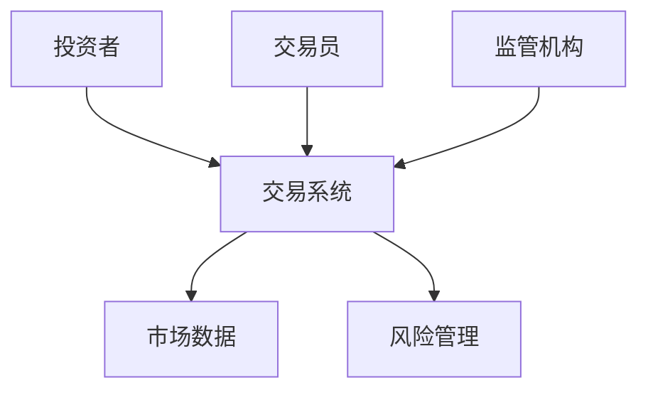
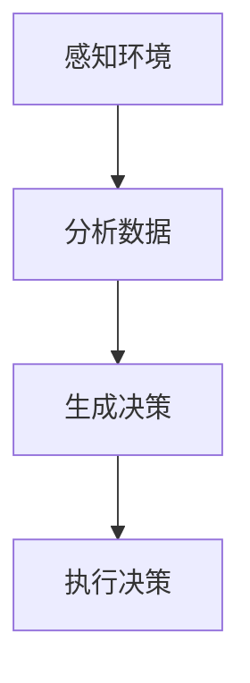
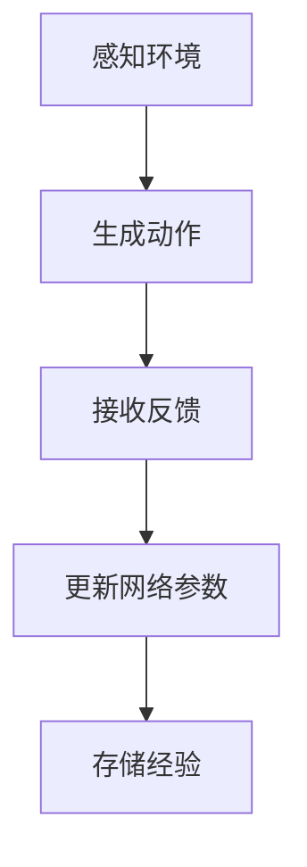
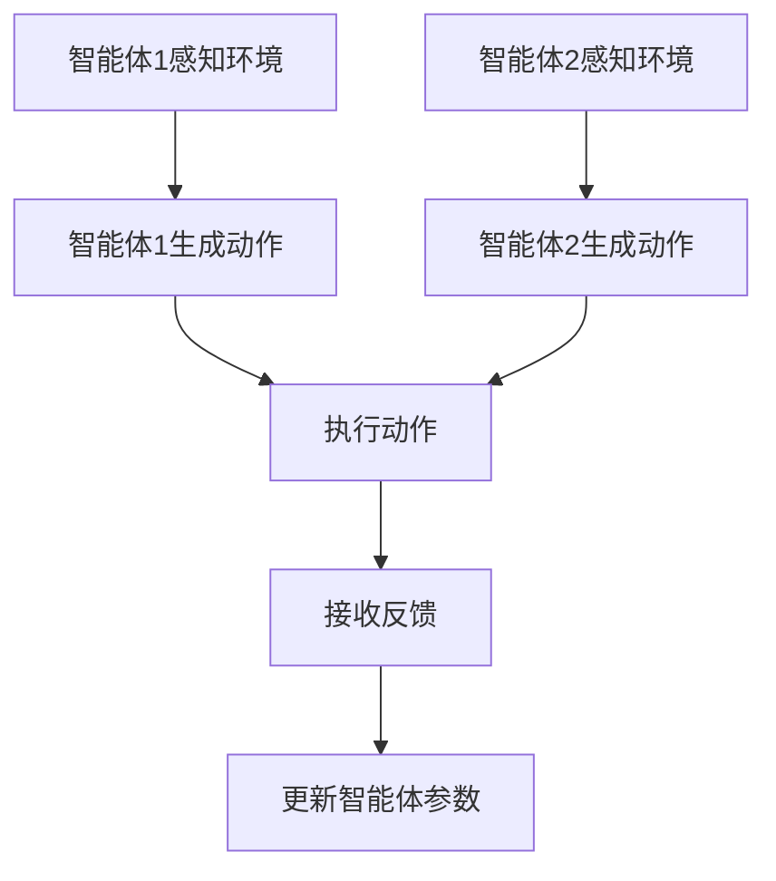
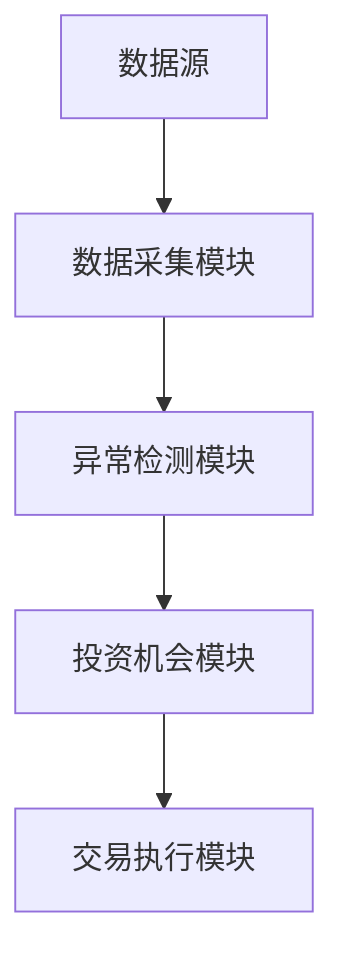
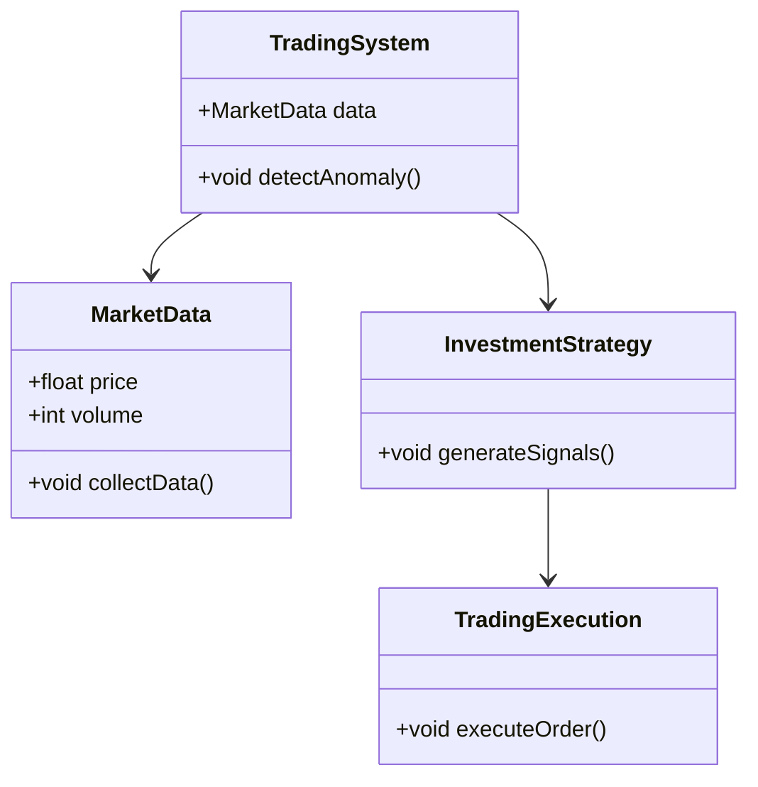

                 


# AI多智能体在识别市场异常和投资机会中的作用

> 关键词：AI多智能体，市场异常识别，投资机会，强化学习，金融数据分析，分布式决策

> 摘要：本文深入探讨了AI多智能体系统在金融市场中的应用，特别是如何利用多智能体系统来识别市场异常和发现投资机会。文章从背景介绍、核心概念、算法原理、系统设计、项目实战到最佳实践，全面解析了AI多智能体在金融领域的独特价值和具体实现。

---

# 第一部分: AI多智能体系统与金融市场概述

## 第1章: AI多智能体系统概述

### 1.1 多智能体系统的基本概念

#### 1.1.1 多智能体系统的定义与特征

多智能体系统（Multi-Agent System, MAS）由多个相互作用的智能体组成，每个智能体具有一定的自主性、反应性和协作性。以下是多智能体系统的几个关键特征：

- **自主性**：每个智能体能够独立感知环境并做出决策。
- **反应性**：智能体能够实时响应环境变化。
- **协作性**：智能体之间通过通信和协作共同完成复杂任务。
- **分布性**：智能体分布在网络中，不依赖于中心化的控制节点。

#### 1.1.2 多智能体系统与单智能体的区别

单智能体系统通常依赖中心化的决策机制，而多智能体系统通过分布式协作完成任务。以下是两者的对比：

| 特性 | 单智能体系统 | 多智能体系统 |
|------|--------------|--------------|
| 决策机制 | 中心化决策 | 分布式决策 |
| 可扩展性 | 有限 | 高 |
| 稳定性 | 单点故障风险高 | 分散风险 |

#### 1.1.3 多智能体系统的应用场景

多智能体系统广泛应用于金融交易、物流调度、智能城市等领域。在金融市场中，多智能体系统可以用于实时交易决策、风险控制和市场分析。

---

### 1.2 金融市场中的异常识别与投资机会

#### 1.2.1 金融市场概述

金融市场是一个复杂的生态系统，包含股票、债券、期货等多种金融工具。市场的参与者包括投资者、交易员、机构和监管机构。金融市场的主要功能是资金的融通和价格的发现。

#### 1.2.2 市场异常的定义与分类

市场异常是指市场价格偏离正常波动范围的现象，通常由突发事件、市场操纵或信息不对称引起。常见的市场异常包括：

- **闪崩**：价格短时间内急剧下跌。
- **暴涨**：价格短时间内急剧上涨。
- **操控**：通过虚假交易操纵市场价格。

#### 1.2.3 投资机会的识别与评估

投资机会通常出现在市场异常之后，例如价格回调、市场低估或结构性变化。识别投资机会需要结合技术分析和基本面分析，同时考虑市场的宏观经济环境。

---

# 第二部分: 多智能体系统的核心原理与算法

## 第3章: 多智能体系统的核心原理

### 3.1 多智能体系统的组成与结构

#### 3.1.1 实体关系图（ER图）

以下是多智能体系统的实体关系图：

```mermaid
er
actor:投资者
actor:交易员
actor:监管机构
class:市场数据
class:交易系统
class:风险管理
```

#### 3.1.2 系统架构图

以下是多智能体系统的架构图：



---

### 3.2 多智能体系统的协作机制

#### 3.2.1 通信协议

多智能体系统中的通信协议通常采用消息传递机制，例如使用WebSocket或HTTP进行实时通信。

#### 3.2.2 协作策略

协作策略包括任务分配、资源分配和冲突解决。以下是常见的协作策略：

| 策略 | 描述 |
|------|------|
| 任务分配 | 根据智能体的能力分配任务 |
| 资源分配 | 根据需求分配计算资源 |
| 冲突解决 | 通过协商或仲裁机制解决冲突 |

#### 3.2.3 决策机制

决策机制包括基于规则的决策和基于模型的决策。以下是决策流程图：



---

## 第4章: 基于强化学习的多智能体算法

### 4.1 强化学习基础

#### 4.1.1 Q-learning算法

Q-learning是一种经典的强化学习算法，适用于离散动作空间。其核心公式为：

$$ Q(s, a) = r + \gamma \max_{a'} Q(s', a') $$

其中：
- \( Q(s, a) \)：状态 \( s \) 下执行动作 \( a \) 的价值。
- \( r \)：立即奖励。
- \( \gamma \)：折扣因子。

以下是Q-learning的实现代码示例：

```python
import numpy as np

class QLearner:
    def __init__(self, state_size, action_size, gamma=0.99):
        self.state_size = state_size
        self.action_size = action_size
        self.gamma = gamma
        self.Q = np.zeros((state_size, action_size))

    def act(self, state):
        return np.argmax(self.Q[state])

    def update(self, state, action, reward, next_state):
        self.Q[state, action] = reward + self.gamma * np.max(self.Q[next_state])
```

#### 4.1.2 Deep Q-Network (DQN)算法

DQN通过深度神经网络近似Q值函数，适用于连续动作空间。以下是DQN的流程图：



---

### 4.2 基于强化学习的多智能体协作算法

#### 4.2.1 算法流程图

以下是多智能体协作的强化学习流程图：



#### 4.2.2 Python实现代码

以下是多智能体协作的Python实现代码示例：

```python
import numpy as np
import gym

class MultiAgentDQN:
    def __init__(self, env, num_agents=2):
        self.env = env
        self.num_agents = num_agents
        self.agents = [DQN(env.observation_space.shape[0], env.action_space.n) for _ in range(num_agents)]

    def act(self, observations):
        actions = []
        for i in range(self.num_agents):
            actions.append(self.agents[i].act(observations[i]))
        return actions

    def update(self, observations, actions, rewards, next_observations):
        for i in range(self.num_agents):
            self.agents[i].update(observations[i], actions[i], rewards[i], next_observations[i])
```

---

## 第5章: 多智能体系统的数学模型与公式

### 5.1 状态空间与动作空间

#### 5.1.1 状态空间的定义

状态空间由所有可能的状态组成，例如市场的开盘价、收盘价、最高价和最低价。

#### 5.1.2 动作空间的定义

动作空间由所有可能的操作组成，例如买入、卖出或持有。

### 5.2 奖励函数的设计

#### 5.2.1 奖励函数的定义

奖励函数通常基于收益、风险和交易成本。例如：

$$ r = \text{收益} - \text{风险} - \text{成本} $$

---

# 第三部分: 金融市场异常识别与投资机会的系统设计

## 第6章: 金融市场异常识别的系统设计

### 6.1 系统功能设计

#### 6.1.1 系统功能模块

以下是系统的功能模块：

- 数据采集模块：实时采集市场数据。
- 异常检测模块：识别市场异常。
- 投资机会模块：生成投资信号。
- 交易执行模块：执行交易指令。

#### 6.1.2 数据流图

以下是系统数据流图：



---

### 6.2 系统架构设计

#### 6.2.1 领域模型类图

以下是系统的类图：



---

## 第7章: 项目实战与案例分析

### 7.1 项目实战

#### 7.1.1 环境安装

需要安装以下环境和库：

- Python 3.8+
- Gym库
- TensorFlow库
- NumPy库

#### 7.1.2 系统核心实现

以下是系统核心实现代码：

```python
import gym
import numpy as np

class TradingAgent:
    def __init__(self, state_size, action_size):
        self.state_size = state_size
        self.action_size = action_size
        self.model = self._build_model()

    def _build_model(self):
        model = Sequential()
        model.add(Dense(32, activation='relu', input_dim=self.state_size))
        model.add(Dense(self.action_size, activation='linear'))
        model.compile(optimizer='adam', loss='mse')
        return model

    def act(self, state):
        return self.model.predict(state)[0]

    def update(self, state, action, reward, next_state):
        target = reward + 0.95 * self.model.predict(next_state)[0]
        self.model.fit(state, target, epochs=1, verbose=0)
```

---

## 第8章: 最佳实践与小结

### 8.1 最佳实践 tips

- **模型调参**：根据实际情况调整模型参数，例如学习率和折扣因子。
- **数据清洗**：确保数据的完整性和准确性。
- **风险控制**：设置止损和止盈机制。

### 8.2 小结

本文详细探讨了AI多智能体在识别市场异常和投资机会中的应用，从理论到实践，全面解析了多智能体系统的实现和优化方法。通过案例分析和代码实现，展示了如何利用多智能体系统提升金融市场的分析能力和投资收益。

---

# 结语

AI多智能体系统在金融市场中的应用前景广阔，随着技术的不断进步，未来将有更多创新性的解决方案涌现。通过结合强化学习和分布式计算，多智能体系统将为金融市场的异常识别和投资机会发现提供更强大的支持。

---

作者：AI天才研究院 & 禅与计算机程序设计艺术

