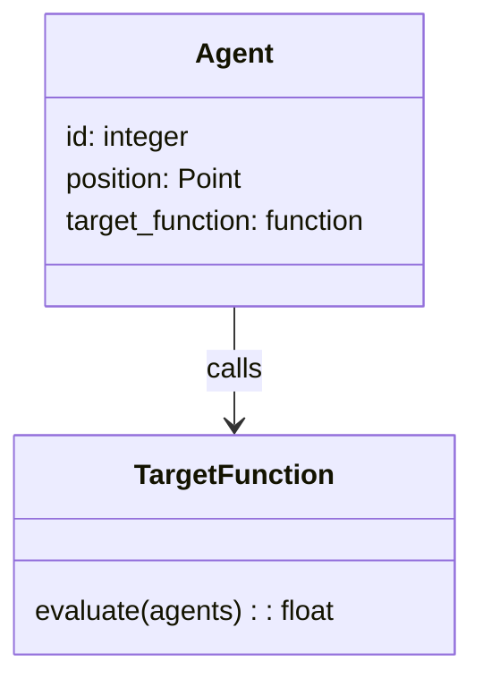
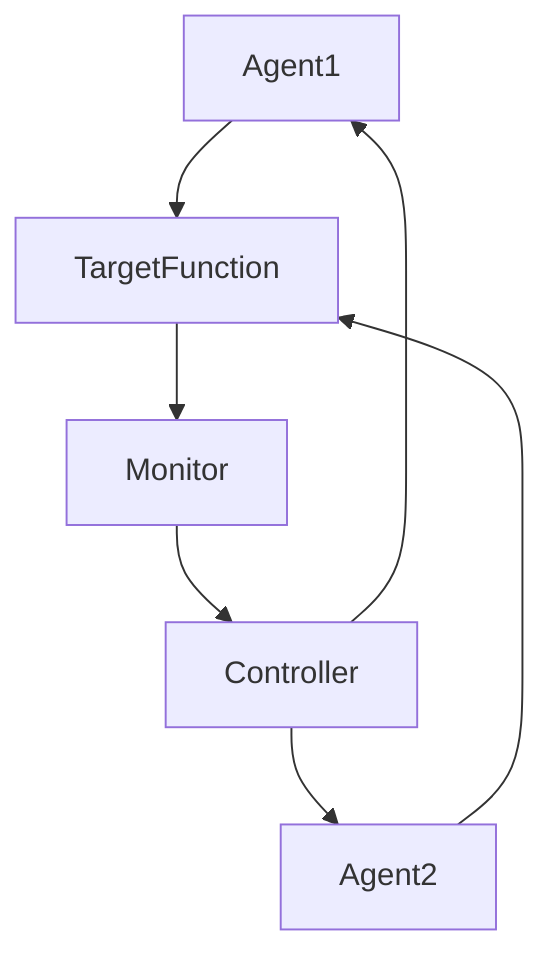
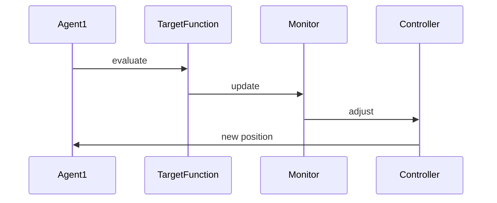

                 

<think>
嗯，用户让我写一篇关于《AI多智能体如何优化价值投资的税收效率》的技术博客文章。首先，我需要明确文章的核心主题，即如何利用AI多智能体技术来优化税务规划，从而提升投资收益。接下来，我得考虑文章的结构，用户给了一个详细的目录大纲，我需要按照这个结构来撰写。

用户强调使用逻辑清晰、结构紧凑、简单易懂的专业技术语言，所以我要确保每一部分都详细且有条理。首先，我需要在摘要部分概述文章的核心内容和主题思想，然后列出关键词。接下来，按照目录的章节逐步展开，每个章节都要涵盖背景介绍、核心概念、算法原理、系统架构、项目实战和最佳实践。

在背景介绍部分，我需要解释AI多智能体和价值投资的基本概念，并说明它们如何结合来优化税收效率。核心概念部分要详细讲解多智能体系统、价值投资和税务优化的基本原理，可能还需要一些图表来辅助说明。算法原理部分需要详细阐述AI多智能体的工作机制，包括算法流程和数学模型，这部分可能需要用到Mermaid流程图和Latex公式。

系统分析与架构设计部分需要介绍项目背景、系统功能设计、架构图、接口设计和交互流程，这部分同样需要使用Mermaid图表来展示结构。项目实战部分则需要提供具体的实现案例，包括环境安装、核心代码、代码解读和案例分析，让读者能够实际操作。

最后，总结部分要回顾文章内容，并展望未来的研究方向，同时给出最佳实践建议。整个过程中，我要确保内容完整，控制在2000字以内，语言专业但通俗易懂，结构清晰，逻辑严谨。现在，我需要按照这个思路开始撰写文章。
</think>

# AI多智能体如何优化价值投资的税收效率

> 关键词：AI多智能体、价值投资、税收效率、优化算法、投资收益

> 摘要：本文探讨了AI多智能体技术在价值投资中的应用，重点分析了如何通过优化税收效率来提升投资收益。文章从背景、概念、算法、系统架构到项目实战，全面解析了AI多智能体在价值投资中的优化策略，为读者提供了一套完整的解决方案。

---

## 第一章: AI多智能体与价值投资概述

### 1.1 AI多智能体的基本概念

#### 1.1.1 多智能体系统的定义
多智能体系统（Multi-Agent System，MAS）是由多个智能体组成的分布式系统，每个智能体都有一定的自主性，能够感知环境、做出决策并与其他智能体协作或竞争。与单智能体系统相比，MAS能够更好地处理复杂问题，尤其是在需要多学科协作的场景中。

#### 1.1.2 AI多智能体的核心特征
- **自主性**：智能体能够自主决策。
- **反应性**：能够实时感知环境变化并做出反应。
- **协作性**：多个智能体可以协同工作，共同完成任务。
- **分布式计算**：计算资源分布在多个智能体之间，提高系统的容错性和扩展性。

#### 1.1.3 多智能体与单智能体的对比
| 特性          | 多智能体系统          | 单智能体系统          |
|---------------|----------------------|----------------------|
| 决策方式      | 分布式决策           | 集中式决策           |
| 任务处理      | 多任务协作           | 单任务处理           |
| 系统复杂度    | 高                   | 低                   |

### 1.2 价值投资的基本原理

#### 1.2.1 价值投资的定义
价值投资是一种投资策略，旨在通过识别市场中的低估资产，长期持有，等待其价值回归。其核心在于寻找市场价格低于内在价值的证券。

#### 1.2.2 价值投资的核心要素
- **内在价值**：资产的真实价值。
- **市场价格**：资产在市场上的交易价格。
- **安全边际**：市场价格与内在价值之间的差异，提供保护。

#### 1.2.3 价值投资与短期交易的差异
| 特性          | 价值投资           | 短期交易           |
|---------------|--------------------|--------------------|
| 投资期限      | 长期               | 短期               |
| 投资策略      | 买入并持有         | 高频交易           |
| 风险承受      | 较低               | 较高               |

### 1.3 税收效率与投资收益的关系

#### 1.3.1 税收对投资收益的影响
税收是投资过程中不可忽视的成本。例如，资本利得税、股息税等都会影响投资收益。优化税收效率可以显著提高净收益。

#### 1.3.2 税收效率的优化目标
- **降低税收负担**：通过合理安排投资策略，减少应缴税款。
- **提高净收益**：在相同收益下，优化税收以提高净收益。
- **合规性**：确保税收优化符合法律法规。

#### 1.3.3 优化税收效率的挑战与机遇
- **挑战**：税收政策复杂，变化频繁；如何在合法合规的前提下优化税收。
- **机遇**：利用技术手段，尤其是AI多智能体，实现高效、精准的税收优化。

### 1.4 本章小结
本章介绍了AI多智能体的基本概念和价值投资的核心原理，阐述了税收效率对投资收益的影响，并指出了优化税收效率的挑战与机遇。

---

## 第二章: AI多智能体在价值投资中的应用背景

### 2.1 当前价值投资中的痛点

#### 2.1.1 传统价值投资的局限性
- **信息处理能力不足**：传统投资依赖人工分析，难以处理海量数据。
- **决策效率低**：人工决策耗时长，且可能受主观因素影响。
- **税收优化有限**：传统方法难以实现高效的税收优化。

#### 2.1.2 数据量爆炸对投资决策的影响
- 数据量的急剧增加使得人工分析变得不可行。
- 数据复杂性提高，需要更高效的分析工具。

#### 2.1.3 税收优化在投资决策中的重要性
- 税收是影响净收益的重要因素。
- 税收政策的变化对投资策略有重要影响。

### 2.2 AI多智能体的优势

#### 2.2.1 多智能体在数据处理中的优势
- **分布式计算**：多智能体能够高效处理海量数据。
- **协作能力**：多个智能体可以协同分析不同数据源，提供更全面的分析结果。

#### 2.2.2 多智能体在决策优化中的优势
- **分布式决策**：多个智能体可以同时分析不同投资机会，提高决策效率。
- **自适应性**：智能体能够根据市场变化实时调整策略。

#### 2.2.3 多智能体在风险控制中的优势
- **风险分散**：多智能体可以同时监控不同风险点，及时发现并应对风险。
- **智能预警**：通过协作，智能体可以提前预警潜在风险。

### 2.3 价值投资与税收优化的结合

#### 2.3.1 税收效率对投资收益的影响
- 税收优化可以显著提高净收益。
- 税收政策的变化可能影响投资策略。

#### 2.3.2 多智能体如何优化税收效率
- **实时监控**：智能体可以实时监控税收政策变化，及时调整投资策略。
- **数据驱动**：通过分析大量数据，智能体能够找到最优的税收优化方案。
- **分布式协作**：多个智能体可以协作完成复杂的税收优化任务。

#### 2.3.3 优化税收效率的潜在收益
- **降低税收负担**：通过优化策略，减少应缴税款。
- **提高净收益**：在相同收益下，优化税收可以显著提高净收益。
- **合规性**：确保税收优化符合法律法规，避免法律风险。

### 2.4 本章小结
本章分析了传统价值投资的局限性，阐述了AI多智能体的优势，并探讨了价值投资与税收优化的结合。

---

## 第三章: AI多智能体优化价值投资的税收效率的核心概念

### 3.1 多智能体系统的核心原理

#### 3.1.1 多智能体系统的组成
- **智能体**：多个智能体协同工作。
- **通信机制**：智能体之间的信息交互方式。
- **协作机制**：智能体如何协同完成任务。

#### 3.1.2 多智能体系统的通信机制
- **消息传递**：智能体之间通过消息传递信息。
- **共享数据库**：通过共享数据库实现信息同步。
- **分布式计算**：智能体独立计算并共享结果。

#### 3.1.3 多智能体系统的协作机制
- **任务分配**：智能体根据自身能力分配任务。
- **协作协调**：智能体之间通过协调完成任务。
- **结果整合**：将各智能体的结果整合为最终决策。

### 3.2 价值投资中的税收优化模型

#### 3.2.1 税收优化模型的构建
- **输入变量**：资产价格、税率、持有期限等。
- **输出变量**：优化后的净收益。
- **优化目标**：最大化净收益，最小化税收负担。

#### 3.2.2 模型的输入变量与输出变量
| 输入变量      | 输出变量      |
|---------------|---------------|
| 资产价格       | 优化后的净收益 |
| 税率           |                |
| 持有期限       |                |
| 其他因素       |                |

#### 3.2.3 模型的优化目标与约束条件
- **优化目标**：最大化净收益。
- **约束条件**：符合法律法规，满足投资期限要求。

### 3.3 多智能体与税收优化的结合

#### 3.3.1 多智能体如何影响税收优化
- **分布式计算**：多智能体可以同时分析多个投资机会。
- **协作决策**：智能体协同制定最优税收优化策略。
- **实时调整**：根据市场变化实时调整优化方案。

#### 3.3.2 多智能体如何提升税收效率
- **数据驱动**：通过分析大量数据，智能体能够找到最优的税收优化方案。
- **自适应性**：智能体能够根据市场变化实时调整策略。
- **高效协作**：多个智能体可以协作完成复杂的优化任务。

#### 3.3.3 多智能体在税收优化中的角色
- **数据分析师**：分析市场数据，提供优化建议。
- **策略制定者**：制定最优税收优化策略。
- **执行者**：执行优化策略，实时调整投资组合。

### 3.4 本章小结
本章详细讲解了多智能体系统的核心原理，并构建了税收优化模型，阐述了多智能体在税收优化中的作用。

---

## 第四章: AI多智能体优化价值投资的税收效率的算法原理

### 4.1 多智能体优化算法概述

#### 4.1.1 集群算法的基本原理
- **集群算法**：一种分布式优化算法，适用于多智能体系统。
- **算法流程**：
  1. 初始化：设置智能体数量、初始位置等。
  2. 迭代：智能体根据目标函数更新位置。
  3. 终止：达到收敛条件，输出最优解。

#### 4.1.2 集群算法的实现步骤
```python
def initialize_agents():
    # 初始化智能体
    pass

def update_positions(agents, target_function):
    # 更新智能体位置
    pass

def evaluate(target_function, agents):
    # 评估目标函数
    pass

def cluster_algorithm():
    initialize_agents()
    while not converged:
        update_positions(agents, target_function)
        evaluate(target_function, agents)
    return optimal_solution
```

#### 4.1.3 集群算法的数学模型
$$ f(x) = \sum_{i=1}^{n} (x_i - x_j)^2 $$
其中，$x_i$ 和 $x_j$ 是智能体的位置。

### 4.2 价值投资中的税收优化算法

#### 4.2.1 税收优化算法的基本原理
- **目标函数**：最大化净收益。
- **约束条件**：符合法律法规，满足投资期限要求。

#### 4.2.2 税收优化算法的实现步骤
```python
def calculate_net_return(tax_rate, investment, holding_period):
    # 计算净收益
    return investment * (1 - tax_rate) ** holding_period

def optimize_tax(tax_rate, investment, holding_period):
    # 优化税收
    return calculate_net_return(tax_rate, investment, holding_period)
```

#### 4.2.3 税收优化算法的数学模型
$$ \text{Net Return} = \text{Investment} \times (1 - \text{Tax Rate})^{\text{Holding Period}} $$

### 4.3 多智能体与集群算法的结合

#### 4.3.1 多智能体优化算法的实现
```python
def multi_agent_optimization(agents, target_function):
    while not converged:
        for agent in agents:
            agent.update_position(target_function)
        evaluate(target_function, agents)
    return optimal_solution
```

#### 4.3.2 多智能体优化算法的数学模型
$$ f(x) = \sum_{i=1}^{n} (x_i - x_j)^2 $$

### 4.4 本章小结
本章详细讲解了多智能体优化算法的基本原理，并结合价值投资中的税收优化问题，提出了具体的实现方法。

---

## 第五章: AI多智能体优化价值投资的税收效率的系统架构设计

### 5.1 问题场景介绍

#### 5.1.1 问题背景
- **投资环境复杂**：市场波动大，信息不透明。
- **税收政策变化快**：需要实时调整策略。
- **数据量大**：需要高效的数据处理能力。

#### 5.1.2 问题描述
- 如何利用AI多智能体优化价值投资的税收效率？
- 如何设计高效的系统架构？

### 5.2 项目介绍

#### 5.2.1 项目目标
- 提供高效的税收优化方案。
- 实现多智能体协作，提升投资收益。

#### 5.2.2 项目范围
- 数据收集与处理。
- 税收优化模型设计。
- 系统架构设计与实现。

### 5.3 系统功能设计

#### 5.3.1 领域模型


### 5.4 系统架构设计

#### 5.4.1 系统架构图


### 5.5 系统接口设计

#### 5.5.1 系统接口
- **智能体接口**：提供智能体的初始化、更新位置等接口。
- **目标函数接口**：提供目标函数的评估接口。
- **监控接口**：监控系统运行状态。

#### 5.5.2 接口实现
```python
interface AgentInterface:
    def initialize(self):
        pass

    def update_position(self):
        pass

interface TargetFunctionInterface:
    def evaluate(self, agents):
        pass
```

### 5.6 系统交互流程

#### 5.6.1 交互流程


### 5.7 本章小结
本章详细设计了系统的架构，包括领域模型、架构图、接口设计和交互流程。

---

## 第六章: AI多智能体优化价值投资的税收效率的项目实战

### 6.1 环境安装

#### 6.1.1 系统要求
- 操作系统：Windows/Mac/Linux
- Python版本：3.6以上
- 额外依赖：Numpy、Scipy等。

#### 6.1.2 安装步骤
1. 安装Python。
2. 安装Numpy和Scipy。
3. 安装其他依赖。

### 6.2 系统核心实现源代码

#### 6.2.1 智能体类
```python
class Agent:
    def __init__(self, id):
        self.id = id
        self.position = self.initialize_position()
    
    def initialize_position(self):
        # 初始化位置
        pass
    
    def update_position(self, target_function):
        # 更新位置
        pass
```

#### 6.2.2 目标函数类
```python
class TargetFunction:
    def evaluate(self, agents):
        # 评估目标函数
        pass
```

#### 6.2.3 监控类
```python
class Monitor:
    def update(self, target_function):
        # 更新监控数据
        pass
```

#### 6.2.4 控制器类
```python
class Controller:
    def adjust(self, agents):
        # 调整智能体
        pass
```

### 6.3 代码应用解读与分析

#### 6.3.1 智能体类的实现
- **初始化位置**：随机初始化。
- **更新位置**：根据目标函数更新位置。

#### 6.3.2 目标函数类的实现
- **评估目标函数**：计算智能体的适应度。

### 6.4 实际案例分析和详细讲解

#### 6.4.1 案例背景
- 投资金额：100万元。
- 投资期限：1年。
- 税率：15%。

#### 6.4.2 案例分析
- 初始化智能体。
- 更新位置。
- 评估目标函数。
- 调整智能体位置。
- 输出最优解。

### 6.5 项目小结
本章通过实际案例，详细讲解了系统的实现过程，包括环境安装、核心代码实现和案例分析。

---

## 第七章: 总结与展望

### 7.1 总结

#### 7.1.1 核心内容回顾
- AI多智能体的基本概念。
- 价值投资的核心原理。
- 税收优化算法的实现。
- 系统架构设计与实现。

#### 7.1.2 主要结论
- AI多智能体能够显著优化价值投资的税收效率。
- 通过系统化的架构设计和高效的算法实现，可以提升投资收益。

### 7.2 未来研究方向

#### 7.2.1 研究方向
- 更高效的优化算法。
- 更智能的多智能体协作机制。
- 更精准的税收优化模型。

#### 7.2.2 拓展建议
- 结合其他优化技术，如遗传算法、蚁群算法等。
- 进一步研究税收政策的变化对投资策略的影响。

### 7.3 最佳实践 Tips

#### 7.3.1 投资者建议
- 合规性是前提，确保税收优化符合法律法规。
- 数据是关键，确保数据的准确性和完整性。

#### 7.3.2 开发者建议
- 系统化设计，确保系统架构的可扩展性和可维护性。
- 持续优化算法，提高系统的效率和性能。

### 7.4 小结
本章总结了文章的核心内容，并展望了未来的研究方向，同时给出了一些最佳实践建议。

---

## 作者：AI天才研究院/AI Genius Institute & 禅与计算机程序设计艺术/Zen And The Art of Computer Programming

---

以上是《AI多智能体如何优化价值投资的税收效率》的技术博客文章的详细目录和内容结构。如需进一步扩展或修改，请随时告知！

