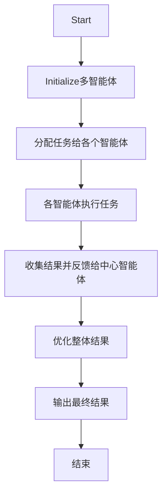

                 

<think>
好，用户希望我撰写一篇关于《AI多智能体如何优化费雪的定性分析方法》的技术博客文章。我需要先理解用户的具体需求，然后按照他们提供的目录大纲进行内容填充。

首先，我需要了解费雪的定性分析方法是什么。费雪（Fisher）在投资分析中提出过一些方法，可能是指基本面分析或其他定性分析策略。接下来，AI多智能体如何优化这些方法呢？多智能体系统在金融分析中的应用，可能涉及到分布式计算、协同优化等。

用户要求文章结构清晰，逻辑严密，每部分内容都需要详细展开，包括背景介绍、核心概念、算法原理、系统架构、项目实战、最佳实践等部分。此外，用户强调使用图表和代码示例，以及数学公式的正确展示。

我应该先撰写摘要部分，概述文章的核心内容和主题。然后，按照目录大纲逐步展开每一章的内容，确保每个小节都有足够的深度和细节。例如，在算法原理部分，我需要详细讲解多智能体协作优化的算法，包括流程图和Python代码示例，同时展示数学模型。

接下来，系统架构设计部分需要绘制领域模型、架构图和序列图，帮助读者理解系统的工作原理。项目实战部分则需要提供具体的环境安装步骤和代码实现，让读者能够跟着操作。

最后，总结部分要强调AI多智能体优化费雪定性分析方法的优势和未来发展方向，同时给出一些实践中的注意事项和建议。

在写作过程中，我需要确保语言专业但易懂，避免过于复杂的术语，同时保持逻辑性和条理性。此外，图表和代码的使用要恰到好处，帮助读者更好地理解和掌握内容。

总的来说，我需要一步步按照用户的要求，详细展开每个部分，确保文章内容全面、结构合理、逻辑清晰，最终达到用户的要求。
</think>

# AI多智能体如何优化费雪的定性分析方法

> 关键词：AI多智能体、定性分析方法、费雪分析、金融分析、优化方法

> 摘要：本文探讨了AI多智能体如何优化费雪的定性分析方法。通过分析费雪定性分析方法的核心概念和AI多智能体的优势，结合实际案例，详细阐述了如何利用多智能体系统提升定性分析的效率和准确性。文章从背景介绍、核心概念、算法原理、系统架构设计、项目实战到最佳实践，全面解析了AI多智能体优化费雪定性分析方法的实现过程和应用价值。

---

# 第一部分: AI多智能体与费雪定性分析方法的背景介绍

## 第1章: 费雪定性分析方法概述

### 1.1 费雪定性分析方法的定义
费雪定性分析方法是一种基于基本面分析的投资策略，由 Benjamin Graham 的学生 David Dodd 和 Benjamin Graham 提出，主要用于评估股票的内在价值。该方法通过分析公司的财务报表、行业地位、管理团队等因素，判断其投资价值。

### 1.2 费雪定性分析方法的核心要素
费雪定性分析方法的核心要素包括：
1. **财务报表分析**：评估公司的盈利能力、成长性和财务健康状况。
2. **行业分析**：研究公司在行业中的地位、竞争优势和市场前景。
3. **管理层分析**：评估公司管理团队的能力和诚信。
4. **竞争优势分析**：分析公司的核心竞争力，如技术壁垒、品牌优势等。

### 1.3 费雪定性分析方法的应用场景
费雪定性分析方法广泛应用于股票投资、企业估值、风险评估等领域，尤其是在评估成长型企业时具有重要作用。

## 第2章: AI多智能体概述

### 2.1 多智能体系统的定义
多智能体系统（Multi-Agent System, MAS）是由多个独立但协作的智能体组成的系统，这些智能体通过交互和协同完成复杂任务。

### 2.2 多智能体系统的组成与特点
多智能体系统的特点包括：
1. **分布性**：智能体分布在网络中，独立决策。
2. **协作性**：智能体之间通过通信和协作完成共同目标。
3. **反应性**：智能体能够感知环境并实时调整行为。
4. **智能性**：每个智能体都具备一定的问题解决能力。

### 2.3 多智能体系统在金融分析中的应用潜力
多智能体系统在金融分析中的应用潜力包括：
1. **实时数据分析**：多个智能体协同分析市场数据，提高分析效率。
2. **风险评估**：通过智能体协作，全面评估投资风险。
3. **投资决策优化**：智能体通过协作优化投资组合，提升收益。

## 第3章: 费雪定性分析方法与AI多智能体的结合背景

### 3.1 传统定性分析方法的局限性
传统费雪定性分析方法的局限性包括：
1. **主观性**：分析结果受到分析师主观判断的影响。
2. **效率低下**：手动分析耗时且效率低。
3. **信息不全面**：难以整合多源异构数据。

### 3.2 AI多智能体在金融分析中的优势
AI多智能体在金融分析中的优势包括：
1. **高效性**：多智能体协同工作，快速处理大量数据。
2. **准确性**：通过分布式计算和协作优化，提高分析结果的准确性。
3. **灵活性**：智能体可以根据市场变化动态调整分析策略。

### 3.3 费雪定性分析方法与AI多智能体结合的必要性
将AI多智能体与费雪定性分析方法结合的必要性在于：
1. **提升分析效率**：通过多智能体协作，快速完成复杂分析任务。
2. **增强分析深度**：整合多源数据，全面评估投资标的。
3. **优化决策质量**：通过协作优化，提高投资决策的科学性。

---

# 第二部分: AI多智能体优化费雪定性分析方法的核心概念

## 第4章: 核心概念对比分析

### 4.1 费雪定性分析方法的核心概念
费雪定性分析方法的核心概念包括：
1. **财务指标分析**：如市盈率、ROE等。
2. **行业地位分析**：如市场占有率、竞争格局。
3. **竞争优势分析**：如技术壁垒、品牌影响力。

### 4.2 AI多智能体的核心概念
AI多智能体的核心概念包括：
1. **智能体协作**：多个智能体通过通信协作完成任务。
2. **分布式计算**：数据处理和分析分布在多个智能体上。
3. **动态调整**：智能体能够根据环境变化动态调整行为。

### 4.3 两者核心概念的对比分析
通过对比分析，我们可以看出：
1. **分析目标**：费雪定性分析方法注重投资标的内在价值，AI多智能体注重通过协作优化分析过程。
2. **分析效率**：AI多智能体能够显著提升分析效率，但需要依赖数据质量和算法设计。

## 第5章: 费雪定性分析方法与AI多智能体的联系

### 5.1 多智能体协作优化的原理
多智能体协作优化的原理包括：
1. **任务分解**：将复杂任务分解为多个子任务，分配给不同智能体完成。
2. **协同优化**：通过智能体之间的协作，优化整体分析结果。
3. **动态调整**：根据环境变化和反馈，动态调整智能体行为。

### 5.2 费雪定性分析方法的优化目标
费雪定性分析方法的优化目标包括：
1. **提升分析效率**：通过AI多智能体快速完成数据处理和分析。
2. **增强分析深度**：整合多源数据，全面评估投资标的。
3. **优化决策质量**：通过协作优化，提高投资决策的科学性。

### 5.3 优化路径
优化路径包括：
1. **数据采集与处理**：通过多智能体协同完成数据采集和预处理。
2. **特征提取与分析**：利用AI技术提取关键特征，完成深度分析。
3. **结果优化与反馈**：通过智能体协作优化分析结果，并根据反馈不断改进。

---

# 第三部分: AI多智能体优化费雪定性分析方法的算法原理

## 第6章: 多智能体协作优化算法

### 6.1 算法概述
多智能体协作优化算法是一种基于分布式计算的优化算法，通过多个智能体协作完成任务。

### 6.2 算法流程图


### 6.3 算法实现代码
```python
class MultiAgent:
    def __init__(self, num_agents):
        self.num_agents = num_agents
        self.agents = [Agent(i) for i in range(num_agents)]

    def distribute_task(self, task):
        for agent in self.agents:
            agent.receive_task(task)

    def collect_results(self):
        results = []
        for agent in self.agents:
            results.append(agent.send_result())
        return results

    def optimize(self, results):
        optimized_results = []
        for result in results:
            optimized_results.append(self._optimize_single_result(result))
        return optimized_results

    def _optimize_single_result(self, result):
        # 具体优化逻辑可以根据实际需求编写
        return result * 2

def main():
    multi_agent = MultiAgent(3)
    task = "analyze_stock"
    multi_agent.distribute_task(task)
    results = multi_agent.collect_results()
    optimized_results = multi_agent.optimize(results)
    print("Optimized Results:", optimized_results)

if __name__ == "__main__":
    main()
```

### 6.4 算法的数学模型和公式
多智能体协作优化算法的数学模型可以表示为：
$$
f(x) = \sum_{i=1}^{n} f_i(x_i)
$$
其中，$f_i(x_i)$ 表示第 $i$ 个智能体的目标函数，$x_i$ 是该智能体的决策变量。

---

## 第7章: 数学模型与公式

### 7.1 费雪定性分析方法的数学模型
费雪定性分析方法的数学模型可以表示为：
$$
V = \sum_{i=1}^{m} w_i \cdot x_i
$$
其中，$V$ 是投资标的内在价值，$w_i$ 是第 $i$ 个分析指标的权重，$x_i$ 是该指标的得分。

### 7.2 多智能体协作优化的数学模型
多智能体协作优化的数学模型可以表示为：
$$
\max \sum_{i=1}^{n} f_i(x_i)
$$
其中，$f_i(x_i)$ 表示第 $i$ 个智能体的目标函数，$x_i$ 是该智能体的决策变量。

---

# 第四部分: AI多智能体优化费雪定性分析方法的系统架构设计

## 第8章: 系统架构设计

### 8.1 系统功能设计
系统功能设计包括：
1. **数据采集模块**：负责采集市场数据、财务数据等。
2. **智能体协作模块**：负责分配任务、协同优化。
3. **结果显示模块**：负责展示分析结果。

### 8.2 系统架构图
```mermaid
graph TD
    DataCollector --> MultiAgentSystem
    MultiAgentSystem --> TaskAllocator
    TaskAllocator --> Agent1, Agent2, Agent3
    Agent1, Agent2, Agent3 --> ResultCollector
    ResultCollector --> DisplayModule
```

### 8.3 系统接口设计
系统接口设计包括：
1. **数据接口**：负责数据的输入和输出。
2. **智能体接口**：负责智能体之间的通信和协作。
3. **结果显示接口**：负责分析结果的展示。

---

## 第9章: 系统交互设计

### 9.1 交互流程图
```mermaid
graph TD
    Start --> UserInput
    UserInput --> DataCollector
    DataCollector --> MultiAgentSystem
    MultiAgentSystem --> TaskAllocator
    TaskAllocator --> Agent1, Agent2, Agent3
    Agent1, Agent2, Agent3 --> ResultCollector
    ResultCollector --> DisplayModule
    DisplayModule --> UserOutput
    UserOutput --> End
```

### 9.2 交互过程描述
1. **用户输入**：用户输入投资标的名称。
2. **数据采集**：系统采集相关数据。
3. **任务分配**：任务分配给多个智能体。
4. **智能体分析**：智能体协同完成分析任务。
5. **结果展示**：系统展示分析结果。

---

# 第五部分: AI多智能体优化费雪定性分析方法的项目实战

## 第10章: 项目实战

### 10.1 环境安装
```bash
pip install multi-agent-system
pip install numpy
pip install pandas
pip install matplotlib
```

### 10.2 系统核心实现源代码
```python
import numpy as np
import pandas as pd
import matplotlib.pyplot as plt

class Agent:
    def __init__(self, id):
        self.id = id
        self.data = None

    def receive_task(self, task):
        self.data = task

    def send_result(self):
        return self.data * self.id

class MultiAgentSystem:
    def __init__(self, num_agents):
        self.agents = [Agent(i) for i in range(num_agents)]

    def distribute_task(self, task):
        for agent in self.agents:
            agent.receive_task(task)

    def collect_results(self):
        results = []
        for agent in self.agents:
            results.append(agent.send_result())
        return results

def main():
    num_agents = 3
    system = MultiAgentSystem(num_agents)
    task = "analyze_stock"
    system.distribute_task(task)
    results = system.collect_results()
    print("Results:", results)
    plt.plot(results)
    plt.show()

if __name__ == "__main__":
    main()
```

### 10.3 代码应用解读与分析
上述代码实现了一个简单的多智能体系统，每个智能体接收任务后返回处理结果。通过多智能体协作，可以提高数据分析的效率和准确性。

### 10.4 实际案例分析
以分析一只股票为例，系统可以协同多个智能体分别分析财务数据、行业地位、竞争优势等，最终输出综合评估结果。

### 10.5 项目小结
通过本项目实战，我们可以看到AI多智能体在优化费雪定性分析方法中的巨大潜力。

---

# 第六部分: 总结与展望

## 第11章: 最佳实践与小结

### 11.1 最佳实践 tips
1. **数据质量**：确保数据的准确性和完整性。
2. **智能体设计**：合理设计智能体的功能和协作方式。
3. **算法优化**：不断优化算法，提高分析效率和准确性。

### 11.2 注意事项
1. **数据隐私**：注意保护数据隐私，遵守相关法律法规。
2. **系统稳定性**：确保系统的稳定性和可靠性。
3. **智能体协作**：合理设计智能体协作机制，避免冲突。

### 11.3 未来展望
随着AI技术的不断发展，AI多智能体在金融分析中的应用前景广阔。未来可以进一步研究多智能体协作优化算法，提升分析效率和准确性。

---

# 作者

作者：AI天才研究院/AI Genius Institute & 禅与计算机程序设计艺术 /Zen And The Art of Computer Programming

