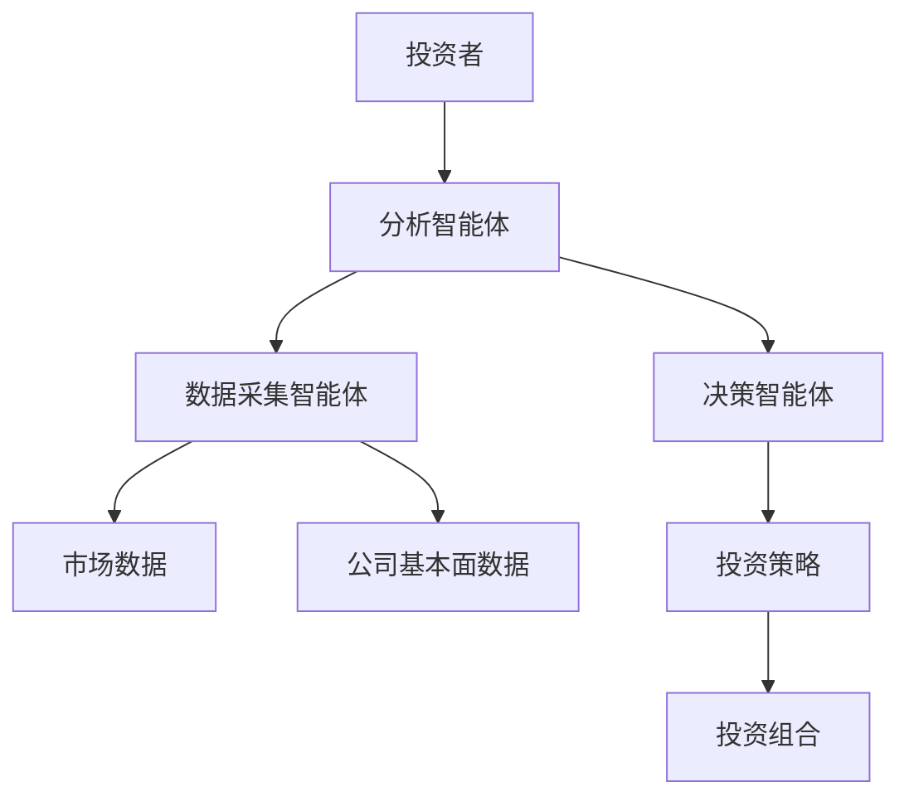
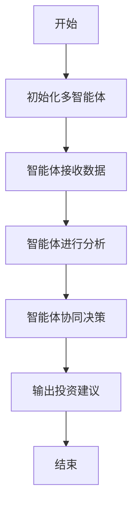
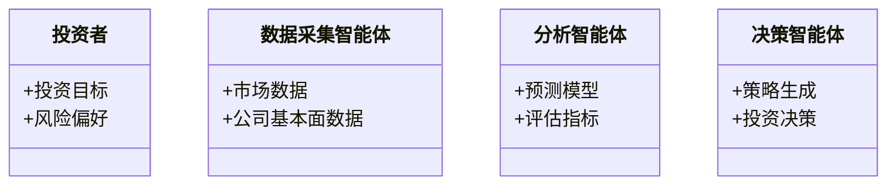
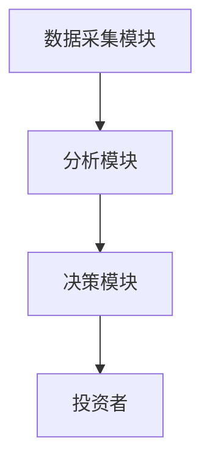
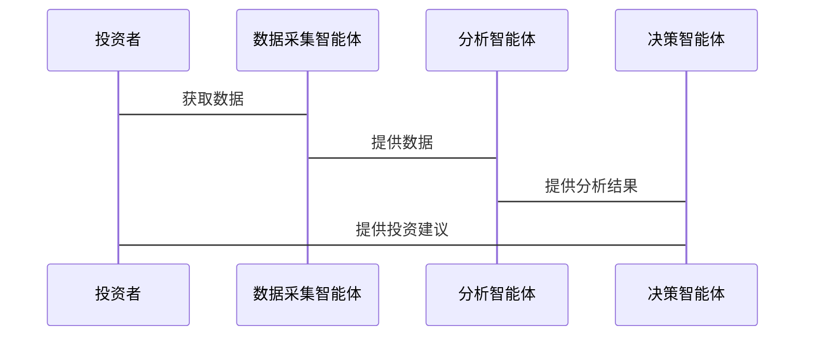

                 


# AI多智能体如何提升价值投资的规模化和个性化

> 关键词：AI多智能体、价值投资、规模化、个性化、投资决策、算法协同

> 摘要：本文深入探讨了AI多智能体在价值投资中的应用，分析了其如何通过协同合作提升投资决策的效率和精准度。文章从背景、核心概念、算法原理、系统设计、项目实战等多个维度展开，结合实例和公式推导，详细阐述了AI多智能体如何实现价值投资的规模化和个性化，为投资者和科技从业者提供了深刻的见解和实用的技术方案。

---

## 第1章: 价值投资与AI多智能体概述

### 1.1 价值投资的基本概念

#### 1.1.1 价值投资的定义与核心理念
价值投资是一种以基本面分析为基础的投资策略，旨在通过识别市场中被低估的资产，长期持有以实现超额收益。其核心理念包括：
- **安全边际**：买入价格低于内在价值。
- **长期视角**：关注企业的长期盈利能力。
- **逆向思维**：在市场恐慌时寻找机会。

#### 1.1.2 价值投资的核心要素
- **内在价值**：企业未来现金流的现值。
- **竞争优势**：企业的护城河，如专利、品牌、成本优势等。
- **管理团队**：企业的管理层能力和战略规划。

#### 1.1.3 价值投资的挑战与局限性
- 数据量大：需要处理海量的市场数据和企业基本面数据。
- 决策复杂：涉及多维度的分析和判断。
- 市场波动：短期波动可能掩盖长期价值。

### 1.2 AI多智能体的基本概念

#### 1.2.1 多智能体系统的定义
多智能体系统是由多个相互作用的智能体组成的系统，每个智能体都有自己的目标和决策机制，通过协同完成复杂任务。

#### 1.2.2 多智能体系统的特征
- **分布式**：智能体独立决策，协同完成任务。
- **动态性**：系统状态随智能体交互而变化。
- **协作性**：智能体通过信息共享实现协同。

#### 1.2.3 多智能体系统与传统AI的区别
- **单智能体**：单个AI系统完成任务。
- **多智能体**：多个AI系统协同完成任务，适用于复杂环境。

### 1.3 价值投资与AI多智能体的结合

#### 1.3.1 价值投资中引入AI多智能体的意义
- **提升效率**：通过分布式计算和协同分析，加快投资决策速度。
- **降低风险**：多个智能体从不同角度分析，减少误判风险。
- **增强个性化**：根据投资者需求定制策略。

#### 1.3.2 AI多智能体如何提升价值投资的效率
- **数据处理**：多个智能体分别处理不同数据源，提高效率。
- **协同分析**：智能体协同完成多维度分析，提供全面决策支持。
- **实时反馈**：智能体实时更新数据，提供动态投资建议。

#### 1.3.3 AI多智能体在价值投资中的应用场景
- **市场监控**：实时监控市场动态，发现投资机会。
- **风险评估**：通过协同分析评估投资风险。
- **策略优化**：根据市场变化优化投资策略。

---

## 第2章: AI多智能体的核心概念与联系

### 2.1 核心概念原理

#### 2.1.1 多智能体系统的协同机制
- **通信机制**：智能体之间通过消息传递共享信息。
- **协作机制**：通过任务分配和协同决策完成目标。
- **协调机制**：通过仲裁和协商解决冲突。

#### 2.1.2 价值投资中的多智能体角色分配
- **数据采集智能体**：负责收集市场数据和公司基本面数据。
- **分析智能体**：负责对数据进行分析和预测。
- **决策智能体**：负责制定投资策略和决策。

#### 2.1.3 多智能体系统的决策模型
- **分布式决策**：每个智能体独立决策，再通过协同完成任务。
- **集中式决策**：由中心智能体统一决策，其他智能体执行。

### 2.2 核心概念属性特征对比

| 属性          | 单智能体             | 多智能体             |
|---------------|---------------------|---------------------|
| 决策方式      | 集中式决策           | 分布式决策           |
| 处理能力      | 单一处理能力         | 多维度处理能力       |
| 可扩展性      | 较低                 | 较高                 |
| 并行性        | 较低                 | 高                  |

### 2.3 ER实体关系图架构



---

## 第3章: AI多智能体的算法原理

### 3.1 算法原理讲解

#### 3.1.1 多智能体协同算法的概述
多智能体协同算法通过分布式计算和强化学习实现智能体之间的协同。

#### 3.1.2 基于强化学习的多智能体协同
- **目标函数**：最大化团队收益。
- **动作空间**：每个智能体可执行的动作。
- **奖励机制**：根据团队收益分配奖励。

#### 3.1.3 基于分布式计算的多智能体协同
- **任务分配**：智能体根据自身能力分配任务。
- **数据共享**：智能体之间共享数据和信息。
- **协同决策**：智能体协同完成决策任务。

### 3.2 算法流程图



### 3.3 数学模型与公式

#### 3.3.1 多智能体协同的数学模型
$$ V(s) = \max_{a} \sum_{t=0}^{\infty} \gamma^t r(s_t, a_t) $$
其中：
- \( V(s) \)：状态 \( s \) 的价值函数。
- \( a \)：动作。
- \( r \)：奖励函数。
- \( \gamma \)：折扣因子。

#### 3.3.2 价值投资预测公式
$$ P_{\text{预测}} = \sum_{t=1}^{n} \frac{C_t}{(1 + r)^t} $$
其中：
- \( P_{\text{预测}} \)：预测的内在价值。
- \( C_t \)：未来现金流。
- \( r \)：折现率。

---

## 第4章: 系统分析与架构设计

### 4.1 系统功能设计

#### 4.1.1 功能模块
- **数据采集模块**：收集市场数据和公司基本面数据。
- **分析模块**：对数据进行预测和评估。
- **决策模块**：制定投资策略。

#### 4.1.2 领域模型



### 4.2 系统架构设计

#### 4.2.1 分层架构
- **数据层**：数据采集和存储。
- **算法层**：分析和决策。
- **应用层**：用户交互和结果展示。

#### 4.2.2 架构图



### 4.3 系统接口设计

#### 4.3.1 接口描述
- **数据接口**：提供市场数据和公司数据的接口。
- **分析接口**：提供预测和评估的接口。
- **决策接口**：提供投资策略的接口。

#### 4.3.2 交互流程图



---

## 第5章: 项目实战

### 5.1 环境安装

#### 5.1.1 安装Python和相关库
```bash
pip install numpy pandas scikit-learn tensorflow
```

#### 5.1.2 安装依赖项
```bash
pip install matplotlib keras
```

### 5.2 核心代码实现

#### 5.2.1 数据采集智能体

```python
import pandas as pd
import requests

def get_market_data(ticker):
    url = f"https://api.example.com/stock/{ticker}"
    response = requests.get(url)
    return pd.DataFrame(response.json())
```

#### 5.2.2 分析智能体

```python
from sklearn import linear_model

def predict_price(data):
    model = linear_model.LinearRegression()
    model.fit(data[['PE', 'PB', 'PS']], data['Price'])
    return model.predict(data[['PE', 'PB', 'PS']])
```

#### 5.2.3 决策智能体

```python
import numpy as np

def make_decision(predicted_prices, threshold=0.1):
    return predicted_prices > (data['Price'].mean() * (1 + threshold))
```

### 5.3 案例分析

#### 5.3.1 实际案例

```python
data = get_market_data("AAPL")
predicted_prices = predict_price(data)
decision = make_decision(predicted_prices)
print("投资建议:", "买入" if decision else "卖出")
```

#### 5.3.2 优化策略

```python
# 根据风险偏好调整阈值
threshold = 0.15
decision = make_decision(predicted_prices, threshold)
print("优化后的投资建议:", "买入" if decision else "卖出")
```

### 5.4 项目小结

- **优势**：通过多智能体协同，实现了高效的投资决策。
- **不足**：需要不断优化模型和策略。
- **改进方向**：引入更多数据源和分析方法。

---

## 第6章: 总结与展望

### 6.1 总结

本文详细探讨了AI多智能体在价值投资中的应用，通过理论分析和实际案例，展示了其如何提升投资决策的效率和精准度。AI多智能体通过协同合作，实现了价值投资的规模化和个性化。

### 6.2 展望

未来，随着AI技术的不断发展，AI多智能体在价值投资中的应用将更加广泛。可以通过引入更多数据源、优化算法和模型，进一步提升投资决策的效率和准确性。

---

## 作者：AI天才研究院 & 禅与计算机程序设计艺术

---

**附录**：完整代码示例、数据源说明、进一步优化建议等。

