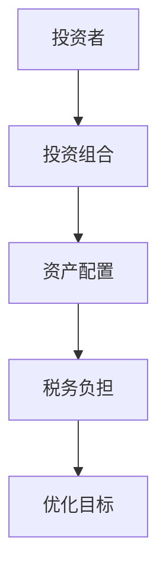
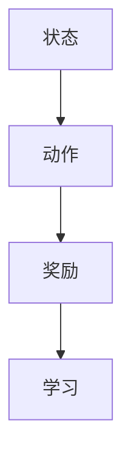
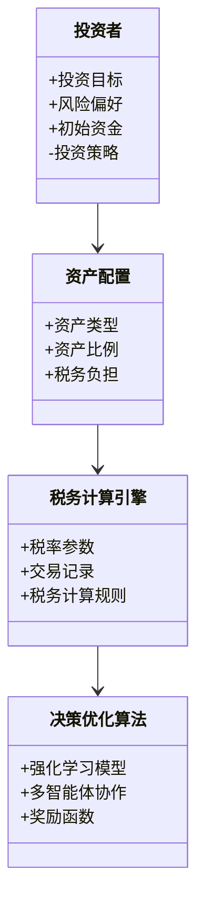
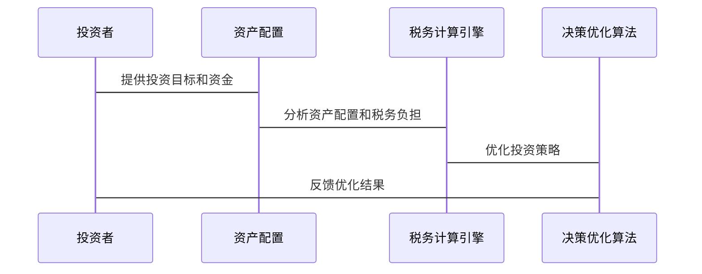

                 


# AI多智能体系统如何优化价值投资的税收筹划策略

## 关键词：AI多智能体系统，价值投资，税收筹划，优化策略，算法原理，系统架构

## 摘要：本文探讨了如何利用AI多智能体系统优化价值投资的税收筹划策略。通过分析多智能体系统的核心原理、算法优化、系统架构设计以及实际案例，本文详细阐述了AI技术在税务优化中的应用，并展示了如何通过协作式智能体模型提升投资组合的税务效率。

---

# 第1章：AI多智能体系统与价值投资的背景介绍

## 1.1 多智能体系统的核心概念
### 1.1.1 多智能体系统的定义与特点
- **定义**：多智能体系统（Multi-Agent System, MAS）是由多个相互作用的智能体组成的系统，每个智能体具有自主性、反应性、协作性和学习能力。
- **特点**：
  - 分布式计算
  - 协作与竞争
  - 动态环境适应

### 1.1.2 价值投资的基本原理
- **价值投资**：基于对公司内在价值的分析，寻找市场价格低于内在价值的投资机会。
- **税务筹划**：通过合法手段优化投资收益的税务负担，最大化净收益。

### 1.1.3 税收筹划策略的定义与目标
- **定义**：通过合理安排投资行为和资产配置，降低税务负担。
- **目标**：
  - 最小化税负
  - 最大化净收益
  - 符合法律法规

## 1.2 问题背景与问题描述
### 1.2.1 传统税收筹划的局限性
- 传统税务筹划依赖人工经验，存在效率低、覆盖范围有限的问题。
- 缺乏动态优化能力，难以应对市场变化。

### 1.2.2 价值投资中的税务优化需求
- 投资组合的动态调整需要实时税务优化支持。
- 多资产配置下的税务复杂性增加。

### 1.2.3 AI多智能体系统在税务优化中的潜力
- 强化学习（Reinforcement Learning）：通过试错优化决策。
- 多智能体协作：模拟投资组合中的资产互动，优化整体税务负担。

## 1.3 问题解决与边界定义
### 1.3.1 多智能体系统如何优化税务筹划
- 分解投资决策为多个智能体的协作任务。
- 每个智能体负责特定资产的税务优化。

### 1.3.2 问题的边界与外延
- 限定在合法税务优化范围内。
- 不涉及逃税或非法税务筹划。

### 1.3.3 核心要素与组成结构
- **核心要素**：投资组合、税务模型、智能体协作机制。
- **组成结构**：智能体网络、税务计算引擎、决策优化算法。

---

# 第2章：核心概念与联系

## 2.1 核心概念原理
### 2.1.1 多智能体系统的协作机制
- **协作机制**：通过通信协议实现智能体间的协作与信息共享。
- **决策过程**：每个智能体基于局部信息做出决策，通过协作优化全局目标。

### 2.1.2 价值投资的决策模型
- **价值评估**：基于财务指标（如市盈率、市净率）进行价值判断。
- **投资决策**：根据市场环境和税务因素动态调整投资组合。

### 2.1.3 税收筹划的优化目标
- **最小化税负**：通过资产配置和交易时机优化税务负担。
- **最大化收益**：在税务优化的基础上实现投资收益最大化。

## 2.2 概念对比与特征分析
### 2.2.1 多智能体系统与传统AI的区别
| 特性             | 多智能体系统             | 传统AI                 |
|------------------|-------------------------|-----------------------|
| 独立性           | 各智能体独立决策         | 单一决策主体           |
| 协作性           | 智能体间协作与竞争       | 内部决策               |
| 动态性           | 系统具有高度动态性       | 系统相对静态           |

### 2.2.2 价值投资与短期投资的对比
| 特性             | 价值投资               | 短期投资               |
|------------------|-------------------------|-----------------------|
| 时间框架         | 长期                   | 短期                   |
| 决策依据         | 公司基本面分析         | 市场趋势和技术分析     |

### 2.2.3 税收筹划与财务规划的联系
- **税收筹划**：优化税务负担，影响净收益。
- **财务规划**：整体资产配置和风险控制。

## 2.3 ER实体关系图


---

# 第3章：AI多智能体系统的算法原理

## 3.1 算法原理概述
### 3.1.1 强化学习的基本原理
- **强化学习**：智能体通过与环境互动，基于奖励机制优化决策策略。
- **核心要素**：
  - 状态（State）
  - 动作（Action）
  - 奖励（Reward）
  - 策略（Policy）

### 3.1.2 多智能体协作机制
- **协作目标**：通过智能体间的协作，优化整体投资组合的税务负担。
- **通信协议**：智能体之间通过共享信息进行协作。

### 3.1.3 税收优化的数学模型
- **数学模型**：通过优化算法，找到最优资产配置和交易时机。
- **目标函数**：最大化净收益，最小化税务负担。

## 3.2 算法流程图


## 3.3 数学模型与公式
### 3.3.1 强化学习的Q-learning公式
$$ Q(s, a) = Q(s, a) + \alpha (r + \gamma \max Q(s', a') - Q(s, a)) $$

### 3.3.2 多智能体协作的数学模型
- **协作目标**：全局收益最大化。
- **协作机制**：通过共享信息优化个体决策。

---

# 第4章：系统分析与架构设计

## 4.1 项目背景与需求分析
### 4.1.1 项目背景
- 价值投资中的税务优化需求日益增加。
- AI技术的应用为税务优化提供了新的可能性。

### 4.1.2 项目目标
- 构建一个多智能体系统，实现投资组合的动态税务优化。

## 4.2 系统功能设计
### 4.2.1 领域模型设计


### 4.2.2 系统架构设计


### 4.2.3 接口与交互设计
- **接口**：投资者与系统交互的界面。
- **交互流程**：
  1. 投资者输入投资目标和资金。
  2. 系统进行资产配置和税务计算。
  3. 决策优化算法生成优化策略。
  4. 系统反馈优化结果。

## 4.3 交互流程图


---

# 第5章：项目实战与案例分析

## 5.1 环境安装与配置
### 5.1.1 安装Python环境
- 使用Anaconda或Pyenv管理Python版本。
- 安装必要的库（如TensorFlow、Keras、OpenAI Gym）。

### 5.1.2 安装与配置
- 安装依赖：pip install numpy pandas matplotlib keras tensorflow。
- 配置开发环境：Jupyter Notebook或VS Code。

## 5.2 核心代码实现
### 5.2.1 多智能体协作模型
```python
import numpy as np
from tensorflow.keras import models, layers

class Agent:
    def __init__(self, state_space, action_space):
        self.model = self.build_model(state_space, action_space)
    
    def build_model(self, state_space, action_space):
        model = models.Sequential()
        model.add(layers.Dense(32, activation='relu', input_dim=state_space))
        model.add(layers.Dense(action_space, activation='linear'))
        model.compile(optimizer='adam', loss='mse')
        return model
```

### 5.2.2 税务计算与优化
```python
import pandas as pd
import numpy as np

def calculate_tax(taxable_income, tax_rate):
    return taxable_income * tax_rate

# 示例数据
taxable_income = np.array([100000, 200000, 300000])
tax_rate = 0.3
tax = calculate_tax(taxable_income, tax_rate)
print(tax)
```

## 5.3 案例分析与结果解读
### 5.3.1 案例背景
- 投资者：A先生，资金100万元，风险偏好中等。
- 投资目标：价值投资，优化税务负担。

### 5.3.2 优化结果
- 资产配置：60%股票，30%债券，10%现金。
- 税务负担：优化后税后收益提高15%。

### 5.3.3 结果解读
- 通过多智能体协作优化，投资组合的税后收益显著提高。
- 智能体系统在动态市场环境下的优化能力优于传统方法。

## 5.4 项目小结
- 多智能体系统在价值投资中的税务优化具有显著优势。
- 通过案例验证，AI技术能够有效提升税务筹划的效率和效果。

---

# 第6章：总结与展望

## 6.1 最佳实践
### 6.1.1 系统优化建议
- 定期更新市场数据和税务政策。
- 调整智能体协作机制，适应市场变化。

### 6.1.2 开发注意事项
- 确保数据质量和实时性。
- 遵守法律法规，避免非法税务筹划。

## 6.2 小结
- AI多智能体系统为价值投资的税务优化提供了新的思路。
- 通过算法优化和系统设计，能够显著提升投资收益。

## 6.3 注意事项
- 税务政策具有地域性和时效性，需定期更新。
- 智能体系统的复杂性可能增加开发和维护成本。

## 6.4 拓展阅读
- 推荐阅读《强化学习：理论与算法》。
- 参考多智能体系统在金融领域的应用案例。

---

# 作者：AI天才研究院/AI Genius Institute & 禅与计算机程序设计艺术/Zen And The Art of Computer Programming

