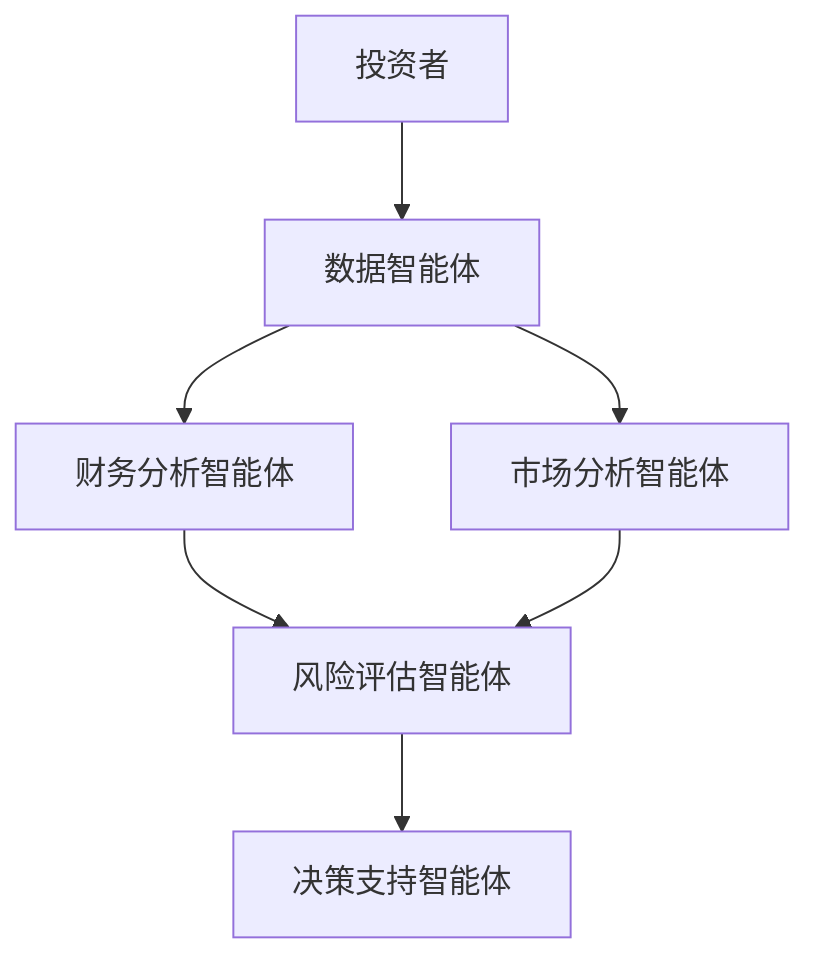
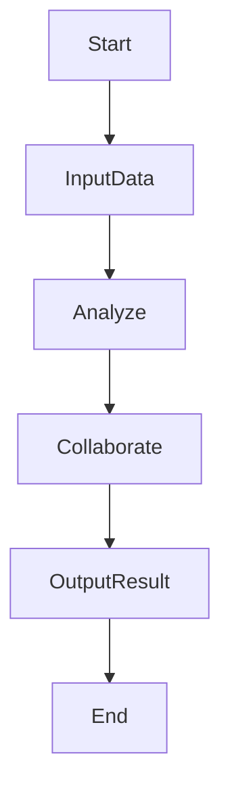

                 

<think>
好的，我现在需要帮助用户撰写一篇关于《AI多智能体系统如何改进传统的价值投资尽职调查流程》的技术博客文章。用户已经提供了一个详细的目录大纲，并要求我按照这个大纲来撰写文章。首先，我需要仔细阅读用户的需求，确保完全理解每个部分的要求。

用户希望文章结构清晰，逻辑紧凑，语言专业，同时使用一步一步的分析推理方式。关键词包括：AI多智能体系统、价值投资、尽职调查、投资决策、风险管理、智能化升级。摘要部分需要简明扼要地概括文章的核心内容。

接下来，我会按照目录大纲逐步撰写每个章节。第一部分是背景介绍与核心概念，包括传统价值投资、多智能体系统的基本概念，以及它们的结合意义。这里需要确保定义清晰，问题背景明确，研究意义突出。

第二部分详细探讨AI多智能体系统的原理，包括组成、协作机制，以及通过实体关系图和算法流程图展示系统结构。这部分需要使用Mermaid图来辅助说明，确保读者能够直观理解。

第三部分分析传统尽职调查流程的优缺点，并介绍AI多智能体系统的改进方向。这里需要对比传统方法和AI方法的差异，突出AI的优势。

第四部分涉及系统架构设计，包括功能模块、架构图、接口设计和交互流程。使用Mermaid图来展示系统架构，帮助读者理解系统结构。

第五部分详细讲解算法实现，包括数学模型和Python代码示例。这里需要确保公式正确，代码清晰，便于读者理解和应用。

第六部分是项目实战，从环境安装到案例分析，确保读者能够实际操作，理解AI多智能体系统在实际中的应用。

最后，总结与展望部分回顾文章内容，并展望未来的发展方向。同时，给出最佳实践的建议和注意事项，帮助读者更好地应用这些知识。

在撰写过程中，我需要确保每个部分都详细具体，涵盖理论与实践，同时保持语言的专业性和逻辑性。此外，注意使用LaTeX公式和Mermaid图，使文章更具可读性和专业性。

现在，我将按照上述思考过程，逐步撰写每个章节，确保满足用户的所有要求，并提供高质量的内容。
</think>

# AI多智能体系统如何改进传统的价值投资尽职调查流程

**关键词**：AI多智能体系统、价值投资、尽职调查、投资决策、风险管理、智能化升级

**摘要**：本文详细探讨了AI多智能体系统如何改进传统的价值投资尽职调查流程。通过分析传统尽职调查的痛点，提出了基于AI多智能体系统的解决方案，并详细阐述了系统的架构设计、算法实现及实际应用案例。文章旨在为投资专业人士提供一种更高效、更精准的投资决策支持工具。

---

## 第一部分：AI多智能体系统与价值投资尽职调查的结合

### 第1章：背景介绍与核心概念

#### 1.1 价值投资与尽职调查的基本概念

##### 1.1.1 价值投资的定义与核心理念
价值投资是一种以内在价值为导向的投资策略，旨在通过分析企业的基本面，寻找市场价格低于其内在价值的投资标的。其核心理念包括：
- **长期投资**：关注企业的长期发展潜力。
- **安全边际**：确保投资价格低于企业的内在价值。
- **逆向思维**：在市场恐慌时寻找低估的机会。

##### 1.1.2 尽职调查的定义与传统流程
尽职调查是投资前对目标企业进行详细调查的过程，旨在评估其财务状况、经营风险和市场前景。传统尽职调查流程通常包括以下几个步骤：
1. **数据收集**：收集目标企业的财务报表、市场数据等。
2. **初步分析**：对收集的数据进行基本的财务分析和行业分析。
3. **深入调查**：对目标企业进行实地考察，与管理层和相关人员访谈。
4. **风险评估**：识别潜在风险并制定应对策略。
5. **投资决策支持**：基于分析结果，为投资决策提供支持。

##### 1.1.3 传统尽职调查的局限性
尽管传统尽职调查流程在一定程度上支持了投资决策，但其仍存在以下问题：
- **效率低下**：数据收集和分析耗时耗力。
- **主观性较强**：依赖分析师的经验和判断，存在人为误差。
- **信息不全**：难以覆盖多维度数据，尤其是非结构化数据。

#### 1.2 AI多智能体系统的定义与特点

##### 1.2.1 多智能体系统的定义
多智能体系统（Multi-Agent System, MAS）是由多个相互作用的智能体组成的系统，每个智能体都能独立感知环境、自主决策并执行任务。

##### 1.2.2 AI多智能体系统的独特优势
AI多智能体系统结合了人工智能和多智能体系统的优势，具有以下特点：
- **分布式计算**：智能体之间可以并行处理任务，提升效率。
- **协作能力强**：智能体之间可以协同工作，实现复杂任务的分解与协作。
- **自适应性**：系统能够根据环境变化动态调整策略。

##### 1.2.3 多智能体系统与传统AI的区别
| **维度** | **传统AI** | **多智能体系统（MAS）** |
|----------|------------|-------------------------|
| 结构     | 单一智能体  | 多个智能体协同工作      |
| 任务     | 独立任务    | 复杂任务分解与协作     |
| 交互     | 单向输入输出| 智能体间动态交互       |
| 并行性   | 串行处理    | 并行处理，提升效率      |

#### 1.3 问题背景与研究意义

##### 1.3.1 传统价值投资尽职调查的痛点
- 数据收集与分析效率低下。
- 分析结果的主观性较强，难以保证准确性。
- 风险评估不够全面，难以覆盖多维度风险。

##### 1.3.2 AI多智能体系统如何解决这些问题
AI多智能体系统可以通过以下方式改进传统尽职调查流程：
- **自动化数据处理**：智能体可以自动收集和处理多源数据。
- **分布式协作分析**：多个智能体协同工作，提升分析效率和准确性。
- **动态风险评估**：系统可以实时监控市场变化，动态调整风险评估结果。

##### 1.3.3 研究的价值与意义
本文的研究旨在为价值投资提供一种更高效、更精准的决策支持工具，通过AI多智能体系统的引入，提升尽职调查的效率和准确性，降低投资风险。

---

### 第2章：AI多智能体系统的原理与核心概念

#### 2.1 多智能体系统的原理

##### 2.1.1 多智能体系统的组成与功能
多智能体系统由以下几部分组成：
- **智能体（Agent）**：能够感知环境、自主决策并执行任务的实体。
- **环境（Environment）**：智能体所处的外部环境，包括数据源、目标企业等。
- **通信机制（Communication）**：智能体之间进行信息交互的渠道。
- **协作机制（Cooperation）**：智能体之间协同工作的规则和协议。

##### 2.1.2 智能体之间的协作机制
智能体之间的协作机制包括以下几种形式：
- **任务分解**：将复杂任务分解为多个子任务，由不同智能体分别完成。
- **信息共享**：智能体之间共享信息，提升整体分析能力。
- **协同决策**：多个智能体共同参与决策过程，确保结果的最优性。

##### 2.1.3 系统的动态交互过程
系统的动态交互过程可以用以下步骤描述：
1. **任务分配**：根据任务需求，将任务分配给不同的智能体。
2. **信息收集**：智能体从各自的数据源收集相关信息。
3. **协作分析**：智能体之间共享信息，协同完成分析任务。
4. **结果整合**：将各智能体的分析结果整合，形成最终的决策支持。

#### 2.2 AI多智能体系统的实体关系图



#### 2.3 多智能体系统的算法流程图



#### 2.4 系统的核心算法实现

##### 2.4.1 分布式协作算法
```python
def distributed_collaboration(task, agents):
    # 分配任务给各个智能体
    for agent in agents:
        agent.receive_task(task)
    # 等待所有智能体完成任务
    for agent in agents:
        result = agent.execute_task()
        collect_result(result)
    # 整合结果
    return combine_results(collect_result)
```

##### 2.4.2 多目标优化算法
```python
def multi_objective_optimization(objectives, weights):
    # 初始化智能体
    agents = initialize_agents()
    # 迭代优化过程
    while not convergence:
        for agent in agents:
            # 计算目标函数
            f = calculate_objectives(agent.state, objectives)
            # 更新权重
            weights.update(f)
            # 更新智能体状态
            agent.update_state(weights)
    return agents.state
```

---

### 第3章：价值投资尽职调查的传统流程与改进方向

#### 3.1 传统价值投资尽职调查流程

##### 3.1.1 数据收集与初步分析
传统尽职调查的第一步是收集目标企业的财务报表、市场数据等，进行初步的财务分析和行业分析。

##### 3.1.2 财务分析与风险评估
通过对企业的财务状况进行详细分析，识别潜在的财务风险。

##### 3.1.3 行业分析与竞争评估
分析目标企业在行业中的地位、竞争优势及潜在威胁。

##### 3.1.4 投资决策支持
基于上述分析结果，为投资决策提供支持。

#### 3.2 AI多智能体系统在尽职调查中的改进方向

##### 3.2.1 数据处理效率的提升
通过AI多智能体系统的分布式计算能力，提升数据处理效率。

##### 3.2.2 分析深度的增强
智能体之间的协作分析能够覆盖更多的数据维度，提升分析的深度。

##### 3.2.3 决策支持的智能化
通过实时数据监控和动态风险评估，提供更精准的投资决策支持。

---

## 第四部分：AI多智能体系统的系统架构设计

### 第4章：系统架构设计与实现

#### 4.1 系统功能模块设计

##### 4.1.1 数据智能体
负责收集和处理目标企业的多源数据，包括财务数据、市场数据等。

##### 4.1.2 财务分析智能体
对收集到的财务数据进行详细分析，识别财务风险。

##### 4.1.3 市场分析智能体
分析目标企业在市场中的竞争地位和潜在威胁。

##### 4.1.4 风险评估智能体
综合财务和市场分析结果，评估投资风险。

##### 4.1.5 决策支持智能体
基于分析结果，为投资决策提供支持。

#### 4.2 系统架构图

```mermaid
graph TD
    DataAgent --> [财务数据] --> FinanceAnalyzer
    DataAgent --> [市场数据] --> MarketAnalyzer
    FinanceAnalyzer --> [财务风险] --> RiskEvaluator
    MarketAnalyzer --> [市场风险] --> RiskEvaluator
    RiskEvaluator --> [风险评估结果] --> DecisionSupport
```

#### 4.3 系统接口设计

##### 4.3.1 数据接口
- **输入接口**：接收目标企业的多源数据。
- **输出接口**：输出处理后的数据。

##### 4.3.2 分析接口
- **输入接口**：接收数据智能体处理后的数据。
- **输出接口**：输出分析结果。

##### 4.3.3 决策支持接口
- **输入接口**：接收风险评估结果。
- **输出接口**：输出投资决策建议。

#### 4.4 系统交互流程图

```mermaid
graph TD
    User --> [发起尽职调查任务] --> DataAgent
    DataAgent --> [收集数据] --> [财务数据、市场数据] --> FinanceAnalyzer
    FinanceAnalyzer --> [进行财务分析] --> [财务风险] --> RiskEvaluator
    MarketAnalyzer --> [进行市场分析] --> [市场风险] --> RiskEvaluator
    RiskEvaluator --> [综合评估风险] --> DecisionSupport
    DecisionSupport --> [生成投资决策建议] --> User
```

---

## 第五部分：AI多智能体系统的实际应用

### 第5章：项目实战与案例分析

#### 5.1 项目环境与工具安装

##### 5.1.1 环境要求
- Python 3.8 或更高版本
- 安装必要的库：`networkx`, `matplotlib`, `pandas`, `scikit-learn`

##### 5.1.2 安装依赖项
```bash
pip install networkx matplotlib pandas scikit-learn
```

#### 5.2 系统核心实现

##### 5.2.1 数据智能体实现
```python
import pandas as pd

class DataAgent:
    def __init__(self):
        self.data = {}

    def collect_data(self, target_company):
        # 收集目标公司的数据
        self.data[target_company] = {
            'financial': self.get_financial_data(target_company),
            'market': self.get_market_data(target_company)
        }

    def get_financial_data(self, company):
        # 示例：获取财务数据
        return pd.DataFrame({'revenue': [1000, 2000, 1500], 'profit': [100, 200, 150]})

    def get_market_data(self, company):
        # 示例：获取市场数据
        return pd.DataFrame({'price': [50, 60, 55], 'volume': [1000, 2000, 1500]})
```

##### 5.2.2 风险评估智能体实现
```python
from sklearn.metrics import mean_squared_error

class RiskEvaluator:
    def __init__(self):
        self.models = []

    def add_model(self, model):
        self.models.append(model)

    def evaluate_risk(self, data):
        # 使用多个模型进行评估
        risks = []
        for model in self.models:
            risks.append(model.predict(data))
        # 综合评估结果
        return pd.DataFrame({'risk': [sum(r)/len(r) for r in zip(*risks)]})
```

#### 5.3 案例分析与详细解读

##### 5.3.1 案例背景
假设我们有一个目标公司A，我们需要对其进行价值投资尽职调查。

##### 5.3.2 数据收集与分析
使用数据智能体收集公司A的财务数据和市场数据。

##### 5.3.3 风险评估
通过风险评估智能体对收集到的数据进行分析，识别潜在的财务风险和市场风险。

##### 5.3.4 投资决策支持
基于风险评估结果，为投资决策提供支持。

#### 5.4 项目小结
通过实际案例分析，我们可以看到AI多智能体系统在价值投资尽职调查中的巨大优势，尤其是在数据处理效率和分析深度方面。

---

## 第六部分：总结与展望

### 第6章：总结与未来发展方向

#### 6.1 总结
本文详细探讨了AI多智能体系统如何改进传统的价值投资尽职调查流程。通过分析传统尽职调查的痛点，提出了基于AI多智能体系统的解决方案，并详细阐述了系统的架构设计、算法实现及实际应用案例。

#### 6.2 未来发展方向

##### 6.2.1 技术方面
- **强化学习**：进一步提升智能体的自适应能力和学习能力。
- **多模态数据处理**：引入图像、文本等多种数据类型，提升分析能力。

##### 6.2.2 应用方面
- **行业扩展**：将AI多智能体系统应用于更多领域，如股票投资、风险投资等。
- **个性化投资策略**：根据投资者的个性化需求，定制投资策略。

#### 6.3 最佳实践 tips
- **数据质量**：确保数据的准确性和完整性。
- **模型优化**：定期优化模型，提升分析结果的准确性。
- **团队协作**：在实际应用中，确保团队成员之间的有效协作。

---

## 作者信息

作者：AI天才研究院/AI Genius Institute & 禅与计算机程序设计艺术 /Zen And The Art of Computer Programming

---

以上是《AI多智能体系统如何改进传统的价值投资尽职调查流程》的技术博客文章的完整内容。通过本文，读者可以全面了解AI多智能体系统在价值投资尽职调查中的应用，以及其如何提升投资决策的效率和准确性。

