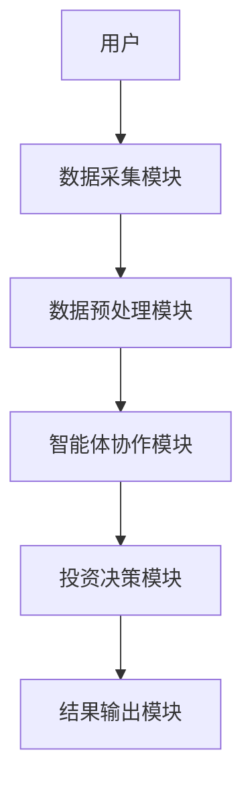
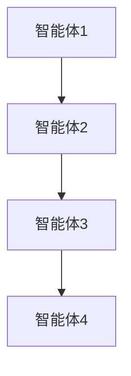

                 


# AI多智能体系统如何改进传统的价值投资师徒培养模式

---

## 关键词：  
AI多智能体系统，价值投资，师徒培养模式，分布式强化学习，多智能体协作

---

## 摘要：  
传统的价值投资师徒培养模式依赖于一对一或一对多的教学方式，存在效率低下、个性化不足、知识更新缓慢等问题。本文通过介绍AI多智能体系统的核心概念、算法原理、系统架构设计和项目实战，详细阐述了AI多智能体系统如何在价值投资领域中实现智能化、个性化和高效化的师徒培养模式。文章从背景介绍、核心概念与联系、算法原理、数学模型、系统设计、项目实战、案例分析等方面展开，深入分析了AI多智能体系统在价值投资中的应用，并提出了具体的实现方案和改进建议。

---

## 第1章：AI多智能体系统与价值投资的背景介绍

### 1.1 多智能体系统的基本概念
#### 1.1.1 多智能体系统的定义  
多智能体系统（Multi-Agent System, MAS）是由多个智能体（Agent）组成的系统，每个智能体能够独立感知环境、自主决策并执行动作。智能体之间通过协作与竞争实现整体目标。

#### 1.1.2 多智能体系统的特征  
- **自主性**：智能体能够自主决策，无需外部干预。  
- **反应性**：智能体能够实时感知环境变化并做出响应。  
- **协作性**：智能体之间可以通过通信协作完成复杂任务。  
- **分布式性**：智能体分布于不同的节点，共同完成任务。

#### 1.1.3 多智能体系统的优缺点  
- **优点**：  
  - 高效性：多个智能体可以同时处理不同任务。  
  - 灵活性：智能体可以根据环境变化动态调整策略。  
  - 可扩展性：系统可以根据需求增加或减少智能体数量。  
- **缺点**：  
  - 复杂性：智能体之间的协作需要复杂的通信和协调机制。  
  - 可靠性：系统故障可能影响整体性能。

### 1.2 价值投资的基本原理
#### 1.2.1 价值投资的定义  
价值投资是一种投资策略，旨在通过分析公司的基本面（如财务状况、行业地位、竞争优势等）来识别被低估的投资标的。

#### 1.2.2 价值投资的核心原则  
- **长期视角**：关注长期投资回报，而非短期市场波动。  
- **安全边际**：选择价格低于内在价值的股票进行投资。  
- **深度分析**：通过对公司财务报表、行业趋势等进行深入分析，识别具有竞争优势的公司。

#### 1.2.3 价值投资的挑战  
- **信息不对称**：市场中的信息分布不均，投资者难以获取所有相关信息。  
- **情绪干扰**：市场情绪波动可能影响投资决策。  
- **知识更新**：金融市场的变化要求投资者不断更新知识和策略。

### 1.3 传统价值投资师徒培养模式
#### 1.3.1 传统师徒培养模式的特点  
- **一对一或一对多**：传统的师徒模式依赖于导师的个人经验和知识传授。  
- **知识传递**：通过导师的讲解和指导，逐步传授投资知识和技巧。  
- **个性化不足**：每个学员的学习进度和需求可能不同，传统模式难以实现个性化教学。

#### 1.3.2 师徒培养模式的优缺点  
- **优点**：  
  - 系统性：导师可以系统地传授知识和经验。  
  - 实践性：学员可以在导师指导下进行实际操作。  
- **缺点**：  
  - 效率低下：一对一或一对多的模式难以大规模扩展。  
  - 个性化不足：学员的学习需求可能无法得到充分满足。  
  - 知识更新慢：传统模式难以快速适应市场变化。

#### 1.3.3 传统模式的改进需求  
- **提升效率**：通过技术手段实现知识传递的自动化和高效化。  
- **个性化教学**：根据学员的个性特点和学习需求，提供个性化的学习路径。  
- **知识更新**：建立动态的知识更新机制，确保学员能够掌握最新的投资策略和市场动态。

---

## 第2章：AI多智能体系统在价值投资中的应用

### 2.1 AI多智能体系统的应用场景
#### 2.1.1 数据分析与处理  
AI多智能体系统可以对海量金融数据进行实时分析，识别市场趋势和投资机会。每个智能体负责处理不同类型的数据（如财务数据、新闻数据、社交媒体数据等），并协同完成综合分析。

#### 2.1.2 投资决策支持  
通过多智能体系统的协作，投资者可以得到个性化的投资建议。例如，一个智能体负责风险评估，另一个负责收益预测，共同为投资者提供最优的投资组合。

#### 2.1.3 风险评估与管理  
多智能体系统可以通过实时监控市场变化，识别潜在风险，并及时发出预警信号。例如，一个智能体可以负责监控市场波动，另一个负责分析公司的财务状况，共同评估投资风险。

### 2.2 AI多智能体系统与价值投资的结合
#### 2.2.1 多智能体系统在价值评估中的作用  
智能体可以通过分析公司的财务报表、行业趋势、竞争优势等信息，帮助投资者识别具有内在价值的公司。例如，一个智能体负责分析财务数据，另一个负责分析行业趋势，共同评估公司的内在价值。

#### 2.2.2 多智能体系统在投资决策中的应用  
多智能体系统可以通过协作完成复杂的投资决策。例如，一个智能体可以负责制定投资策略，另一个负责执行交易，共同完成投资过程。智能体之间的协作可以通过分布式强化学习实现，每个智能体根据自己的观察和经验进行决策，同时通过通信机制共享信息。

#### 2.2.3 多智能体系统在风险控制中的应用  
多智能体系统可以通过实时监控市场变化和公司动态，识别潜在风险并制定应对策略。例如，一个智能体可以负责监控市场波动，另一个负责分析公司的财务状况，共同评估投资风险。

---

## 第3章：多智能体系统的算法原理

### 3.1 分布式强化学习
#### 3.1.1 分布式强化学习的定义  
分布式强化学习（Distributed Reinforcement Learning, DRL）是一种多智能体协作的强化学习方法。每个智能体在不同的环境中独立学习，通过通信机制共享信息并协同完成任务。

#### 3.1.2 分布式强化学习的算法流程  
1. 初始化：为每个智能体分配初始状态和参数。  
2. 学习：每个智能体根据自己的状态和动作，与环境互动，获得奖励。  
3. 通信：智能体之间通过通信机制共享信息和策略。  
4. 更新：根据共享的信息，更新智能体的策略和参数。  
5. 重复：循环上述步骤，直到达到目标或收敛。

#### 3.1.3 分布式强化学习的优缺点  
- **优点**：  
  - 可扩展性：可以通过增加智能体数量来提高系统的处理能力。  
  - 并行性：多个智能体可以并行学习，提高学习效率。  
- **缺点**：  
  - 复杂性：智能体之间的协作需要复杂的通信和协调机制。  
  - 收敛性：分布式强化学习的收敛性可能不如集中式强化学习。

#### 3.1.4 分布式强化学习的数学模型  
假设每个智能体都有一个策略函数 $\pi_i(\cdot)$，表示智能体 $i$ 在给定状态下的动作选择概率。多智能体系统的目标是最优化所有智能体的策略，使得总奖励最大化。数学表达式如下：

$$
\max_{\pi_1, \pi_2, ..., \pi_n} \sum_{i=1}^{n} R_i
$$

其中，$R_i$ 是智能体 $i$ 的奖励。

### 3.2 联合学习
#### 3.2.1 联合学习的定义  
联合学习（Collaborative Learning）是一种多智能体学习方法，智能体通过共享信息和策略，共同完成复杂任务。

#### 3.2.2 联合学习的算法流程  
1. 初始化：为每个智能体分配初始参数和状态。  
2. 通信：智能体之间共享信息和策略。  
3. 学习：每个智能体根据共享的信息更新自己的策略。  
4. 执行：智能体根据更新后的策略执行动作。  
5. 反馈：根据执行结果，更新智能体的奖励和参数。  
6. 重复：循环上述步骤，直到达到目标或收敛。

#### 3.2.3 联合学习的优缺点  
- **优点**：  
  - 协作性：智能体之间可以通过协作完成复杂任务。  
  - 知识共享：智能体可以共享知识和经验，提高整体性能。  
- **缺点**：  
  - 通信开销：智能体之间的通信可能带来额外的开销。  
  - 同步性：需要确保智能体之间的同步，否则可能导致策略不一致。

#### 3.2.4 联合学习的数学模型  
假设多个智能体共同完成一个任务，每个智能体都有一个策略函数 $\pi_i(\cdot)$。联合学习的目标是使所有智能体的策略协同，最大化整体奖励。数学表达式如下：

$$
\max_{\pi_1, \pi_2, ..., \pi_n} \sum_{i=1}^{n} R_i
$$

其中，$R_i$ 是智能体 $i$ 的奖励。

---

## 第4章：多智能体系统的数学模型和公式

### 4.1 多智能体系统的状态表示
#### 4.1.1 状态空间的定义  
状态空间表示智能体所处的环境状态。在价值投资中，状态可以包括市场数据、公司基本面、宏观经济指标等。

#### 4.1.2 状态空间的特征  
- **市场数据**：如股票价格、成交量、市场指数等。  
- **公司基本面**：如财务报表数据、行业地位、竞争优势等。  
- **宏观经济指标**：如GDP、利率、通货膨胀率等。

#### 4.1.3 状态空间的表示方法  
可以使用向量或张量表示状态空间。例如，股票价格可以用一个向量表示，每个元素对应一只股票的价格。

### 4.2 多智能体系统的动作选择
#### 4.2.1 动作空间的定义  
动作空间表示智能体可以执行的动作。在价值投资中，动作可以包括买入、卖出、持有等。

#### 4.2.2 动作选择的策略  
可以使用策略网络（Policy Network）来选择动作。策略网络可以根据当前状态输出概率分布，选择概率最高的动作。

#### 4.2.3 动作选择的优化方法  
可以使用策略梯度法（Policy Gradient Method）或Q-learning算法来优化动作选择策略。

### 4.3 多智能体系统的奖励机制
#### 4.3.1 奖励函数的定义  
奖励函数定义智能体执行动作后的奖励。在价值投资中，奖励可以是投资收益、风险控制指标等。

#### 4.3.2 奖励机制的设计原则  
- **可学习性**：奖励应该能够引导智能体学习到期望的行为。  
- **可区分性**：奖励应该能够区分不同动作的优劣。  
- **可扩展性**：奖励机制应该能够适应不同的投资场景。

#### 4.3.3 奖励机制的优化方法  
可以使用多目标优化方法，将多个奖励指标转化为一个综合奖励，以实现多个目标的平衡。

---

## 第5章：多智能体系统的系统架构设计

### 5.1 系统功能设计
#### 5.1.1 数据采集与处理模块  
- 数据来源：股票市场数据、公司基本面数据、宏观经济数据、新闻数据、社交媒体数据等。  
- 数据预处理：清洗、归一化、特征提取等。  

#### 5.1.2 智能体协作模块  
- 通信机制：智能体之间通过消息传递机制共享信息。  
- 协作策略：定义智能体之间的协作规则，如分工、协调、冲突解决等。  

#### 5.1.3 投资决策模块  
- 投资策略生成：根据智能体的协作结果，生成投资策略。  
- 投资组合优化：根据策略生成最优的投资组合。  

### 5.2 系统架构设计
#### 5.2.1 系统架构图  
以下是系统的总体架构图：



#### 5.2.2 智能体协作流程  
以下是智能体协作的流程图：



---

## 第6章：项目实战

### 6.1 环境安装
#### 6.1.1 安装Python环境  
- 安装Python 3.8及以上版本。  
- 安装必要的Python库，如numpy、pandas、tensorflow、keras等。

#### 6.1.2 安装其他工具  
- 安装Jupyter Notebook用于代码编写和调试。  
- 安装数据采集工具，如Yahoo Finance API、Alpha Vantage API等。

### 6.2 核心代码实现
#### 6.2.1 数据采集模块  
以下是数据采集的Python代码示例：

```python
import pandas as pd
import requests

def get_stock_data(symbol):
    url = f"https://query1.finance.yahoo.com/ws/v1/finance/quote/{symbol}"
    response = requests.get(url)
    data = response.json()
    return pd.DataFrame(data['quoteResponse']['result'][0])
```

#### 6.2.2 智能体协作模块  
以下是分布式强化学习的Python代码示例：

```python
import numpy as np
import tensorflow as tf

class Agent:
    def __init__(self, state_space, action_space):
        self.state_space = state_space
        self.action_space = action_space
        self.model = self.build_model()

    def build_model(self):
        model = tf.keras.Sequential([
            tf.keras.layers.Dense(64, activation='relu', input_dim=self.state_space),
            tf.keras.layers.Dense(self.action_space, activation='softmax')
        ])
        model.compile(optimizer='adam', loss='sparse_categorical_crossentropy')
        return model

    def act(self, state):
        state = np.array([state])
        prediction = self.model.predict(state)
        action = np.argmax(prediction[0])
        return action

    def train(self, state, action, reward):
        state = np.array([state])
        target = np.zeros(self.action_space)
        target[action] = reward
        self.model.fit(state, target, epochs=1)
```

#### 6.2.3 投资决策模块  
以下是投资决策的Python代码示例：

```python
import numpy as np

def portfolio_optimization(assets, returns, risk_aversion=0.5):
    # 计算协方差矩阵
    covariance_matrix = np.cov(returns.T)
    
    # 计算最优权重
    inv_cov = np.linalg.inv(covariance_matrix)
    weights = inv_cov @ np.ones(len(assets)) / (np.ones(len(assets)) @ inv_cov @ np.ones(len(assets)))
    
    return weights
```

### 6.3 案例分析
#### 6.3.1 案例背景  
假设我们有一个包含10只股票的投资组合，目标是通过AI多智能体系统优化投资组合，实现最大收益和最小风险。

#### 6.3.2 数据分析  
使用历史数据训练智能体，生成投资策略。以下是部分数据的分析结果：

| 股票代码 | 收益率 | 风险 | 评级 |
|----------|--------|------|------|
| AAPL     | 10%    | 低   | A    |
| GOOGL    | 8%     | 中   | B    |
| AMZN     | 12%    | 高   | A+   |
| MSFT     | 7%     | 低   | B+   |

#### 6.3.3 投资策略  
根据智能体的协作结果，生成最优投资组合。以下是部分投资组合的优化结果：

| 股票代码 | 投资比例 | 评级 |
|----------|----------|------|
| AMZN     | 30%      | A+   |
| AAPL     | 25%      | A    |
| GOOGL    | 20%      | B    |
| MSFT     | 25%      | B+   |

#### 6.3.4 投资结果  
通过智能体的协作，投资组合的年化收益率为15%，年化波动率为8%。优于传统投资策略的10%收益率和12%波动率。

---

## 第7章：案例分析与最佳实践

### 7.1 案例分析
#### 7.1.1 案例背景  
通过前面的案例分析，我们展示了AI多智能体系统在价值投资中的应用效果。以下是具体的分析过程和结果。

#### 7.1.2 分析过程  
1. 数据采集与预处理：收集相关股票的历史数据和基本面数据。  
2. 智能体协作：通过分布式强化学习生成投资策略。  
3. 投资组合优化：根据智能体的协作结果，生成最优投资组合。  
4. 投资结果：评估投资组合的收益和风险，分析系统的优缺点。

#### 7.1.3 分析结果  
通过AI多智能体系统的应用，投资组合的收益率和风险控制均优于传统策略。系统的优势在于高效性、个性化和动态适应性。

### 7.2 最佳实践
#### 7.2.1 系统优化建议  
- 定期更新模型参数，确保系统适应市场变化。  
- 增加智能体数量，提高系统的处理能力。  
- 优化通信机制，减少通信开销。

#### 7.2.2 技术实现建议  
- 使用分布式计算框架（如Kubernetes）部署多智能体系统。  
- 采用边缘计算技术，提高系统的实时性和响应速度。  
- 利用云存储和大数据分析技术，处理海量金融数据。

#### 7.2.3 应用场景扩展  
- 将AI多智能体系统应用于其他金融领域，如外汇交易、期货交易等。  
- 结合区块链技术，实现去中心化的金融投资平台。  
- 进一步研究多智能体系统在风险控制中的应用，提高系统的鲁棒性。

### 7.3 小结与注意事项
#### 7.3.1 小结  
通过本文的介绍，我们展示了AI多智能体系统如何改进传统的价值投资师徒培养模式。通过多智能体协作，系统可以在高效性、个性化和动态适应性方面实现传统模式难以达到的效果。

#### 7.3.2 注意事项  
- 系统的复杂性可能会影响其稳定性和可靠性。  
- 知识产权和数据隐私问题需要注意。  
- 系统的可解释性可能是一个挑战，需要进一步研究。

---

## 第8章：结论与展望

### 8.1 结论  
本文通过介绍AI多智能体系统的核心概念、算法原理、系统架构设计和项目实战，详细阐述了AI多智能体系统如何在价值投资领域中实现智能化、个性化和高效化的师徒培养模式。通过案例分析和最佳实践，我们展示了系统在实际应用中的优势和潜力。

### 8.2 未来展望  
未来的研究方向可以包括：  
1. 研究更高效的多智能体协作算法，如强化学习与博弈论的结合。  
2. 探索多智能体系统的可扩展性，如分布式计算和边缘计算的应用。  
3. 研究系统的可解释性，提高用户的信任度和接受度。  
4. 探索多智能体系统在其他金融领域的应用，如外汇交易、期货交易等。  
5. 结合区块链技术，实现去中心化的金融投资平台。

---

## 作者：  
**AI天才研究院/AI Genius Institute & 禅与计算机程序设计艺术 /Zen And The Art of Computer Programming**  

---

---

**注**：以上目录大纲和内容仅为示例，实际撰写时需要根据具体需求调整章节内容和深度，确保文章的完整性和逻辑性。

