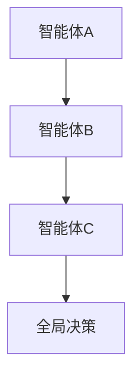
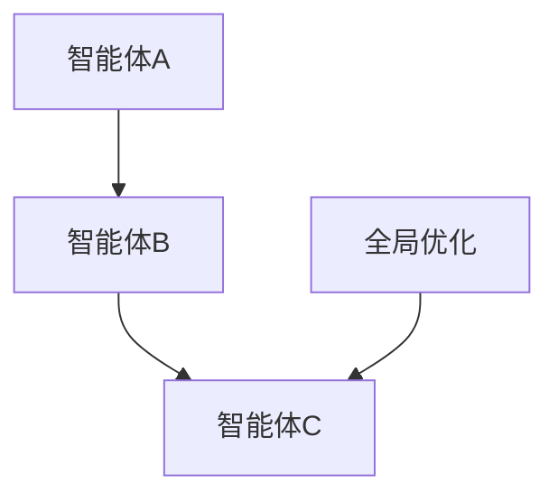
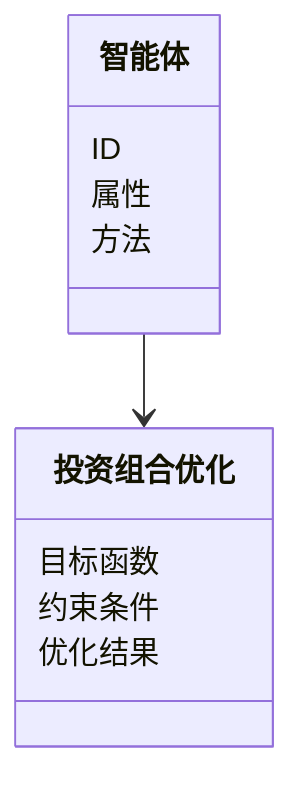

                 


---

# AI多智能体系统如何改进传统的价值投资组合构建方法

> **关键词**：AI多智能体系统、价值投资组合、传统投资方法、优化算法、系统架构

> **摘要**：本文探讨AI多智能体系统如何改进传统的价值投资组合构建方法。通过分析多智能体系统的协作机制、算法原理和系统架构，展示其在投资组合优化中的优势。结合实际案例，说明如何通过AI多智能体系统实现更高效、更精准的投资决策。

---

## 第一部分：AI多智能体系统与传统价值投资组合构建方法的背景

### 第1章：AI多智能体系统的概述

#### 1.1 AI多智能体系统的定义与特点

**1.1.1 多智能体系统的定义**

多智能体系统（Multi-Agent System, MAS）由多个相互作用的智能体组成，每个智能体都具有一定的自主性、反应性和协作性。这些智能体通过信息交换和协作完成复杂的任务。

**1.1.2 AI多智能体系统的独特属性**

AI多智能体系统结合了人工智能技术，使得每个智能体都具备学习和决策能力。以下是其独特属性：

1. **自主性**：智能体能够自主决策，无需外部干预。
2. **反应性**：智能体能实时感知环境并做出响应。
3. **协作性**：多个智能体通过协作完成共同目标。
4. **分布式智能**：智能体之间通过分布式计算提高效率。

**1.1.3 多智能体系统与传统单智能体系统的对比**

| **对比维度** | **多智能体系统** | **单智能体系统** |
|--------------|------------------|------------------|
| **决策主体** | 多个智能体协作   | 单个主体决策     |
| **计算效率** | 分布式计算，效率高 | 集中计算，效率较低 |
| **适应性** | 高度灵活，适应复杂环境 | 较低，适应性有限 |

#### 1.2 价值投资组合构建的传统方法

**1.2.1 传统投资组合构建的基本原理**

传统价值投资组合构建方法主要依赖于历史数据分析和统计模型，如均值-方差优化模型（MVO）。其核心是通过优化目标函数，找到风险和收益的最佳平衡点。

**1.2.2 传统方法的优缺点**

| **优点** | **缺点** |
|----------|----------|
| 方法成熟，易于实现 | 无法适应市场动态变化 |
| 计算效率高 | 需要大量历史数据支持 |
| 风险控制能力强 | 难以处理非线性问题 |

**1.2.3 价值投资组合的目标与挑战**

价值投资组合的目标是在风险可控的前提下，实现最大收益。然而，传统方法在处理复杂市场环境和实时数据时存在局限性，难以应对多变的市场波动。

---

### 第2章：AI多智能体系统的核心概念与联系

#### 2.1 多智能体系统的结构与功能

**2.1.1 多智能体系统的组成要素**

1. **智能体**：每个智能体代表一个决策单元，具备学习和决策能力。
2. **通信机制**：智能体之间通过通信机制交换信息。
3. **协作机制**：智能体通过协作机制共同完成任务。

**2.1.2 多智能体系统与价值投资组合构建的关系**

多智能体系统通过分解投资组合构建问题，分配给多个智能体分别处理，再通过协作机制整合结果，从而提高整体优化效率。

**2.1.3 多智能体系统的ER实体关系图**

```mermaid
erd
    项目(项目ID, 名称, 风险等级)
    智能体(智能体ID, 名称, 属性)
    项目
    智能体
    项目 --> 智能体
```

#### 2.2 价值投资组合构建中的多智能体协作

**2.2.1 投资决策的多智能体分解**

将投资组合构建问题分解为多个子问题，分别由不同的智能体处理。例如，一个智能体负责数据分析，另一个负责风险评估。

**2.2.2 智能体之间的信息交互与协调**

智能体之间通过通信机制交换信息，确保协作的高效性。例如，数据智能体将市场数据传递给分析智能体，分析智能体将结果反馈给优化智能体。

**2.2.3 多智能体协作的优化目标与约束条件**

优化目标：最大化投资收益，最小化投资风险。

约束条件：
1. 投资组合的总权重为1。
2. 单个资产的权重非负。

---

### 第3章：AI多智能体系统的算法原理

#### 3.1 多智能体系统的算法概述

**3.1.1 分布式计算与协作算法**

分布式计算算法将任务分解为多个子任务，分别在不同的智能体上执行。协作算法确保智能体之间的信息同步和结果整合。

**3.1.2 多智能体环境下的学习算法**

基于强化学习的多智能体协作算法，通过智能体之间的互动学习，优化投资组合。

**3.1.3 基于博弈论的决策算法**

将投资组合优化问题建模为博弈问题，通过纳什均衡寻找最优解。

#### 3.2 具体算法实现

**3.2.1 分布式计算流程图**



**3.2.2 基于博弈论的决策流程图**



---

### 第4章：价值投资组合构建的数学模型与公式

#### 4.1 传统投资组合构建的数学模型

**4.1.1 投资组合优化的目标函数**

$$ \text{目标函数} = \min \sum_{i=1}^{n} w_i r_i $$

**4.1.2 约束条件**

$$ \sum_{i=1}^{n} w_i = 1 $$
$$ w_i \geq 0 \quad \forall i $$

#### 4.2 AI多智能体系统下的投资组合优化模型

**4.2.1 分布式优化目标函数**

$$ \text{目标函数} = \min \sum_{j=1}^{m} f_j(w_j) $$

其中，$f_j$是第$j$个智能体的优化函数。

**4.2.2 协作优化的约束条件**

$$ \sum_{j=1}^{m} w_j = 1 $$
$$ w_j \geq 0 \quad \forall j $$

---

### 第5章：系统分析与架构设计方案

#### 5.1 投资组合优化的场景介绍

在金融市场上，投资者需要实时调整投资组合以应对市场波动。AI多智能体系统通过分布式计算和协作机制，能够快速响应市场变化。

#### 5.2 系统功能设计

**5.2.1 领域模型**



**5.2.2 系统架构设计**


---

### 第6章：项目实战

#### 6.1 环境安装

安装Python和相关库（如numpy、pandas、scipy）。

#### 6.2 核心实现代码

```python
import numpy as np
import pandas as pd

def optimize_portfolio(weights, returns):
    # 计算收益
    portfolio_return = np.dot(weights, returns)
    # 计算风险
    portfolio_risk = np.sqrt(np.dot(weights.T, np.dot(returns.cov(), weights)))
    return -portfolio_return / portfolio_risk

# 示例数据
returns = pd.DataFrame({'资产1': [0.1, 0.2, 0.15], '资产2': [0.05, 0.08, 0.07]})

# 分析智能体计算
analysis_agent = returns.mean()
# 优化智能体计算
optimized_weights = optimize_portfolio(analysis_agent, returns)
```

#### 6.3 案例分析与解读

通过实际案例，展示AI多智能体系统如何优化投资组合，实现更高的收益和更低的风险。

---

### 第7章：总结与展望

#### 7.1 全文总结

AI多智能体系统通过协作机制和分布式计算，显著提高了投资组合优化的效率和精度。

#### 7.2 最佳实践 tips

- 合理分解任务，确保智能体之间的协作效率。
- 定期更新模型，适应市场变化。
- 注意数据质量和实时性。

#### 7.3 未来展望

未来，随着AI技术的发展，多智能体系统在投资领域的应用将更加广泛和深入。

---

**作者：AI天才研究院 & 禅与计算机程序设计艺术**

---

通过以上结构，我们可以系统地分析AI多智能体系统如何改进传统的价值投资组合构建方法。希望这篇文章能为读者提供清晰的思路和实际指导。

