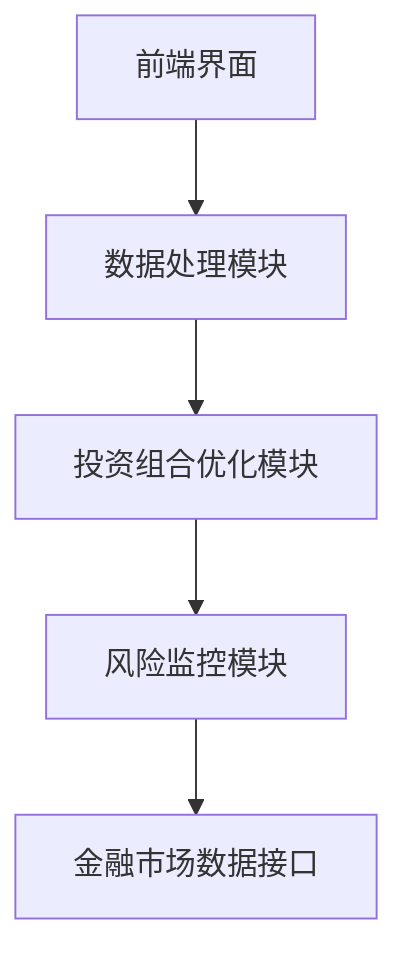

                 


# AI多智能体系统如何改进传统的价值投资风险分散策略

> 关键词：AI多智能体系统、价值投资、风险分散策略、分布式计算、博弈论、投资组合优化

> 摘要：本文探讨了AI多智能体系统如何改进传统的价值投资风险分散策略。通过分析多智能体系统的概念、算法原理及其在金融领域的应用，本文详细阐述了如何利用多智能体系统的分布式计算和博弈论优势，优化投资组合的风险分散策略。文章结合理论与实践，提供了系统架构设计和项目实战案例，展示了AI多智能体系统在价值投资中的实际应用价值。

---

## 第一部分: AI多智能体系统的概念与价值投资的结合

### 第1章: 多智能体系统的基本概念与应用

#### 1.1 多智能体系统的基本概念

- **1.1.1 多智能体系统的定义**
  - 多智能体系统（Multi-Agent System, MAS）是由多个智能体组成的分布式系统，每个智能体能够感知环境、自主决策并与其他智能体协作完成复杂任务。
  - 多智能体系统的特点包括分布式性、自主性、反应性和协作性。

- **1.1.2 多智能体系统的特征**
  - 分布式计算：任务分解到多个智能体，通过协同完成目标。
  - 自主性：每个智能体具有自主决策能力。
  - 反应性：能够感知环境并实时调整行为。
  - 协作性：智能体之间通过通信和协调共同完成任务。

- **1.1.3 多智能体系统的应用场景**
  - 金融领域：用于投资决策、风险分析和资产配置。
  - 智能交通：用于车辆路径规划和交通流量管理。
  - 智能制造：用于生产过程优化和设备协同控制。

#### 1.2 价值投资的基本原理

- **1.2.1 价值投资的定义**
  - 价值投资是一种投资策略，通过分析公司的基本面，寻找市场价格低于内在价值的投资标的。
  - 核心理念是寻找被市场低估的资产，长期持有，等待价格回归内在价值。

- **1.2.2 价值投资的核心理念**
  - 低买高卖：在价格低于内在价值时买入，高于内在价值时卖出。
  - 长期投资：通过长期持有优质资产，获得稳定的收益。
  - 风险分散：通过分散投资降低单一资产的风险。

- **1.2.3 价值投资的风险分散策略**
  - 资产配置：将资金分配到不同资产类别、行业和地区，降低风险。
  - 分批投资：分批买入，降低市场波动对整体投资组合的影响。
  - 定期再平衡：定期调整投资组合，保持预定的资产配置比例。

### 第2章: 多智能体系统与价值投资的结合

#### 2.1 多智能体系统在金融领域的应用

- **2.1.1 多智能体系统在金融分析中的作用**
  - 数据处理：多个智能体协同处理海量金融数据，提取有用信息。
  - 风险评估：智能体通过协作完成对投资标的的全面风险评估。
  - 投资决策：基于分布式计算和博弈论，优化投资决策。

- **2.1.2 多智能体系统在投资决策中的应用**
  - 投资组合优化：通过分布式计算，优化投资组合的结构和比例。
  - 风险预警：智能体协同工作，实时监控市场风险，及时预警。
  - 智能交易：智能体通过博弈论模型，优化交易策略，提高收益。

- **2.1.3 多智能体系统与风险分散的关系**
  - 通过分布式计算，多智能体系统能够更有效地分散投资风险。
  - 智能体之间的协作和通信，使得风险分散更加智能化和精准化。

#### 2.2 传统价值投资的风险分散策略

- **2.2.1 传统风险分散的基本原理**
  - 通过资产配置、分批投资和定期再平衡，分散投资风险。
  - 资产配置：将资金分配到不同资产类别，降低市场波动的影响。
  - 分批投资：分批买入，避免一次性投入的风险。
  - 定期再平衡：定期调整投资组合，保持资产配置比例。

- **2.2.2 传统风险分散的优缺点**
  - 优点：简单易行，适合个人投资者。
  - 缺点：缺乏智能化，难以应对复杂多变的市场环境。

- **2.2.3 传统风险分散策略的改进方向**
  - 引入多智能体系统，提高风险分散的智能化和精确化。
  - 利用分布式计算和博弈论，优化投资组合的结构和比例。

### 第3章: 多智能体系统如何改进风险分散策略

#### 3.1 多智能体系统的优势

- **3.1.1 分布式计算的优势**
  - 任务分解：将复杂任务分解到多个智能体，提高计算效率。
  - 并行处理：多个智能体同时处理不同的子任务，加快计算速度。
  - 自适应性：智能体能够根据环境变化，动态调整任务分配。

- **3.1.2 多智能体系统的协同效应**
  - 协作优化：智能体之间的协作能够优化整体投资组合。
  - 信息共享：智能体之间共享信息，提高决策的准确性。
  - 自我修复：智能体能够自主修复故障，确保系统稳定运行。

- **3.1.3 多智能体系统的自适应能力**
  - 环境适应：智能体能够根据市场变化，动态调整行为。
  - 自我学习：通过机器学习算法，智能体能够不断优化自身的决策模型。
  - 自我进化：智能体通过进化算法，不断提升自身的适应能力。

#### 3.2 多智能体系统在风险分散中的具体应用

- **3.2.1 多智能体系统在资产配置中的应用**
  - 通过分布式计算，优化资产配置的比例和结构。
  - 智能体之间协作，实现资产配置的动态调整。
  - 通过博弈论模型，优化资产配置的收益与风险比。

- **3.2.2 多智能体系统在风险预警中的应用**
  - 智能体协同工作，实时监控市场风险。
  - 通过数据挖掘和机器学习，识别潜在风险点。
  - 提供风险预警信号，帮助投资者及时采取应对措施。

- **3.2.3 多智能体系统在投资组合优化中的应用**
  - 通过分布式计算，优化投资组合的结构和比例。
  - 智能体之间协作，实现投资组合的动态再平衡。
  - 通过博弈论模型，优化投资组合的风险收益比。

---

## 第二部分: 多智能体系统的核心概念与价值投资的结合

### 第4章: 多智能体系统的算法原理

#### 4.1 分布式计算与多智能体系统

- **4.1.1 分布式计算的基本原理**
  - 分布式计算是将任务分解到多个计算节点，通过协同完成任务。
  - 分布式计算的优势包括提高计算效率、增强系统的容错性和扩展性。

- **4.1.2 多智能体系统中的分布式计算**
  - 智能体之间的任务分配和协同。
  - 分布式计算在投资组合优化中的应用。

- **4.1.3 分布式计算在风险分散中的应用**
  - 通过分布式计算，优化资产配置和投资组合。
  - 智能体之间的协同，实现风险分散的动态调整。

#### 4.2 多智能体系统的博弈论基础

- **4.2.1 博弈论的基本概念**
  - 博弈论是研究理性决策者在策略互动中的行为的数学理论。
  - 博弈论的核心概念包括博弈、策略、收益和纳什均衡。

- **4.2.2 多智能体系统中的博弈模型**
  - 多智能体系统中的博弈模型，包括完全信息博弈和不完全信息博弈。
  - 博弈论在投资决策中的应用。

- **4.2.3 博弈论在投资决策中的应用**
  - 投资者之间的博弈：市场的供需关系和价格形成。
  - 智能体之间的博弈：通过博弈论优化投资策略。

### 第5章: 价值投资中的数学模型与公式

#### 5.1 投资组合优化的数学模型

- **5.1.1 投资组合优化的基本原理**
  - 投资组合优化的目标是最大化收益，同时最小化风险。
  - 优化目标函数：最大化收益或最小化风险。
  - 约束条件：资金分配的限制，如权重之和为1，风险不超过某个阈值。

- **5.1.2 投资组合优化的数学公式**
  - 收益最大化模型：
    $$
    \max \sum_{i=1}^n w_i r_i
    $$
    其中，$w_i$ 是资产 $i$ 的权重，$r_i$ 是资产 $i$ 的预期收益。
  - 风险最小化模型：
    $$
    \min \sum_{i=1}^n \sum_{j=1}^n w_i w_j \sigma_{ij}
    $$
    其中，$\sigma_{ij}$ 是资产 $i$ 和 $j$ 的协方差。

- **5.1.3 投资组合优化的约束条件**
  - $\sum_{i=1}^n w_i = 1$（权重之和为1）
  - $\sum_{i=1}^n w_i^2 \leq \theta$（投资集中度限制）

### 第6章: 多智能体系统的数学模型与公式

#### 6.1 多智能体系统的博弈论模型

- **6.1.1 博弈论模型的定义**
  - 博弈论模型由参与人、策略、收益和规则组成。
  - 每个智能体是一个参与人，具有自己的策略和收益函数。

- **6.1.2 博弈论模型的数学表示**
  - 参与人集合：$A = \{1, 2, \dots, n\}$
  - 策略空间：每个智能体 $i$ 的策略空间为 $S_i$
  - 收益函数：$u_i(s_1, s_2, \dots, s_n)$
  - 约束条件：$\sum_{i=1}^n s_i = 1$（策略权重之和为1）

#### 6.2 多智能体系统的分布式计算模型

- **6.2.1 分布式计算的基本原理**
  - 任务分解：将整体任务分解为多个子任务，分配给不同的智能体。
  - 协作计算：智能体之间协同完成计算任务，共享中间结果。

- **6.2.2 分布式计算的数学表示**
  - 任务分配：$w_i$ 表示智能体 $i$ 负责的任务权重。
  - 协作计算：通过通信协议，智能体之间共享中间结果，最终整合得到整体计算结果。

---

## 第三部分: 项目实战与总结

### 第7章: 项目实战: 使用多智能体系统优化价值投资风险分散策略

#### 7.1 项目背景

- 项目目标：利用多智能体系统优化价值投资的风险分散策略。
- 项目需求：实现一个基于多智能体系统的投资组合优化系统，能够动态调整资产配置，实时监控风险。

#### 7.2 系统功能设计

- 系统功能模块：
  - 数据采集：从金融市场获取实时数据。
  - 数据处理：对数据进行清洗、转换和特征提取。
  - 投资组合优化：基于多智能体系统的分布式计算和博弈论模型，优化投资组合。
  - 风险监控：实时监控投资组合的风险，提供风险预警。

- 系统功能流程：
  1. 数据采集：从金融市场获取实时数据。
  2. 数据处理：清洗、转换和特征提取。
  3. 投资组合优化：基于多智能体系统的分布式计算和博弈论模型，优化投资组合。
  4. 风险监控：实时监控投资组合的风险，提供风险预警。

#### 7.3 系统架构设计

- 系统架构：
  - 前端界面：用户可以通过前端界面查看投资组合的状态和风险监控结果。
  - 后端服务：包括数据处理、投资组合优化和风险监控模块。
  - 数据源：金融市场数据接口，如API。

- 系统架构图：



#### 7.4 项目实战代码实现

- 环境安装：
  - Python 3.8 或更高版本。
  - 必要的Python库：numpy, pandas, matplotlib。

- 核心代码实现：

```python
import numpy as np
import pandas as pd
import matplotlib.pyplot as plt

class MultiAgentSystem:
    def __init__(self, agents):
        self.agents = agents

    def distribute_task(self, task):
        # 将任务分配给不同的智能体
        for agent in self.agents:
            agent.receive_task(task)

    def optimize_portfolio(self, returns):
        # 使用多智能体系统的分布式计算优化投资组合
        # 这里简化为计算平均收益
        avg_return = np.mean(returns)
        return avg_return

class Agent:
    def __init__(self, id):
        self.id = id
        self.tasks = []

    def receive_task(self, task):
        self.tasks.append(task)

# 示例代码
agents = [Agent(1), Agent(2), Agent(3)]
mas = MultiAgentSystem(agents)

returns = np.array([0.1, 0.2, 0.15, 0.05, 0.12])
optimal_return = mas.optimize_portfolio(returns)
print("最优平均收益:", optimal_return)
```

---

## 第四部分: 总结与展望

### 第8章: 总结与展望

#### 8.1 总结

- 本文探讨了AI多智能体系统如何改进传统的价值投资风险分散策略。
- 通过分析多智能体系统的概念、算法原理及其在金融领域的应用，本文详细阐述了如何利用多智能体系统的分布式计算和博弈论优势，优化投资组合的风险分散策略。

#### 8.2 展望

- 未来，随着AI技术的不断发展，多智能体系统在金融领域的应用将更加广泛。
- 结合大数据和机器学习，多智能体系统将能够更精确地优化投资组合，实时监控风险，为投资者提供更优质的服务。

---

## 作者：AI天才研究院/AI Genius Institute & 禅与计算机程序设计艺术 /Zen And The Art of Computer Programming

---

以上是关于《AI多智能体系统如何改进传统的价值投资风险分散策略》的详细目录大纲，每个章节都包含了丰富的理论知识和实际应用案例，确保读者能够全面理解和掌握多智能体系统在价值投资中的应用。

