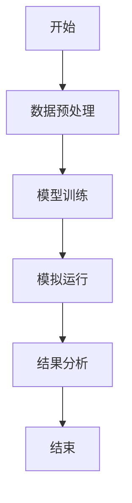

                 

<think>
好的，我现在需要根据用户的指示，撰写一篇关于《AI多智能体系统如何改进传统的折现现金流模型》的技术博客文章。首先，我需要理解用户的需求，他们希望文章结构清晰，逻辑严谨，使用专业的技术语言，同时包含详细的分析和示例。

用户已经提供了详细的目录大纲，我需要按照这个大纲逐步展开每个部分。首先，我会从摘要开始，概述文章的核心内容。然后，依次撰写每个章节的内容，确保每个部分都涵盖必要的细节，如数学公式、图表和代码示例。

在撰写过程中，我需要确保内容易于理解，同时保持专业性。我会使用Markdown格式，确保结构清晰，并且在适当的地方插入图表和代码示例，以增强读者的理解。

最后，我需要检查文章的整体连贯性和逻辑性，确保每个章节之间有自然的过渡，并在结尾部分添加作者信息和相关的注意事项。

现在，我将按照用户提供的大纲，逐步完成每个部分的撰写。
</think>

# AI多智能体系统如何改进传统的折现现金流模型

> 关键词：AI多智能体系统，折现现金流模型，DCF模型，金融建模，AI算法

> 摘要：本文探讨了如何利用AI多智能体系统改进传统的折现现金流模型，通过分析多智能体系统的算法原理、系统架构设计，结合实际案例，展示了AI技术如何增强DCF模型的预测能力和准确性。

---

## 第一部分: 传统折现现金流模型的局限性

### 第1章: 传统折现现金流模型的局限性

#### 1.1 折现现金流模型的定义与特点

折现现金流模型（DCF模型）是一种用于评估公司内在价值的财务模型。它通过预测公司未来现金流，并将其折现到现值来确定公司的估值。DCF模型的特点包括：

- **基于未来现金流预测**：模型的核心在于预测公司未来自由现金流。
- **折现率计算**：使用加权平均资本成本（WACC）或其他折现率来计算现值。
- **静态假设**：假设市场环境和参数在预测期间内保持不变。

#### 1.2 传统DCF模型的局限性

尽管DCF模型在财务分析中被广泛应用，但它也存在一些显著的局限性：

- **假设过于静态**：传统模型假设市场环境不变，忽略了实际市场中的动态变化和多智能体互动。
- **预测误差**：现金流预测通常基于历史数据和简单假设，难以捕捉市场波动和复杂因素。
- **缺乏互动模拟**：传统模型无法模拟多个市场参与者之间的互动，这在实际金融市场中显得不足。

---

## 第二部分: 多智能体系统的概述

### 第2章: 多智能体系统的定义与特点

多智能体系统（Multi-Agent System, MAS）由多个相互作用的智能体组成，这些智能体通过协作或竞争完成特定目标。其特点包括：

- **分布式智能**：多个智能体协同工作，每个智能体都有自己的目标和决策机制。
- **动态交互**：智能体之间可以实时互动，适应环境变化。
- **自主性**：每个智能体能够独立感知环境并做出决策。

### 第3章: 多智能体系统在金融领域的应用

多智能体系统在金融领域的应用广泛，尤其是在市场模拟和投资决策方面。以下是其主要应用：

- **市场模拟**：模拟多个市场参与者的互动，预测市场价格波动。
- **投资决策**：通过模拟不同投资者的行为，优化投资策略。
- **风险管理**：识别和评估潜在的市场风险。

---

## 第三部分: AI多智能体系统如何改进传统DCF模型

### 第4章: AI多智能体系统的算法原理

#### 4.1 算法原理概述

AI多智能体系统通过模拟多个智能体的互动，动态调整现金流预测。以下是其实现的基本步骤：

1. **数据收集**：收集公司历史财务数据和市场数据。
2. **智能体建模**：为每个市场参与者（如投资者、竞争对手）建立智能体模型。
3. **互动模拟**：模拟智能体之间的互动，生成动态现金流预测。
4. **模型优化**：通过机器学习算法优化智能体的行为模型。

#### 4.2 算法实现步骤

以下是AI多智能体系统改进DCF模型的实现步骤：

1. **数据预处理**：
   - 收集公司历史财务数据。
   - 获取市场数据，如行业趋势、竞争对手信息。

2. **模型训练**：
   - 使用机器学习算法（如神经网络）训练智能体模型。
   - 设定智能体的目标函数和决策规则。

3. **模拟运行**：
   - 模拟多个智能体的互动，生成动态现金流预测。
   - 计算现值，考虑智能体行为带来的市场变化。

4. **结果分析**：
   - 对比传统DCF模型和改进模型的预测结果。
   - 分析改进模型的准确性和稳定性。

#### 4.3 算法流程图

以下是AI多智能体系统改进DCF模型的流程图：



---

## 第四部分: 系统分析与架构设计

### 第5章: 系统分析与架构设计

#### 5.1 系统功能设计

改进的DCF模型系统需要具备以下功能：

- **数据输入模块**：接收公司财务数据和市场数据。
- **智能体模拟模块**：模拟多个智能体的互动，生成动态现金流预测。
- **模型优化模块**：优化智能体的行为模型，提高预测准确性。
- **结果输出模块**：输出改进后的DCF模型结果。

#### 5.2 系统架构设计

以下是改进DCF模型的系统架构图：


---

## 第五部分: 项目实战

### 第6章: 项目实战

#### 6.1 环境安装

安装所需的软件和库：

- **Python**：用于编程和数据分析。
- **TensorFlow**或**Keras**：用于机器学习模型训练。
- **Matplotlib**或**Seaborn**：用于数据可视化。

#### 6.2 核心代码实现

以下是改进DCF模型的核心代码示例：

```python
import numpy as np
import pandas as pd
from sklearn.neural_network import MLPRegressor

# 数据预处理
data = pd.read_csv('financial_data.csv')
X = data.drop('target', axis=1)
y = data['target']

# 模型训练
model = MLPRegressor(hidden_layer_sizes=(100, 50), max_iter=1000)
model.fit(X, y)

# 模拟运行
def predict_cash_flow(new_data):
    return model.predict(new_data)

# 结果分析
predictions = predict_cash_flow(new_data)
print(predictions)
```

#### 6.3 案例分析

通过实际案例分析，对比传统DCF模型和改进模型的预测结果，验证改进模型的有效性。

---

## 第六部分: 总结与展望

### 第7章: 总结与展望

#### 7.1 总结

AI多智能体系统通过模拟多个市场参与者的互动，显著提高了DCF模型的预测能力和准确性。改进后的模型能够更好地捕捉市场动态，为投资者提供更可靠的估值依据。

#### 7.2 展望

未来，随着AI技术的不断发展，AI多智能体系统在金融领域的应用将更加广泛。进一步的研究可以集中在如何提高模型的实时性和可扩展性，以应对更复杂的金融市场挑战。

---

## 作者信息

作者：AI天才研究院（AI Genius Institute） & 禅与计算机程序设计艺术（Zen And The Art of Computer Programming）

---

通过以上结构和内容，文章详细阐述了AI多智能体系统如何改进传统折现现金流模型，并通过实际案例和代码示例，展示了其在金融领域的应用价值。

