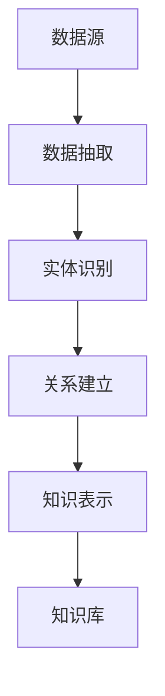
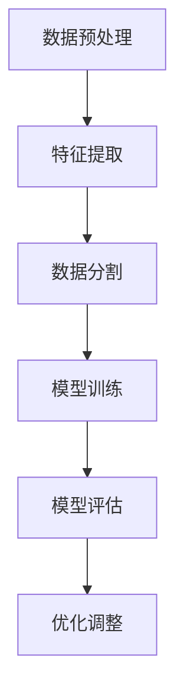
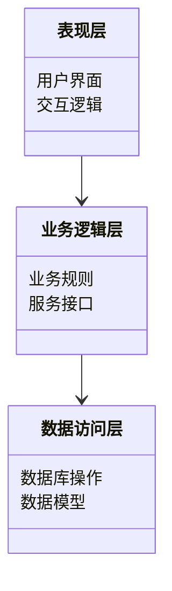
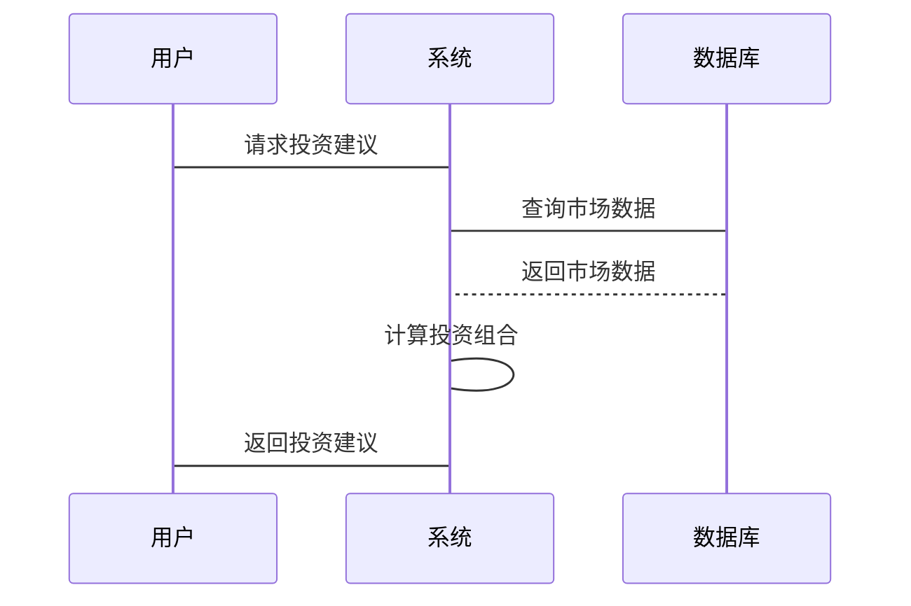

                 

<think>
好的，我现在需要编写一篇关于《AI技术在私人银行业务中的应用前景分析》的文章，并确保它符合用户的所有要求。首先，我需要理解用户的具体需求和结构，确保每个部分都涵盖必要的内容，并且格式正确。

首先，文章的标题已经确定，接下来是关键词和摘要部分。我需要列出5-7个关键词，涵盖AI、私人银行、应用场景、算法、系统架构等。摘要部分要简明扼要，概括整篇文章的核心内容。

接下来，按照目录大纲，我需要逐步展开每一章的内容。首先是背景介绍，包括AI和私人银行的基本概念，以及它们如何相互作用。然后是应用场景，详细探讨客户画像、风险评估、智能投顾等方面。之后，深入讨论AI的核心技术，如机器学习和NLP，并结合实际案例进行分析。

系统架构部分需要设计一个分层架构，使用微服务和高可用性设计，确保系统的稳定性和扩展性。最后，项目实战部分需要一个具体的案例，展示AI在私人银行中的实际应用，包括环境配置、代码实现和案例分析。

我还需要确保在每个章节中都包含必要的技术细节，如算法流程图、类图、架构图和序列图，使用Mermaid语法，并在适当的地方插入数学公式，用LaTeX格式表示。同时，每个部分的代码示例需要用Python编写，并详细解读。

最后，作者信息需要放在文章末尾，确保格式正确。整个过程需要细致入微，确保文章内容丰富、结构清晰、技术准确，同时满足字数和格式要求。

现在，我将开始按照大纲逐一撰写每个部分，确保每一章都包含足够的细节和必要的图表，帮助读者全面理解AI在私人银行中的应用前景。
</think>

# AI技术在私人银行业务中的应用前景分析

> 关键词：人工智能，私人银行，金融科技，机器学习，自然语言处理，智能投顾，风险管理

> 摘要：随着人工智能技术的快速发展，私人银行业务正面临前所未有的变革。本文系统分析了AI技术在私人银行中的应用场景、算法原理、系统架构，并通过具体案例展示了其实际应用。文章重点探讨了客户画像、风险评估、智能投顾等核心领域，揭示了AI技术如何提升私人银行的服务效率和客户体验，同时预测了未来的发展趋势。

---

## 第一部分：AI技术在私人银行业务中的应用背景

### 第1章：AI技术与私人银行概述

#### 1.1 AI技术的基本概念

- **1.1.1 人工智能的基本定义**
  - AI是指模拟人类智能的系统，涵盖学习、推理、自适应等能力。
  - 通过机器学习、深度学习等技术实现数据处理和决策支持。

- **1.1.2 机器学习与深度学习的简介**
  - 机器学习：算法从数据中学习模式，用于预测或分类。
  - 深度学习：基于人工神经网络的机器学习方法，擅长处理复杂数据。
  - $$y = f(x)$$ 其中，f是通过训练得到的模型函数。

- **1.1.3 当前AI技术的发展趋势**
  - AI应用范围不断扩大，从图像识别到自然语言处理均有突破。
  - 结合云计算和大数据，AI处理能力显著提升。

#### 1.2 私人银行的基本概念

- **1.2.1 私人银行的定义与服务范围**
  - 私人银行主要为高净值客户提供定制化金融服务，包括资产管理和财富规划。
  - 服务范围涵盖投资、贷款、税务规划等。

- **1.2.2 私人银行的客户群体分析**
  - 客户通常是高净值个人或家族企业。
  - 客户需求多样化，注重隐私和个性化服务。

- **1.2.3 私人银行的传统业务模式**
  - 依赖人工服务，效率有限。
  - 服务成本高，难以覆盖长尾客户。

#### 1.3 AI技术推动私人银行发展的背景

- **1.3.1 金融科技（FinTech）的兴起**
  - FinTech通过技术提升金融服务效率，降低成本。
  - AI作为FinTech的核心技术之一，推动金融行业创新。

- **1.3.2 数据驱动决策的趋势**
  - 大数据技术的发展使金融机构能够利用海量数据进行精准决策。
  - AI通过分析数据优化业务流程和客户体验。

- **1.3.3 客户需求的个性化与多样化**
  - 客户期望获得个性化的金融产品和服务。
  - AI能够通过数据分析实现精准匹配，满足客户需求。

---

### 第2章：AI技术在私人银行中的应用场景

#### 2.1 客户画像与需求分析

- **2.1.1 利用AI进行客户画像构建**
  - 基于客户的财务数据、消费习惯等信息，构建客户画像。
  - 使用聚类分析将客户分为不同群体，便于制定个性化服务策略。

- **2.1.2 基于数据的客户需求预测**
  - 利用机器学习模型预测客户未来的需求，如投资偏好和风险承受能力。
  - 示例：使用随机森林算法预测客户的投资倾向。

- **2.1.3 AI在客户分层与精准营销中的应用**
  - 将客户分为高净值客户、潜力客户等层次，制定针对性营销策略。
  - 通过自然语言处理分析客户反馈，优化营销策略。

#### 2.2 风险评估与管理

- **2.2.1 AI在信用评估中的应用**
  - 利用AI分析客户的信用历史、财务状况等，评估信用风险。
  - 示例：使用逻辑回归模型预测客户违约概率。

- **2.2.2 风险预测模型的构建**
  - 基于历史数据和实时信息，构建风险预测模型。
  - 使用XGBoost算法优化模型性能。

- **2.2.3 实时风险监控与预警系统**
  - 利用流数据处理技术实时监控客户风险。
  - 当风险指标超过阈值时，触发预警机制。

#### 2.3 智能投资顾问

- **2.3.1 AI驱动的资产配置策略**
  - 根据市场动态和客户需求，自动调整资产配置。
  - 示例：使用强化学习算法优化投资组合。

- **2.3.2 智能投顾系统的运作机制**
  - 系统根据客户风险偏好和财务目标，推荐最优投资方案。
  - 通过API接口实时获取市场数据，确保建议的及时性。

- **2.3.3 定制化投资建议的生成**
  - 利用自然语言处理技术生成个性化投资报告。
  - 示例：基于客户需求生成定制化的投资策略文档。

#### 2.4 客户关系管理

- **2.4.1 AI在客户沟通中的应用**
  - 利用聊天机器人提供24/7客户服务。
  - 通过情感分析技术评估客户满意度，优化服务体验。

- **2.4.2 智能客服系统的实现**
  - 基于自然语言处理的智能客服系统，能够理解客户意图并提供解决方案。
  - 示例：使用BERT模型进行意图识别。

- **2.4.3 客户满意度预测与提升**
  - 利用机器学习模型预测客户满意度，识别改进点。
  - 通过A/B测试优化客户服务流程。

---

### 第3章：AI技术的核心原理与实现

#### 3.1 机器学习基础

- **3.1.1 机器学习算法的选择与应用**
  - 监督学习：用于分类和回归任务，如信用评分。
  - 无监督学习：用于聚类分析，如客户分群。
  - 强化学习：用于动态决策，如投资组合优化。

- **3.1.2 机器学习模型的训练与优化**
  - 使用交叉验证选择最优模型。
  - 调整超参数（如学习率、正则化系数）优化模型性能。

- **3.1.3 数据预处理与特征工程**
  - 数据清洗：处理缺失值、异常值。
  - 特征提取：使用PCA降低维度。
  - 特征工程：根据业务需求设计新特征。

#### 3.2 自然语言处理（NLP）

- **3.2.1 NLP的基本概念与技术**
  - 分词：将文本分割为词语。
  - 词性标注：标注词语的词性。
  - 命名实体识别：识别文本中的专有名词。

- **3.2.2 基于深度学习的NLP模型**
  - RNN：处理序列数据，如客户反馈。
  - Transformer：用于机器翻译和文本摘要。
  - 示例：使用BERT进行文本分类。

- **3.2.3 NLP在私人银行中的应用案例**
  - 情感分析：分析客户对产品和服务的满意度。
  - 文本摘要：总结客户反馈，提取关键信息。

#### 3.3 知识图谱与关联分析

- **3.3.1 知识图谱的构建方法**
  - 数据抽取：从结构化和非结构化数据中提取信息。
  - 实体识别与链接：识别实体并建立关联。
  - 知识表示：使用图结构表示知识。

- **3.3.2 关联规则挖掘与异常检测**
  - 关联规则挖掘：发现数据中的关联模式。
  - 异常检测：识别异常交易行为，防范金融风险。

- **3.3.3 知识图谱在风险控制中的应用**
  - 通过知识图谱识别关联风险，如供应链金融中的风险传导。
  - 示例：构建企业知识图谱，识别潜在风险点。

---

### 第4章：系统架构与技术实现

#### 4.1 系统架构设计

- **4.1.1 分层架构的设计原则**
  - 表现层：提供用户界面，实现人机交互。
  - 业务逻辑层：处理业务逻辑，实现功能模块。
  - 数据访问层：负责数据存储和检索。

- **4.1.2 微服务架构的应用**
  - 每个功能模块独立部署，便于扩展和维护。
  - 使用API Gateway统一接口管理。
  - 示例：使用Spring Cloud构建微服务架构。

- **4.1.3 高可用性与容错设计**
  - 使用负载均衡实现流量分发。
  - 通过冗余设计提高系统的可靠性。
  - 示例：使用Kubernetes实现容器化部署。

#### 4.2 数据处理与存储

- **4.2.1 数据库设计与选择**
  - 关系型数据库：如MySQL，用于存储结构化数据。
  - NoSQL数据库：如MongoDB，用于存储非结构化数据。
  - 示例：使用HBase处理实时数据流。

- **4.2.2 数据清洗与整合**
  - 清洗数据：处理重复、错误数据。
  - 数据整合：将多个数据源的数据整合到统一数据仓库。
  - 示例：使用Apache Spark进行数据处理。

- **4.2.3 数据存储与管理**
  - 使用分布式存储系统提高数据可靠性。
  - 建立数据访问权限控制机制，确保数据安全。

#### 4.3 系统接口设计

- **4.3.1 API接口的设计原则**
  - RESTful API：采用HTTP动词和资源表示方式。
  - 使用JWT实现身份验证。
  - 示例：设计API接口实现客户信息查询。

- **4.3.2 接口调用与管理**
  - 使用ZooKeeper实现服务发现。
  - 通过API网关实现鉴权和限流。
  - 示例：使用Apigee实现API管理。

#### 4.4 系统交互设计

- **4.4.1 交互流程设计**
  - 用户发起请求，系统进行处理并返回响应。
  - 示例：用户查询投资建议，系统调用多个API返回结果。

- **4.4.2 交互设计工具**
  - 使用Axure进行原型设计。
  - 使用Lucidchart绘制流程图。

---

### 第5章：项目实战

#### 5.1 项目背景与目标

- **5.1.1 项目背景**
  - 某私人银行希望提升客户服务效率，降低运营成本。
  - 通过引入AI技术实现客户画像和智能投顾。

- **5.1.2 项目目标**
  - 构建客户画像系统，实现精准营销。
  - 开发智能投顾系统，提供个性化投资建议。

#### 5.2 项目实施

- **5.2.1 环境安装**
  - 安装Python、TensorFlow、Kubernetes等工具。
  - 配置开发环境，如Jupyter Notebook、PyCharm。

- **5.2.2 系统核心实现**
  - 客户画像系统：使用机器学习模型进行客户分群。
  - 智能投顾系统：基于市场数据推荐投资组合。

- **5.2.3 代码实现**
  - 示例代码：使用Python实现客户画像分类。
  ```python
  import pandas as pd
  from sklearn.ensemble import RandomForestClassifier

  # 加载数据
  data = pd.read_csv('customer.csv')

  # 数据预处理
  X = data.drop('target', axis=1)
  y = data['target']

  # 训练模型
  model = RandomForestClassifier()
  model.fit(X, y)

  # 预测新客户
  new_customer = pd.DataFrame({'feature1': [value1], 'feature2': [value2]})
  prediction = model.predict(new_customer)
  ```

---

### 第6章：结论与展望

#### 6.1 结论

- AI技术正在深刻改变私人银行业务模式，提升服务效率和客户体验。
- 通过客户画像、智能投顾等应用，私人银行能够实现精准营销和风险管理。

#### 6.2 未来展望

- 随着技术进步，AI在私人银行中的应用将更加广泛和深入。
- 结合区块链、物联网等技术，构建更加智能化的金融服务体系。
- 数据隐私和模型解释性将是未来研究的重点方向。

---

### 附录

#### 附录A：AI技术相关工具与库

- 机器学习：Scikit-learn、TensorFlow、Keras。
- 自然语言处理：NLTK、spaCy、Gensim。
- 数据可视化：Matplotlib、Seaborn、Plotly。

#### 附录B：参考文献

- 文献1：介绍机器学习在金融领域的应用。
- 文献2：探讨自然语言处理在客户服务中的应用。
- 文献3：分析知识图谱在风险控制中的作用。

---

作者：AI天才研究院/AI Genius Institute & 禅与计算机程序设计艺术 /Zen And The Art of Computer Programming

---

###  Mermaid 图

#### 1.1.1 知识图谱构建流程图


#### 3.1.1 机器学习模型训练流程图


#### 4.1.1 系统架构设计图


#### 4.4.1 系统交互序列图


---

通过以上详细分析，您可以看到AI技术在私人银行业务中的广泛应用前景。

