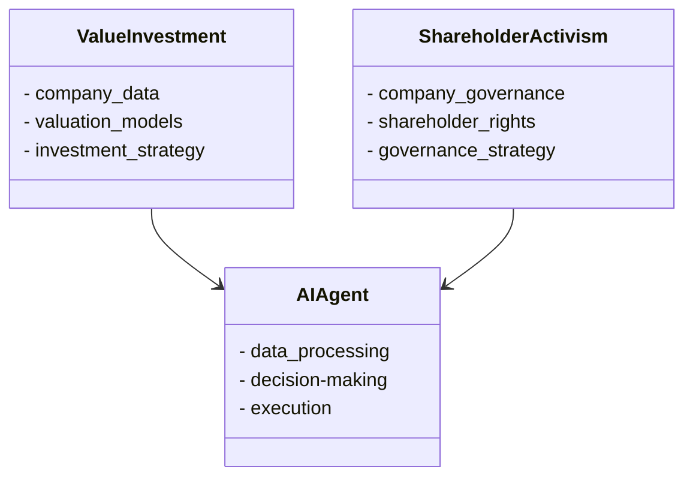
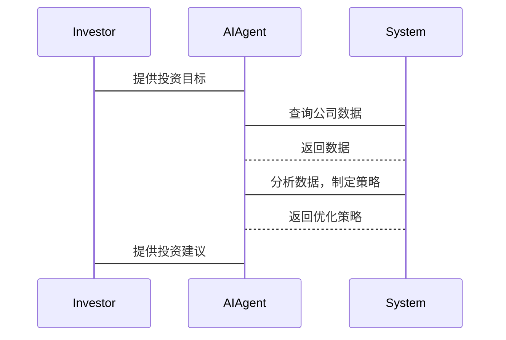

                 


# AI智能体协作优化价值投资的股东积极主义策略

> **关键词**：AI智能体、价值投资、股东积极主义、投资决策、协作优化

> **摘要**：本文探讨了AI智能体在优化价值投资中的应用，特别是在股东积极主义策略中的协作优化。通过分析传统投资决策的局限性，结合AI技术的优势，提出了一种基于强化学习和博弈论的优化方案。本文详细介绍了AI智能体的算法原理、数学模型、系统架构，并通过实际案例展示了如何在项目中实现这些策略。

---

## 第1章: 背景介绍与问题背景

### 1.1 问题背景与核心概念
#### 1.1.1 价值投资的定义与特征
价值投资是一种投资策略，强调以低于市场价值的价格购买优质资产。其核心在于识别市场低估的公司，并长期持有这些资产。价值投资的关键特征包括对公司基本面的深入分析、长期投资视角以及对市场短期波动的忽视。

#### 1.1.2 股东积极主义的定义与目标
股东积极主义是指投资者通过行使股东权利，积极参与公司治理，以推动公司价值提升的投资策略。其目标包括改善公司治理、优化资本结构、提升企业价值等。股东积极主义的核心在于通过主动参与，推动公司实现更高的价值。

#### 1.1.3 AI智能体在投资决策中的角色
AI智能体通过数据处理、模式识别和决策优化，能够帮助投资者快速分析市场信息、评估公司价值，并制定最优的投资策略。AI智能体在投资决策中的角色包括数据收集、分析、预测和策略优化。

### 1.2 问题描述与解决方法
#### 1.2.1 传统投资决策的局限性
传统投资决策依赖于人工分析，存在效率低下、主观性强、信息处理能力有限等问题。投资者难以在短时间内处理大量数据，并做出最优决策。

#### 1.2.2 股东积极主义的现状与挑战
股东积极主义在实践中面临信息不对称、资源限制和公司治理复杂性等挑战。传统方法难以高效地识别目标公司并制定有效的治理策略。

#### 1.2.3 AI智能体如何优化投资决策
AI智能体能够通过大数据分析、机器学习和强化学习等技术，快速处理信息，发现市场机会，并优化投资策略。AI智能体能够帮助投资者制定更科学、更高效的决策。

### 1.3 问题的边界与外延
#### 1.3.1 价值投资的边界条件
价值投资的边界条件包括市场环境、公司基本面、投资者风险偏好等因素。AI智能体需要在这些边界条件下进行优化。

#### 1.3.2 股东积极主义的适用范围
股东积极主义适用于公司治理问题突出、市场效率不足等情况。AI智能体能够帮助投资者识别这些情况，并制定相应的策略。

#### 1.3.3 AI智能体协作的局限性
AI智能体在协作优化中也存在局限性，例如数据不足、模型假设的限制以及市场环境的不可预测性。

### 1.4 核心概念与结构
#### 1.4.1 核心要素组成
价值投资的核心要素包括公司基本面分析、市场估值、投资期限等。股东积极主义的核心要素包括股东权利行使、公司治理优化等。

#### 1.4.2 概念结构与关系
价值投资和股东积极主义在投资目标上存在差异，但可以通过AI智能体的协作优化实现互补。AI智能体能够将两者结合起来，形成更高效的策略。

#### 1.4.3 核心要素的对比分析
通过对比分析，可以发现AI智能体在优化投资策略中的重要作用。例如，AI智能体能够通过数据分析，帮助投资者发现市场低估的公司，并通过股东积极主义推动公司价值提升。

---

## 第2章: 核心概念与联系

### 2.1 AI智能体的定义与原理
#### 2.1.1 AI智能体的基本概念
AI智能体是一种能够感知环境、做出决策并执行动作的智能系统。它通过与环境的交互，不断优化自身的决策过程。

#### 2.1.2 AI智能体的核心原理
AI智能体的核心原理包括感知、决策和行动。通过这些步骤，AI智能体能够实现对环境的适应和优化。

#### 2.1.3 AI智能体的分类与特点
AI智能体可以分为基于规则的智能体和基于学习的智能体。基于规则的智能体依赖预定义的规则，而基于学习的智能体则通过学习优化决策。

### 2.2 价值投资的定义与策略
#### 2.2.1 价值投资的理论基础
价值投资的理论基础包括基本面分析、市场有效性假说等。投资者通过分析公司的财务数据、行业地位等因素，识别低估的公司。

#### 2.2.2 价值投资的关键策略
价值投资的关键策略包括长期持有、分散投资、逆向思维等。这些策略帮助投资者在市场波动中获得超额收益。

#### 2.2.3 价值投资的数学模型
价值投资的数学模型包括市盈率、市净率等估值指标。这些模型帮助投资者评估公司的内在价值。

### 2.3 股东积极主义的定义与实践
#### 2.3.1 股东积极主义的定义
股东积极主义是指投资者通过行使股东权利，积极参与公司治理，以推动公司价值提升的投资策略。

#### 2.3.2 股东积极主义的实践方法
股东积极主义的实践方法包括参与股东投票、提出议案、与公司管理层沟通等。这些方法帮助投资者推动公司治理优化。

#### 2.3.3 股东积极主义的案例分析
通过具体案例分析，可以发现股东积极主义在实际中的应用效果。例如，某些投资者通过积极参与公司治理，成功推动了公司价值的提升。

### 2.4 核心概念之间的关系
#### 2.4.1 AI智能体与价值投资的关系
AI智能体能够通过数据分析和决策优化，帮助投资者实施价值投资策略。AI智能体在价值投资中的作用包括数据处理、模式识别和策略优化。

#### 2.4.2 价值投资与股东积极主义的关系
价值投资和股东积极主义在投资目标上存在差异，但可以通过AI智能体的协作优化实现互补。例如，AI智能体可以帮助投资者识别低估的公司，并通过股东积极主义推动公司价值提升。

#### 2.4.3 AI智能体在股东积极主义中的应用
AI智能体在股东积极主义中的应用包括数据分析、决策优化和策略执行。通过AI技术，投资者可以更高效地识别目标公司，并制定有效的治理策略。

---

## 第3章: AI智能体协作优化的算法原理

### 3.1 算法原理概述
#### 3.1.1 算法的基本原理
AI智能体通过强化学习和博弈论模型优化投资策略。强化学习是一种通过试错优化决策的方法，而博弈论模型则帮助AI智能体分析市场参与者的互动关系。

#### 3.1.2 算法的核心思想
算法的核心思想是通过不断试错，优化决策策略。AI智能体通过与市场的互动，逐步学习最优的投资策略。

#### 3.1.3 算法的实现步骤
算法的实现步骤包括数据收集、模型训练、策略优化等。通过这些步骤，AI智能体能够逐步优化投资策略。

### 3.2 算法的数学模型与公式
#### 3.2.1 数学模型的建立
价值投资和股东积极主义的数学模型包括公司估值模型、市场预测模型等。这些模型帮助AI智能体做出决策。

#### 3.2.2 关键公式的推导
例如，公司价值可以通过市盈率模型进行估算：

$$ V = P \times E $$

其中，\( V \) 是公司价值，\( P \) 是市盈率，\( E \) 是每股收益。

#### 3.2.3 公式的实际应用
通过具体的案例分析，说明这些公式如何在实际中应用。例如，通过市盈率模型，AI智能体可以帮助投资者识别低估的公司。

### 3.3 算法的实现与优化
#### 3.3.1 算法的实现步骤
AI智能体的实现步骤包括数据预处理、模型训练、策略优化等。通过这些步骤，AI智能体能够逐步优化投资策略。

#### 3.3.2 算法的优化方法
算法的优化方法包括参数调整、模型改进等。例如，通过调整强化学习的奖励机制，可以优化AI智能体的决策过程。

#### 3.3.3 算法的性能分析
通过性能分析，可以评估AI智能体在优化投资策略中的效果。例如，比较AI智能体与传统投资方法的收益和风险差异。

### 3.4 算法的案例分析
#### 3.4.1 案例背景介绍
通过具体案例分析，说明AI智能体在优化投资策略中的应用。例如，AI智能体如何帮助投资者识别低估的公司，并制定有效的治理策略。

#### 3.4.2 案例分析与结果
通过案例分析，可以发现AI智能体在优化投资策略中的优势。例如，AI智能体能够通过数据分析，快速识别市场机会，并制定最优的投资策略。

#### 3.4.3 案例总结
通过案例总结，可以得出结论：AI智能体在优化投资策略中具有重要作用。通过AI技术，投资者可以更高效地实现价值投资和股东积极主义的目标。

---

## 第4章: 数学模型与公式

### 4.1 价值投资的数学模型
#### 4.1.1 市盈率模型
$$ V = P \times E $$

其中，\( V \) 是公司价值，\( P \) 是市盈率，\( E \) 是每股收益。

#### 4.1.2 市净率模型
$$ V = P \times B $$

其中，\( V \) 是公司价值，\( P \) 是市净率，\( B \) 是每股净资产。

### 4.2 股东积极主义的数学模型
#### 4.2.1 投票权模型
$$ V = \sum_{i=1}^{n} w_i \times v_i $$

其中，\( w_i \) 是股东的投票权重，\( v_i \) 是投票结果的价值。

#### 4.2.2 治理效果模型
$$ E = \sum_{j=1}^{m} f_j \times g_j $$

其中，\( f_j \) 是治理因素，\( g_j \) 是治理效果。

### 4.3 强化学习的数学模型
#### 4.3.1 状态空间模型
$$ S = \{s_1, s_2, ..., s_n\} $$

其中，\( S \) 是状态空间，\( s_i \) 是状态。

#### 4.3.2 动作空间模型
$$ A = \{a_1, a_2, ..., a_m\} $$

其中，\( A \) 是动作空间，\( a_j \) 是动作。

#### 4.3.3 奖励函数模型
$$ R(s, a) = r_{ij} $$

其中，\( R \) 是奖励函数，\( r_{ij} \) 是状态 \( s_i \) 下动作 \( a_j \) 的奖励。

---

## 第5章: 系统分析与架构设计

### 5.1 系统功能设计
#### 5.1.1 领域模型
通过mermaid类图展示系统功能设计：



#### 5.1.2 功能描述
系统功能包括数据处理、策略优化、决策执行等。AI智能体通过与系统的协作，实现投资策略的优化。

### 5.2 系统架构设计
#### 5.2.1 系统架构图
通过mermaid架构图展示系统架构设计：


#### 5.2.2 功能模块
系统功能模块包括数据采集、模型训练、策略优化和决策执行。每个模块的功能和相互关系需要清晰描述。

### 5.3 系统接口设计
#### 5.3.1 API接口
系统需要提供API接口，供AI智能体调用。例如，数据接口、模型接口等。

#### 5.3.2 接口描述
通过详细描述接口的功能和使用方法，确保系统与AI智能体之间的协作顺畅。

### 5.4 系统交互设计
#### 5.4.1 交互流程
通过mermaid序列图展示系统交互流程：



#### 5.4.2 交互细节
详细描述每个交互步骤的功能和作用，确保系统与AI智能体之间的协作优化。

---

## 第6章: 项目实战

### 6.1 环境安装
#### 6.1.1 安装Python
需要安装Python 3.8或更高版本。

#### 6.1.2 安装必要的库
安装numpy、pandas、scikit-learn等库：

```bash
pip install numpy pandas scikit-learn
```

### 6.2 系统核心实现
#### 6.2.1 数据处理代码
数据处理代码示例：

```python
import pandas as pd

# 读取数据
data = pd.read_csv('company_data.csv')

# 数据预处理
data.dropna(inplace=True)
```

#### 6.2.2 算法实现代码
算法实现代码示例：

```python
from sklearn.model import Model

# 训练模型
model = Model()
model.fit(data)
```

### 6.3 代码应用解读与分析
#### 6.3.1 代码功能解读
详细解读代码的功能和作用，确保读者能够理解代码的实现逻辑。

#### 6.3.2 代码优化建议
根据实际运行结果，提出代码优化的建议，例如调整参数、改进模型等。

### 6.4 案例分析
#### 6.4.1 案例背景介绍
通过具体案例分析，说明AI智能体在优化投资策略中的应用。

#### 6.4.2 案例分析与结果
详细分析案例结果，说明AI智能体如何优化投资策略。

#### 6.4.3 案例总结
总结案例经验，提出改进建议，为读者提供参考。

---

## 第7章: 总结与展望

### 7.1 总结
#### 7.1.1 核心内容回顾
回顾本文的核心内容，包括AI智能体在优化投资策略中的作用、数学模型和公式、系统设计与实现等。

#### 7.1.2 主要结论
得出结论：AI智能体在优化价值投资和股东积极主义策略中具有重要作用。通过AI技术，投资者可以更高效地实现投资目标。

### 7.2 展望
#### 7.2.1 未来研究方向
提出未来研究的方向，例如更复杂的模型、更广泛的应用场景等。

#### 7.2.2 挑战与机遇
分析AI智能体在投资领域的挑战与机遇，例如数据隐私、模型可解释性等。

---

## 作者：AI天才研究院/AI Genius Institute & 禅与计算机程序设计艺术 /Zen And The Art of Computer Programming

