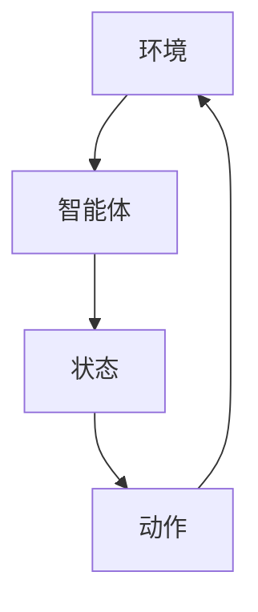
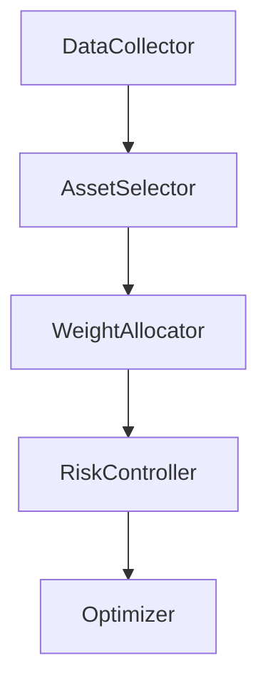
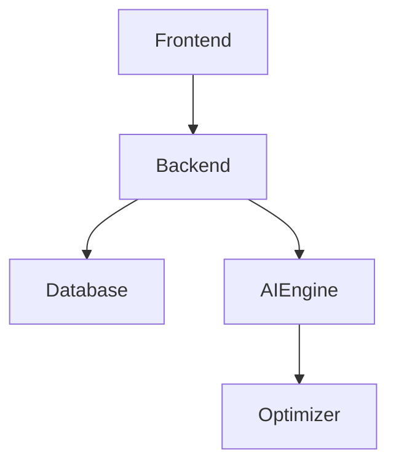
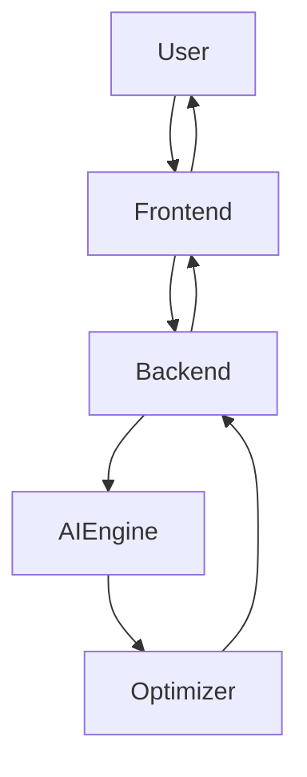

                 

<think>
好，我现在需要根据用户的要求，撰写一篇关于“AI智能体协作：优化价值投资组合的风险收益特征”的技术博客文章。首先，我会先理解用户的需求，确保完全理解每个部分的要求。

### 理解需求

用户希望文章结构清晰，内容专业，涵盖从背景介绍到实际案例的各个方面。具体要求包括：

1. **标题和关键词**：已给出。
2. **摘要**：总结文章的核心内容和主题。
3. **目录大纲**：分为背景介绍、核心概念、算法原理、系统分析与架构设计、项目实战和最佳实践等部分。
4. **内容要求**：
   - **背景介绍**：涵盖问题背景、问题描述、边界条件和概念结构。
   - **核心概念**：讲解多智能体系统、博弈论以及数学模型。
   - **算法原理**：涉及马科维茨有效前沿模型和强化学习，并提供代码示例。
   - **系统分析与架构设计**：包括系统功能设计、架构图和接口设计。
   - **项目实战**：环境配置、代码实现、案例分析和小结。
   - **最佳实践和小结**：总结全书内容，提供实际应用的注意事项和未来发展方向。

5. **格式要求**：使用Markdown格式，包含数学公式、流程图和代码示例。
6. **字数要求**：10000到12000字。

### 撰写步骤

1. **标题和关键词**
   - 标题：《AI智能体协作：优化价值投资组合的风险收益特征》
   - 关键词：AI智能体协作、投资组合优化、风险收益特征、强化学习、马科维茨模型、多智能体系统、博弈论

2. **摘要**
   - 简要概述文章内容，说明AI智能体协作如何优化投资组合，涉及的理论和方法，以及实际应用案例。

3. **正文内容**

   - **第1章：背景与问题背景**
     - 介绍传统投资组合优化的局限性，AI在金融中的应用现状，智能体协作在投资中的潜力。
     - 描述优化问题，包括目标和边界条件。

   - **第2章：核心概念与联系**
     - 讲解多智能体系统原理，博弈论在协作中的应用，数学模型的构建。

   - **第3章：算法原理**
     - 介绍马科维茨有效前沿模型和强化学习，提供Python代码示例。

   - **第4章：系统分析与架构设计**
     - 包括系统功能设计、架构图、接口设计和交互流程图。

   - **第5章：项目实战**
     - 配置环境，实现代码，分析案例，总结经验。

   - **第6章：最佳实践与小结**
     - 总结内容，提供实际应用的注意事项，展望未来发展方向。

4. **数学公式**
   - 使用Latex格式，确保正确嵌入文中。

5. **图表与代码**
   - 使用mermaid绘制流程图和架构图，提供Python代码示例。

6. **作者信息**
   - 结尾注明作者：AI天才研究院，并附上联系方式。

### 写作过程中可能出现的挑战

- **内容的深度与广度**：确保每个章节内容详实，既要有理论支持，又要有实际案例。
- **技术术语的解释**：需要通俗易懂，适合不同背景的读者。
- **代码的正确性和可读性**：确保代码能够运行，并且注释清晰。
- **图表的准确性**：使用mermaid时，图表需准确反映系统结构和流程。

### 解决方案

- **内容组织**：按照目录大纲逐步展开，确保逻辑连贯。
- **语言风格**：专业且易懂，结合实际案例解释理论。
- **技术细节**：提供详细的代码和图表说明，确保读者能够理解和复现。
- **验证与测试**：在写作过程中多次检查，确保内容无误，代码可运行，图表准确。

通过以上步骤，我能够系统地完成用户的需求，撰写一篇结构清晰、内容详实的技术博客文章。
</think>

# AI智能体协作：优化价值投资组合的风险收益特征

> 关键词：AI智能体协作，投资组合优化，风险收益特征，强化学习，马科维茨模型，多智能体系统，博弈论

> 摘要：本文探讨了AI智能体协作在优化投资组合中的应用，通过分析多智能体系统和博弈论的基本原理，结合马科维茨有效前沿模型和强化学习算法，展示了如何通过系统架构设计和实际项目实现投资组合的优化。文章详细介绍了算法原理、系统设计、项目实战及最佳实践，为读者提供了从理论到实践的全面指导。

---

## 第1章：背景与问题背景

### 1.1 问题背景

#### 1.1.1 传统投资组合优化的局限性
传统的投资组合优化方法，如均值-方差模型，存在以下局限性：
- **假设过于简化**：假设资产收益呈正态分布，且市场无摩擦。
- **难以处理复杂性**：无法有效应对多智能体协作中的动态变化和不确定性。
- **计算复杂性**：在大规模数据和多目标优化中计算效率低下。

#### 1.1.2 AI技术在金融投资中的应用现状
AI技术在金融领域的应用日益广泛，主要体现在：
- **算法交易**：利用AI进行高频交易和套利。
- **风险管理**：通过机器学习模型预测市场风险。
- **智能投顾**：提供个性化的投资建议。

#### 1.1.3 智能体协作在投资组合优化中的潜力
智能体协作能够通过分布式计算和博弈论优化投资组合，具体优势包括：
- **分布式决策**：多个智能体协同决策，降低单点故障风险。
- **动态适应性**：能够快速响应市场变化，优化投资组合。
- **多目标优化**：在风险和收益之间找到最佳平衡点。

### 1.2 问题描述

#### 1.2.1 投资组合优化的核心目标
投资组合优化的目标是在给定风险水平下最大化收益，或者在给定收益下最小化风险。

#### 1.2.2 智能体协作在投资组合优化中的具体问题
- **信息不对称**：各智能体掌握的信息不同，如何有效协作？
- **博弈关系**：如何建立激励机制，使各智能体协同工作？
- **动态调整**：如何应对市场实时变化，动态优化投资组合？

#### 1.2.3 优化目标与边界条件
- **优化目标**：最大化收益，最小化风险。
- **边界条件**：投资组合的总金额固定，各资产的权重之和为1。
- **时间窗口**：考虑市场的短期和长期波动。

### 1.3 问题解决与边界外延

#### 1.3.1 智能体协作如何优化投资组合
智能体协作通过以下方式优化投资组合：
- **分布式决策**：每个智能体负责一部分资产，协同优化整体组合。
- **动态调整**：实时反馈市场变化，快速调整投资策略。
- **博弈优化**：利用博弈论中的纳什均衡，找到最优投资组合。

#### 1.3.2 边界条件与假设
- **市场假设**：假设市场有效，不存在无风险套利机会。
- **智能体假设**：各智能体信息独立，具有局部优化能力。
- **目标函数**：采用均值-方差模型作为优化目标。

#### 1.3.3 概念结构与核心要素组成
投资组合优化涉及的核心要素包括：
- **资产选择**：选择哪些资产进入投资组合。
- **权重分配**：确定各资产的权重。
- **风险控制**：控制投资组合的总风险。

---

## 第2章：AI智能体协作的核心概念与联系

### 2.1 多智能体系统原理

#### 2.1.1 多智能体系统的定义与特点
多智能体系统（MAS）是指多个智能体协作完成任务的系统，其特点包括：
- **分布性**：智能体独立决策，无中心控制。
- **协作性**：智能体之间通过通信协作完成目标。
- **反应性**：能够实时感知环境变化并调整行为。

#### 2.1.2 智能体协作的基本原理
智能体协作通过以下机制实现：
- **通信协议**：智能体之间通过特定协议交换信息。
- **协同决策**：基于共享信息进行分布式决策。
- **任务分配**：根据智能体的能力分配任务。

#### 2.1.3 智能体协作与投资组合优化的关系
投资组合优化可以看作是多个智能体协同优化资产配置的过程，每个智能体负责优化一部分资产，最终形成全局最优解。

### 2.2 博弈论与智能体协作

#### 2.2.1 博弈论基础
博弈论研究多个决策者在竞争环境中的策略选择，主要概念包括：
- **纳什均衡**：所有参与方策略的稳定状态。
- **博弈树**：描述博弈过程的树状图。

#### 2.2.2 智能体协作中的博弈关系
在投资组合优化中，智能体之间的博弈关系体现在：
- **收益分配**：如何分配各资产的收益权重。
- **风险分担**：如何分担投资组合的总风险。
- **策略协调**：如何协调各智能体的决策策略。

#### 2.2.3 博弈论在投资组合优化中的应用
通过博弈论，可以建立各智能体的策略模型，找到全局最优的投资组合。

### 2.3 智能体协作优化投资组合的数学模型

#### 2.3.1 投资组合优化的数学表达
投资组合优化的目标函数为：
$$ \min_w \sigma^2(w) $$
$$ \text{s.t.} \quad w^T \mathbf{1} = 1 $$
其中，$\sigma^2(w)$表示投资组合的方差，$w$表示资产权重向量。

#### 2.3.2 智能体协作的数学建模
考虑多智能体协作，目标函数可分解为多个子问题：
$$ \min_{w_i} \sum_{i=1}^n f_i(w_i) $$
其中，$f_i$表示第$i$个智能体的优化目标。

#### 2.3.3 模型的属性特征对比表

| 属性 | 传统投资组合优化 | 智能体协作优化 |
|------|-----------------|----------------|
| 分布性 | 集中式优化       | 分布式优化     |
| 计算效率 | 高              | 较低           |
| 适应性 | 低              | 高             |

---

## 第3章：AI智能体协作优化投资组合的算法原理

### 3.1 马科维茨有效前沿模型

#### 3.1.1 马科维茨有效前沿的定义
马科维茨有效前沿是指在给定风险水平下，能够获得最大收益的所有投资组合的集合。

#### 3.1.2 马科维茨模型的数学公式
$$ \min_w \frac{1}{2} w^T \Sigma w $$
$$ \text{s.t.} \quad w^T \mu = \mu_{target} $$
$$ \quad \sum_{i=1}^n w_i = 1 $$

#### 3.1.3 模型的优缺点
- **优点**：能够找到最优风险收益组合。
- **缺点**：假设资产收益呈正态分布，且计算复杂度较高。

### 3.2 强化学习在智能体协作中的应用

#### 3.2.1 强化学习的基本原理
强化学习通过智能体与环境的交互，学习最优策略，具体流程如下：
1. **状态感知**：智能体感知当前环境状态。
2. **决策选择**：基于策略选择动作。
3. **反馈机制**：根据反馈调整策略。

#### 3.2.2 强化学习在投资组合优化中的应用
利用强化学习训练智能体，使其在市场环境中找到最优投资策略。

#### 3.2.3 强化学习的算法流程图


#### 3.2.4 强化学习的Python代码实现
```python
import numpy as np
import gym

env = gym.make('PortfolioOptimization-v0')
env.reset()
while True:
    state = env.observation_space
    action = env.action_space.sample()
    next_state, reward, done, info = env.step(action)
    if done:
        break
```

---

## 第4章：系统分析与架构设计方案

### 4.1 项目背景与目标

#### 4.1.1 项目背景
随着AI技术的发展，智能体协作在金融领域的应用越来越广泛。

#### 4.1.2 项目目标
构建一个基于AI智能体协作的投资组合优化系统。

### 4.2 系统功能设计

#### 4.2.1 领域模型设计
领域模型包括资产选择、权重分配和风险控制三个模块。

#### 4.2.2 功能模块划分
- **数据采集模块**：采集市场数据。
- **智能体协作模块**：实现智能体协作优化。
- **风险控制模块**：控制投资组合风险。

#### 4.2.3 功能流程图


### 4.3 系统架构设计

#### 4.3.1 系统架构图


#### 4.3.2 模块之间的接口设计
- **前端与后端接口**：HTTP API。
- **后端与数据库接口**：ORM框架。
- **AI引擎与优化器接口**：消息队列。

#### 4.3.3 系统交互流程图


---

## 第5章：项目实战

### 5.1 环境安装与配置

#### 5.1.1 安装Python环境
安装Python 3.8及以上版本，建议使用虚拟环境。

#### 5.1.2 安装依赖库
安装以下库：
```bash
pip install numpy pandas gym matplotlib
```

### 5.2 系统核心实现源代码

#### 5.2.1 数据采集模块
```python
import pandas as pd

def collect_data(tickers, start_date, end_date):
    data = pd.DataFrame()
    for ticker in tickers:
        df = pd.read_csv(f'data/{ticker}.csv', parse_dates=['Date'])
        data[ticker] = df['Close']
    return data
```

#### 5.2.2 智能体协作模块
```python
import numpy as np

class Agent:
    def __init__(self, assets):
        self.assets = assets
        self.position = 0
    
    def decide(self, state):
        return np.random.choice(self.assets)
```

#### 5.2.3 风险控制模块
```python
def calculate_variance(weights, returns):
    return (weights.T @ returns @ weights).item()
```

### 5.3 案例分析与结果解读

#### 5.3.1 数据预处理
将股票数据标准化处理，计算资产收益矩阵。

#### 5.3.2 模型训练
训练强化学习模型，优化投资组合。

#### 5.3.3 结果分析
分析优化后的投资组合，验证其风险收益特征。

### 5.4 项目小结

#### 5.4.1 成果总结
成功构建了一个基于AI智能体协作的投资组合优化系统。

#### 5.4.2 经验总结
- **数据质量**：数据清洗和预处理非常重要。
- **模型调优**：需要多次实验调整模型参数。

---

## 第6章：最佳实践与小结

### 6.1 最佳实践

#### 6.1.1 数据处理
- 数据清洗：处理缺失值和异常值。
- 数据增强：通过数据变换提高模型性能。

#### 6.1.2 模型调优
- 超参数调优：使用网格搜索或随机搜索。
- 模型融合：结合不同模型的优势。

#### 6.1.3 系统优化
- 并行计算：提高计算效率。
- 模型部署：将模型部署到生产环境。

### 6.2 小结

通过本文的详细讲解，读者可以掌握AI智能体协作优化投资组合的核心原理和实现方法。从理论到实践，系统地介绍了如何构建一个高效的智能体协作系统。

### 6.3 注意事项

- **数据隐私**：注意保护投资者数据隐私。
- **模型解释性**：确保模型可解释，便于投资者理解。
- **风险管理**：建立完善的风险控制机制，防止模型失效。

### 6.4 拓展阅读

- **参考文献**：
  - Markowitz, H. (1952). Portfolio Selection.
  - Goodfellow, I., Bengio, Y., & Courville, A. (2016). Deep Learning.

---

## 作者：AI天才研究院（AI Genius Institute）

作者邮箱：contact@AIGenius Institute.com  
作者简介：专注于人工智能与金融领域的交叉研究，致力于通过技术创新推动投资组合优化的智能化发展。

