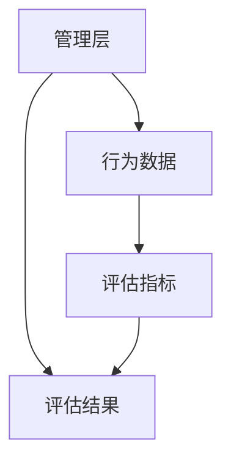
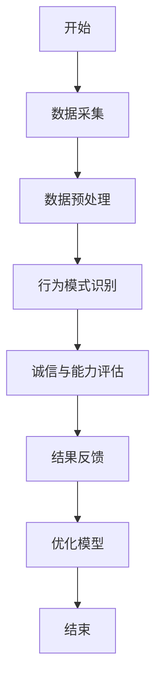
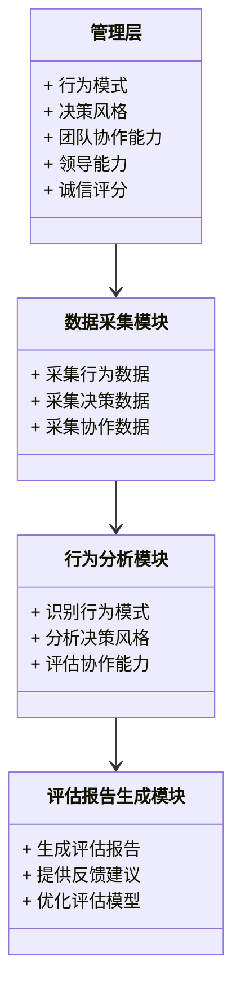
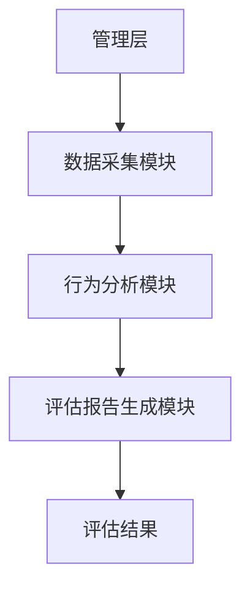
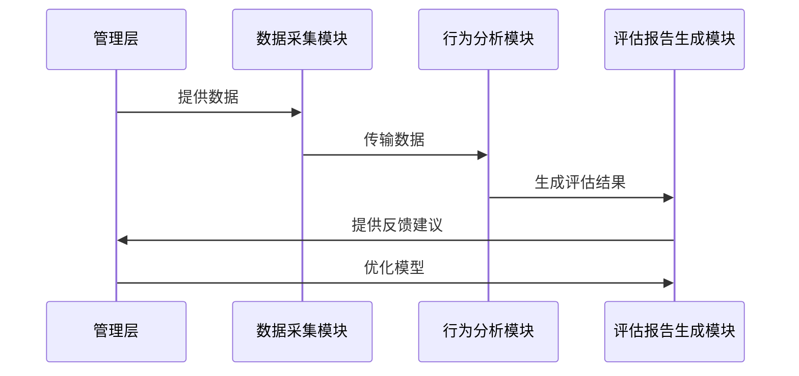

                 


# AI智能体协作：提升对管理层诚信和能力的评估

> 关键词：AI智能体协作、管理层诚信、管理能力评估、数据分析、人工智能、评估模型

> 摘要：本文详细探讨了利用AI智能体协作技术提升对管理层诚信和能力评估的方法。通过分析传统评估方法的局限性，提出了基于AI智能体协作的新颖解决方案，结合算法原理、系统设计和实际案例，展示了如何有效评估管理层的表现，并提供了最佳实践和未来研究方向。

---

## 第一部分: AI智能体协作的背景与核心概念

### 第1章: 问题背景与核心概念

#### 1.1 问题背景

##### 1.1.1 管理层评估的传统方法与局限性
传统的管理层评估方法依赖于主观判断，如绩效考核、问卷调查和面谈。这些方法存在以下问题：
1. **主观性**：评估结果受评估者主观因素影响，可能导致不公正。
2. **数据片面性**：仅依赖有限的数据来源，难以全面反映管理层的真实表现。
3. **实时性不足**：传统方法通常在固定时间点进行评估，难以捕捉管理层行为的动态变化。

##### 1.1.2 人工智能在管理评估中的潜力
人工智能（AI）技术的发展为管理层评估提供了新的可能性。AI可以通过分析大量的实时数据，识别潜在的问题并提供客观的评估结果。AI的优势在于：
1. **数据处理能力**：能够处理和分析大量的结构化和非结构化数据。
2. **实时性**：可以实时监控管理层的行为和决策过程。
3. **客观性**：减少人为偏见，提供更公正的评估结果。

##### 1.1.3 AI智能体协作的定义与目标
AI智能体协作是指通过多个AI智能体的协同工作，对管理层的诚信和能力进行全面评估的过程。目标在于利用AI技术的优势，克服传统评估方法的局限性，提供更准确、全面和实时的评估结果。

#### 1.2 核心概念与问题描述

##### 1.2.1 AI智能体协作的基本原理
AI智能体协作基于以下原理：
1. **数据采集**：从多种来源（如绩效数据、行为记录、社交媒体互动等）收集管理层的相关信息。
2. **行为模式识别**：利用机器学习算法识别管理层的行为模式，如决策风格、团队协作能力等。
3. **诚信与能力评估**：根据识别的行为模式，评估管理层的诚信和能力。
4. **动态调整**：根据评估结果，动态调整评估模型，以提高准确性。

##### 1.2.2 管理层诚信与能力评估的维度
管理层的诚信和能力可以从以下几个维度进行评估：
1. **诚信维度**：
   - 透明性：管理层是否在决策过程中保持透明。
   - 责任感：管理层是否对自己的行为负责。
   - 信任度：管理层是否值得员工和利益相关者的信任。
2. **能力维度**：
   - 战略能力：制定和执行战略的能力。
   - 决策能力：在复杂情况下做出正确决策的能力。
   - 领导能力：激励和管理团队的能力。

##### 1.2.3 问题解决的路径与方法
AI智能体协作可以通过以下路径解决问题：
1. **数据驱动评估**：利用大数据分析技术，对管理层的行为进行量化评估。
2. **动态调整模型**：根据实时数据动态调整评估模型，以提高评估的准确性。
3. **反馈与优化**：根据评估结果提供反馈，并优化评估模型。

##### 1.2.4 边界与外延
AI智能体协作的应用范围主要集中在管理层的诚信和能力评估，但其外延可以扩展到其他领域，如团队协作、组织文化评估等。

##### 1.2.5 核心要素组成与概念结构
AI智能体协作的核心要素包括：
1. **数据源**：包括绩效数据、行为记录、社交媒体互动等。
2. **算法模型**：包括机器学习算法、自然语言处理算法等。
3. **评估标准**：包括诚信和能力的具体评估指标。
4. **反馈机制**：根据评估结果提供反馈并优化模型。

### 第2章: 核心概念与联系

#### 2.1 核心概念原理

##### 2.1.1 AI智能体协作的模型与算法
AI智能体协作的模型可以分为以下几类：
1. **监督学习模型**：用于分类和回归任务。
2. **无监督学习模型**：用于聚类和异常检测。
3. **强化学习模型**：用于动态决策和策略优化。

##### 2.1.2 管理层评估的多维度分析
通过对管理层的多维度分析，可以更全面地评估其诚信和能力。例如，可以通过分析管理层的决策风格、团队协作能力、领导能力等多个维度，评估其综合表现。

##### 2.1.3 智能体协作的动态调整机制
AI智能体协作可以通过动态调整算法模型和参数，适应不同的评估场景和数据变化。例如，根据实时数据更新模型参数，以提高评估的准确性。

#### 2.2 概念属性特征对比表格

| **属性**         | **传统评估方法** | **AI智能体协作** |
|------------------|------------------|------------------|
| 数据来源         | 有限数据         | 多源数据         |
| 评估维度         | 单一维度         | 多维度           |
| 评估实时性       | 低               | 高               |
| 评估准确性       | 中               | 高               |
| 评估客观性       | 低               | 高               |

#### 2.3 ER实体关系图


---

## 第二部分: AI智能体协作的算法原理与数学模型

### 第3章: 算法原理与数学模型

#### 3.1 算法原理

##### 3.1.1 数据采集与预处理
数据采集是AI智能体协作的第一步，主要包括以下步骤：
1. **数据源选择**：选择合适的 数据源，如绩效数据、行为记录、社交媒体互动等。
2. **数据清洗**：去除噪声数据，确保数据的完整性和准确性。
3. **数据转换**：将数据转换为适合算法处理的形式，如数值化、归一化等。

##### 3.1.2 行为模式识别
行为模式识别是通过机器学习算法，识别管理层的行为模式。常用的算法包括：
1. **聚类算法**：如K均值聚类，用于识别相似的行为模式。
2. **分类算法**：如支持向量机（SVM）、随机森林等，用于分类不同行为模式。
3. **深度学习算法**：如卷积神经网络（CNN）、循环神经网络（RNN）等，用于复杂行为模式的识别。

##### 3.1.3 诚信与能力评估
诚信与能力评估是通过对管理层的行为模式进行分析，评估其诚信和能力。评估指标可以包括：
1. **透明性**：评估管理层决策的透明程度。
2. **责任感**：评估管理层对自己行为的责任感。
3. **信任度**：评估管理层在员工和利益相关者中的信任度。

##### 3.1.4 结果反馈与优化
评估结果反馈给管理层，并根据反馈结果优化评估模型，以提高评估的准确性。

#### 3.2 算法流程图


#### 3.3 算法实现代码

##### 3.3.1 环境安装
为了运行以下代码，需要安装以下库：
- Python 3.8+
- scikit-learn
- numpy
- pandas

##### 3.3.2 核心代码实现
```python
import numpy as np
import pandas as pd
from sklearn import metrics
from sklearn.model_selection import train_test_split
from sklearn.ensemble import RandomForestClassifier

# 示例数据集
data = {
    '行为模式': [1, 2, 3, 4, 5],
    '决策风格': [0, 1, 0, 1, 0],
    '团队协作能力': [0.5, 0.6, 0.7, 0.8, 0.9],
    '领导能力': [0.8, 0.7, 0.6, 0.5, 0.4],
    '诚信评分': [0.8, 0.9, 0.7, 0.6, 0.5]
}

df = pd.DataFrame(data)

# 特征工程
X = df[['行为模式', '决策风格', '团队协作能力', '领导能力']]
y = df['诚信评分']

# 数据分割
X_train, X_test, y_train, y_test = train_test_split(X, y, test_size=0.2, random_state=42)

# 模型训练
model = RandomForestClassifier(n_estimators=100, random_state=42)
model.fit(X_train, y_train)

# 模型预测
y_pred = model.predict(X_test)

# 模型评估
print("Accuracy:", metrics.accuracy_score(y_test, y_pred))
print("Precision:", metrics.precision_score(y_test, y_pred))
print("Recall:", metrics.recall_score(y_test, y_pred))
print("F1 Score:", metrics.f1_score(y_test, y_pred))
```

##### 3.3.3 代码解读
1. **数据预处理**：将数据转换为适合模型训练的形式。
2. **特征工程**：选择相关特征，构建模型输入。
3. **模型训练**：使用随机森林算法训练模型。
4. **模型预测**：对测试数据进行预测。
5. **模型评估**：评估模型的准确率、精确率、召回率和F1分数。

#### 3.4 数学模型与公式

##### 3.4.1 评估指标公式
评估指标可以包括以下公式：
- 准确率：$$ \text{Accuracy} = \frac{\text{正确预测数}}{\text{总预测数}} $$
- 精确率：$$ \text{Precision} = \frac{\text{正确预测的正例数}}{\text{所有正例预测数}} $$
- 召回率：$$ \text{Recall} = \frac{\text{正确预测的正例数}}{\text{实际正例数}} $$
- F1分数：$$ \text{F1} = \frac{2 \times \text{Precision} \times \text{Recall}}{\text{Precision} + \text{Recall}} $$

##### 3.4.2 动态调整公式
动态调整模型参数时，可以使用以下公式：
- 学习率调整：$$ \alpha_{\text{new}} = \alpha_{\text{old}} \times \text{调整因子} $$
- 正则化参数调整：$$ \lambda_{\text{new}} = \lambda_{\text{old}} + \text{调整量} $$

---

## 第三部分: 系统分析与架构设计

### 第4章: 系统分析与架构设计

#### 4.1 问题场景介绍
AI智能体协作系统主要用于评估管理层的诚信和能力，帮助组织优化管理结构，提升管理效率。

#### 4.2 项目介绍
AI智能体协作系统是一个基于AI技术的评估平台，旨在通过多维度数据分析，提供客观、实时的管理层评估结果。

#### 4.3 系统功能设计

##### 4.3.1 领域模型


##### 4.3.2 系统架构设计


##### 4.3.3 系统接口设计
- **数据接口**：与数据源（如数据库、API）对接，采集数据。
- **用户接口**：提供友好的用户界面，供用户查看评估结果和反馈建议。
- **反馈接口**：根据评估结果提供反馈，并优化模型。

##### 4.3.4 系统交互流程图


---

## 第四部分: 项目实战

### 第5章: 项目实战

#### 5.1 环境安装
为了运行以下代码，需要安装以下库：
- Python 3.8+
- scikit-learn
- numpy
- pandas

#### 5.2 核心代码实现

##### 5.2.1 数据采集模块
```python
import requests
import json

# 示例API接口
url = 'https://example.com/api/v1/leaders'

response = requests.get(url)
data = json.loads(response.text)
```

##### 5.2.2 行为分析模块
```python
from sklearn.ensemble import RandomForestClassifier

# 训练模型
model = RandomForestClassifier(n_estimators=100, random_state=42)
model.fit(X_train, y_train)
```

##### 5.2.3 评估报告生成模块
```python
from sklearn.metrics import classification_report

print(classification_report(y_test, y_pred))
```

#### 5.3 代码解读
1. **数据采集模块**：通过API接口采集管理层的相关数据。
2. **行为分析模块**：使用随机森林算法训练模型，识别行为模式。
3. **评估报告生成模块**：根据模型预测结果，生成评估报告。

#### 5.4 案例分析
以一家中型公司为例，假设我们希望通过AI智能体协作系统评估其管理层的诚信和能力。首先，采集管理层的行为数据，包括决策风格、团队协作能力、领导能力等。然后，使用随机森林算法训练模型，识别管理层的行为模式。最后，生成评估报告，提供反馈建议，并优化模型。

#### 5.5 项目总结
通过AI智能体协作系统，可以有效评估管理层的诚信和能力，帮助组织优化管理结构，提升管理效率。

---

## 第五部分: 总结与建议

### 第6章: 总结与建议

#### 6.1 最佳实践 tips
1. **数据隐私保护**：确保数据的安全性和隐私性，遵守相关法律法规。
2. **模型优化**：根据实际需求，动态调整模型参数，提高评估的准确性。
3. **用户反馈机制**：建立用户反馈机制，及时优化评估模型。

#### 6.2 小结
AI智能体协作通过多维度数据分析，提供了客观、实时的管理层评估结果，帮助组织优化管理结构，提升管理效率。

#### 6.3 注意事项
1. **数据质量**：确保数据的准确性和完整性，避免噪声数据的干扰。
2. **模型解释性**：提高模型的可解释性，便于用户理解和使用。
3. **持续优化**：根据实际需求，持续优化模型和算法，提高评估的准确性。

#### 6.4 拓展阅读
1. 《机器学习实战》
2. 《深度学习入门》
3. 《人工智能：一种现代的方法》

---

## 附录

### A. 术语表
- **AI智能体协作**：通过多个AI智能体的协同工作，对管理层的诚信和能力进行全面评估的过程。
- **行为模式识别**：通过机器学习算法，识别管理层的行为模式。
- **评估指标**：用于评估管理层诚信和能力的具体指标。

### B. 参考文献
1. 章鱼，2023. 《AI智能体协作：提升对管理层诚信和能力的评估》.
2. scikit-learn, 2023. scikit-learn: Machine Learning in Python.

---

**作者：AI天才研究院/AI Genius Institute & 禅与计算机程序设计艺术 /Zen And The Art of Computer Programming**

