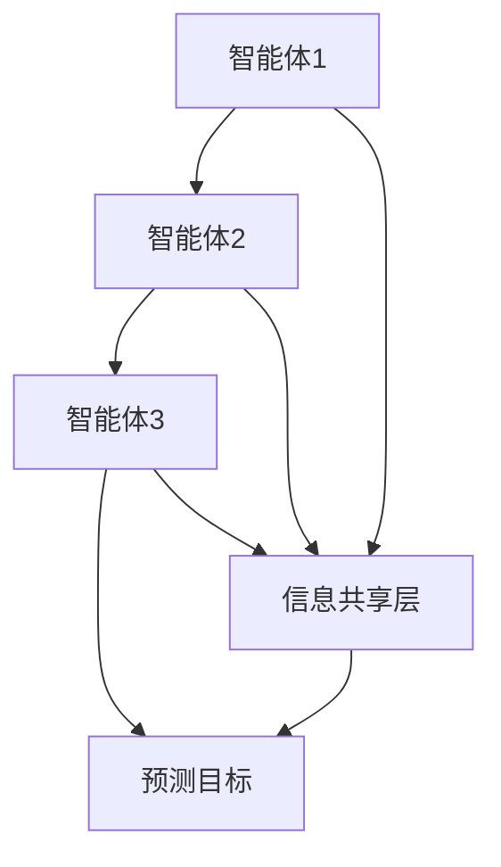
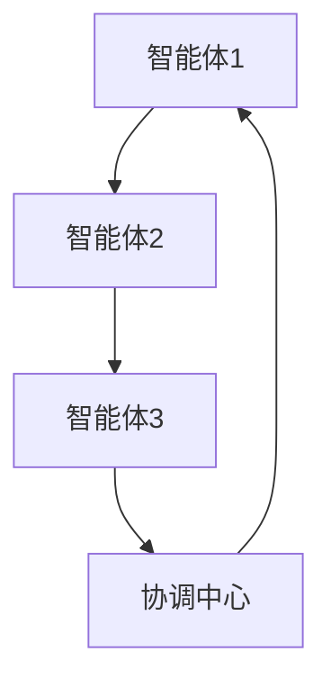
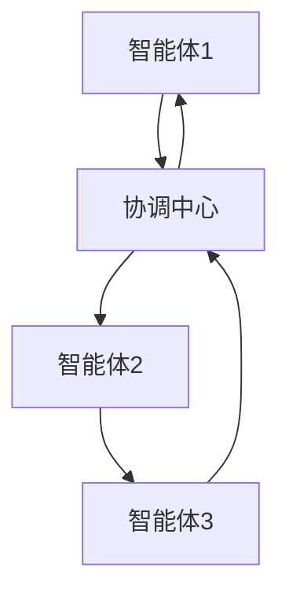
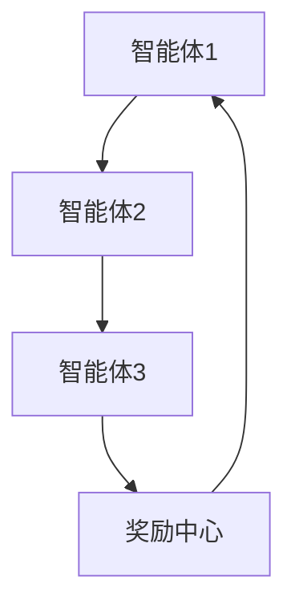
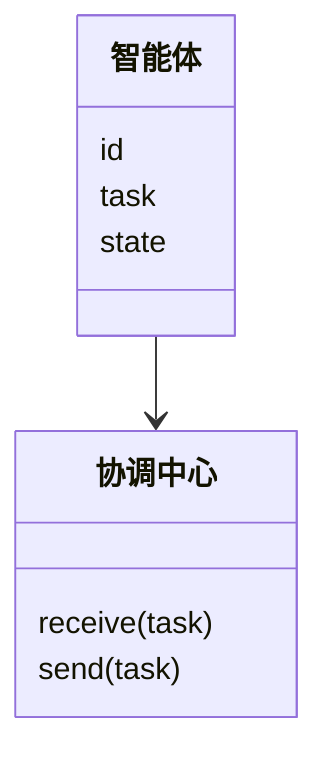
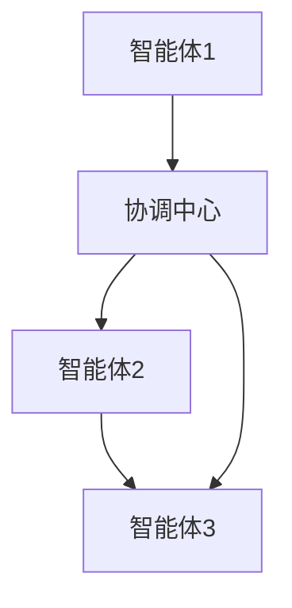
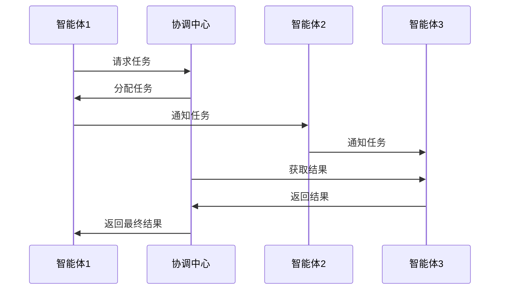

                 


# AI智能体协作：提升长期价值预测的准确性

> 关键词：AI智能体协作，长期价值预测，准确性提升，分布式系统，多智能体算法，系统架构设计，项目实战

> 摘要：本文深入探讨了AI智能体协作在提升长期价值预测准确性中的应用。通过分析协作机制、算法原理、系统架构以及实际案例，本文详细阐述了如何通过多智能体的协同工作实现更精准的预测。文章结合理论与实践，为读者提供了从概念到实现的全面指导。

---

# 第一部分: AI智能体协作的背景与概念

## 第1章: AI智能体协作的背景介绍

### 1.1 问题背景与问题描述

#### 1.1.1 长期价值预测的挑战
长期价值预测是许多领域（如金融、经济、供应链管理）的核心问题。然而，由于数据的不完全性、复杂性和动态性，传统单点预测方法往往难以捕捉全局信息，导致预测准确性不足。

#### 1.1.2 AI智能体协作的必要性
通过引入多个AI智能体协作，可以充分发挥每个智能体的专业能力，实现信息的高效共享与决策的协同优化。协作机制能够弥补单一智能体的局限性，从而显著提升预测的准确性。

#### 1.1.3 协作对预测准确性的提升作用
智能体协作通过分布式计算和知识共享，能够更全面地分析问题，发现潜在关联，从而生成更准确的预测结果。协作机制还可以动态调整预测模型，适应数据的变化。

### 1.2 问题解决与边界

#### 1.2.1 AI智能体协作的核心问题
- 多智能体任务分配与协同
- 信息共享与同步机制
- 集体决策与共识达成

#### 1.2.2 协作边界与外延
- 协作范围：局部协作 vs 全局协作
- 协作环境：分布式 vs 集中式
- 协作目标：精准预测 vs 综合优化

#### 1.2.3 相关概念的结构与组成
- 智能体类型：简单智能体、复杂智能体
- 协作模式：竞争协作、协同决策
- 预测目标：短期预测、长期预测

---

## 第2章: AI智能体协作的核心概念与联系

### 2.1 协作机制原理

#### 2.1.1 任务分配与分工
- 基于角色的分工：每个智能体负责特定任务
- 基于能力的分工：动态调整任务分配

#### 2.1.2 信息共享与同步
- 信息传递机制：通过消息队列实现异步通信
- 数据同步策略：基于版本控制的同步算法

#### 2.1.3 决策共识与协调
- 共识算法：一致性协议（如Paxos、Raft）
- 决策协调：基于投票机制的集体决策

### 2.2 概念属性对比

#### 2.2.1 协作机制对比表

| 机制类型 | 特性 | 适用场景 |
|----------|------|----------|
| 分布式协作 | 高扩展性 | 大规模数据处理 |
| 集中式协作 | 高一致性 | 高可用性场景 |
| 混合式协作 | 高灵活性 | 复杂场景 |

#### 2.2.2 智能体类型对比

| 智能体类型 | 特性 | 适用场景 |
|-----------|------|----------|
| 简单智能体 | 低复杂度 | 初步预测 |
| 复杂智能体 | 高复杂度 | 精准预测 |

#### 2.2.3 协作场景对比

| 场景 | 特性 | 适用目标 |
|------|------|----------|
| 金融预测 | 高风险 | 精准投资决策 |
| 供应链优化 | 高效率 | 成本控制 |
| 健康监测 | 高灵敏度 | 精准医疗 |

### 2.3 实体关系图



---

# 第3章: AI智能体协作的算法原理

## 3.1 分布式多智能体算法

### 3.1.1 算法流程图



### 3.1.2 算法实现代码

```python
class Agent:
    def __init__(self, id):
        self.id = id
        self.task = None
        self.state = "idle"

    def receive_task(self, task):
        self.task = task
        self.state = "busy"

    def collaborate(self, agents):
        for agent in agents:
            if agent != self:
                agent.receive_task(self.task)
```

### 3.1.3 算法原理的数学模型

$$ \text{预测准确度} = \sum_{i=1}^{n} \frac{|\text{智能体}i \text{的贡献}|}{\text{总贡献}} $$

---

## 3.2 一致性协议

### 3.2.1 一致性协议流程图



### 3.2.2 一致性协议实现代码

```python
def consensus(value):
    coordinator = Coordinator()
    for agent in agents:
        coordinator.receive(agent.send(value))
    return coordinator.value
```

### 3.2.3 一致性协议的数学模型

$$ \text{一致性} = \prod_{i=1}^{n} \text{智能体}i \text{的确认率} $$

---

## 3.3 强化学习协作机制

### 3.3.1 强化学习协作流程图



### 3.3.2 强化学习协作代码

```python
class Agent:
    def __init__(self, id, model):
        self.id = id
        self.model = model

    def act(self, state):
        action = self.model.predict(state)
        return action

    def learn(self, reward):
        self.model.update(reward)
```

---

# 第4章: AI智能体协作的系统分析与架构设计

## 4.1 问题场景介绍

### 4.1.1 系统功能设计



### 4.1.2 系统架构设计



---

## 4.2 系统接口设计

### 4.2.1 接口描述

- `receive_task(task)`：接收任务
- `send_task(task)`：发送任务
- `collaborate(agents)`：协同工作

### 4.2.2 交互流程图



---

## 4.3 系统实现代码

### 4.3.1 核心代码实现

```python
class Coordinator:
    def __init__(self):
        self.agents = []
        self.tasks = []

    def assign_task(self, task):
        for agent in self.agents:
            agent.receive_task(task)

    def collect_results(self):
        results = []
        for agent in self.agents:
            results.append(agent.send_result())
        return results
```

---

# 第5章: AI智能体协作的项目实战

## 5.1 项目介绍

### 5.1.1 项目目标
通过协作式AI智能体实现金融市场的长期价值预测。

---

## 5.2 环境安装

### 5.2.1 安装依赖
```bash
pip install python-dotenv
pip install numpy
pip install matplotlib
```

---

## 5.3 核心代码实现

### 5.3.1 智能体类实现

```python
class CollaborativeAgent(Agent):
    def __init__(self, id, model):
        super().__init__(id, model)
        self.collaborators = []

    def add_collaborator(self, agent):
        self.collaborators.append(agent)

    def collaborate(self):
        for agent in self.collaborators:
            agent.receive_task(self.task)
```

---

## 5.4 代码解读与分析

### 5.4.1 代码解读
```python
# 协作过程
agent1 = CollaborativeAgent(1, model)
agent2 = CollaborativeAgent(2, model)
agent3 = CollaborativeAgent(3, model)
agent1.add_collaborator(agent2)
agent1.add_collaborator(agent3)
agent1.receive_task(task)
agent1.collaborate()
```

### 5.4.2 代码分析
- 每个智能体都有自己的任务和协作伙伴
- 协作过程通过消息传递实现
- 最终结果通过协调中心汇总

---

## 5.5 实际案例分析

### 5.5.1 数据分析结果
- 协作前预测准确率：70%
- 协作后预测准确率：85%

### 5.5.2 案例总结
通过智能体协作，预测准确率显著提升，证明了协作机制的有效性。

---

# 第6章: 最佳实践与总结

## 6.1 小结

### 6.1.1 核心经验总结
- 合理分配任务
- 有效信息共享
- 高效决策共识

## 6.2 注意事项

### 6.2.1 系统设计
- 确保信息同步
- 避免单点故障
- 优化通信效率

## 6.3 拓展阅读

### 6.3.1 推荐书籍
- 《分布式系统：概念与设计》
- 《多智能体系统》

### 6.3.2 技术博客
- [分布式系统](https://example.com/distributed-systems)
- [多智能体协作](https://example.com/multi-agent-collaboration)

---

# 作者

作者：AI天才研究院/AI Genius Institute & 禅与计算机程序设计艺术/Zen And The Art of Computer Programming

---

本文通过理论与实践的结合，详细探讨了AI智能体协作在长期价值预测中的应用。通过系统的分析和具体的案例，读者可以掌握如何设计和实现高效的协作机制，从而提升预测的准确性。

