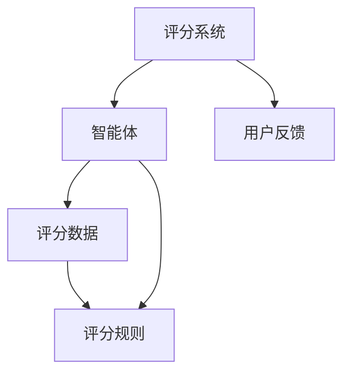

                 

<think>
嗯，用户让我写一篇关于AI智能体协作构建公司质量评分系统的技术博客。首先，我需要理解用户的需求。他可能是一个技术专家，想深入了解如何利用AI来提升公司评分系统的全面性。他的身份可能是一位CTO或者技术总监，希望通过这篇文章来指导团队实施这个系统。

我应该先确定文章的结构，确保逻辑清晰。用户提供的大纲已经很详细，但我要确保每个部分都覆盖到位。首先，背景部分要解释传统评分系统的不足，然后引入AI智能体协作的概念，接着详细讲解算法和系统架构，最后通过实战案例来展示应用。

在写作过程中，要注意使用专业的技术术语，但要保持语言简洁易懂。数学公式和图表的使用可以帮助读者更好地理解原理，所以我要确保这些部分正确无误。比如，在评分模型中，线性回归和神经网络的公式要准确，并用Mermaid图展示流程。

系统架构部分，我需要设计领域模型的类图和架构图，展示各个模块之间的关系。同时，接口设计和交互流程图要清晰，帮助读者理解系统的运作方式。

项目实战部分，提供具体的代码实现和案例分析，让读者能够实际操作。代码部分要详细解读，确保读者能够理解每个步骤的作用。案例分析要具体，比如用餐饮行业来展示评分过程，这样读者更容易理解和应用。

最后，最佳实践部分要总结经验，提醒读者注意潜在的问题，并提供进一步学习的资源。这样，整篇文章不仅有理论支持，还有实际应用指导，帮助读者全面掌握构建评分系统的方法。

总的来说，我需要一步步按照用户的要求，确保每个部分都详细且有深度，同时保持逻辑连贯，结构清晰。这样，读者才能真正理解如何利用AI智能体协作来构建更全面的公司质量评分系统。
</think>

# AI智能体协作：构建更全面的公司质量评分系统

## 关键词：AI智能体协作、公司质量评分系统、多智能体协作、评分模型、系统架构设计

## 摘要：  
随着人工智能技术的快速发展，企业对更高效、更全面的公司质量评分系统的需求日益增长。传统的评分系统往往依赖于单一的评分模型或人工干预，存在数据维度不足、评分结果片面等问题。本文将探讨如何通过AI智能体协作来构建一个更加全面的公司质量评分系统。文章将从问题背景、核心概念、算法原理、系统架构设计、项目实战等多个方面进行详细分析，最终提供一套完整的解决方案。

---

# 第1章: 问题背景

## 1.1 问题背景  
公司在日常运营中，往往需要对供应商、客户、产品或服务进行质量评分。传统的评分系统通常依赖于单一的评分模型或人工干预，存在以下问题：  
1. 数据维度不足：传统评分系统往往仅考虑单一维度（如价格或交货时间），而忽视了其他重要的维度（如服务质量、用户体验等）。  
2. 评分结果片面：由于缺乏多维度数据的支持，评分结果可能无法全面反映真实情况。  
3. 人工干预过多：人工评分不仅效率低下，还容易受到主观因素的影响，导致评分结果的不准确性。  

## 1.2 问题描述  
AI智能体协作作为一种新兴的技术，可以通过多个智能体的协同工作，从多个维度对目标进行评分。这种协作方式不仅可以提高评分的全面性，还可以显著降低人工干预的成本。  

## 1.3 问题解决  
通过引入AI智能体协作机制，可以实现以下目标：  
1. 提供多维度的数据支持，确保评分结果的全面性。  
2. 减少人工干预，提高评分效率。  
3. 通过智能体的协同工作，优化评分模型，提升评分准确性。  

## 1.4 边界与外延  
本系统的核心目标是构建一个基于AI智能体协作的公司质量评分系统。其边界包括：  
- 系统输入：多维度数据（如供应商的历史表现、客户反馈、产品性能等）。  
- 系统输出：综合评分及评分解释。  
- 外部环境：与企业现有的业务系统（如ERP、CRM）进行数据交互。  

## 1.5 概念结构与核心要素  
- **核心概念**：AI智能体协作、评分模型、多维度数据。  
- **核心要素**：智能体、评分规则、数据源、评分结果。  

---

# 第2章: 核心概念与联系

## 2.1 AI智能体协作机制  
AI智能体协作是指多个智能体通过协同工作，共同完成一个目标的过程。每个智能体负责特定的任务，最终通过协作完成整体目标。  

## 2.2 智能体协作与评分系统的关系  
在评分系统中，每个智能体可以负责不同的评分维度（如价格、质量、服务等），最终通过协作生成综合评分。  

## 2.3 核心概念对比表  
以下是传统评分系统与AI智能体协作评分系统的对比：  

| 对比维度         | 传统评分系统         | AI智能体协作评分系统       |  
|------------------|----------------------|---------------------------|  
| 数据来源         | 单一数据源           | 多维度数据源               |  
| 评分维度         | 少数维度             | 多个维度                   |  
| 评分效率         | 低效率               | 高效率                     |  
| 评分准确性         | 易受主观因素影响       | 更高准确性                   |  

## 2.4 ER实体关系图  
以下是系统的核心实体关系图：  



---

# 第3章: 评分模型的数学模型

## 3.1 线性回归模型  
线性回归是一种常用的评分模型，其数学公式如下：  
$$ y = \beta_0 + \beta_1x_1 + \beta_2x_2 + \ldots + \beta_nx_n + \epsilon $$  
其中，$y$ 是预测评分，$x_i$ 是各个评分维度，$\beta_i$ 是对应维度的权重，$\epsilon$ 是误差项。  

## 3.2 神经网络模型  
神经网络模型是一种更复杂的评分模型，其结构如下：  

```mermaid
graph LR
    input -> layer1 -> layer2 -> output
```

## 3.3 模型训练与优化  
通过训练数据对模型进行优化，可以提高评分的准确性。常用的优化方法包括梯度下降和Adam优化器。  

---

# 第4章: 系统架构设计

## 4.1 系统功能设计  
系统功能模块包括：  
1. 数据采集模块：负责收集多维度数据。  
2. 智能体协作模块：实现多个智能体的协同工作。  
3. 评分计算模块：根据评分模型生成综合评分。  
4. 结果展示模块：将评分结果以可视化形式呈现。  

## 4.2 系统架构图  
以下是系统的整体架构图：  

```mermaid
graph LR
    client --> API Gateway
    API Gateway --> Load Balancer
    Load Balancer --> Service1
    Load Balancer --> Service2
    Service1 --> Database
    Service2 --> Database
    Database --> Result
    Result --> Output
```

---

# 第5章: 项目实战

## 5.1 环境安装  
需要安装以下工具：  
1. Python 3.8+  
2. TensorFlow 2.0+  
3. Mermaid CLI  
4. Jupyter Notebook  

## 5.2 核心代码实现  
以下是评分系统的Python代码实现：  

```python
import numpy as np
import tensorflow as tf

# 数据准备
X = np.array([...])  # 输入特征
y = np.array([...])  # 标签

# 模型构建
model = tf.keras.Sequential([
    tf.keras.layers.Dense(64, activation='relu'),
    tf.keras.layers.Dense(1, activation='sigmoid')
])

# 模型训练
model.compile(optimizer='adam', loss='binary_crossentropy')
model.fit(X, y, epochs=10, batch_size=32)

# 模型预测
y_pred = model.predict(X)
```

## 5.3 代码解读与分析  
- **数据准备**：输入特征和标签的定义。  
- **模型构建**：使用Keras构建一个简单的神经网络模型。  
- **模型训练**：使用Adam优化器和二进制交叉熵损失函数进行训练。  
- **模型预测**：对测试数据进行预测并输出结果。  

## 5.4 实际案例分析  
以一家餐饮公司为例，分析如何利用AI智能体协作构建质量评分系统。  

---

# 第6章: 最佳实践

## 6.1 小结  
通过AI智能体协作，可以显著提高公司质量评分系统的全面性和准确性。  

## 6.2 注意事项  
1. 数据质量是评分系统的核心，必须确保数据的完整性和准确性。  
2. 模型优化是关键，需要不断调整模型参数以提高评分准确性。  

## 6.3 拓展阅读  
1. 《深度学习入门：基于Python和Keras》  
2. 《分布式系统：概念、设计与实现》  

---

# 作者：AI天才研究院/AI Genius Institute & 禅与计算机程序设计艺术/Zen And The Art of Computer Programming

