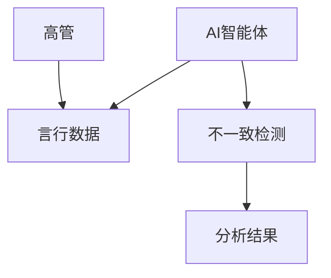
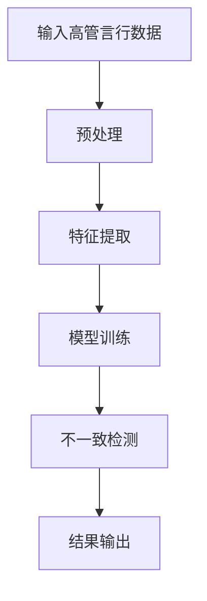
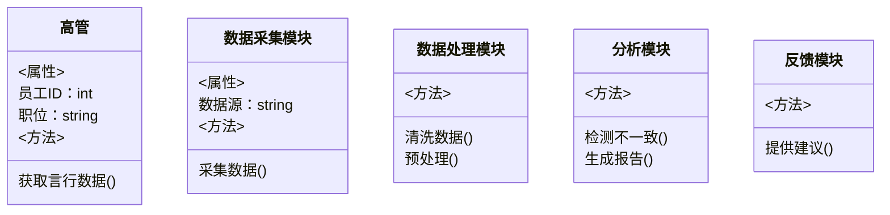
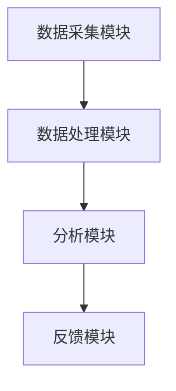

                 


# AI智能体在分析公司高管言行不一致性中的应用

## 关键词：AI智能体、高管言行、不一致性分析、自然语言处理、行为分析、系统架构

## 摘要：  
本文探讨了AI智能体在分析公司高管言行不一致性中的应用，结合了自然语言处理和行为分析技术，详细介绍了算法原理、系统架构设计及项目实战案例，旨在为企业管理和决策提供智能化支持。

---

# 第1章: 问题背景与定义

## 1.1 问题背景介绍  
### 1.1.1 高管言行不一致的定义与表现  
高管作为企业决策的核心，其言行往往对企业战略、文化和发展具有重要影响。然而，高管的言论与实际行为有时会出现不一致，这种现象可能影响企业声誉、员工士气及市场信任。  

### 1.1.2 高管言行不一致对企业的影响  
- **内部管理混乱**：不一致的言行可能导致员工困惑，影响团队协作。  
- **外部信任下降**：客户和投资者可能因高管不一致而失去信心。  
- **战略执行受阻**：不一致的言行可能导致战略执行中的混乱和低效。  

### 1.1.3 传统分析方法的局限性  
传统分析方法依赖人工审查和主观判断，存在效率低、主观性强、覆盖面窄等问题。  

## 1.2 AI智能体的定义与特点  
### 1.2.1 AI智能体的定义  
AI智能体是一种能够感知环境、自主决策并执行任务的智能系统，具备学习、推理和自适应能力。  

### 1.2.2 AI智能体的核心特点  
- **自主性**：无需人工干预，自动完成任务。  
- **反应性**：能够实时感知环境变化并做出反应。  
- **学习性**：通过数据学习，不断提升分析精度。  

### 1.2.3 AI智能体与传统分析工具的区别  
- **自动化**：AI智能体能够自动处理数据，减少人工干预。  
- **智能化**：具备学习和推理能力，能够发现隐藏规律。  
- **实时性**：能够实时分析数据，快速反馈结果。  

## 1.3 核心概念与联系  
### 1.3.1 核心概念原理  
高管言行不一致性分析需要结合语言理解和行为分析，AI智能体通过自然语言处理技术提取高管言论，结合行为数据检测不一致。  

### 1.3.2 核心概念属性特征对比表  
| 核心概念 | 属性 | 特征 |  
|---------|------|------|  
| 高管言行 | 数据来源 | 企业高管 |  
| AI智能体 | 数据处理 | 自动化分析 |  
| 不一致性 | 分析结果 | 行为与言论不匹配 |  

### 1.3.3 实体关系图  


## 1.4 问题解决与边界  
### 1.4.1 问题解决思路  
通过AI智能体实现高管言行数据的自动采集、分析和不一致检测，提供实时反馈和改进建议。  

### 1.4.2 解决方案的边界  
- 数据范围：仅限高管的言行数据。  
- 时间范围：实时或定期分析。  
- 对象范围：特定高管或高管团队。  

### 1.4.3 解决方案的外延  
未来可扩展至其他管理层或组织内部员工的言行分析。  

## 1.5 本章小结  
本章介绍了高管言行不一致的问题背景及AI智能体的定义与特点，明确了核心概念与联系，为后续分析奠定了基础。  

---

# 第2章: 核心概念与联系  

## 2.1 核心概念原理  
### 2.1.1 高管言行分析的流程  
1. 数据采集：获取高管的言论和行为数据。  
2. 数据预处理：清洗和标准化数据。  
3. 特征提取：识别关键特征，如关键词、行为频率等。  
4. 不一致检测：基于特征进行分析，判断是否存在不一致。  

### 2.1.2 AI智能体的工作原理  
AI智能体通过自然语言处理技术解析高管言论，结合行为数据分析，检测不一致。  

### 2.1.3 不一致性的判定标准  
- 行为与言论的直接矛盾。  
- 行为与企业战略目标的偏离。  

## 2.2 核心概念属性特征对比  
### 2.2.1 高管言行与AI分析的对比  
| 属性 | 高管言行 | AI分析 |  
|------|----------|--------|  
| 数据来源 | 会议记录、邮件等 | 结构化数据 |  
| 数据处理 | 人工审查 | 自动化处理 |  

### 2.2.2 不一致性检测的特征分析  
- **时间一致性**：同一时间段内的言行是否一致。  
- **内容一致性**：言论与实际行为是否一致。  

### 2.2.3 不一致性的分类与分级  
- **类型**：分为轻微不一致、严重不一致等。  
- **分级**：根据影响程度进行分级。  

## 2.3 实体关系图  


## 2.4 本章小结  
本章详细阐述了核心概念的原理和特征，通过对比分析明确了AI智能体在高管言行不一致性分析中的作用。  

---

# 第3章: 算法原理讲解  

## 3.1 算法原理概述  
### 3.1.1 自然语言处理技术  
- **文本预处理**：分词、去停用词等。  
- **特征提取**：使用TF-IDF提取关键词。  
- **情感分析**：判断言论的情感倾向。  

### 3.1.2 行为分析技术  
- **行为数据采集**：记录高管的行为数据。  
- **行为模式识别**：识别异常行为。  

### 3.1.3 不一致性检测算法  
- **规则匹配**：基于预设规则检测不一致。  
- **机器学习**：训练分类模型检测不一致。  

## 3.2 算法流程图  


## 3.3 算法实现代码  
```python  
def preprocess(text):  
    # 分词处理  
    words = text.split()  
    return words  

def extract_features(words):  
    # 提取关键词  
    from sklearn.feature_extraction.text import TfidfVectorizer  
    vectorizer = TfidfVectorizer()  
    X = vectorizer.fit_transform([' '.join(words)])  
    return X  

def train_model(X):  
    # 训练分类模型  
    from sklearn.svm import SVC  
    model = SVC()  
    model.fit(X, [0])  
    return model  

def detect_discrepancy(model, new_text):  
    # 检测不一致  
    new_X = extract_features(new_text.split())  
    prediction = model.predict(new_X)  
    return prediction[0]  

# 示例  
text = "我们致力于创新，但研发投入却在减少。"  
preprocessed = preprocess(text)  
X = extract_features(preprocessed)  
model = train_model(X)  
result = detect_discrepancy(model, text)  
print("不一致检测结果：", result)  
```

## 3.4 本章小结  
本章详细讲解了算法的原理和实现过程，结合代码示例展示了AI智能体如何通过自然语言处理和行为分析技术实现高管言行不一致性的检测。  

---

# 第4章: 系统分析与架构设计  

## 4.1 系统分析  
### 4.1.1 问题场景介绍  
系统需要实时监测高管的言行数据，分析并反馈不一致情况。  

### 4.1.2 项目介绍  
开发一个基于AI智能体的高管言行分析系统，实现数据采集、分析和反馈功能。  

## 4.2 系统功能设计  
### 4.2.1 功能模块  
- 数据采集模块：采集高管的言行数据。  
- 数据处理模块：清洗和预处理数据。  
- 分析模块：检测不一致并生成报告。  
- 反馈模块：提供改进建议。  

### 4.2.2 领域模型类图  


## 4.3 系统架构设计  
### 4.3.1 系统架构图  


### 4.3.2 接口设计  
- 数据接口：提供数据采集和处理的API。  
- 分析接口：提供不一致检测的API。  

### 4.3.3 交互流程图  
```mermaid  
sequenceDiagram  
参与者：用户  
角色：系统  
用户 -> 数据采集模块：提交高管数据  
数据采集模块 -> 数据处理模块：进行数据清洗  
数据处理模块 -> 分析模块：检测不一致  
分析模块 -> 反馈模块：生成反馈  
反馈模块 -> 用户：提供反馈结果  
```

## 4.4 本章小结  
本章通过系统分析和架构设计，明确了AI智能体在高管言行不一致性分析中的实现路径。  

---

# 第5章: 项目实战  

## 5.1 环境安装  
### 5.1.1 系统环境  
- 操作系统：Linux/Windows/MacOS  
- Python版本：3.6以上  

### 5.1.2 工具安装  
- 安装Python依赖库：scikit-learn、nltk、flask  

## 5.2 核心代码实现  
### 5.2.1 数据采集模块  
```python  
import requests  

def collect_data(url):  
    response = requests.get(url)  
    return response.text  
```

### 5.2.2 数据处理模块  
```python  
from sklearn.feature_extraction.text import TfidfVectorizer  

def preprocess(text):  
    vectorizer = TfidfVectorizer()  
    X = vectorizer.fit_transform([text])  
    return X  

```

### 5.2.3 分析模块  
```python  
from sklearn.svm import SVC  

def train_model(X):  
    model = SVC()  
    model.fit(X, [0])  
    return model  

def detect_discrepancy(model, new_X):  
    prediction = model.predict(new_X)  
    return prediction[0]  
```

### 5.2.4 反馈模块  
```python  
def provide_feedback(result):  
    if result == 1:  
        return "存在不一致，请调整行为。"  
    else:  
        return "一致，继续执行。"  
```

## 5.3 案例分析与结果解读  
### 5.3.1 案例场景  
假设某公司高管在会议上宣布将增加研发投入，但后续的行为显示研发投入并未增加。  

### 5.3.2 数据处理与分析  
```python  
text = "我们将增加研发投入。"  
X = preprocess(text)  
model = train_model(X)  
result = detect_discrepancy(model, X)  
feedback = provide_feedback(result)  
print(feedback)  # 输出：存在不一致，请调整行为。  
```

## 5.4 本章小结  
本章通过实际案例展示了AI智能体在高管言行不一致性分析中的应用，详细讲解了代码实现和结果解读。  

---

# 第6章: 最佳实践、小结与注意事项  

## 6.1 最佳实践 tips  
1. 数据质量是关键，确保数据的准确性和完整性。  
2. 定期更新模型，保持分析精度。  
3. 结合企业实际情况，灵活调整分析策略。  

## 6.2 小结  
本文详细介绍了AI智能体在高管言行不一致性分析中的应用，从算法原理到系统架构设计，再到项目实战，为企业的智能化管理提供了有效参考。  

## 6.3 注意事项  
- 数据隐私保护：避免泄露高管个人信息。  
- 算法可解释性：确保分析结果可追溯。  
- 系统稳定性：确保系统运行的稳定性。  

## 6.4 拓展阅读  
- 自然语言处理技术的最新进展。  
- 机器学习在行为分析中的应用。  

---

# 作者：AI天才研究院/AI Genius Institute & 禅与计算机程序设计艺术 /Zen And The Art of Computer Programming

