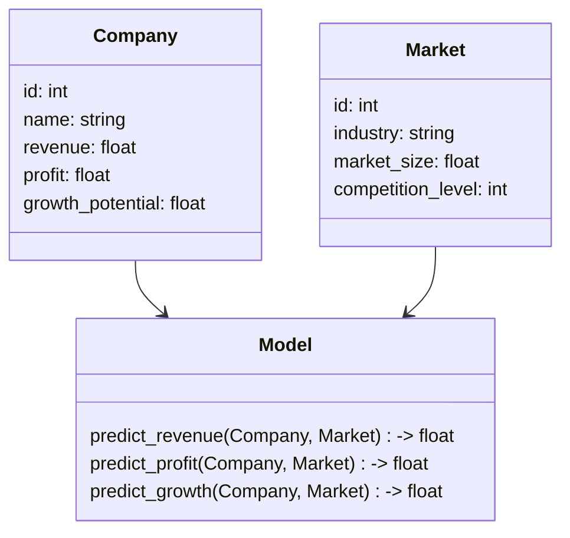
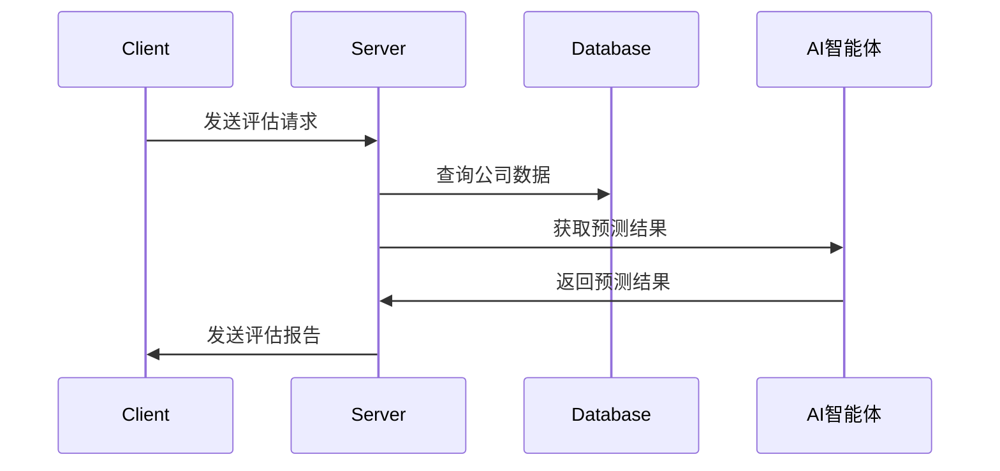

                 


# AI智能体在评估公司长期盈利能力和增长潜力中的应用

## 关键词：AI智能体，公司评估，长期盈利能力，增长潜力，机器学习，数据分析

## 摘要：  
本文探讨了AI智能体在评估公司长期盈利能力和增长潜力中的应用。通过分析AI智能体的核心原理、系统架构和实际案例，展示了如何利用AI技术提高公司评估的准确性和效率。文章详细讲解了从数据采集到模型训练的全过程，并提供了具体的Python代码示例和系统设计图，帮助读者理解如何将AI智能体应用于实际业务场景。

---

## 第一部分: AI智能体在公司评估中的背景与基础

### 第1章: AI智能体与公司评估概述

#### 1.1 AI智能体的基本概念
##### 1.1.1 AI智能体的定义
AI智能体是一种能够感知环境、处理信息、做出决策并执行行动的智能系统。它通过数据输入、信息处理和智能决策，帮助用户解决复杂问题。

##### 1.1.2 AI智能体的核心特征
| 特征 | 描述 |
|------|------|
| 感知能力 | 能够从多种数据源获取信息，如财务数据、市场数据、新闻等。 |
| 自适应性 | 根据环境变化自动调整策略和模型。 |
| 高效性 | 可以快速处理大量数据并生成实时结果。 |
| 可解释性 | 输出结果可追溯和解释。 |

##### 1.1.3 AI智能体与传统评估方法的对比
| 对比维度 | 传统评估方法 | AI智能体评估方法 |
|----------|----------------|---------------------|
| 数据处理 | 依赖人工整理，耗时 | 实时数据采集与处理，高效 |
| 模型更新 | 静态模型，更新缓慢 | 动态调整，实时优化 |
| 分析深度 | 局限于财务指标，分析浅层 | 多维度分析，深度洞察 |

#### 1.2 公司长期盈利能力与增长潜力评估的重要性
##### 1.2.1 传统评估方法的局限性
传统评估方法通常依赖财务报表分析，难以捕捉市场动态和潜在风险。例如，财务指标如ROE和毛利率只能反映历史表现，无法预测未来变化。

##### 1.2.2 长期盈利能力的关键因素
- 市场地位：公司在行业中的竞争力和市场份额。
- 财务健康：盈利能力、现金流和资产负债情况。
- 管理团队：领导层的战略能力和执行力。
- 创新能力：研发投入和技术优势。

##### 1.2.3 增长潜力的评估维度
- 行业增长：所在行业的市场规模和发展趋势。
- 市场渗透：公司在目标市场的覆盖率。
- 产品创新：新产品开发能力和专利数量。
- 资源配置：资金、人才和技术资源的充足性。

#### 1.3 AI智能体在公司评估中的应用前景
##### 1.3.1 AI智能体的优势
- **高效性**：AI智能体可以快速处理大量数据，显著提高评估效率。
- **准确性**：通过机器学习算法，AI智能体能够发现数据中的隐藏模式，提升评估准确性。
- **实时性**：AI智能体可以实时监控市场变化，提供及时的预警和建议。

##### 1.3.2 应用场景分析
| 应用场景 | 描述 |
|----------|------|
| 财务预测 | 预测公司未来的财务表现，如收入、利润和现金流。 |
| 风险评估 | 识别潜在的财务风险和市场风险，制定风险控制策略。 |
| 竞争分析 | 分析竞争对手的动态，制定市场进入和扩张策略。 |
| 投资决策 | 帮助投资者做出更明智的投资决策，优化投资组合。 |

##### 1.3.3 未来发展趋势
随着AI技术的不断进步，AI智能体在公司评估中的应用将更加广泛和深入。未来，AI智能体将能够结合自然语言处理（NLP）和计算机视觉技术，进一步提升分析的深度和广度。

---

## 第二部分: AI智能体的核心原理与技术

### 第2章: AI智能体的核心机制

#### 2.1 感知机制
##### 2.1.1 数据采集与处理
AI智能体需要从多种数据源（如公司财务报表、行业报告、新闻媒体）采集数据，并进行清洗和预处理。

##### 2.1.2 特征提取方法
通过特征工程，从原始数据中提取有用的特征，如收入增长率、净利润率、研发投入占比等。

##### 2.1.3 数据预处理流程
1. 数据清洗：处理缺失值、异常值和重复数据。
2. 数据标准化：将数据转换为统一的格式，便于后续分析。
3. 数据增强：通过增加多样化的数据来提高模型的泛化能力。

#### 2.2 决策机制
##### 2.2.1 机器学习模型的选择
根据具体场景选择合适的模型，如线性回归用于预测收入，随机森林用于分类问题。

##### 2.2.2 模型训练策略
- **监督学习**：使用标记数据训练模型，如使用历史财务数据预测未来表现。
- **无监督学习**：发现数据中的隐藏模式，如聚类分析客户群体。

##### 2.2.3 预测结果的解释
通过可解释性机器学习（如SHAP值）解释模型的输出，帮助用户理解预测结果的原因。

#### 2.3 执行机制
##### 2.3.1 动作规划
根据预测结果制定相应的行动计划，如调整投资策略或优化运营流程。

##### 2.3.2 反馈机制
收集执行结果的反馈，用于模型的持续优化和改进。

##### 2.3.3 自适应优化
通过反馈不断调整模型参数和策略，提升AI智能体的性能和适应能力。

---

## 第三部分: 评估模型的构建与实现

### 第3章: 评估模型的构建原理

#### 3.1 数据特征的选择
##### 3.1.1 关键特征识别
根据业务需求选择关键特征，如收入增长率、净利润率、研发投入占比等。

##### 3.1.2 特征重要性评估
使用特征重要性评分（如随机森林的特征重要性）识别关键特征。

#### 3.2 机器学习模型的选择与实现
##### 3.2.1 线性回归模型
用于预测公司的收入和利润。

##### 3.2.2 随机森林模型
用于分类问题，如判断公司是否具备增长潜力。

##### 3.2.3 深度学习模型
使用LSTM网络处理时间序列数据，预测未来的财务表现。

#### 3.3 模型训练与优化
##### 3.3.1 数据分割
将数据划分为训练集、验证集和测试集。

##### 3.3.2 模型调参
使用网格搜索或随机搜索优化模型参数，提升模型性能。

##### 3.3.3 模型评估
使用准确率、召回率、F1分数等指标评估模型性能。

---

## 第四部分: 系统分析与架构设计方案

### 第4章: 系统架构设计

#### 4.1 问题场景介绍
AI智能体用于评估公司长期盈利能力，需要实时监控市场变化，提供动态的评估结果。

#### 4.2 项目介绍
本项目旨在构建一个AI智能体，帮助投资者和企业管理者评估公司的长期盈利能力和增长潜力。

#### 4.3 系统功能设计
##### 4.3.1 领域模型


##### 4.3.2 系统架构设计


##### 4.3.3 系统接口设计
- API接口：提供RESTful API，供其他系统调用评估结果。
- 数据接口：与财务系统、市场数据供应商对接，获取实时数据。

##### 4.3.4 系统交互设计


---

## 第五部分: 项目实战

### 第5章: 项目实战

#### 5.1 环境搭建
##### 5.1.1 安装必要的库
```bash
pip install numpy pandas scikit-learn tensorflow matplotlib
```

#### 5.2 核心实现
##### 5.2.1 数据处理
```python
import pandas as pd

# 读取数据
data = pd.read_csv('company_data.csv')

# 数据清洗
data.dropna(inplace=True)
data = pd.get_dummies(data)
```

##### 5.2.2 模型训练
```python
from sklearn.ensemble import RandomForestRegressor
from sklearn.model_selection import train_test_split

# 划分数据
X_train, X_test, y_train, y_test = train_test_split(data.drop('profit', axis=1), data['profit'], test_size=0.2)

# 训练模型
model = RandomForestRegressor()
model.fit(X_train, y_train)

# 预测结果
y_pred = model.predict(X_test)
```

##### 5.2.3 结果展示
```python
import matplotlib.pyplot as plt

plt.scatter(y_test, y_pred)
plt.xlabel('真实值')
plt.ylabel('预测值')
plt.title('利润预测结果')
plt.show()
```

#### 5.3 实际案例分析
以某科技公司为例，展示如何利用AI智能体预测其未来的收入和利润，并分析其增长潜力。

#### 5.4 项目小结
总结项目中的经验教训，提出改进建议。

---

## 第六部分: 最佳实践与未来展望

### 第6章: 最佳实践与未来展望

#### 6.1 最佳实践 tips
- 数据质量是模型性能的关键，需确保数据的准确性和完整性。
- 定期更新模型，保持其适应市场变化的能力。
- 结合业务知识，优化特征选择和模型解释性。

#### 6.2 未来展望
- **多模态分析**：结合文本、图像等多种数据源，提升分析的全面性。
- **实时监控**：实现对公司动态的实时监控，提供即时预警。
- **自动化决策**：AI智能体能够自动执行某些决策，如自动调整投资组合。

---

## 作者：AI天才研究院 & 禅与计算机程序设计艺术

---

以上是《AI智能体在评估公司长期盈利能力和增长潜力中的应用》的完整大纲和内容。通过系统地介绍AI智能体的核心原理、技术实现和实际应用，本文为读者提供了一个全面的视角，帮助他们在公司评估中有效利用AI技术。

