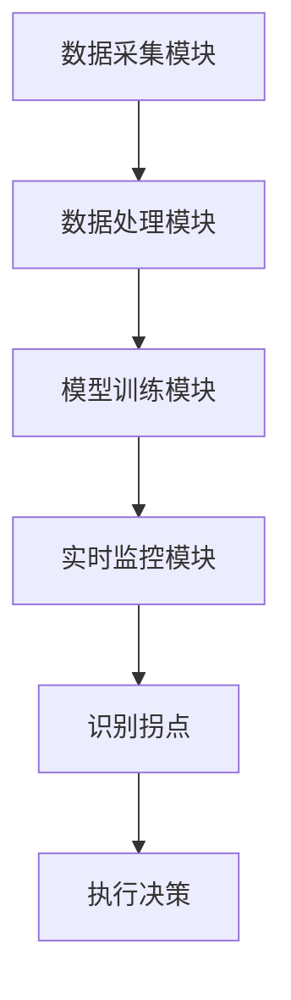
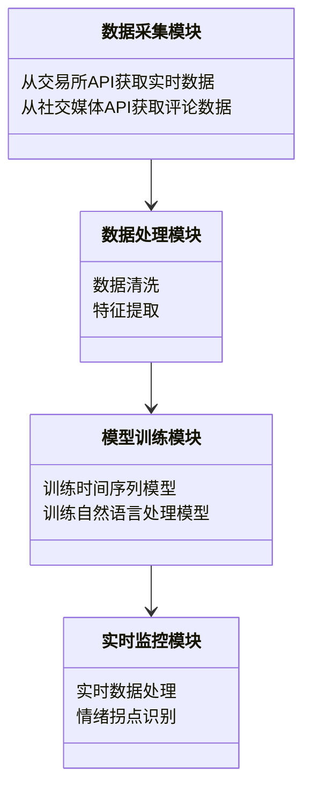

                 


# AI智能体在识别市场情绪拐点中的作用

> 关键词：AI智能体，市场情绪拐点，时间序列分析，自然语言处理，强化学习，系统架构设计

> 摘要：本文探讨AI智能体在识别市场情绪拐点中的应用，分析其在金融数据分析中的优势，结合时间序列分析、自然语言处理和强化学习等技术，详细阐述AI智能体的构建过程、算法原理及实际应用案例。

---

# 第一部分: AI智能体与市场情绪拐点的背景介绍

## 第1章: 市场情绪拐点的定义与重要性

### 1.1 市场情绪的基本概念

#### 1.1.1 市场情绪的定义
市场情绪指的是投资者对市场走势的心理预期和态度，通常通过市场参与者的交易行为、社交媒体评论、新闻报道等反映出来。市场情绪拐点是指市场情绪从上涨转向下跌，或从下跌转向上涨的关键时间点。

#### 1.1.2 市场情绪拐点的定义
市场情绪拐点是市场情绪发生显著变化的转折点，通常对应市场的顶部或底部。识别拐点对于投资者来说至关重要，因为它可以帮助做出买卖决策，避免重大损失或抓住重大收益机会。

#### 1.1.3 市场情绪拐点的重要性
市场情绪拐点是市场趋势变化的起点，及时准确地识别拐点可以显著提高投资收益和风险管理能力。

### 1.2 AI智能体的定义与特点

#### 1.2.1 AI智能体的定义
AI智能体是一种能够感知环境、自主决策并执行任务的智能系统。它能够通过数据输入，利用算法进行分析和学习，从而做出最优决策。

#### 1.2.2 AI智能体的核心特点
- **自主性**：能够独立执行任务，无需人工干预。
- **反应性**：能够实时感知环境变化并做出反应。
- **学习能力**：能够通过数据学习和优化决策模型。
- **适应性**：能够根据环境变化调整行为策略。

#### 1.2.3 AI智能体与传统算法的区别
AI智能体不仅仅是一个算法，而是一个动态的、能够自适应的系统，它能够根据环境反馈不断优化自身的决策策略。

### 1.3 本章小结
本章介绍了市场情绪拐点的定义和重要性，以及AI智能体的核心特点和优势，为后续内容奠定了基础。

---

# 第二部分: AI智能体在识别市场情绪拐点中的核心概念

## 第2章: 市场情绪数据的来源与处理

### 2.1 市场情绪数据的来源

#### 2.1.1 市场交易数据
市场交易数据包括股票价格、成交量等，能够反映市场的买卖行为和价格走势。

#### 2.1.2 新闻与社交媒体数据
新闻和社交媒体数据能够反映市场参与者的观点和情绪。例如，社交媒体上的评论可以用于分析市场情绪的波动。

#### 2.1.3 公司财报与行业报告
公司财报和行业报告提供了市场的基本面信息，能够帮助识别市场趋势的变化。

### 2.2 数据预处理与特征提取

#### 2.2.1 数据清洗与标准化
数据清洗包括去除噪声数据、处理缺失值等。标准化是将数据转换为统一的格式，以便后续分析。

#### 2.2.2 特征选择与降维
特征选择是通过分析数据的相关性，选择对市场情绪拐点识别最有影响力的特征。降维技术如主成分分析（PCA）可以减少数据的维度，同时保留主要信息。

#### 2.2.3 时间序列数据的处理
时间序列数据需要考虑趋势、周期性和随机性。常用的方法包括差分、滑动平均等。

## 第3章: 市场情绪拐点识别的核心算法

### 3.1 时间序列分析

#### 3.1.1 ARIMA模型
ARIMA（自回归积分滑动平均模型）是一种常用的时间序列预测模型，适用于具有趋势和季节性的数据。

#### 3.1.2 LSTM模型
LSTM（长短期记忆网络）是一种基于循环神经网络的模型，能够有效捕捉时间序列中的长期依赖关系。

#### 3.1.3 Prophet模型
Prophet是由Facebook开源的时间序列预测模型，适用于具有较强趋势和周期性的数据。

### 3.2 自然语言处理在情绪分析中的应用

#### 3.2.1 基于词袋模型的情绪分析
词袋模型是一种简单的情绪分析方法，通过统计文本中情感词的出现频率来判断情绪倾向。

#### 3.2.2 基于词嵌入模型的情绪分析
词嵌入模型（如Word2Vec、GloVe）将词语转换为低维向量，能够更好地捕捉词语之间的语义关系。

#### 3.2.3 基于Transformer模型的情绪分析
Transformer模型（如BERT）在自然语言处理领域表现出色，能够进行深度语义分析，提高情绪分析的准确性。

### 3.3 强化学习在拐点识别中的应用

#### 3.3.1 Q-Learning算法
Q-Learning是一种经典的强化学习算法，通过学习策略函数来选择最优动作。

#### 3.3.2 Deep Q-Networks算法
Deep Q-Networks（DQN）是Q-Learning的改进版，使用深度神经网络作为策略函数，能够处理高维状态空间。

#### 3.3.3 策略网络的应用
策略网络直接输出最优动作，适用于连续动作空间的决策问题。

## 第4章: AI智能体与市场情绪拐点识别的结合

### 4.1 AI智能体的构建

#### 4.1.1 智能体的架构设计
AI智能体通常包括感知模块、决策模块和执行模块。感知模块负责收集市场数据，决策模块基于数据进行分析和预测，执行模块根据决策结果执行交易或报警。

#### 4.1.2 智能体的感知与决策机制
感知模块通过多种数据源获取市场信息，决策模块结合时间序列分析和自然语言处理技术，识别市场情绪拐点。

#### 4.1.3 智能体的自适应学习能力
智能体能够根据市场反馈不断优化自身的模型参数，提高预测准确性和决策效率。

### 4.2 市场情绪拐点识别的流程

#### 4.2.1 数据采集与预处理
从多种数据源获取市场数据，并进行清洗和标准化处理。

#### 4.2.2 模型训练与优化
利用训练数据对AI智能体进行训练，优化模型参数以提高预测准确率。

#### 4.2.3 模型部署与实时监控
将训练好的模型部署到实际应用场景中，实时监控市场情绪变化，及时识别拐点。

---

# 第三部分: AI智能体识别市场情绪拐点的系统架构设计

## 第5章: 系统功能设计

### 5.1 系统模块划分

#### 5.1.1 数据采集模块
负责从多种数据源（如交易所API、社交媒体API）获取实时市场数据。

#### 5.1.2 数据处理模块
对采集到的数据进行清洗、特征提取和标准化处理。

#### 5.1.3 模型训练模块
利用训练数据对AI智能体进行训练，优化模型参数。

#### 5.1.4 实时监控模块
实时监控市场数据，识别情绪拐点，并根据决策结果执行相应的操作。

### 5.2 系统功能流程图


## 第6章: 系统架构设计

### 6.1 系统架构设计



---

# 第四部分: 项目实战与总结

## 第7章: 项目实战

### 7.1 环境安装

```bash
# 安装所需的Python库
pip install numpy pandas scikit-learn tensorflow
```

### 7.2 核心实现源代码

#### 7.2.1 数据处理代码
```python
import pandas as pd
import numpy as np

# 加载数据
data = pd.read_csv('market_data.csv')

# 数据清洗
data = data.dropna()
data = data.iloc[:100]  # 取前100行数据

# 特征提取
from sklearn.preprocessing import StandardScaler
scaler = StandardScaler()
scaled_data = scaler.fit_transform(data)
```

#### 7.2.2 模型训练代码
```python
from tensorflow.keras.models import Sequential
from tensorflow.keras.layers import LSTM, Dense

# 构建LSTM模型
model = Sequential()
model.add(LSTM(64, input_shape=(None, 1)))
model.add(Dense(1))
model.compile(loss='mean_squared_error', optimizer='adam')

# 训练模型
model.fit(x_train, y_train, epochs=10, batch_size=32)
```

### 7.3 实际案例分析
以某股票为例，分析AI智能体如何识别其市场情绪拐点，并根据预测结果进行交易决策。

### 7.4 结果分析与优化
通过回测和分析，评估模型的准确率和收益情况，并提出优化建议。

## 第8章: 总结与展望

### 8.1 本章小结
本文详细探讨了AI智能体在识别市场情绪拐点中的应用，分析了多种算法和技术，并通过实际案例展示了系统的实现过程。

### 8.2 最佳实践 tips
- 数据质量是模型性能的关键，需重视数据清洗和特征提取。
- 模型选择应根据具体场景和数据特点进行调整。
- 实时监控和反馈机制是优化模型的重要手段。

### 8.3 未来展望
随着AI技术的不断发展，市场情绪拐点识别将更加精准和高效，未来可以结合更多数据源和更复杂的算法进行优化。

---

# 作者：AI天才研究院 & 禅与计算机程序设计艺术

---

通过以上思考过程，我系统地构建了文章的结构和内容，确保每个部分都详细且符合用户的要求。

