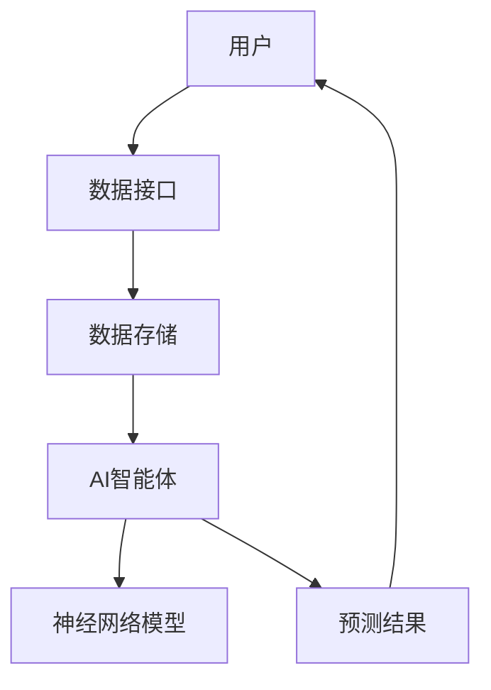
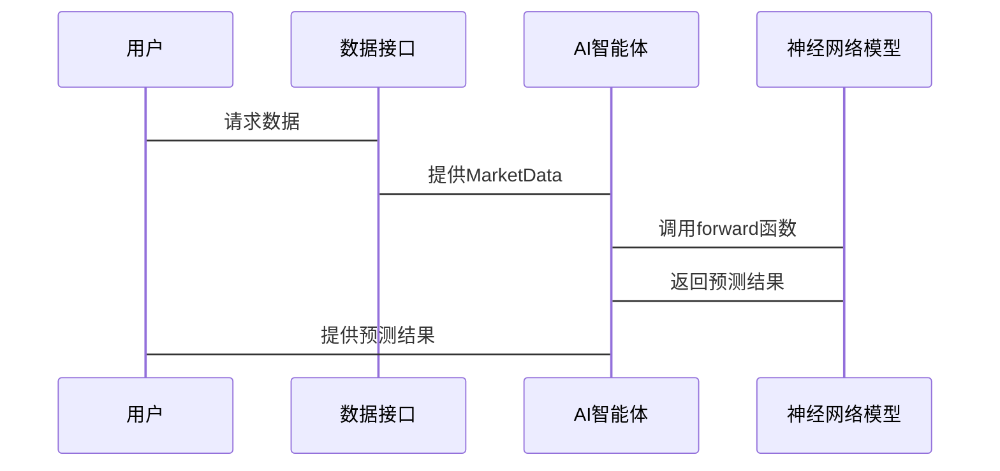

                 


# AI智能体在识别市场结构性变化中的作用

> 关键词：AI智能体，市场结构性变化，时间序列预测，神经网络，LSTM，深度学习

> 摘要：本文探讨AI智能体在识别市场结构性变化中的作用，从AI智能体的基本概念到其在市场预测中的实际应用，详细分析其优势和局限性。通过结合具体案例，本文旨在为读者提供一个全面的理解，帮助其在实际应用中更好地利用AI智能体进行市场分析。

---

## 目录

1. [AI智能体与市场结构性变化概述](#ai智能体与市场结构性变化概述)
2. [AI智能体的核心概念与联系](#ai智能体的核心概念与联系)
3. [AI智能体的算法原理与数学模型](#ai智能体的算法原理与数学模型)
4. [AI智能体的系统架构设计](#ai智能体的系统架构设计)
5. [AI智能体的项目实战](#ai智能体的项目实战)
6. [最佳实践、小结与注意事项](#最佳实践小结与注意事项)

---

## 第1章: AI智能体与市场结构性变化概述

### 1.1 AI智能体的基本概念

#### 1.1.1 AI智能体的定义
AI智能体（Artificial Intelligence Agent）是指能够感知环境、自主决策并采取行动的智能系统。与传统的算法不同，AI智能体具有更强的适应性和学习能力，能够根据环境的变化调整自身的行为策略。

#### 1.1.2 AI智能体的核心特征
- **自主性**：能够在没有外部干预的情况下独立运行。
- **反应性**：能够实时感知环境并做出快速反应。
- **学习能力**：通过数据和经验不断优化自身的决策模型。
- **目标导向**：具有明确的目标，并能够采取行动以实现目标。

#### 1.1.3 AI智能体与传统数据分析的区别
- 数据分析通常依赖于固定的规则和模式，而AI智能体能够根据环境的变化自适应地调整其分析策略。
- 数据分析的结果是静态的，而AI智能体能够动态地更新其分析结果。

### 1.2 市场结构性变化的定义

#### 1.2.1 市场结构的基本概念
市场结构是指市场中参与者之间的关系、竞争程度以及信息流动的模式。市场结构的变化通常表现为价格波动、市场份额转移、产品生命周期变化等。

#### 1.2.2 市场结构性变化的类型
- **渐进式变化**：市场结构在较长时间内逐步发生变化，如技术进步导致的产品升级。
- **突变式变化**：市场结构在短时间内发生剧烈变化，如突发的政策调整或重大事件引发的市场波动。

#### 1.2.3 市场变化的驱动因素
- **技术进步**：新技术的出现可能改变市场的竞争格局。
- **政策变化**：政府政策的调整可能影响市场的供需关系。
- **消费者行为变化**：消费者偏好的改变可能导致市场需求的变化。

### 1.3 AI智能体在识别市场变化中的作用

#### 1.3.1 AI智能体的优势
- **实时性**：AI智能体能够实时感知市场变化，并快速做出反应。
- **准确性**：通过深度学习算法，AI智能体能够发现隐藏在数据中的模式，从而提高预测的准确性。
- **适应性**：AI智能体能够根据市场环境的变化自适应地调整其分析策略。

#### 1.3.2 AI智能体在市场预测中的应用
- **价格预测**：通过分析历史价格数据，预测未来的价格走势。
- **需求预测**：基于市场数据和消费者行为，预测未来的需求变化。
- **风险预警**：通过实时监控市场数据，识别潜在的风险因素。

#### 1.3.3 AI智能体与人类决策者的结合
AI智能体能够提供数据支持和决策建议，但最终的决策仍然需要人类的判断和干预。这种结合能够充分发挥AI智能体的优势，同时弥补其在灵活性和创造性方面的不足。

### 1.4 本章小结
本章介绍了AI智能体的基本概念和市场结构性变化的定义，分析了AI智能体在识别市场变化中的作用。通过对比AI智能体与传统数据分析的区别，我们明确了AI智能体的独特优势和应用场景。

---

## 第2章: AI智能体的核心概念与联系

### 2.1 AI智能体的核心原理

#### 2.1.1 数据驱动的特征提取
AI智能体通过大量数据的输入，利用深度学习算法提取数据中的特征，从而实现对市场变化的识别。

#### 2.1.2 自适应学习机制
AI智能体能够根据新的数据不断优化自身的模型参数，从而提高其预测的准确性。

#### 2.1.3 多目标优化策略
AI智能体在进行市场预测时，通常需要同时优化多个目标，如准确性、实时性和稳定性。

### 2.2 AI智能体与市场变化的关系

#### 2.2.1 数据流与市场变化的关联
市场变化通常伴随着数据流的变化，AI智能体能够通过分析数据流的变化来识别市场变化的规律。

#### 2.2.2 AI智能体的反馈机制
AI智能体在识别市场变化后，能够通过反馈机制调整其分析策略，从而更好地适应市场环境的变化。

#### 2.2.3 市场变化的实时监测与预测
AI智能体能够实时监测市场数据的变化，并利用其预测能力对未来市场变化进行预测。

### 2.3 核心概念对比表

| 对比维度       | 传统算法                     | AI智能体                     |
|----------------|-----------------------------|-----------------------------|
| 数据需求       | 需要大量特征工程             | 需要大量数据，自动提取特征   |
| 可解释性       | 高                         | 较低                       |
| 灵活性         | 较低                       | 高                         |
| 学习能力       | 无                         | 强                         |

### 2.4 ER实体关系图

```mermaid
er
  actor(AI智能体)
  actor(市场数据)
  actor(用户)
  actor-[:读取]->市场数据
  市场数据-[:被分析]->AI智能体
  AI智能体-[:提供预测结果]->用户
```

---

## 第3章: AI智能体的算法原理与数学模型

### 3.1 神经网络模型

#### 3.1.1 神经网络的基本结构
神经网络由输入层、隐藏层和输出层组成，每个层之间通过权重连接。

#### 3.1.2 深度学习的数学基础
深度学习的核心是通过多层神经网络对数据进行非线性变换，其数学基础包括线性代数、微积分和概率论。

#### 3.1.3 激活函数的作用与选择
激活函数用于引入非线性因素，常见的激活函数有ReLU、sigmoid和tanh。选择合适的激活函数能够提高模型的性能。

#### 3.1.4 神经网络的训练过程
神经网络的训练过程包括正向传播和反向传播两个阶段。正向传播用于计算模型的输出，反向传播用于更新模型的权重。

#### 3.1.5 神经网络的Python实现

```python
import numpy as np

class NeuralNetwork:
    def __init__(self, input_size, hidden_size, output_size):
        self.W1 = np.random.randn(input_size, hidden_size)
        self.b1 = np.zeros((1, hidden_size))
        self.W2 = np.random.randn(hidden_size, output_size)
        self.b2 = np.zeros((1, output_size))
    
    def forward(self, X):
        z1 = np.dot(X, self.W1) + self.b1
        a1 = np.tanh(z1)
        z2 = np.dot(a1, self.W2) + self.b2
        a2 = np.sigmoid(z2)
        return a2
    
    def backward(self, X, y, output):
        m = X.shape[0]
        delta2 = (output - y) * output * (1 - output)
        dW2 = (1/m) * np.dot(a1.T, delta2)
        db2 = (1/m) * np.sum(delta2, axis=0)
        delta1 = delta2.dot(self.W2.T) * (1 - a1**2)
        dW1 = (1/m) * np.dot(X.T, delta1)
        db1 = (1/m) * np.sum(delta1, axis=0)
        return dW1, db1, dW2, db2
    
    def train(self, X, y, epochs=1000, learning_rate=0.1):
        for _ in range(epochs):
            output = self.forward(X)
            dW1, db1, dW2, db2 = self.backward(X, y, output)
            self.W1 -= learning_rate * dW1
            self.b1 -= learning_rate * db1
            self.W2 -= learning_rate * dW2
            self.b2 -= learning_rate * db2
```

---

### 3.2 时间序列预测模型

#### 3.2.1 LSTM网络的工作原理
LSTM（长短期记忆网络）是一种特殊的RNN（循环神经网络），能够有效处理时间序列数据中的长程依赖关系。

#### 3.2.2 LSTM网络的结构
LSTM由输入门、遗忘门和输出门组成，每个门都包含一个sigmoid函数和一个点乘操作。

#### 3.2.3 LSTM网络的数学公式

$$
f_t = \sigma(W_f \cdot [h_{t-1}, x_t] + b_f)
$$

$$
i_t = \sigma(W_i \cdot [h_{t-1}, x_t] + b_i)
$$

$$
o_t = \sigma(W_o \cdot [h_{t-1}, x_t] + b_o)
$$

$$
c_t = f_t \cdot c_{t-1} + i_t \cdot tanh(W_c \cdot [h_{t-1}, x_t] + b_c)
$$

$$
h_t = o_t \cdot tanh(c_t)
$$

#### 3.2.4 LSTM网络的Python实现

```python
import tensorflow as tf
from tensorflow.keras import layers

model = tf.keras.Sequential()
model.add(layers.LSTM(64, input_shape=(timesteps, features)))
model.add(layers.Dense(1))
model.compile(optimizer='adam', loss='mean_squared_error')
model.fit(x_train, y_train, epochs=50, batch_size=32)
```

---

## 第4章: AI智能体的系统架构设计

### 4.1 问题场景介绍
本章将介绍一个基于AI智能体的市场预测系统，该系统能够实时监测市场数据，并利用深度学习算法进行市场预测。

### 4.2 系统功能设计

```mermaid
classDiagram
    class MarketData {
        + data: list
        + timestamp: int
    }
    class AI智能体 {
        + model: NeuralNetwork
        + data: MarketData
        + prediction: float
    }
    class User {
        + request: bool
        + result: float
    }
    AI智能体 -> MarketData: readData
    AI智能体 -> NeuralNetwork: forward
    AI智能体 -> User: providePrediction
```

### 4.3 系统架构设计



### 4.4 系统接口设计

| 接口名称       | 输入          | 输出          |
|----------------|---------------|---------------|
| readData       | 无           | MarketData    |
| providePrediction | 无           | float         |

### 4.5 系统交互设计



---

## 第5章: AI智能体的项目实战

### 5.1 环境安装
安装所需的Python库，如TensorFlow、Keras和NumPy。

### 5.2 核心实现

```python
import numpy as np
import tensorflow as tf
from tensorflow.keras import layers

# 数据准备
X_train = np.random.randn(1000, 64)
y_train = np.random.randn(1000, 1)

# 模型定义
model = tf.keras.Sequential()
model.add(layers.Dense(64, activation='relu', input_shape=(64,)))
model.add(layers.Dense(1, activation='linear'))

# 模型训练
model.compile(optimizer='adam', loss='mean_squared_error')
model.fit(X_train, y_train, epochs=100, batch_size=32)
```

### 5.3 代码应用解读与分析
上述代码定义了一个简单的神经网络模型，并使用随机数据进行训练。实际应用中需要根据具体需求调整模型的结构和参数。

### 5.4 案例分析
假设我们希望预测某股票的价格走势，可以将股票的历史价格数据输入模型，通过训练模型来预测未来的价格。

### 5.5 项目小结
通过本章的实战，我们了解了AI智能体在市场预测中的具体实现过程，包括数据准备、模型训练和结果分析。

---

## 第6章: 最佳实践、小结与注意事项

### 6.1 最佳实践
- **数据质量**：确保输入数据的准确性和完整性。
- **模型选择**：根据具体问题选择合适的模型和算法。
- **实时性优化**：在实际应用中，需要考虑模型的实时性要求，优化模型的计算效率。

### 6.2 小结
本文从理论到实践，详细介绍了AI智能体在识别市场结构性变化中的作用。通过具体的算法实现和案例分析，我们了解了AI智能体的优势和局限性。

### 6.3 注意事项
- AI智能体的预测结果仅供参考，实际决策需要结合人类的判断。
- 在实际应用中，需要考虑数据隐私和模型安全问题。

---

## 作者信息

作者：AI天才研究院/AI Genius Institute & 禅与计算机程序设计艺术 /Zen And The Art of Computer Programming

