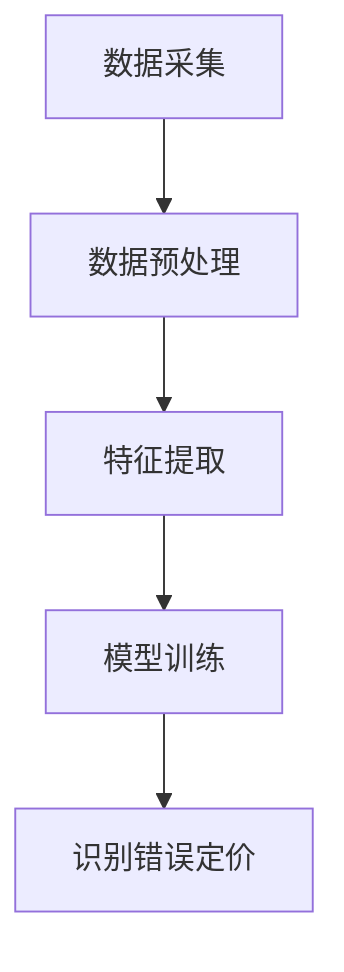
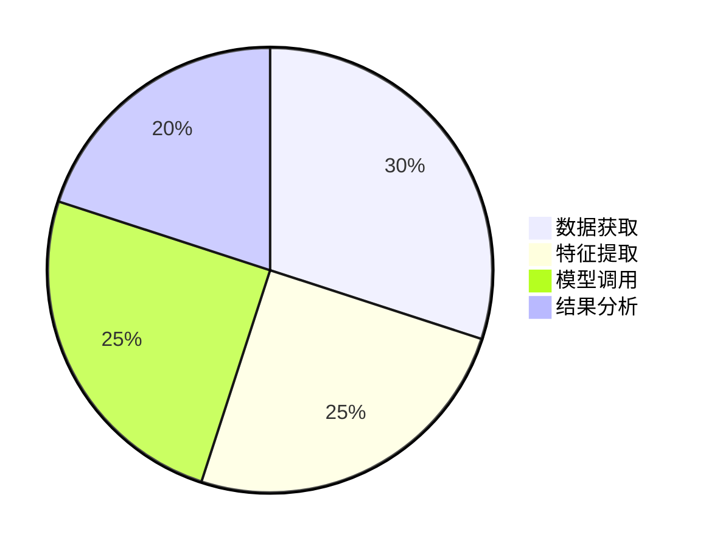
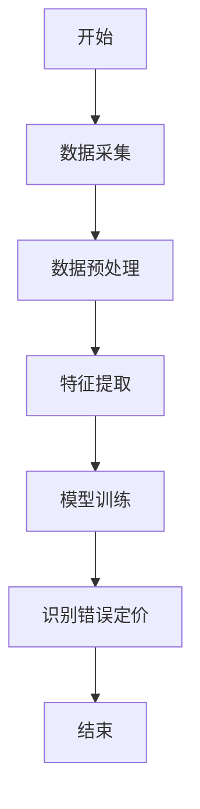
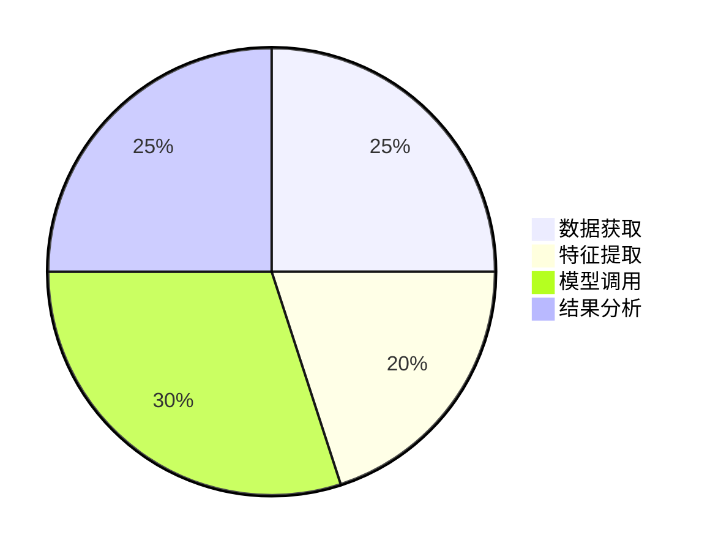
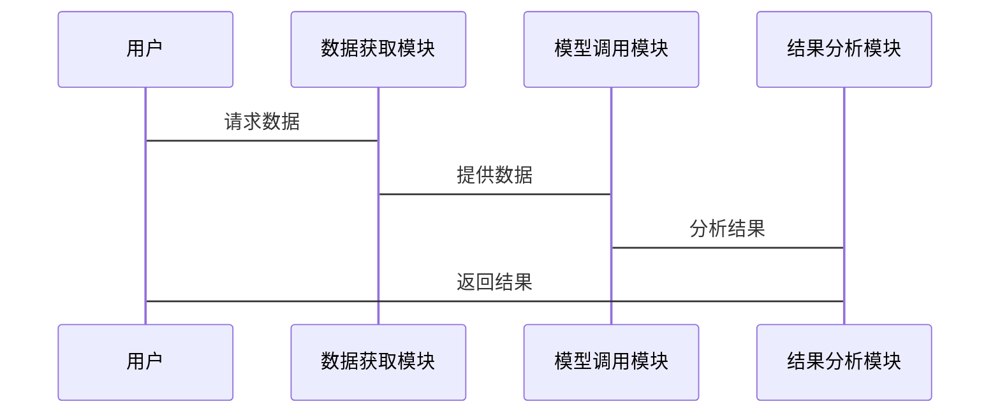

                 


# AI智能体在识别市场错误定价机会中的作用

> 关键词：AI智能体、市场错误定价、机会识别、机器学习、人工智能

> 摘要：本文探讨了AI智能体在识别市场错误定价机会中的应用，详细介绍了AI智能体的基本概念、核心原理、算法实现、系统架构以及实际应用场景。通过结合理论与实践，本文旨在为读者提供一个全面的理解框架，展示如何利用AI技术捕捉市场中的定价错误机会。

---

# 第一部分: AI智能体与市场错误定价机会的背景与概念

## 第1章: AI智能体与市场错误定价机会概述

### 1.1 AI智能体的基本概念

#### 1.1.1 AI智能体的定义
AI智能体（Artificial Intelligence Agent）是指能够感知环境并采取行动以实现目标的智能系统。它具备感知、推理、规划和学习的能力，能够适应复杂环境的变化。

#### 1.1.2 AI智能体的核心特征
- **自主性**：能够自主决策，无需外部干预。
- **反应性**：能够实时感知环境并做出反应。
- **学习能力**：能够通过数据和经验不断优化自身行为。
- **社交能力**：能够与其他智能体或人类进行交互。

#### 1.1.3 AI智能体与传统算法的区别
| 特性            | 传统算法                | AI智能体              |
|-----------------|-------------------------|-----------------------|
| 行为驱动         | 预先定义的规则驱动       | 目标驱动，动态适应     |
| 学习能力         | 无或有限                | 强大的学习能力         |
| 复杂环境处理能力 | 适用于简单、静态问题     | 适用于复杂、动态问题   |

### 1.2 市场错误定价机会的定义与特征

#### 1.2.1 市场错误定价的定义
市场错误定价是指商品或服务的定价与其真实价值不符的情况。这种错误可能是由于市场信息不对称、供需失衡或参与者决策失误等原因造成的。

#### 1.2.2 错误定价机会的类型
- **短期错误**：由于市场波动或突发事件导致的短期定价偏差。
- **长期错误**：由于市场结构或参与者行为长期失衡导致的定价偏差。
- **局部错误**：特定市场或行业中的定价偏差。

#### 1.2.3 错误定价机会的识别挑战
- **数据获取难度**：需要实时、多源的数据支持。
- **模型复杂性**：市场行为受多种因素影响，模型需要高度复杂。
- **动态变化**：市场环境不断变化，需要动态调整模型。

### 1.3 AI智能体在识别错误定价机会中的作用

#### 1.3.1 AI智能体的优势
- **高效性**：能够快速处理大量数据，识别定价错误。
- **准确性**：通过机器学习算法，提高定价错误识别的准确性。
- **适应性**：能够动态调整策略，应对市场变化。

#### 1.3.2 AI智能体在市场分析中的应用
- **价格预测**：通过分析历史数据，预测未来价格走势。
- **异常检测**：识别价格偏离正常范围的情况。
- **策略优化**：根据市场反馈，优化定价策略。

#### 1.3.3 错误定价机会的识别流程
1. **数据采集**：收集相关市场数据。
2. **数据预处理**：清洗和标准化数据。
3. **模型训练**：利用机器学习算法训练模型。
4. **识别错误定价**：通过模型输出结果，识别定价错误。

### 1.4 本章小结
本章介绍了AI智能体的基本概念和市场错误定价机会的定义与特征。通过对比AI智能体与传统算法的区别，阐述了AI智能体在识别错误定价机会中的独特优势和应用场景。

---

# 第二部分: AI智能体识别错误定价机会的核心原理

## 第2章: AI智能体的核心原理

### 2.1 AI智能体的基本原理

#### 2.1.1 AI智能体的感知与决策机制
AI智能体通过传感器或数据源感知环境，利用感知信息进行推理和决策。例如，股票交易智能体可以通过分析市场数据，决定买入或卖出股票。

#### 2.1.2 智能体的行为模型
- **反应式模型**：基于当前感知做出反应。
- **规划式模型**：根据目标制定行动计划。
- **混合式模型**：结合反应式和规划式的特点。

#### 2.1.3 智能体的自适应学习能力
AI智能体能够通过强化学习、监督学习等方法，不断优化自身的决策策略。

### 2.2 错误定价机会识别的算法原理

#### 2.2.1 错误定价机会识别的数学模型
数学模型描述了价格与真实价值之间的关系。例如，可以通过回归分析模型预测价格偏离的真实价值程度。

$$ \text{预测价格} = \beta_0 + \beta_1 \times \text{真实价值} + \epsilon $$

其中，$\epsilon$ 是误差项，表示价格与真实价值之间的偏差。

#### 2.2.2 错误定价机会识别的算法流程
1. **数据采集**：收集商品或服务的价格和相关特征数据。
2. **特征提取**：提取影响定价的关键特征。
3. **模型训练**：利用机器学习算法训练定价预测模型。
4. **识别错误定价**：将实际价格与模型预测价格进行对比，识别偏差。

#### 2.2.3 算法的优缺点分析
| 算法类型       | 优点                           | 缺点                           |
|----------------|--------------------------------|---------------------------------|
| 监督学习         | 高准确性，适用于有标签数据       | 需要大量标注数据                 |
| 强化学习         | 能够适应动态环境                 | 需要大量训练时间                 |
| 对比学习         | 可以发现数据中的偏差             | 实现复杂性较高                   |

### 2.3 AI智能体的训练方法

#### 2.3.1 监督学习
监督学习通过标记数据训练模型，使其能够预测新的数据。例如，利用历史定价数据训练模型，预测未来的价格。

#### 2.3.2 强化学习
强化学习通过智能体与环境的交互，逐步优化决策策略。例如，股票交易智能体通过不断买卖操作，优化收益。

#### 2.3.3 对比学习
对比学习通过比较不同数据点的差异，发现定价错误。例如，通过比较同类商品的价格差异，识别定价异常。

### 2.4 本章小结
本章详细介绍了AI智能体的核心原理，包括感知与决策机制、行为模型和自适应学习能力。同时，阐述了错误定价机会识别的算法原理和训练方法。

---

## 图表示例

### 错误定价机会识别的算法流程图



---

## 系统架构图



---

## 算法流程图



---

# 第三部分: 错误定价机会识别的算法实现

## 第3章: 错误定价机会识别的算法实现

### 3.1 错误定价机会识别的模型训练

#### 3.1.1 数据预处理
数据预处理包括数据清洗、标准化和特征工程。例如，处理缺失值、异常值和无关特征。

```python
import pandas as pd
data = pd.read_csv('pricing_data.csv')
data = data.dropna()
data = (data - data.mean()) / data.std()
```

#### 3.1.2 模型选择
选择适合的模型，如线性回归、随机森林或神经网络。

```python
from sklearn.linear_model import LinearRegression
model = LinearRegression()
```

#### 3.1.3 模型训练与优化
利用训练数据训练模型，并通过交叉验证优化模型参数。

```python
from sklearn.model_selection import train_test_split
X_train, X_test, y_train, y_test = train_test_split(data.drop('price', axis=1), data['price'], test_size=0.2)
model.fit(X_train, y_train)
```

### 3.2 错误定价机会识别的特征工程

#### 3.2.1 特征提取
提取影响定价的关键特征，如商品类别、市场趋势和季节性因素。

```python
import numpy as np
features = data[['category', 'market_trend', 'seasonality']]
```

#### 3.2.2 特征选择
通过特征重要性分析选择关键特征。

```python
from sklearn.ensemble import RandomForestRegressor
model = RandomForestRegressor()
model.fit(features, data['price'])
importances = model.feature_importances_
```

#### 3.2.3 特征工程的实现
对特征进行标准化、编码和组合。

```python
from sklearn.preprocessing import OneHotEncoder
encoder = OneHotEncoder()
encoded_features = encoder.fit_transform(features[['category']])
```

### 3.3 错误定价机会识别的算法调优

#### 3.3.1 超参数调优
通过网格搜索优化模型参数。

```python
from sklearn.model_selection import GridSearchCV
param_grid = {'n_estimators': [100, 200], 'max_depth': [None, 10]}
grid_search = GridSearchCV(RandomForestRegressor(), param_grid)
grid_search.fit(X_train, y_train)
best_model = grid_search.best_estimator_
```

#### 3.3.2 模型评估与验证
通过均方误差（MSE）评估模型性能。

```python
from sklearn.metrics import mean_squared_error
y_pred = best_model.predict(X_test)
mse = mean_squared_error(y_test, y_pred)
print(f"均方误差: {mse}")
```

#### 3.3.3 模型部署与应用
将模型部署到生产环境，实时监控定价错误。

```python
import joblib
joblib.dump(best_model, 'pricing_model.pkl')
```

### 3.4 本章小结
本章详细介绍了错误定价机会识别的算法实现，包括模型训练、特征工程和算法调优。通过具体代码示例，展示了如何利用Python和机器学习库实现定价错误识别。

---

# 第四部分: 系统架构与应用场景

## 第4章: 系统架构与应用场景

### 4.1 系统总体架构

#### 4.1.1 系统功能设计
- 数据获取模块：实时采集市场数据。
- 特征提取模块：提取影响定价的关键特征。
- 模型调用模块：调用训练好的模型进行预测。
- 结果分析模块：分析模型输出，识别定价错误。

#### 4.1.2 系统架构设计


### 4.2 错误定价机会识别的关键模块设计

#### 4.2.1 数据获取模块
通过API或数据库获取实时市场数据。

```python
import requests
response = requests.get('https://api.marketdata.com/prices')
data = response.json()
```

#### 4.2.2 特征提取模块
从原始数据中提取有用的特征，如价格、成交量、市场趋势等。

```python
features = data[['price', 'volume', 'market_trend']]
```

#### 4.2.3 模型调用模块
调用训练好的模型进行定价预测。

```python
import joblib
model = joblib.load('pricing_model.pkl')
predictions = model.predict(features)
```

#### 4.2.4 结果分析模块
分析模型输出，识别定价错误。

```python
errors = abs(data['price'] - predictions)
print(f"平均绝对误差: {errors.mean()}")
```

### 4.3 错误定价机会识别的系统交互

#### 4.3.1 系统交互设计


### 4.4 本章小结
本章详细介绍了错误定价机会识别系统的总体架构和关键模块设计，展示了如何通过系统化的方法实现定价错误识别。

---

## 图表示例

### 系统架构图


---

### 系统交互图


---

# 第五部分: 项目实战

## 第5章: 项目实战

### 5.1 项目背景

#### 5.1.1 项目介绍
本项目旨在利用AI智能体识别股票市场的错误定价机会，帮助投资者捕捉潜在收益。

### 5.2 项目核心实现

#### 5.2.1 环境搭建
安装必要的Python库，如pandas、scikit-learn、TensorFlow等。

```bash
pip install pandas scikit-learn tensorflow
```

#### 5.2.2 数据处理
加载股票数据并进行预处理。

```python
import pandas as pd
data = pd.read_csv('stock_prices.csv')
data = data.dropna()
data = (data - data.mean()) / data.std()
```

#### 5.2.3 模型实现
训练一个神经网络模型来预测股票价格。

```python
from tensorflow.keras import layers
model = tf.keras.Sequential()
model.add(layers.Dense(64, activation='relu', input_dim=10))
model.add(layers.Dense(1, activation='linear'))
model.compile(optimizer='adam', loss='mean_squared_error')
model.fit(X_train, y_train, epochs=100, batch_size=32)
```

#### 5.2.4 结果展示
通过混淆矩阵和回归分析展示模型的性能。

```python
from sklearn.metrics import confusion_matrix, classification_report
print(classification_report(y_test, y_pred))
```

### 5.3 项目小结
本章通过一个具体的项目案例，展示了如何利用AI智能体识别股票市场的错误定价机会。通过详细代码实现，帮助读者理解如何将理论应用于实际。

---

# 第六部分: 总结与未来趋势

## 第6章: 总结与未来趋势

### 6.1 本文总结
本文详细介绍了AI智能体在识别市场错误定价机会中的应用，从基本概念到算法实现，再到系统架构和项目实战，全面展示了AI技术在定价错误识别中的潜力。

### 6.2 未来发展趋势
- **更复杂模型**：深度学习和强化学习的进一步应用。
- **实时分析**：提升系统的实时性和响应速度。
- **多模态数据**：结合文本、图像等多种数据源进行分析。
- **自动化决策**：实现从识别到决策的自动化流程。

### 6.3 本章小结
未来，AI智能体在市场错误定价机会识别中的应用将更加广泛和深入，技术的进步将进一步提升定价错误识别的准确性和效率。

---

# 作者：AI天才研究院/AI Genius Institute & 禅与计算机程序设计艺术 /Zen And The Art of Computer Programming

---

以上是文章的详细目录和内容框架，您可以根据需要扩展每一部分的具体内容。

