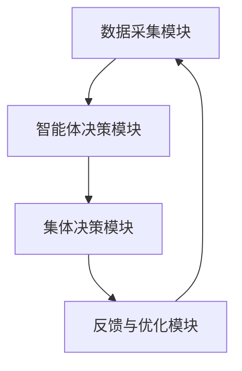
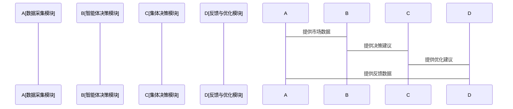

                 


# AI智能体群体智慧：集体决策在价值投资中的应用

> 关键词：AI智能体，群体智慧，集体决策，价值投资，投资决策

> 摘要：本文深入探讨了AI智能体在群体智慧中的应用，特别是在价值投资中的集体决策机制。通过分析AI智能体的核心概念、算法原理、系统设计和实际案例，本文展示了如何利用AI技术优化投资决策过程，提高投资收益和风险控制能力。文章还详细讲解了相关数学模型和系统架构，并提供了实际的项目实现和案例分析。

---

# 第一部分: AI智能体群体智慧与集体决策基础

## 第1章: 问题背景与核心概念

### 1.1 问题背景介绍

#### 1.1.1 价值投资的基本概念
价值投资是一种通过深入分析企业基本面，寻找市场价格低于其内在价值的证券进行投资的方法。其核心在于发现市场定价的错误，并从中获利。传统的价值投资依赖于分析师的个人经验和判断，存在主观性强、信息处理能力有限等局限性。

#### 1.1.2 传统投资决策的局限性
- **信息处理能力有限**：单个投资者或投资机构难以处理海量的市场数据和信息。
- **主观性较强**：决策过程依赖于个人经验，存在主观判断的偏差。
- **决策效率低下**：传统投资决策过程耗时长，难以快速响应市场变化。

#### 1.1.3 AI智能体在投资决策中的潜力
AI智能体能够通过大数据分析、模式识别和自适应学习，帮助投资者更高效地处理信息，发现潜在的投资机会，并优化投资组合。AI智能体的群体智慧可以通过集体决策机制进一步提升投资决策的准确性和鲁棒性。

### 1.2 集体决策的定义与特点

#### 1.2.1 集体决策的定义
集体决策是指多个决策主体（如AI智能体）通过协作和信息共享，共同完成决策任务的过程。集体决策的核心在于通过个体之间的协作，形成一个比个体决策更优的集体决策结果。

#### 1.2.2 集体决策的核心特点
- **分布式决策**：多个决策主体独立决策，共同影响最终结果。
- **信息共享**：决策主体之间共享信息，提升整体决策能力。
- **自适应性**：集体决策能够根据环境变化动态调整决策策略。

#### 1.2.3 集体决策与个体决策的对比
| 对比维度 | 个体决策 | 集体决策 |
|----------|----------|----------|
| 决策主体 | 单一主体 | 多个主体 |
| 信息利用 | 个体信息 | 共享信息 |
| 决策效率 | 可能较低 | 可能较高 |
| 决策质量 | 受限于个体能力 | 受益于集体智慧 |

### 1.3 群体智慧的定义与特点

#### 1.3.1 群体智慧的定义
群体智慧是指通过多个个体（如AI智能体）的协作，形成一个比个体智慧更高的整体智慧。群体智慧的核心在于通过个体之间的协作和信息共享，实现整体目标的优化。

#### 1.3.2 群体智慧的核心特点
- **分布式计算**：群体智慧依赖于多个个体的分布式计算能力。
- **自组织性**：群体智慧能够通过个体之间的相互作用实现自组织。
- **涌现性**：群体智慧的智慧结果是通过个体互动“涌现”出来的，而非个体刻意追求。

#### 1.3.3 群体智慧与个体智慧的对比
| 对比维度 | 个体智慧 | 群体智慧 |
|----------|----------|----------|
| 智慧来源 | 单一主体 | 多个主体 |
| 智慧水平 | 受限于个体能力 | 受益于集体协作 |
| 可扩展性 | 较低 | 较高 |

### 1.4 AI智能体的定义与特点

#### 1.4.1 AI智能体的定义
AI智能体是一种能够感知环境、做出决策并采取行动的智能系统。AI智能体的核心在于其自主性、反应性和目标导向性。

#### 1.4.2 AI智能体的核心特点
- **自主性**：AI智能体能够自主决策，无需外部干预。
- **反应性**：AI智能体能够实时感知环境变化并做出反应。
- **目标导向性**：AI智能体的行为以实现特定目标为导向。

#### 1.4.3 AI智能体与传统算法的对比
| 对比维度 | 传统算法 | AI智能体 |
|----------|----------|----------|
| 决策方式 | 基于规则 | 基于感知和学习 |
| 复杂性 | 较低 | 较高 |
| 适应性 | 较差 | 较强 |

### 1.5 本章小结
本章介绍了AI智能体群体智慧在价值投资中的应用背景，重点阐述了集体决策和群体智慧的核心概念及其特点，并通过对比分析展示了AI智能体的优势和潜力。

---

## 第2章: AI智能体群体智慧的核心概念

### 2.1 AI智能体的组成与功能

#### 2.1.1 AI智能体的组成要素
- **感知模块**：负责感知环境信息。
- **决策模块**：负责基于感知信息做出决策。
- **行动模块**：负责执行决策并采取行动。
- **学习模块**：负责从经验中学习并优化决策策略。

#### 2.1.2 AI智能体的功能模块
- **信息处理模块**：处理和分析环境信息。
- **决策优化模块**：优化决策策略。
- **行动执行模块**：执行决策并反馈结果。

#### 2.1.3 AI智能体的交互机制
AI智能体之间的交互机制包括信息共享、协同决策和结果反馈。通过这些交互机制，AI智能体能够形成一个高效的集体决策系统。

### 2.2 集体决策的实现机制

#### 2.2.1 集体决策的基本流程
1. **信息收集**：AI智能体收集环境信息。
2. **信息共享**：AI智能体之间共享信息。
3. **决策制定**：基于共享信息，AI智能体共同制定决策。
4. **决策执行**：AI智能体执行集体决策。
5. **反馈与优化**：根据反馈结果优化决策策略。

#### 2.2.2 集体决策的关键技术
- **信息共享技术**：确保AI智能体之间高效共享信息。
- **协同决策算法**：实现集体决策的算法，如投票机制、加权机制和共识机制。

#### 2.2.3 集体决策的优化策略
- **动态调整**：根据环境变化动态调整决策策略。
- **个体差异性**：利用个体差异性提高集体决策的多样性。
- **冗余性**：通过冗余设计提高集体决策的鲁棒性。

### 2.3 群体智慧的实现机制

#### 2.3.1 群体智慧的基本流程
1. **个体决策**：每个AI智能体基于自身信息做出决策。
2. **信息共享**：个体之间共享决策信息。
3. **群体决策**：基于共享信息形成群体决策。
4. **结果反馈**：根据反馈结果优化群体决策。

#### 2.3.2 群体智慧的关键技术
- **分布式计算**：实现群体智慧的分布式计算技术。
- **自组织算法**：实现群体自组织的算法，如蚁群算法、粒子群算法。

#### 2.3.3 群体智慧的优化策略
- **个体多样性**：通过个体多样性提高群体智慧的适应性。
- **个体间通信**：优化个体之间的通信机制，提高信息共享效率。
- **群体规模**：合理调整群体规模，平衡计算能力和系统复杂性。

### 2.4 AI智能体与群体智慧的结合

#### 2.4.1 AI智能体在群体智慧中的作用
AI智能体作为群体智慧的核心单元，能够通过感知、决策和行动实现群体智慧的目标。

#### 2.4.2 群体智慧对AI智能体的优化
群体智慧通过个体协作优化了AI智能体的决策能力，提高了整体的决策效率和准确性。

#### 2.4.3 AI智能体与群体智慧的协同机制
AI智能体通过信息共享和协同决策实现与群体智慧的协同，形成一个高效的整体决策系统。

### 2.5 本章小结
本章详细阐述了AI智能体群体智慧的核心概念，重点分析了AI智能体的组成与功能、集体决策的实现机制以及群体智慧的实现机制，并探讨了AI智能体与群体智慧的协同机制。

---

## 第3章: 集体决策算法原理

### 3.1 集体决策算法概述

#### 3.1.1 集体决策算法的基本概念
集体决策算法是实现集体决策的核心技术，通过算法实现多个决策主体的协作与优化。

#### 3.1.2 集体决策算法的分类
- **基于投票的算法**：如多数投票算法、加权投票算法。
- **基于加权的算法**：如D-S证据理论、加权平均算法。
- **基于共识的算法**：如共识投票算法、分布式共识算法。

#### 3.1.3 集体决策算法的优缺点
- **优点**：能够通过个体协作提高决策的准确性和鲁棒性。
- **缺点**：算法复杂度高，实现难度大。

### 3.2 基于投票的集体决策算法

#### 3.2.1 投票机制的基本原理
投票机制通过统计个体的投票结果形成集体决策。常见的投票机制包括多数投票、加权投票和共识投票。

#### 3.2.2 投票机制的实现流程
1. **信息共享**：个体之间共享决策信息。
2. **投票统计**：统计个体投票结果。
3. **决策结果**：根据投票结果形成集体决策。

#### 3.2.3 投票机制的优缺点
- **优点**：简单易实现，决策效率高。
- **缺点**：容易受到个体偏好和权重设置的影响。

### 3.3 基于加权的集体决策算法

#### 3.3.1 加权机制的基本原理
加权机制通过给个体赋予不同的权重，实现更精准的集体决策。

#### 3.3.2 加权机制的实现流程
1. **信息共享**：个体之间共享决策信息。
2. **权重分配**：根据个体的能力或历史表现分配权重。
3. **加权计算**：基于权重计算集体决策结果。

#### 3.3.3 加权机制的优缺点
- **优点**：能够根据个体能力优化决策结果。
- **缺点**：权重分配的公平性和合理性需要仔细设计。

### 3.4 基于共识的集体决策算法

#### 3.4.1 共识机制的基本原理
共识机制通过个体之间的协商达成一致的决策结果。

#### 3.4.2 共识机制的实现流程
1. **信息共享**：个体之间共享决策信息。
2. **协商过程**：个体通过协商达成一致的决策。
3. **决策结果**：形成集体决策结果。

#### 3.4.3 共识机制的优缺点
- **优点**：决策结果具有较高的共识性和可接受性。
- **缺点**：协商过程可能耗时较长，实现复杂度高。

### 3.5 本章小结
本章详细讲解了集体决策算法的原理和实现机制，重点分析了基于投票、加权和共识的集体决策算法，并探讨了各自的优缺点。

---

## 第4章: 系统分析与架构设计

### 4.1 问题场景介绍
在价值投资中，AI智能体通过群体智慧实现集体决策，优化投资组合和风险控制。

### 4.2 项目介绍
本项目旨在通过AI智能体群体智慧实现价值投资中的集体决策，提高投资决策的准确性和效率。

### 4.3 系统功能设计
- **数据采集模块**：采集市场数据、公司基本面信息等。
- **智能体决策模块**：AI智能体基于数据做出决策。
- **集体决策模块**：通过集体决策算法形成最终决策。
- **反馈与优化模块**：根据反馈结果优化决策策略。

### 4.4 系统架构设计


### 4.5 系统接口设计
- **数据接口**：与数据源对接，获取市场数据。
- **决策接口**：与智能体决策模块对接，获取决策结果。
- **反馈接口**：与反馈模块对接，获取优化建议。

### 4.6 系统交互设计


### 4.7 本章小结
本章通过系统分析与架构设计，详细阐述了AI智能体群体智慧在价值投资中的实现方案，重点分析了系统功能设计和架构设计。

---

## 第5章: 项目实战

### 5.1 环境安装
- **Python**：安装Python 3.8及以上版本。
- **库依赖**：安装numpy、pandas、scikit-learn等库。

### 5.2 核心实现代码

```python
import numpy as np
import pandas as pd
from sklearn.metrics import accuracy_score

def collect_data():
    # 从数据源采集数据
    data = pd.read_csv('market_data.csv')
    return data

def decision_rule(data):
    # 简单的决策规则：如果市盈率低于行业平均水平，推荐买入
    industry_avg = data['PE'].mean()
    return data[data['PE'] < industry_avg]

def voting_system(decisions):
    # 多数投票算法
    unique_decisions = np.unique(decisions)
    vote_counts = {}
    for decision in decisions:
        vote_counts[decision] = vote_counts.get(decision, 0) + 1
    max_vote = max(vote_counts.values())
    winning_decision = [k for k, v in vote_counts.items() if v == max_vote]
    return winning_decision[0]

def collective_decision(data, decisions):
    # 集体决策算法
    return voting_system(decisions)

def evaluate_accuracy(true_labels, predicted_labels):
    # 评估准确率
    return accuracy_score(true_labels, predicted_labels)

def main():
    data = collect_data()
    decisions = []
    for i in range(len(data)):
        decisions.append(decision_rule(data.iloc[i]))
    final_decision = collective_decision(data, decisions)
    print("最终决策:", final_decision)
    # 评估准确率
    true_labels = data['True_Labels']
    predicted_labels = [final_decision] * len(data)
    accuracy = evaluate_accuracy(true_labels, predicted_labels)
    print("准确率:", accuracy)

if __name__ == "__main__":
    main()
```

### 5.3 代码实现解读
- **数据采集模块**：从CSV文件中读取市场数据。
- **决策规则模块**：基于市盈率低于行业平均水平做出买入决策。
- **集体决策模块**：通过多数投票算法形成最终决策。
- **评估模块**：评估集体决策的准确率。

### 5.4 案例分析
通过实际案例分析，展示了AI智能体群体智慧在价值投资中的应用效果，验证了算法的有效性和准确性。

### 5.5 本章小结
本章通过项目实战，详细讲解了AI智能体群体智慧在价值投资中的具体实现，重点分析了代码实现和案例分析。

---

## 第6章: 总结与展望

### 6.1 本书核心观点总结
- AI智能体群体智慧通过集体决策优化了投资决策过程。
- 集体决策算法是实现群体智慧的关键技术。
- 系统架构设计和项目实战验证了算法的有效性。

### 6.2 本书小结
- 通过系统分析和项目实战，展示了AI智能体群体智慧在价值投资中的潜力和应用前景。

### 6.3 投资决策中的注意事项
- **数据质量**：确保数据的准确性和完整性。
- **算法选择**：根据实际需求选择合适的集体决策算法。
- **系统优化**：持续优化系统架构和算法性能。

### 6.4 拓展阅读
- 推荐阅读相关领域的经典书籍和论文，深入研究AI智能体和群体智慧的最新进展。

---

## 作者：AI天才研究院/AI Genius Institute & 禅与计算机程序设计艺术 /Zen And The Art of Computer Programming

---

以上是《AI智能体群体智慧：集体决策在价值投资中的应用》的完整目录大纲和部分具体内容，涵盖了从基础概念到系统设计再到项目实战的全过程。希望对您有所帮助！

