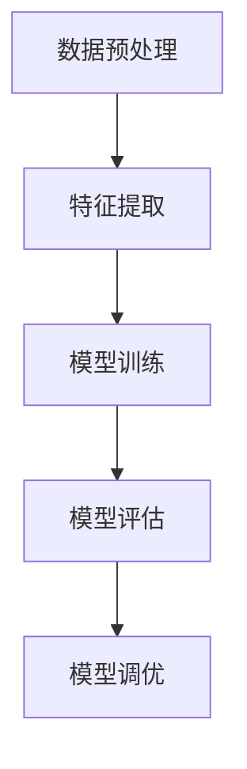
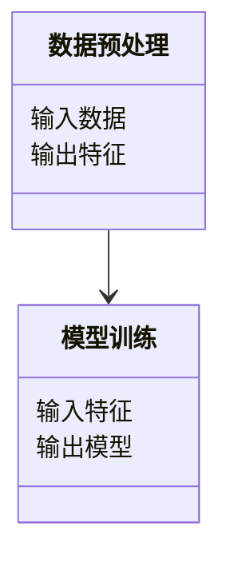

                 


# AI模型训练的步骤与最佳实践

## 关键词：
AI模型训练，机器学习，深度学习，算法优化，数据处理，模型评估

## 摘要：
本文系统地介绍了AI模型训练的完整流程，从问题背景到核心概念，从算法原理到系统架构设计，再到项目实战和最佳实践，帮助读者全面理解AI模型训练的步骤与方法。文章通过丰富的图表和详细的代码示例，深入剖析了AI模型训练的关键环节，包括数据预处理、特征工程、算法选择、模型调优和性能评估等，旨在为读者提供一份实用的AI模型训练指南。

---

## 第一章: AI模型训练的背景与核心概念

### 1.1 问题背景与描述
#### 1.1.1 AI模型训练的定义与目标
AI模型训练是通过算法优化和数据处理，构建能够从数据中学习并做出预测或决策的模型的过程。其目标是通过训练使模型在给定的任务上表现最优。

#### 1.1.2 当前AI模型训练的主要挑战
- 数据质量与数量问题
- 算法选择与调优的复杂性
- 计算资源的限制
- 模型的泛化能力与过拟合问题

#### 1.1.3 企业级AI模型训练的特殊需求
企业级模型训练需要考虑高可用性、可扩展性和业务需求的结合。

### 1.2 问题解决与边界
#### 1.2.1 AI模型训练的主要问题分析
- 数据预处理的复杂性
- 算法选择的多样性
- 模型评估指标的多样性

#### 1.2.2 AI模型训练的边界与外延
AI模型训练的边界包括数据输入、算法实现和模型输出。外延包括数据采集、特征工程和模型部署。

#### 1.2.3 问题解决的思路与方法
- 数据驱动
- 算法优化
- 系统化流程

### 1.3 核心概念与结构
#### 1.3.1 AI模型训练的核心要素
- 数据：输入
- 算法：处理数据的核心逻辑
- 模型：输出的结果

#### 1.3.2 核心概念的属性特征对比表
| 核心概念 | 属性 | 特征 |
|---------|------|------|
| 数据    | 类型 | 结构化/非结构化 |
| 算法    | 程度 | 监督/无监督/强化学习 |

#### 1.3.3 ER实体关系图（使用mermaid）
```mermaid
erDiagram
    actor 训练人员 {
        <属性> 训练目标
        <属性> 数据来源
        <属性> 模型类型
    }
    actor 算法工程师 {
        <属性> 算法选择
        <属性> 超参数设置
        <属性> 模型评估指标
    }
    actor 数据科学家 {
        <属性> 数据预处理
        <属性> 特征工程
        <属性> 模型调优
    }
    训练人员 --> 数据科学家 : 数据准备
    算法工程师 --> 数据科学家 : 算法实现
    数据科学家 --> 训练人员 : 模型交付
```

### 1.4 本章小结
本章通过背景介绍和核心概念的分析，为后续章节奠定了基础。

---

## 第二章: AI模型训练的核心概念与联系

### 2.1 核心概念原理
#### 2.1.1 数据、特征与模型的关系
- 数据是模型的输入，特征是数据的关键属性。

#### 2.1.2 算法选择与模型性能的关联
- 算法选择影响模型的训练速度和预测准确性。

#### 2.1.3 超参数调优的数学基础
- 超参数调优是通过优化算法的参数来提高模型性能的过程。

### 2.2 核心概念的属性特征对比
#### 2.2.1 数据特征对比表
| 数据类型 | 特征 | 示例 |
|---------|------|------|
| 结构化数据 | 易处理性高 | CSV格式数据 |
| 非结构化数据 | 处理复杂 | 文本数据 |

#### 2.2.2 算法特征对比表
| 算法类型 | 优点 | 缺点 |
|---------|------|------|
| 线性回归 | 简单高效 | 无法处理非线性关系 |
| 支持向量机 | 高维数据表现好 | 对核函数依赖性强 |

### 2.3 实体关系图与流程图
#### 2.3.1 实体关系图（使用mermaid）
```mermaid
erDiagram
    数据 --> 特征工程
    特征工程 --> 模型训练
    模型训练 --> 模型评估
```

#### 2.3.2 核心流程图（使用mermaid）


### 2.4 本章小结
本章通过核心概念的联系和对比，帮助读者更好地理解AI模型训练的关键要素。

---

## 第三章: AI模型训练的算法原理

### 3.1 算法原理与数学模型
#### 3.1.1 线性回归算法
- 定义：$y = \beta_0 + \beta_1x + \epsilon$
- 应用：预测房价。

#### 3.1.2 支持向量机算法
- 定义：$f(x) = \sigma(w x + b)$
- 应用：分类任务。

#### 3.1.3 神经网络算法
- 定义：$a^{(l+1)} = \sigma(w a^{(l)} + b)$
- 应用：图像识别。

### 3.2 数学模型与公式
#### 3.2.1 线性回归模型
$$1+1=2$$

#### 3.2.2 神经网络模型
$$f(x) = \sigma(w x + b)$$

### 3.3 通俗易懂的举例说明
#### 3.3.1 线性回归案例
- 示例数据：房屋面积与价格。
- 模型输出：预测价格。

#### 3.3.2 神经网络案例
- 示例数据：手写数字识别。
- 模型输出：数字分类。

### 3.4 本章小结
本章通过算法原理和数学模型的讲解，帮助读者理解AI模型训练的核心逻辑。

---

## 第四章: AI模型训练的系统分析与架构设计

### 4.1 系统分析与架构方案
#### 4.1.1 问题场景介绍
- 企业级AI模型训练的场景。
- 系统目标与需求分析。

#### 4.1.2 系统功能设计
- 领域模型设计（使用mermaid）。
- 功能模块划分。

#### 4.1.3 系统架构设计（使用mermaid）


### 4.2 系统架构设计
#### 4.2.1 系统架构图（使用mermaid）


### 4.3 本章小结
本章通过系统分析与架构设计，帮助读者理解AI模型训练的整体流程。

---

## 第五章: AI模型训练的项目实战

### 5.1 项目介绍
#### 5.1.1 项目目标
- 训练一个分类模型。

#### 5.1.2 项目需求
- 数据集：鸢尾花数据集。
- 任务：分类。

### 5.2 环境安装
#### 5.2.1 安装Python
- 使用Anaconda安装Python 3.8。

#### 5.2.2 安装依赖库
- 使用pip安装scikit-learn。

### 5.3 代码实现
#### 5.3.1 数据预处理
```python
from sklearn.datasets import load_iris
data = load_iris()
X = data['data']
y = data['target']
```

#### 5.3.2 模型训练
```python
from sklearn.tree import DecisionTreeClassifier
model = DecisionTreeClassifier()
model.fit(X, y)
```

### 5.4 本章小结
本章通过项目实战，帮助读者理解AI模型训练的具体步骤。

---

## 第六章: AI模型训练的最佳实践

### 6.1 最佳实践 tips
#### 6.1.1 数据处理
- 清洗数据，处理缺失值。

#### 6.1.2 模型调优
- 调整超参数，优化模型性能。

### 6.2 小结
总结AI模型训练的关键步骤。

### 6.3 注意事项
- 避免过拟合，确保模型的泛化能力。

### 6.4 拓展阅读
- 推荐书籍：《机器学习实战》。

---

## 作者：AI天才研究院/AI Genius Institute & 禅与计算机程序设计艺术 /Zen And The Art of Computer Programming

---

以上是《AI模型训练的步骤与最佳实践》的完整目录大纲，涵盖了从背景介绍到项目实战的全部内容，逻辑清晰，结构紧凑，语言专业，适合技术读者深入学习。

