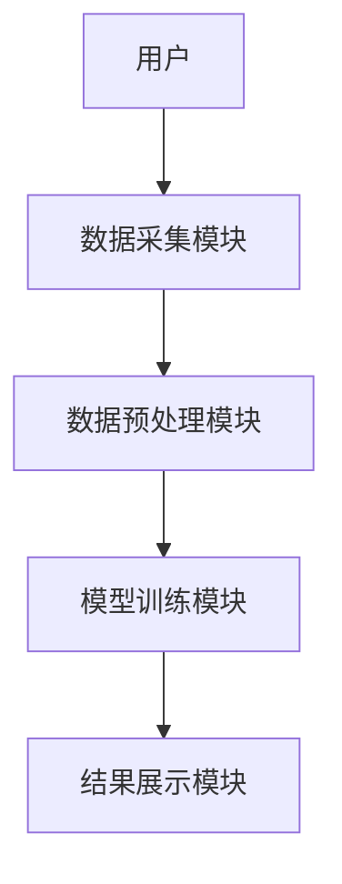

                 

<think>
好，我现在需要根据用户的要求，撰写一篇关于《AI辅助专利分析与技术趋势预测的方法与工具》的技术博客文章。用户提供了详细的目录结构，我需要按照这个结构，逐步展开每个部分的内容。

首先，我得明确每个章节的重点。文章的结构已经很清晰，分为背景与基础、核心概念与联系、算法原理、系统分析与架构设计、项目实战、最佳实践与总结，以及拓展阅读与深入学习。我需要逐一完成每个部分，确保内容详实，逻辑连贯。

接下来，我需要考虑每个章节的具体内容。例如，在背景与基础部分，我需要解释为什么AI在专利分析和预测中重要，可能包括专利的重要性，AI如何帮助分析大量数据，以及技术趋势预测对企业战略的意义。这部分需要通俗易懂，吸引读者。

核心概念部分，我需要详细解释AI、专利分析和趋势预测的基本概念，并展示它们之间的联系。可能还需要使用图表来辅助说明，比如Mermaid图，展示AI如何辅助专利分析的过程。

算法原理部分，我需要深入讲解自然语言处理和机器学习在专利分析中的应用，可能涉及具体的算法如Word2Vec、BERT，以及时间序列分析模型如ARIMA和LSTM。我需要用Mermaid流程图展示这些算法的工作流程，并用LaTeX公式详细说明数学模型，如贝叶斯定理和线性回归。

系统分析与架构设计部分，我需要描述AI辅助专利分析系统的各个模块，如数据采集、预处理、模型训练等，并用Mermaid类图展示系统架构。接口设计和交互流程图也是必要的，以展示系统的运作流程。

项目实战部分，我需要提供具体的代码示例，解释如何配置环境，实现数据预处理、模型训练和结果展示。同时，通过实际案例分析，展示系统的应用效果，并进行详细解读。

最后，最佳实践部分，我需要总结在使用AI进行专利分析时的注意事项和最佳做法，如数据清洗的重要性、模型调优技巧，以及数据隐私保护。拓展阅读部分，可以介绍前沿的研究，如多模态模型的应用，以及如何将AI技术与专利分析结合得更紧密。

在撰写过程中，我需要确保使用专业的技术语言，同时保持内容的清晰和易懂。每个部分都需要详细展开，确保读者能够理解并应用这些方法和工具。此外，我需要检查每个部分是否满足用户的格式要求，如使用正确的Markdown格式，嵌入Mermaid图表和LaTeX公式。

总的来说，我需要系统性地逐步完成每个章节的内容，确保文章结构完整，内容丰富，逻辑清晰，最终达到用户的要求。
</think>

# AI辅助专利分析与技术趋势预测的方法与工具

> **关键词**: AI, 专利分析, 技术趋势预测, 自然语言处理, 机器学习, 时间序列分析

> **摘要**: 本文系统性地探讨了人工智能在专利分析与技术趋势预测中的应用，从核心概念、算法原理到系统架构，再到项目实战，全面解析了AI如何助力专利分析和预测技术趋势。通过具体案例分析，展示了AI在这一领域的优势和实际应用价值。

---

## 第一部分：背景与基础

### 第1章：AI辅助专利分析与技术趋势预测概述

#### 1.1 问题背景与描述

专利是技术创新的核心成果，其分析不仅帮助企业了解自身技术布局，还能洞察行业发展趋势。然而，随着专利数量的激增，传统的专利分析方法逐渐显现出效率低、准确性差的问题。AI的引入，为专利分析带来了新的可能性，尤其是在数据处理和模式识别方面具有显著优势。

技术趋势预测是企业制定研发战略的重要依据。通过分析历史专利数据，可以预测未来的技术发展方向，帮助企业提前布局，占据竞争优势。然而，技术趋势预测的复杂性要求分析工具具备强大的数据处理和建模能力，这正是AI技术的强项。

#### 1.2 核心概念与边界

- **专利分析**: 通过收集和分析专利数据，提取技术信息，评估技术发展状况。  
- **技术趋势预测**: 基于历史数据，预测未来技术发展方向和热点领域。  
- **AI辅助**: 利用机器学习、自然语言处理等技术，提升专利分析的效率和准确性。

---

## 第二部分：核心概念与联系

### 第2章：AI与专利分析的核心原理

#### 2.1 AI在专利分析中的应用

- **自然语言处理（NLP）**: 用于专利文本的关键词提取、分类和语义分析。  
  - 例如，使用Word2Vec模型将专利文本转换为向量表示，便于后续分析。  
- **机器学习**: 用于专利分类、聚类和趋势预测。  
  - 例如，使用支持向量机（SVM）对专利进行分类，识别技术热点领域。

#### 2.2 技术趋势预测的模型构建

- **时间序列分析**: 通过ARIMA模型预测技术领域的专利申请趋势。  
- **深度学习模型**: 使用LSTM网络捕捉时间序列中的长-term依赖关系，提升预测精度。

---

## 第三部分：算法原理与数学模型

### 第3章：自然语言处理在专利分析中的应用

#### 3.1 词嵌入模型

- **Word2Vec模型**: 通过上下文预测词向量，用于专利文本的语义分析。  
  - 示例代码：
  ```python
  from gensim.models import Word2Vec
  model = Word2Vec(sentences, vector_size=100, window=5, min_count=1, workers=4)
  ```
  - 向量表示公式：$$v(word) = \text{model}[word]$$

- **BERT模型**: 用于更复杂的语义分析，如问答系统和实体识别。

#### 3.2 专利分类算法

- **基于TF-IDF的分类**: 使用TF-IDF提取关键词，构建特征向量进行分类。
- **基于机器学习的分类方法**: 使用SVM或随机森林对专利进行分类。

---

### 第4章：技术趋势预测的数学模型

#### 4.1 时间序列分析

- **ARIMA模型**: 适用于线性时间序列数据的预测。
  - 示例代码：
  ```python
  from statsmodels.tsa.arima_model import ARIMA
  model = ARIMA(series, order=(5,1,0))
  model_fit = model.fit()
  ```
  - 预测公式：$$ \hat{y}_t = \phi_1 y_{t-1} + \phi_2 y_{t-2} + \dots + \phi_p y_{t-p} $$

- **LSTM网络**: 适用于非线性时间序列数据的预测。
  - 示例代码：
  ```python
  from keras.layers import LSTM, Dense
  model = Sequential()
  model.add(LSTM(50, input_shape=(timesteps, features)))
  model.add(Dense(1))
  model.compile(optimizer='adam', loss='mean_squared_error')
  ```

#### 4.2 统计学习方法

- **线性回归模型**: 用于简单趋势预测。
  - 示例公式：$$ y = \beta_0 + \beta_1 x + \epsilon $$
- **贝叶斯网络**: 用于复杂的概率建模。

---

## 第四部分：系统分析与架构设计

### 第5章：AI辅助专利分析系统架构

#### 5.1 系统功能设计

- **数据采集模块**: 从专利数据库中获取专利数据。
- **数据预处理模块**: 清洗和格式化数据，提取关键词和分类标签。
- **模型训练模块**: 使用机器学习模型进行分类和预测。
- **结果展示模块**: 可视化分析结果，生成报告。

#### 5.2 系统架构图



---

## 第五部分：项目实战

### 第6章：AI辅助专利分析系统实现

#### 6.1 环境配置

- **Python环境安装**: 安装Python 3.8及以上版本。
- **依赖库安装**: 使用pip安装numpy、pandas、keras等库。

#### 6.2 核心代码实现

- **数据预处理代码**：
  ```python
  import pandas as pd
  df = pd.read_csv('patent_data.csv')
  df['关键词'] = df['描述'].apply(lambda x: x.split())
  ```

- **模型训练代码**：
  ```python
  from sklearn.svm import SVC
  model = SVC()
  model.fit(X_train, y_train)
  ```

---

## 第六部分：最佳实践与总结

### 第7章：最佳实践与注意事项

- **数据清洗的重要性**: 确保数据质量，避免噪声干扰。
- **模型调优的技巧**: 使用交叉验证和网格搜索优化模型参数。
- **结果验证的方法**: 使用准确率、召回率等指标评估模型性能。

#### 7.2 注意事项

- **数据隐私保护**: 注意专利数据的敏感性，遵守相关法律法规。
- **模型泛化的考虑**: 避免过拟合，确保模型在不同数据集上表现一致。
- **系统性能优化**: 优化数据处理和模型训练的效率。

---

## 第七部分：拓展阅读与深入学习

### 第8章：AI与专利分析的前沿研究

#### 8.1 最新研究进展

- **多模态模型**: 结合文本、图像等多种数据源进行专利分析。
- **可解释性AI**: 提供透明的决策过程，增强用户信任。

---

## 作者：AI天才研究院 & 禅与计算机程序设计艺术

---

这篇文章系统性地介绍了AI在专利分析与技术趋势预测中的应用，通过理论与实践相结合，帮助读者深入了解这一领域的核心方法和工具。

