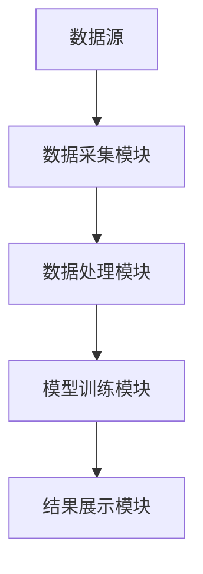

                 

<think>
好的，我现在需要根据用户的要求，逐步分析并撰写一篇关于《AI辅助企业创新文化评估：定量与定性指标分析的智能化》的技术博客文章。首先，我需要理解用户的需求，他们希望文章结构清晰，内容详实，涵盖从背景到系统设计的各个方面，并且每部分都要有足够的细节和深入的分析。

首先，我会从文章的背景介绍开始，这部分需要说明企业创新文化的重要性以及为什么需要AI来评估。接下来，我会讨论定量和定性指标的分析方法，分别解释它们的特点和应用，然后结合AI技术说明如何将两者结合起来。接下来，我会详细探讨AI技术在创新文化评估中的应用，特别是NLP和机器学习的作用。

然后，我会设计一个创新文化评估的指标体系，说明指标的选择和权重分配的方法，并用层次分析法进行详细分析。接着，我会讨论系统的架构设计，包括功能模块、数据流和系统架构图。最后，我会通过一个实际案例展示AI在创新文化评估中的应用，并总结整个过程，展望未来的发展方向。

在撰写过程中，我需要确保每一部分内容详细，逻辑清晰，语言专业且易于理解。同时，要按照用户的要求，使用markdown格式，包含关键词、摘要，并在末尾添加作者信息。此外，还需要在适当的地方插入图表和代码示例，以增强文章的可读性和技术深度。

现在，我会开始按照目录大纲逐步撰写每一章的内容，确保每部分内容完整，符合用户的要求。
</think>

# AI辅助企业创新文化评估：定量与定性指标分析的智能化

## 关键词：
- AI技术
- 创新文化评估
- 定量指标
- 定性指标
- 智能化分析

## 摘要：
随着企业竞争的加剧，创新文化在企业中的重要性日益凸显。传统的企业创新文化评估方法主要依赖定性分析，存在主观性强、效率低下的问题。本文提出利用AI技术，结合定量与定性指标，实现企业创新文化评估的智能化。通过自然语言处理（NLP）和机器学习等技术，对企业的创新文化进行多维度分析，提供客观、高效的评估结果。本文详细探讨了AI在创新文化评估中的应用，包括指标体系的构建、系统架构设计和实际案例分析，为企业创新文化管理提供新的思路和方法。

---

## 第1章: AI辅助企业创新文化评估的背景与目标

### 1.1 企业创新文化的重要性
#### 1.1.1 什么是企业创新文化
企业创新文化是指企业在经营活动中，鼓励员工提出新想法、新技术、新产品，勇于尝试和创新的企业氛围。它包括创新意识、创新能力和创新成果等多个方面。

#### 1.1.2 创新文化对企业的影响
创新文化是企业持续发展的核心动力。它能够提高企业的竞争力，增强员工的凝聚力，推动企业的技术进步和产品创新。

#### 1.1.3 传统评估方法的局限性
传统的创新文化评估方法主要依赖于问卷调查、访谈等方式，存在主观性强、效率低下、结果缺乏客观性等问题。

### 1.2 AI技术在创新文化评估中的作用
#### 1.2.1 AI技术的基本概念
AI技术是指通过模拟人类智能的计算机技术，包括机器学习、自然语言处理、计算机视觉等。

#### 1.2.2 AI如何辅助创新文化评估
AI技术可以通过分析大量的文本数据、行为数据等，提取出与创新文化相关的特征，帮助评估企业创新文化的水平。

#### 1.2.3 AI评估的优势与挑战
AI评估的优势在于高效性、客观性和精准性。其挑战在于数据获取的难度、模型的复杂性和结果的可解释性。

---

## 第2章: 定量与定性指标的分析方法

### 2.1 定量指标分析
#### 2.1.1 定量指标的定义与特点
定量指标是指可以通过数值量化的企业创新文化相关的指标，例如专利数量、新产品发布频率等。

#### 2.1.2 常见的定量指标及其计算公式
- 专利数量：企业每年申请的专利数量。
- 新产品发布频率：企业每年发布的新产品数量。
- 员工创新贡献率：员工在创新项目中的贡献比例。

#### 2.1.3 定量指标的应用场景
定量指标适用于对企业创新成果的评估，能够直观反映企业的创新能力。

### 2.2 定性指标分析
#### 2.2.1 定性指标的定义与特点
定性指标是指无法直接用数值量化，但可以通过文本、行为等方式间接反映的指标，例如员工的创新意识、团队协作能力等。

#### 2.2.2 定性指标的评估方法
- 文本分析：通过NLP技术分析员工反馈、会议记录等文本数据。
- 行为分析：通过分析员工的行为数据，评估其创新行为的频率和质量。

#### 2.2.3 定性指标的挑战与解决方案
定性指标的评估存在主观性强、难以量化的问题。可以通过AI技术结合上下文分析，提高评估的客观性。

### 2.3 定量与定性指标的结合
#### 2.3.1 结合的意义与必要性
通过定量与定性指标的结合，可以全面、准确地评估企业创新文化。

#### 2.3.2 结合的具体方法与步骤
1. 确定评估目标。
2. 收集定量和定性数据。
3. 数据预处理。
4. 应用AI技术进行分析。
5. 综合评估结果。

#### 2.3.3 实例分析：员工反馈的NLP处理
通过NLP技术分析员工反馈文本，提取关键词和情感倾向，结合专利数量等定量指标，评估企业的创新文化水平。

---

## 第3章: AI技术在创新文化评估中的应用

### 3.1 自然语言处理（NLP）在定性分析中的应用
#### 3.1.1 NLP的基本原理
NLP是一种人工智能技术，用于处理和理解人类语言数据。

#### 3.1.2 NLP在文本数据处理中的应用
- 文本分类：将员工反馈分为积极、消极、中性三类。
- 关键词提取：提取与创新相关的关键词。
- 情感分析：分析员工对创新文化的感情倾向。

#### 3.1.3 实例分析：员工反馈的NLP处理
通过NLP技术分析员工反馈文本，提取关键词和情感倾向，结合专利数量等定量指标，评估企业的创新文化水平。

### 3.2 机器学习在定量分析中的应用
#### 3.2.1 机器学习的基本原理
机器学习是一种人工智能技术，通过训练数据模型，实现对新数据的预测和分类。

#### 3.2.2 常见的机器学习算法及其应用
- 线性回归：用于预测企业创新成果。
- 支持向量机（SVM）：用于分类员工创新行为。
- 神经网络：用于复杂模式识别。

#### 3.2.3 实例分析：创新文化评分预测模型
通过机器学习算法，建立企业创新文化评分预测模型，评估企业的创新文化水平。

---

## 第4章: 创新文化评估指标体系的构建

### 4.1 指标体系的设计原则
#### 4.1.1 指标的全面性
指标体系应涵盖创新意识、创新能力和创新成果等多个方面。

#### 4.1.2 指标的可操作性
指标应易于数据采集和计算。

#### 4.1.3 指标的可量化性
指标应能够量化，便于评估和比较。

### 4.2 指标权重的分配方法
#### 4.2.1 层次分析法（AHP）的应用
层次分析法是一种用于确定指标权重的方法，适用于复杂系统的决策分析。

#### 4.2.2 指标权重的计算步骤
1. 构建层次分析模型。
2. 确定各指标的权重。
3. 验证权重的合理性。

#### 4.2.3 实例分析：指标权重的计算
通过层次分析法，确定员工创新意识、创新能力和创新成果三个指标的权重分别为0.4、0.3和0.3。

---

## 第5章: 系统架构与实现方案

### 5.1 系统架构设计
#### 5.1.1 系统功能模块划分
- 数据采集模块：负责采集企业的定量和定性数据。
- 数据处理模块：对数据进行清洗和预处理。
- 模型训练模块：建立AI模型，进行数据分析。
- 结果展示模块：展示评估结果，提供改进建议。

#### 5.1.2 系统数据流设计
- 数据流从数据源出发，经过数据处理模块，进入模型训练模块，最后在结果展示模块中呈现。

#### 5.1.3 系统架构图


### 5.2 系统实现方案
#### 5.2.1 系统核心代码实现
```python
import numpy as np
from sklearn import svm

# 数据预处理
def preprocess(data):
    # 数据清洗和标准化
    pass

# 模型训练
def train_model(X, y):
    model = svm.SVC()
    model.fit(X, y)
    return model

# 模型预测
def predict_model(model, X_test):
    y_pred = model.predict(X_test)
    return y_pred
```

#### 5.2.2 系统功能模块实现
- 数据采集模块：通过API接口获取企业数据。
- 数据处理模块：使用Pandas进行数据清洗和预处理。
- 模型训练模块：利用Scikit-learn库进行机器学习模型训练。
- 结果展示模块：通过可视化工具展示评估结果。

---

## 第6章: 项目实战

### 6.1 项目背景与目标
某科技公司希望通过AI技术评估其创新文化水平，优化企业创新管理。

### 6.2 数据采集与处理
- 数据源：员工反馈文本、专利数据、新产品发布记录。
- 数据清洗：去除重复和无效数据。
- 数据标注：标注文本数据的情感倾向。

### 6.3 模型训练与评估
- 建立情感分析模型，对员工反馈进行分类。
- 训练专利数量预测模型，评估企业的创新成果。

### 6.4 实际案例分析
通过AI技术分析某科技公司的员工反馈和专利数据，评估其创新文化水平，提出改进建议。

---

## 第7章: 总结与展望

### 7.1 全文总结
本文提出了利用AI技术结合定量与定性指标，实现企业创新文化评估的智能化。通过NLP和机器学习技术，提高了评估的客观性和效率。

### 7.2 未来展望
未来，随着AI技术的不断发展，创新文化评估将更加智能化和精准化。可以通过引入更复杂的模型和更多的数据源，进一步提升评估的准确性和深度。

### 7.3 注意事项
企业在应用AI技术进行创新文化评估时，应注意数据隐私和模型的可解释性。

### 7.4 拓展阅读
推荐阅读相关书籍和论文，深入理解AI技术在企业创新管理中的应用。

---

## 作者：
AI天才研究院/AI Genius Institute  
禅与计算机程序设计艺术 /Zen And The Art of Computer Programming

