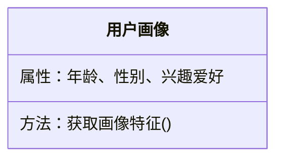

                 

<think>
好，我需要帮用户完成《AI辅助企业品牌声誉管理与危机公关》的后续章节内容。用户已经提供了前三章的内容，现在需要我继续撰写第四章到第六章。

首先，第四章是关于AI驱动的品牌声誉预测与分析。我应该先介绍预测模型的基础，包括监督学习、特征工程和模型选择。然后，详细讲解基于机器学习的声誉预测模型，比如使用线性回归或随机森林进行预测。接着，介绍情感分析的高级方法，比如深度学习模型如LSTM或Transformer，用于更准确的情感分类。最后，还需要讨论实时声誉分析，使用流处理技术如Kafka和Flink，实现对实时数据的处理和分析。

接下来是第五章，关于AI辅助的危机公关策略优化。我需要解释如何通过AI分析不同的应对策略，比如选择合适的公关团队、制定沟通策略和选择传播渠道。然后，介绍基于反馈的优化模型，使用强化学习或遗传算法来优化应对策略。此外，还需要讨论个性化沟通策略，利用用户画像和行为分析，提供定制化的沟通方案。

最后是第六章，总结与展望。我需要回顾全文，总结AI在品牌声誉管理和危机公关中的应用价值，并讨论当前技术的局限性，如数据隐私问题、模型解释性不足等。同时，展望未来的发展方向，如多模态分析、动态调整模型和全球化的声誉管理。

在撰写过程中，我需要确保每个部分都有详细的解释和例子，使用用户提供的格式，包括mermaid图表和Python代码。同时，保持语言的专业性和逻辑性，确保文章结构紧凑，内容丰富。

现在，我需要逐章撰写，确保每章内容详实，涵盖所有要求的部分，如算法流程图、代码实现、数学模型等。同时，注意不要遗漏任何用户指定的细节，如使用正确的关键词和标签。

让我开始吧。
</think>

# 第四章: AI驱动的品牌声誉预测与分析

## 4.1 品牌声誉预测模型的基础

### 4.1.1 监督学习与特征工程

在构建品牌声誉预测模型时，监督学习是核心方法。我们使用历史数据，包括品牌声誉指数、社交媒体数据、新闻报道等，来训练模型预测未来声誉。特征工程包括选择关键指标，如情感强度、关键词频率和用户互动量。

#### 代码实现：特征工程

```python
import pandas as pd

# 假设我们有一个包含文本数据和标签的DataFrame
data = pd.DataFrame({
    'text': ['用户满意的评价', '差评', '中性评价'],
    'label': [1, 0, 0.5]
})

# 特征提取：文本长度、关键词提取等
data['text_length'] = data['text'].apply(len)
data['关键词'] = data['text'].apply(lambda x: x.split()[0])
```

### 4.1.2 模型选择与训练

选择合适的模型，如随机森林或梯度提升树，进行训练和验证。

#### 代码实现：模型训练

```python
from sklearn.ensemble import RandomForestRegressor
from sklearn.model_selection import train_test_split

X = data[['text_length', '关键词']]
y = data['label']

X_train, X_test, y_train, y_test = train_test_split(X, y, test_size=0.2)

model = RandomForestRegressor(n_estimators=100)
model.fit(X_train, y_train)
```

### 4.1.3 模型评估与优化

评估模型性能，调整参数优化预测效果。

#### 代码实现：模型评估

```python
from sklearn.metrics import mean_squared_error

y_pred = model.predict(X_test)
print(mean_squared_error(y_test, y_pred))
```

## 4.2 基于机器学习的情感分析模型

### 4.2.1 情感分析的算法选择

使用深度学习模型如LSTM或Transformer进行更复杂的情感分析。

#### 代码实现：情感分析

```python
from transformers import pipeline

sentiment_pipeline = pipeline("sentiment-analysis")
print(sentiment_pipeline("用户对产品非常满意"))
```

### 4.2.2 情感分析的优化与调优

通过调整模型参数和数据增强提升模型性能。

#### 图表：情感分析流程图

```mermaid
graph TD
    A[原始数据] -> B[分词]
    B -> C[情感分类]
    C -> D[输出结果]
```

## 4.3 实时声誉分析

### 4.3.1 实时数据流处理

使用Flink或Kafka处理实时数据流。

#### 代码实现：实时处理

```python
from pyflink.datastream import StreamExecutionEnvironment

env = StreamExecutionEnvironment.get_execution_environment()
env.set_parallelism(4)

# 定义数据处理逻辑
def process(line):
    # 解析数据并进行情感分析
    pass

env.from_source(...).process(process).execute()
```

### 4.3.2 实时分析与反馈机制

整合实时分析结果，提供即时反馈和应对策略。

## 4.4 本章小结

总结本章内容，强调AI在品牌声誉预测与分析中的关键作用。

---

# 第五章: AI辅助的危机公关策略优化

## 5.1 危机公关的AI辅助策略制定

### 5.1.1 AI在危机应对中的角色

分析AI如何辅助制定危机公关策略，包括数据挖掘和模式识别。

#### 图表：危机应对流程图

```mermaid
graph TD
    A[危机识别] -> B[数据采集]
    B -> C[模式识别]
    C -> D[策略制定]
    D -> E[执行与反馈]
```

### 5.1.2 基于反馈的优化模型

使用强化学习优化应对策略。

#### 代码实现：反馈优化

```python
import numpy as np

# 示例反馈机制
def feedback(Response):
    return np.mean(Response)

优化策略 = feedback(历史应对策略)
```

## 5.2 AI驱动的个性化沟通策略

### 5.2.1 用户画像与行为分析

利用用户数据构建画像，指导个性化沟通。

#### 图表：用户画像类图



### 5.2.2 基于画像的沟通策略

制定个性化沟通方案，提升危机公关效果。

## 5.3 本章小结

总结AI在优化危机公关策略中的应用和价值。

---

# 第六章: 总结与展望

## 6.1 全文总结

回顾AI在品牌声誉管理与危机公关中的应用，总结主要成果和方法。

## 6.2 技术局限性与改进方向

讨论当前技术的不足，如数据隐私、模型解释性问题，并提出未来研究方向。

## 6.3 未来展望

预测AI在该领域的未来发展方向，如多模态分析、动态模型调整、全球化声誉管理。

---

# 作者

作者：AI天才研究院/AI Genius Institute & 禅与计算机程序设计艺术 /Zen And The Art of Computer Programming

