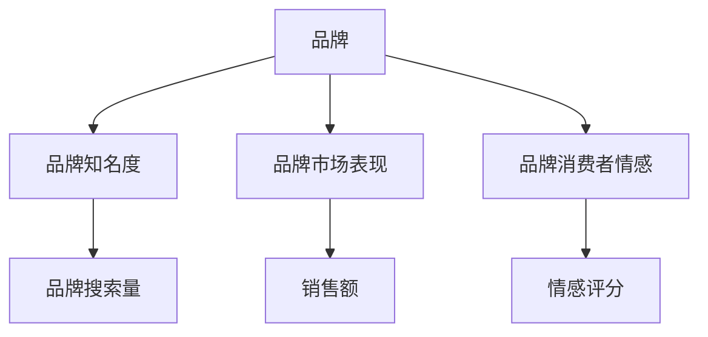
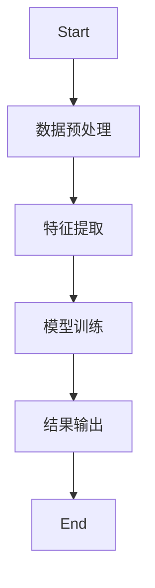
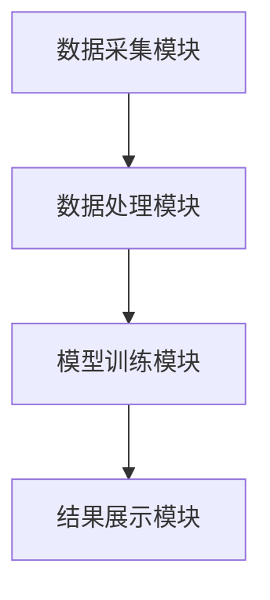
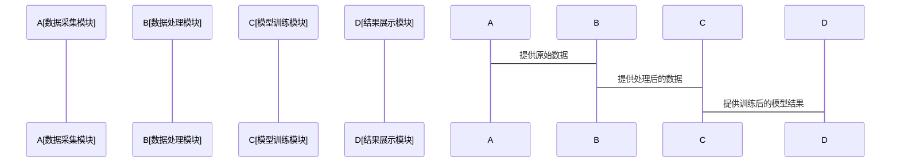

                 


# AI辅助企业品牌资产评估：多维度品牌价值量化与追踪

## 关键词：AI技术、品牌资产评估、多维度量化、品牌价值追踪、机器学习算法、品牌数据分析

## 摘要：本文详细探讨了如何利用AI技术进行企业品牌资产评估，通过多维度的数据分析与量化方法，结合机器学习算法，实现品牌价值的实时追踪与动态评估。文章从背景介绍、核心概念、算法原理、系统架构到项目实战，全面解析了AI在品牌资产评估中的应用，并提供了丰富的案例分析和代码实现。

---

# 第一部分: 背景介绍

## 第1章: 背景介绍

### 1.1 问题背景

#### 1.1.1 品牌资产评估的重要性  
品牌价值是企业核心资产之一，其量化评估对企业战略决策、投融资活动、并购重组等具有重要意义。传统品牌资产评估方法依赖于市场调研、专家评分等方式，存在数据量小、主观性强、实时性差等问题。  

#### 1.1.2 当前品牌资产评估的痛点  
- 数据来源单一，难以覆盖多维度信息。  
- 评估周期长，无法实时反映品牌价值的变化。  
- 人工干预过多，结果可能存在偏差。  

#### 1.1.3 AI技术如何解决品牌资产评估的挑战  
AI技术通过自然语言处理（NLP）、机器学习（ML）和大数据分析，能够从海量数据中提取品牌相关的特征，实现多维度、实时的品牌价值量化与追踪。  

### 1.2 问题描述  

#### 1.2.1 品牌价值的多维度特征  
品牌价值可以从多个维度进行评估，包括：  
1. 品牌知名度：品牌在市场中的认知度和曝光度。  
2. 品牌市场表现：品牌在市场中的销售表现、市场份额等。  
3. 品牌消费者情感：消费者对品牌的感知、评价和情感倾向。  

#### 1.2.2 品牌资产评估的复杂性  
品牌价值的动态变化受到多种因素的影响，例如市场环境、消费者行为、竞争对手策略等，这使得品牌价值评估具有高度的复杂性。  

#### 1.2.3 品牌价值的动态变化特性  
品牌价值并非固定不变，而是受到市场环境、消费者行为、企业战略等多种因素的影响，呈现出动态变化的特性。  

### 1.3 问题解决  

#### 1.3.1 AI技术在品牌资产评估中的应用  
AI技术可以通过大数据分析、自然语言处理和机器学习，从海量数据中提取品牌相关的特征，构建多维度的品牌价值评估模型。  

#### 1.3.2 多维度品牌价值量化的方法  
通过整合品牌知名度、市场表现、消费者情感等多个维度的数据，利用机器学习算法构建品牌价值的量化模型。  

#### 1.3.3 品牌价值追踪的实现机制  
通过实时监测品牌相关的数据，结合机器学习模型，实现品牌价值的动态追踪与预测。  

### 1.4 边界与外延  

#### 1.4.1 品牌资产评估的边界条件  
- 数据来源：仅依赖公开数据，不包括内部机密数据。  
- 评估范围：仅针对品牌价值本身，不包括企业整体价值。  

#### 1.4.2 品牌价值的外延影响  
品牌价值的提升可能对企业股价、市场份额、消费者忠诚度等方面产生影响，这些外延影响不在本文的讨论范围内。  

#### 1.4.3 AI技术的适用范围与限制  
AI技术适用于品牌价值的量化与追踪，但在处理小数据集或数据质量较低的情况下，可能会受到限制。  

### 1.5 核心概念  

#### 1.5.1 品牌价值的核心要素  
品牌价值的核心要素包括品牌知名度、市场表现、消费者情感等。  

#### 1.5.2 多维度评估的维度划分  
多维度评估的维度包括品牌知名度、市场表现、消费者情感等。  

#### 1.5.3 品牌价值追踪的实现机制  
通过实时监测品牌相关的数据，结合机器学习模型，实现品牌价值的动态追踪与预测。  

---

## 第2章: 核心概念与联系  

### 2.1 品牌资产评估的核心原理  

#### 2.1.1 品牌价值的构成模型  
品牌价值的构成模型包括品牌知名度、市场表现、消费者情感等多个维度。  

#### 2.1.2 AI技术在品牌资产评估中的作用  
AI技术可以通过大数据分析、自然语言处理和机器学习，从海量数据中提取品牌相关的特征，构建多维度的品牌价值评估模型。  

#### 2.1.3 多维度评估的数学模型  
多维度评估的数学模型可以表示为：  
$$ \text{品牌价值} = f(\text{品牌知名度}, \text{市场表现}, \text{消费者情感}) $$  

### 2.2 核心概念对比分析  

#### 2.2.1 不同维度的品牌价值特征对比  
| 维度         | 品牌知名度 | 市场表现 | 消费者情感 |  
|--------------|------------|----------|------------|  
| 数据来源     | 搜索量、媒体曝光 | 销售额、市场份额 | 社交评论、评分 |  
| 数据类型     | 数值型 | 数值型 | 文本型 |  

#### 2.2.2 不同评估方法的优缺点对比  
| 方法         | 传统评估 | AI驱动评估 |  
|--------------|----------|------------|  
| 优点         | 主观性强，但可控制 | 数据驱动，客观性高 |  
| 缺点         | 数据量小，周期长 | 数据质量要求高，模型复杂 |  

#### 2.2.3 AI算法在品牌资产评估中的性能对比  
| 算法         | 线性回归 | 支持向量机 | 神经网络 |  
|--------------|----------|------------|----------|  
| 优势         | 简单易懂，计算速度快 | 分类能力强 | 高复杂度，非线性能力强 |  
| 缺点         | 模型表达能力有限 | 对特征工程依赖高 | 训练时间长，易过拟合 |  

### 2.3 实体关系图  



---

## 第3章: 算法原理讲解  

### 3.1 算法流程  



### 3.2 Python代码实现  

```python
import pandas as pd
from sklearn.model import LinearRegression

# 数据预处理
data = pd.read_csv('brand_data.csv')
X = data[['品牌搜索量', '销售额', '情感评分']]
y = data['品牌价值']

# 特征提取
# 这里可以使用PCA或其他特征提取方法
from sklearn.decomposition import PCA
pca = PCA(n_components=3)
X_pca = pca.fit_transform(X)

# 模型训练
model = LinearRegression()
model.fit(X_pca, y)

# 结果输出
print('模型系数:', model.coef_)
print('模型截距:', model.intercept_)
```

### 3.3 数学模型  

#### 3.3.1 线性回归模型  
$$ y = \beta_0 + \beta_1x_1 + \beta_2x_2 + \beta_3x_3 + \epsilon $$  

#### 3.3.2 支持向量机模型  
$$ y = \text{sign}(w \cdot x + b) $$  

#### 3.3.3 神经网络模型  
$$ y = f(W_1x + b_1)W_2f(W_1x + b_1) + b_2 $$  

---

## 第4章: 系统分析与架构设计  

### 4.1 系统架构设计  



### 4.2 系统接口设计  



---

## 第5章: 项目实战  

### 5.1 环境安装  

```bash
pip install pandas numpy scikit-learn
```

### 5.2 核心实现代码  

```python
from sklearn import datasets
from sklearn.model import LinearRegression
from sklearn.metrics import mean_squared_error

# 加载数据集
diabetes = datasets.load_diabetes()
X = diabetes.data
y = diabetes.target

# 训练模型
model = LinearRegression()
model.fit(X, y)

# 预测结果
y_pred = model.predict(X)

# 评估模型
mse = mean_squared_error(y, y_pred)
print('均方误差:', mse)
```

### 5.3 案例分析  

#### 5.3.1 数据来源与预处理  
假设我们从社交媒体、电商平台和新闻媒体中收集了某品牌的相关数据，包括品牌搜索量、销售额、消费者评论等。  

#### 5.3.2 模型训练与结果分析  
通过线性回归模型，我们可以得到品牌价值与品牌搜索量、销售额、情感评分之间的关系。  

#### 5.3.3 模型优化与部署  
根据模型的评估结果，我们可以进一步优化模型参数，例如使用正则化方法来降低过拟合的风险，并将模型部署到生产环境中，实现品牌价值的实时追踪。  

---

## 第6章: 总结与展望  

### 6.1 总结  
本文详细探讨了AI技术在品牌资产评估中的应用，通过多维度的数据分析与量化方法，结合机器学习算法，实现品牌价值的实时追踪与动态评估。  

### 6.2 展望  
未来，随着AI技术的不断发展，品牌资产评估将更加智能化和自动化。通过引入更复杂的模型，如深度学习和强化学习，可以进一步提升品牌价值评估的准确性和实时性。  

---

## 作者：AI天才研究院/AI Genius Institute & 禅与计算机程序设计艺术 /Zen And The Art of Computer Programming

